# StreamArchiver

A lightweight, always-on desktop app (Windows-first, cross-platform-friendly) that
monitors an arbitrary number of channels/links, detects when they go **live**, and
automatically records them using `streamlink`, `yt-dlp`, and `ffmpeg`.

Written in **Rust** with a **native egui UI** (no web/Chromium). Runs in the system
tray with the window opened on demand; idle CPU is ~0% and the resident footprint is
small.

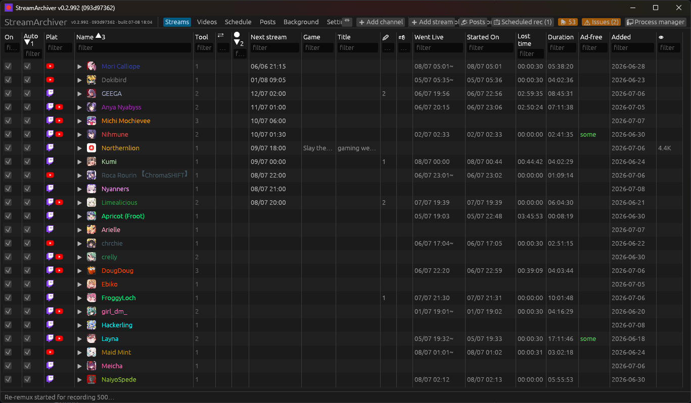

## Status

| Phase | State |
|---|---|
| 1 — Tray app, on-demand UI, SQLite store, settings, autostart | ✅ |
| 2 — Shared batched poll scheduler + detectors (Twitch API, YouTube/Kick scrape, generic probe) | ✅ |
| 3 — Download supervisor (record → `.ts`, remux → MKV, tree-kill, backoff, orphan recovery) | ✅ |
| 4 — Graceful finalize-on-stop, desktop notifications | ✅ |
| 4 — Twitch EventSub real-time push (conduit) | ✅ (needs live Twitch creds to verify) |
| 4 — Installer / packaging | ⏳ planned |

## Requirements

- **Runtime tools** on `PATH`: [`streamlink`](https://streamlink.github.io/),
  [`yt-dlp`](https://github.com/yt-dlp/yt-dlp), [`ffmpeg`](https://ffmpeg.org/).
- **To build**: Rust (stable) + the MSVC toolchain on Windows.
- **Optional, for YouTube live capture-from-start:** a SABR-capable `yt-dlp` dev
  build, a JS runtime (Node), and a GVS PO-token provider (bgutil). See
  [YouTube live capture-from-start (SABR)](#youtube-live-capture-from-start-sabr).
- **Optional, for watching recordings while they record:** [mpv](https://mpv.io)
  as the configured media player. See
  [Watching in a media player](#watching-in-a-media-player).

## Build & run

```sh
cargo build --release
./target/release/streamarchiver        # opens the window; closing it hides to tray
./target/release/streamarchiver --hidden   # start straight to the tray (used by autostart)
```

Right-click the tray icon → **Open** / **Quit**. Quitting gracefully stops any active
recordings (finalizing the MKV) before exiting.

The window has three tabs: **Streams** (monitor channels for live broadcasts),
**Videos** (on-demand downloads), and **Settings**.

## Using it

### Table columns (Streams, Videos, Background, Processes, Issues)

Every data table's columns can be **hidden/shown** and **resized** by
dragging a header edge — both persist across restarts. Right-click any
header for: sort, a filter box, **Hide** this column, and **⇕ Reorder
columns…**, which opens a small window to freely move columns up/down (and
toggle visibility) without touching the live table — nothing changes until
you hit **Apply**, so moving a column across many positions doesn't cause a
resize/flicker on every intermediate step. **⇔** (Streams toolbar) re-fits
all columns to their content.

### Streams (live monitoring)

A **channel** is a *container* (just a name) holding one or more **instances**.
Each instance has its **own URL/platform** + tool + detection + output, so one
channel can mix sources — e.g. the same creator on **Twitch *and* YouTube**, or
two tools on one URL.

1. **Add stream** → name the channel and add its **first instance**: paste a URL
   (platform auto-detected; tool + detection default to it), then adjust poll
   interval, quality, **container** (MKV default), output folder, filename
   template, auth. (Or **Add channel** to create an empty container and add
   instances to it afterwards.)
2. **➕** on a channel row (or **Add instance to channel** in the menu) adds
   another instance — including one on a **different platform** (paste a YouTube
   URL on a Twitch channel, etc.).
3. **Two independent switches**, each at both the channel and instance level
   (the channel checkbox gates *all* its instances at once; each instance has
   its own — pause just YouTube for the day, keep Twitch). Both also appear on
   the add/edit instance form:
   - **Enabled** (the **On** column, left of Auto; default on) is the **master
     switch**. Off = **fully dormant**: no detection, recording, or asset/About/
     posts/schedule fetch — the channel does nothing until you act manually
     (▶ **Start**, ⟳ **Refetch**). Its State cell shows **⏸** and its live info
     freezes. Use it to shelve a channel without deleting it.
   - **Auto** (default on) controls **only the automatic recording to disk** — a
     disk-space control. It does **not** gate detection, metadata, posts,
     schedules, or assets: an Auto-off (but Enabled) channel is still fully
     monitored — liveness is polled/pushed as usual (the State column shows
     *live*, and the **Title/Game/👁 Viewers/Went Live/Started On/Duration**
     columns show its current stream even though nothing is recording),
     everything keeps refreshing into the archive, and the ▶ **Start** button
     always records on demand. Recording auto-starts only when **both**
     Enabled and Auto are on (or a trigger word matches). Went Live/Started
     On/Duration come from detection's own go-live tracking in this case (the
     same "known even without a recording" data as Title/Game) — Started On
     mirrors Went Live and Lost time is blank, since nothing is being captured.

   A **channel** (container) row rolls up its instances: the State column shows
   a live/recording indicator when **any** instance is live (with a count after
   the icon, e.g. `⏺ 2`, when more than one is), and its Went Live/Started
   On/Duration/Title/Game/Viewers show whichever live instance went live
   **earliest** — unless a **preferred platform** is configured (useful when
   one platform's metadata is richer, e.g. Twitch's game/category vs.
   YouTube's), in which case that platform's instance wins instead whenever
   it's live. Three-level inheritance, same pattern as VOD-download/head-backfill
   overrides: a per-**instance pin** ("Pin as preferred platform" in the
   instance form) beats a per-**channel** override (channel form's "Preferred
   platform when multiple live") beats the **global default** (Settings →
   Interface → Display). None configured = the original earliest-live
   behavior, unchanged.

   A take whose capture has **ended** but whose finalize (the remux/promote
   into the output dir) is still running — or waiting in the disk-gate queue,
   which can be hours behind after a restart recovers many interrupted takes —
   shows **⌛ finalizing** instead of ⏺ recording, at the take, stream,
   instance, and channel levels. The Background view shows the actual
   remux progress and queue position. (Previously these kept showing
   "recording" until the remux finished.) A finalizing take no longer blocks
   the monitor either: polling resumes and a new take can start the moment
   the capture process exits, so a stream that drops and comes back is
   re-captured immediately even while the old take's remux is still queued.

   The instance and channel rows represent **present state only** — once an
   instance is neither recording nor live, its Went Live/Started On/Duration/
   Lost time cells go blank rather than showing a past recording's numbers
   (which would otherwise read as "currently live for 3h" when it isn't).
   That history isn't lost — it's exactly what expanding the instance's row
   shows, one row per past stream/take.

   When **Add stream** creates a brand-new channel, the channel's Enabled/Auto
   start out matching the first instance's — so a new instance added with Auto
   off doesn't leave its channel showing Auto on (both flags AND together, so
   this was never a functional bug, just a confusing mismatch in the grid).
   Adding an instance to an *existing* channel never touches the channel's own
   switches.

   Adding a channel fetches its assets/About immediately, and its live state +
   title/game/viewers appear within one poll cycle (≤30s). **✏** renames the
   channel; the per-instance **✏** edits that instance (incl. its URL). **🗑**
   deletes a channel (and its instances) or a single instance.
4. **Settings** → Twitch/YouTube credentials, default output folder, max concurrent
   downloads, and **start at login** (autostart). Folder fields have a **Browse…**
   button.

#### Bulk import: followed / subscribed channels (📥)

Instead of adding channels one by one, import the ones you already follow:

- **Twitch** — Settings → Accounts → *📥 Import followed channels* (needs a
  connected Twitch account; older connections may need a reconnect to grant
  the *follows* permission).
- **YouTube** — Settings → Accounts → *📥 Import subscriptions* (needs a
  connected Google account via the "Connect YouTube" device-code flow).

A confirmation dialog lists every candidate with a search filter, an **All**
master checkbox, and per-row choices:

- **Import** — create the channel + monitor (same max-archival defaults as a
  manual Add stream: chat log, thumbnails, chat assets, all audio/subtitle
  tracks).
- **Auto** (default off) — let the scheduler auto-record it. The channel's own
  Auto switch is seeded to match, so a fresh import never starts with the
  channel/instance mismatch the grid would AND together.
- **Disabled** — import with the **master Enabled switch off** (channel and
  instance): fully dormant — no polling, detection, or fetches — until you
  enable it in the grid. Useful for "archive the list now, activate later".

**Dedup**: channels you already monitor are greyed out ("added") — matched by
Twitch login / Kick slug / YouTube channel id. YouTube monitors that were
added by **@handle** URL (where the `UC…` id isn't in the URL) are resolved to
their channel id in the background (a one-time channel-page scrape per URL,
cached persistently), so they also match exactly. Only when resolution fails
does the fallback name match kick in: a candidate whose *name* equals an
existing channel's is flagged "(maybe added)" and left unticked, but can still
be imported deliberately.

**Overrides for this import** (collapsed section in the dialog): optionally
set a **quality** and/or **output directory** applied to every channel this
batch creates, instead of the per-platform defaults — e.g. point a hundred
subscriptions at a spare drive at 720p in one go. Individual monitors can
still be edited afterwards.

Kick has no import (no user-level OAuth flow to read a follow list from).

### Videos (on-demand downloads)

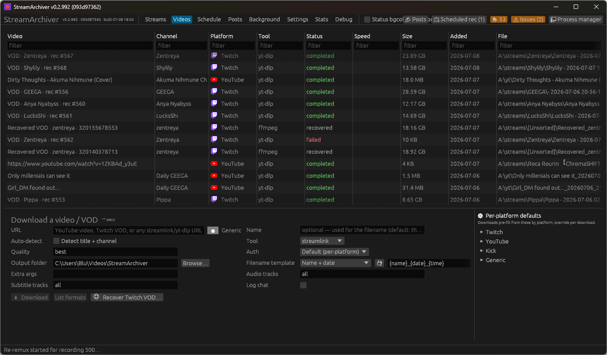

The **Videos** tab downloads a *specific* video or VOD now — a YouTube video, a
Twitch VOD, or any `streamlink`/`yt-dlp` URL — rather than watching a channel for
live streams. Paste a URL in the form at the bottom, adjust the settings shown
alongside it (**tool**, **quality**, **auth**, output folder, filename template,
extra args), and click **Download**. Output is always **MKV** (yt-dlp remuxes to
MKV; streamlink/ffmpeg capture to `.ts` then remux). Downloads share the same
global concurrency limit as live recordings.

**Tool.** Alongside `streamlink`, `yt-dlp`, and `ffmpeg`, the dropdown also
offers **yt-dlp-dev (SABR)** — the same [SABR dev
build](#youtube-live-capture-from-start-sabr) configured in Settings →
Downloads, usable here for any on-demand download, not just live
capture-from-start — plus any **custom tools** defined in Settings →
Downloads → *Custom download tools*. A custom tool is any other
yt-dlp-compatible binary (e.g. a personal fork) registered there with an
alias + path; it uses the same yt-dlp argument template as `yt-dlp`, only the
invoked binary differs. Picking SABR or a custom tool whose binary path is
unset/no-longer-valid falls back to the system yt-dlp at download time.

> **YouTube note:** YouTube now refuses VOD media to clients without a **PO
> token** (downloads would fail with `HTTP Error 403` right after a successful
> extraction). Video downloads therefore automatically use the bgutil PO-token
> provider when configured — the same **PO token extractor-args** setting as
> [SABR](#youtube-live-capture-from-start-sabr) — together with a
> still-served player client (`mweb`). Both are appended *before* your extra
> args, so a per-download or global `--extractor-args youtube:…` can override
> them if YouTube's client landscape shifts again.

**List formats.** Click **List formats** to probe the URL with the selected tool
(`yt-dlp --list-formats`, streamlink's stream list, or `ffprobe`) and show the
available formats/qualities in a window — handy for picking a **Quality** value.

**Auto-detect title + channel.** Tick **Auto-detect** to look up the real
title *and* channel/uploader (via yt-dlp) at download time. These populate the
**Channel** column and the `{title}`/`{channel}` template variables — and
`{title}` is used for `{name}` when **Name** is left blank (so files aren't named
`video_…`). See [Filename templates](#filename-templates) for the full variable
list.

**Per-platform defaults.** The form pre-fills from saved defaults for the pasted
URL's platform; edit any field to override it for that download. The
**⚙ Per-platform defaults** panel to the right of the download form sets the
default tool/quality/auth/output/filename/extra args for Twitch, YouTube, Kick,
NRK, Nebula, and Generic (each collapsible) — saved automatically. **NRK**
(`nrk.no` incl. `tv.nrk.no` and `radio.nrk.no` — TV, live channels, podcasts,
radio theatre; audio-only downloads still land in MKV) and **Nebula**
(`nebula.tv`) are recognized as
their own platforms — own icon, defaults, and log tag — but ride yt-dlp's
extractors (no platform-specific detection or channel-asset fetching; Nebula
needs your subscription cookies via the Auth field). **Generic** covers every
other URL — any of yt-dlp's ~1800 supported sites (Vimeo, …) — and defaults to
**yt-dlp** for exactly that reason: streamlink is a live-stream tool and fails
on a plain video page with `error: No plugin can handle URL` (the form shows an
inline ⚠ warning if you combine such a URL with streamlink; defaults saved
before this change are healed to yt-dlp once, automatically). The form's **Auth** has a **Default
(per-platform)** option (selected by default, uses the platform default's auth)
plus the explicit choices; **Inherit (global)** stays available and chains to the
Settings → *Download authentication* default.

**Audio / subtitle tracks + chat.** Like monitors, each download can pick which
**audio tracks** (streamlink `--hls-audio-select`) and **subtitle tracks** (yt-dlp
`--sub-langs`, written as sidecars) to capture, and can **Log chat** (yt-dlp's
`live_chat` → a `.live_chat.json` sidecar, e.g. a YouTube VOD's chat replay). New
downloads default to *all* audio + subtitle tracks (chat off); the choices are
sticky across downloads. See [Audio & subtitle tracks](#audio--subtitle-tracks).

Each row shows the title, **Channel** (when detected), status (`queued` →
`downloading` → `completed`/`failed`/`stopped`), live **Speed** (download rate
while active; yt-dlp downloads only), size, and the **File** path on disk, with a
platform favicon and per-column header tooltips. Rows are **tinted by status**
(in-flight — queued/downloading — = accent, failed = red), honoring the top-bar
**Status bgcolor** toggle; **hover a failed row** to see why it failed (the
captured error + exit code). Per-row inline actions plus a **right-click context menu** offer: **Open
file**, **Open folder**, **Copy URL**, **Copy file path**, **Stop**/**Retry**, and
**Delete** (removes the row; the file is kept). A download left in flight by a
crash/quit is marked `orphaned` on the next start.

**Sort & filter.** Click any column header to sort by it (click again to reverse;
a ▲/▼ shows the active column); type in the box under a header to filter that
column (case-insensitive substring). Filters combine across columns. This works on
the **Videos** and **Streams** tables alike.

The channel table shows, per channel: **On** (master switch — dormant when off),
Auto (auto-record on/off), Name, Platform (with a
brand badge), Tool, Detection, **Polled** (when it was last checked, with the poll
interval in parentheses — e.g. `2026-06-21 14:02:33 (60s)`), State, **Next stream**
(the next scheduled stream — see below), **Game** and
**Title** (the current category/title — the live stream's when detected, else the
latest recording's), **👁 Viewers** (live viewer count when live), **Went Live** (the
platform's go-live time — `~`-prefixed when only our first-detected time is known,
e.g. for scrape), **Started On** (when we began recording), **Lost time** (how
much of the stream we missed), **Duration** (live, `HH:MM:SS`), and **Added** (when
the channel was added). Timestamps follow the **Date format** chosen in Settings
(default ISO).

> The console log (run with `RUST_LOG=info,streamarchiver=debug`, the default)
> reports detection: a `DEBUG scheduler: polling N monitor(s) due […]` line per
> cycle, a `DEBUG poll: <name> [<method>] <result>` line per check, and an
> `INFO poll: <name> [<method>] <old> -> <new>` line whenever a channel's state
> changes (with the go-live time when it goes live, or the error detail).

**Recording history (collapsible).** Each channel row is a tree you can expand
(the ▶ triangle) to see its **past streams**, and each stream that took more than
one attempt expands again to its individual **takes**:

```
▼ Layna            twitch  streamlink  recording
   ▼ 🎬 2026-06-20 18:00   recording   · 2 takes
        Take 1   18:00–18:12   failed       (crashed)
        Take 2   18:13–…       recording
   ▶ 🎬 2026-06-19 21:30   completed
```

A channel with **multiple capture instances** (e.g. streamlink *and* yt-dlp on the
same channel) instead expands to one row per instance, and each instance expands
to its own streams → takes. The app groups attempts into one stream by the
platform's **stream/video id** when detection knows it (Twitch Helix/EventSub,
YouTube Data API, Kick API); for id-less methods (scrape/probe) it groups attempts
that share a go-live time or that abut in time (a crash + retry, or a manual
stop+restart, becomes one stream with several takes). A take row offers **Open
file / Open folder / Copy file path / Remove from list** (the file is kept).

**Lost time & capture-from-start.** Normally Lost time is `Started On − Went Live`
— the gap before we began. But with **Capture from start** enabled (yt-dlp
`--live-from-start` / streamlink `--hls-live-restart`) the early footage isn't
actually lost; it's pulled from the platform's DVR. So for those recordings the
app watches the capture and **drops Lost time to 0 once it catches up to the live
edge** (confirmed again at the end by checking the captured length covers the
whole broadcast). If a from-start capture *doesn't* reach the live edge — it's
stopped, crashes, or the stream ends first — the not-yet-downloaded part is the
recent *tail*, not the beginning, so we don't claim a "lost" figure: the column
just shows the provisional `Started − Went Live` estimate until catch-up is
confirmed.

**Twitch head backfill (missed-start recovery, while live).** On Twitch,
streamlink's `--hls-live-restart` only rewinds within its own DVR view and
usually can't reach the true start of a long-running stream. But the published
VOD's playlist already exists on Twitch's CDN and **grows while the stream is
live** — so when a *Capture from start* recording joined ≥ 1 minute late, a
background job (visible in the **Background** panel as *Head backfill*) locates
that live playlist (same derivation as [VOD
recovery](#twitch-vod-recovery-deleted--muted-vods); no published VOD needed),
downloads **just the missed beginning**, and saves it as `{stem}.head.mkv` next
to the recording. Doing this *during* the stream matters: DMCA mutes are applied
minutes **after** the stream ends and scrub the original segments — a head
fetched mid-stream carries the **original, un-muted audio**.

The head is cut at a **PTS-exact splice point**: the live capture's raw `.ts`
and the CDN playlist's segments carry the *same* broadcast MPEG-TS timeline, so
comparing their `start_time`s pinpoints exactly where the capture joined, and
the head ends precisely there — no duplicated seconds at the seam. (A pure
wall-clock estimate systematically overshoots by the broadcast latency, ~5–15 s,
which used to appear as a short backwards jump-cut at the `full.mkv` splice.)
The capture's first PTS is also saved on the take the moment it finishes —
before the MKV remux resets timestamps — so a later manual *Backfill head* can
still splice exactly. If either PTS anchor is unavailable, or the two disagree
by more than 60 s (timestamp discontinuity, non-TS capture), the job logs it
and falls back to the wall-clock estimate.

Once the live recording finishes, the head and the capture are **losslessly
concatenated** (stream copy, no re-encode) into `{stem}.full.mkv` — a true
full-stream file — and, by default, **both parts are kept**. Keeping the parts
means a joined stream occupies double its size, so an opt-in **After full.mkv
join** setting (Settings → Downloads → *Automatic deletion*; overridable
per-channel and per-instance) can instead delete just the head, or both parts —
in which case the take's main file becomes the full. The cleanup only runs
after the join passes its duration sanity check, and removals follow the
configured [deletion method](#automatic-deletion) (trash folder / Recycle Bin /
permanent), so nothing is irrecoverably gone unless you chose that. The take shows a **🧩 head**
badge while only the head exists and **🧩 full** once the join lands — visible
on the stream's row directly for the common single-take case, and rolled up
onto the stream row (in addition to each take's own row) when a reconnect
produced more than one take. The join
is skipped (parts kept, warning logged) if the capture ran at a transcoded
quality whose codec parameters differ from the source-quality head, and a
duration sanity check discards a broken join rather than promoting it. An
interrupted join is retried on the next app start. Nothing runs when catch-up
already zeroed Lost time.

Before any of that, the job intentionally waits ~2 minutes (letting the CDN's
live-VOD folder appear and streamlink's own rewind settle — this grace period
applies even when the recording joined right at the live edge, not just a late
join) before it can even tell whether there's anything to backfill. During
that window the take's row shows an **⏳ backfill queued** badge, switching to
**⏳ backfilling…** once the fetch actually starts, so there's always
something visible from the moment the recording begins — not just once the
job finishes its settle wait. The **Background** panel's *Planned* section
lists every currently-queued take with an ETA for when it'll be checked.
The planned state is persisted, but the job itself is in-memory — if a restart
kills a job mid-wait, the next launch **re-drives it** (or clears the state
when the row can no longer be backfilled), so a *Planned* entry can never
survive as a permanent ghost across restarts.

**Fetch new head backfill on new take.** A stream reconnect mid-broadcast (a
new recording "take") loses footage the same way a missed intro does — and
it's just as recoverable from the same still-growing CDN playlist while the
stream stays live. With this setting on (**default**), every take gets its own
fresh, **full** head backfill (go-live through *that* take's start, not just
the incremental gap since the previous take), not only the stream's first.
Global default in Settings → Downloads → *Head backfill on new takes*;
override per-channel or per-instance like the other 3-level toggles. Turning
it off restores the original behavior (first take only).

**Replace old head (if new is undamaged).** A sub-setting (**default on**):
once a fresh head backfill passes its integrity checks — no CDN segment had to
fall back to a silenced copy, and its duration is plausible — it supersedes
every older take's head file for the same stream (a strict subset of the fresh
one), which is removed via the configured
[deletion method](#automatic-deletion). A fresh head that fails its checks is
still kept, just never used to replace anything, so nothing is ever lost to a
bad check.

### Automatic deletion

A few features delete finished recordings on their own: the post-join parts
cleanup above, superseded old heads, and a live capture displaced by *Replace
with VOD*. **Settings → Downloads → Automatic deletion** controls what such a
delete actually does — with the usual global < channel < instance override
chain (channel Properties / edit instance):

- **Recycle Bin** (default): the normal Windows bin — restorable, needs no
  setup. Note that drives without a bin (some removable media) delete
  permanently instead; that's a Windows shell behavior.
- **Trash folder**: an instant same-drive rename into a folder you configure
  and prune yourself. Like the capture cache, the **Trash folder(s)** setting
  is a `;`-separated list with one folder per drive — a trashed file always
  moves to the folder on *its own* drive (a multi-GB "delete" must never
  become a cross-drive copy), and files on a drive with no folder listed fall
  back to the Recycle Bin. Name collisions get a ` (1)` suffix.
- **Delete permanently**: gone immediately.

A failed move or recycle always leaves the file in place (and logs why) — a
disposal failure is never escalated to a more destructive method. Transient
working files (playlists, cache leftovers, `.state`) are not media and are
always plainly deleted regardless of these settings.

**Manual "🧩 Backfill head."** Right-click an **instance** (targets its latest
recording) or a specific **take** for a manual, on-demand head backfill —
Twitch only, and only enabled while the channel is **currently live** (the CDN
playlist this needs stops being reliably pre-mute-safe once the stream ends;
the button is grayed out otherwise, with a tooltip pointing at **📥 Download
post-stream VOD** instead). Unlike the automatic path, this always forces the
fetch regardless of the *fetch new head backfill on new take* setting — it's
user-initiated, so there's no reason to gate it. The *replace old head*
setting still applies as configured.

### Row actions & shortcuts

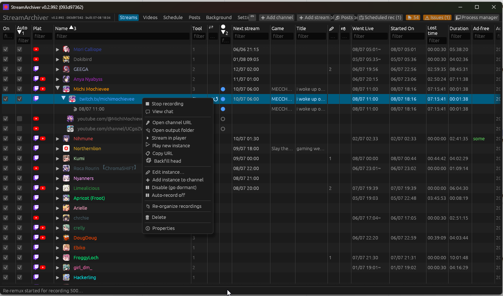

Left-click a row to select it; **right-click** any row — channel, instance,
stream, or take — for a context menu with that row's actions. For an instance:
Start/Stop recording, **Stream in player** / **Play new instance** (see
[Watching in a media player](#watching-in-a-media-player)), **Open channel URL**
(browser), **Open output folder** (file manager), **Copy URL**, Edit…, Add tool
instance, Enable/Disable, and Delete.

**Stopping holds the restart.** A manual **⏹ Stop** doesn't just stop the take
— it also suppresses every automatic restart (polls, pushes, trigger rules)
until the channel goes offline and starts a **new** broadcast, so Auto can't
immediately re-record the stream you just stopped. **Stop for 6 hours** /
**Stop for 12 hours** hold for a fixed time instead, regardless of
offline/online cycles. A held instance shows a **✋** badge in its State cell
(hover for when the hold ends); **▶ Start** always clears the hold. Holds
survive an app restart. Automated stops (a trigger's *only-while-matching*
auto-stop, scheduled stops, the quality-upgrade restart) never hold. A stream/take row's menu offers Open folder
/ Open file / Stream in player / Play new instance / Copy path (and Delete for
a take). The inline per-row buttons (▶/⏹ ⏵ ▷ ✏ ➕ 🗑) do the same.

The inline **Actions** column can be hidden via **Settings → Display → Show
Actions column** (applies to the Streams and Videos tables) to reclaim width — the
right-click context menu still provides every action.

Keyboard shortcuts:

| Key | Action |
|---|---|
| `Ctrl/Cmd+N` | Add channel |
| `Ctrl/Cmd+,` | Open Settings |
| `F5` | Refresh the list |
| `Enter` | Edit the selected row |
| `Delete` | Delete the selected row |
| `Esc` | Close the open dialog |

Deleting always asks for confirmation (the recorded files are kept either way).

### Watching in a media player

Set **Settings → Defaults → Media player path** to a player binary (e.g.
`C:\Progs\mpv\mpv.exe`) and every recording row — instance, stream, and take —
gains two playback actions, as inline buttons and context-menu entries:

- **⏵ Stream in player** — open *this* recording in the player. For a finished
  take that's simply the output file; for an **in-progress** recording it opens
  the growing capture straight out of `.sa-cache\`, so you can watch a recording
  **from the start while it is still being captured**. On the instance and
  stream rows it prefers the active capture and falls back to the most recent
  finished file.
- **▷ Play new instance** — tune into the channel **at the live edge**, like
  opening the stream in a browser, without touching the recording (and without
  needing one to be running).

[mpv](https://mpv.io) is strongly recommended — the app hands it live-viewing
flags (`appending://` growing-file URLs, `--keep-open`, a generated live HLS
playlist for SABR) that other players don't understand; the SABR cases below
are **mpv-only** and their buttons say so when disabled. Any player opens
finished files. With no player configured the buttons are disabled and **Open
file** falls back to the Windows file association.

| Row state | ⏵ Stream in player | ▷ Play new instance |
|---|---|---|
| Finished take | opens the output file (any player) | live-edge stream, if the channel is live |
| Recording — Twitch / HLS (`.ts`) | the growing `.ts`, from the start; mpv follows it as it grows | streamlink pipes the live edge to the player (`--player`) |
| Recording — YouTube SABR | the two growing SABR files merged in mpv (**mpv only**) | throwaway live-edge download served as live HLS (**mpv only**) |
| YouTube, not recording | most recent finished file | live-edge preview download (**mpv only**) |

**⏵ during a SABR capture.** Until the stream ends, a SABR capture is not one
playable file — it's two separate growing per-format files (video + audio; see
[the SABR section](#watching-sabr-captures--live-edge-previews)). ⏵ detects
the pair and launches mpv with the video as an `appending://` main file and
the audio attached as an external track, playing in sync from the capture's
start. Non-mpv players can't merge the pair, so the button stays disabled for
them (a dual-capture monitor falls back to its DASH companion's `.ts` instead).

**▷ on YouTube.** SABR live streams can't be piped to a player or opened by
URL (stock yt-dlp sees no formats for them), and seeking a multi-GB growing
capture to its end means a minutes-long linear scan — so ▷ starts a small
**throwaway live-edge download** under `%TEMP%\streamarchiver-preview\` and
serves it to mpv as a **locally generated live HLS playlist** that follows the
download as it grows. The player opens once the stream has buffered (~10–30 s;
the status bar says so). Closing the player stops the download and deletes the
temp folder. This path reuses the capture-from-start SABR setup (dev build +
PO-token provider) and downloads the stream a second time while you watch —
the same bandwidth as watching in a browser. Twitch needs none of this:
streamlink feeds the player natively.

Caveats:

- Seeking to the live edge of a *long* in-progress capture from ⏵ is slow (a
  growing file has no seek index, so the player scans linearly). That's what ▷
  is for — it starts *at* the edge.
- ▷'s timeline covers only what the preview has downloaded since you clicked,
  not the whole broadcast; use ⏵ for the recorded-so-far part.
- The preview download is killed when the player closes. If the app exits
  first, the downloader ends on its own when the stream does, and stale
  preview folders are swept on a later preview.

### Detection methods

A monitor's **Detection** method is *how* the app learns a channel went live. The
dropdown is filtered to the methods valid for the channel's platform, with a
sensible default pre-selected. Hover the **Detection** field (or the table column)
in-app for a one-line description of each.

| Method | Platforms | Needs creds | Latency | Notes |
|---|---|---|---|---|
| **Twitch API (Helix)** | Twitch | Client ID + Secret, or a connected account | one poll interval | Polls `Get Streams`, batched up to 100 channels/call; scales well. **Default for Twitch.** |
| **Twitch EventSub** | Twitch | Client ID + Secret | ~seconds | Real-time push over a WebSocket (conduit + app token) for both go-live **and** go-offline; ignores the poll interval, idles cheaply, reconciles on (re)connect. No public endpoint needed, no poll fallback. |
| **Twitch EventSub + Helix** | Twitch | Client ID + Secret | ~seconds, with a poll backstop | Does both: EventSub push **and** Helix polling. Whichever sees live first starts the recording, so a missed event (network drop, app started after go-live) is still caught. A longer poll interval is fine — it's just a safety net. |
| **YouTube WebSub (VPS push)** | YouTube | [yt-websub](../yt-websub) relay (URL + token) | ~seconds, with a poll backstop | Push via an external relay on a public VPS: it subscribes to YouTube's WebSub/PubSubHubbub hub and streamarchiver polls it for events. Each notification triggers an **on-demand liveness check** (records only if actually live), with scrape polling as a safety net. A longer poll interval is fine. |
| **YouTube Data API** | YouTube | API key | one poll interval | `search.list?eventType=live`; reports the real go-live time. **Quota-limited (~100 checks/day)** — use a long interval. |
| **Kick official API** | Kick | Client ID + Secret | one poll interval | client-credentials app token; more reliable than scraping (no Cloudflare). |
| **Scrape poll** | YouTube `/live`, Kick, generic | No | one poll interval | **Default for YouTube/Kick**; no credentials, but fragile to site changes. Go-live time is approximate (`~`). |
| **Generic probe** | any streamlink/yt-dlp URL | No | one poll interval | `streamlink --stream-url` liveness test; works anywhere those tools do. For NRK/Nebula monitors the probe uses `yt-dlp --print live_status` instead (streamlink has no plugin for either). |
| **Disabled** | any | No | manual only | No automatic checking at all — not polled by the scheduler, no push subscribed. **▶ Start** records immediately (there's no configured way to check first, so it trusts you) instead of erroring "not live". For channels you only ever want to record by hand. |

**Polling vs. push (Helix vs. EventSub).** Helix *asks* "is it live?" every poll
interval, so you notice within that interval (and the **Lost time** column ≈ the
interval). EventSub is *told* the moment a channel goes live, so it catches the
start within seconds and ignores the per-channel interval — at the cost of holding
a WebSocket. Both report the real go-live time and use the same Twitch app creds;
EventSub specifically needs the **Client Secret** (it authenticates with an app
token). Choose **EventSub** to minimize missed footage, **Helix** for a simpler,
fully stateless poll, or **Twitch EventSub + Helix** for the most robust option —
instant push with a polling backstop so you still start the recording if an event
is ever missed. (Connecting a Twitch account also satisfies Helix — its user token
expires, so the app auto-refreshes it and falls back to the app token; if you'd
rather not reconnect, set a Client Secret and the app token is used.)

> To verify EventSub: set Twitch creds, add a Twitch channel with method **Twitch
> EventSub**, then `streamarchiver --run-for 120` with `RUST_LOG=info` — it logs
> `eventsub: connected (conduit …); N channel(s) subscribed (N offline)` and
> `stream.online -> monitor N` / `stream.offline -> monitor N` as the channel
> goes live/offline.

**YouTube WebSub (push via VPS).** YouTube can *push* go-live notifications over
WebSub/PubSubHubbub, but the hub needs a public callback URL — which a home machine
doesn't have. The companion [yt-websub](../yt-websub) server runs on a small public
VPS: it subscribes to the hub for your channels, durably logs each notification, and
exposes them over a token-authenticated HTTPS API. streamarchiver (at home) **polls**
that API. Because a WebSub notification fires for uploads and metadata edits too —
not just go-lives — each event is treated as a *"check this channel now"* trigger:
streamarchiver runs its normal liveness check and records **only if the channel is
actually live** (so it's safe and idempotent), while the scrape poll stays on as a
backstop. To use it: deploy `yt-websub` (see its README), then in **Settings →
YouTube WebSub** set the **VPS base URL** + **bearer token**, and set the relevant
YouTube monitors' **Detection** to **YouTube WebSub (VPS push)**. streamarchiver
auto-resolves each channel to its `UC…` id, pushes the set to the VPS, and the VPS
manages the hub subscriptions.

> Tool tip: use **streamlink for Twitch** (reaches 1440p/2K HEVC) and **yt-dlp for
> YouTube** (`--live-from-start`; streamlink hits YouTube segment 403s). The app
> defaults accordingly. **Note:** YouTube `--live-from-start` now requires the SABR
> setup — see [YouTube live capture-from-start (SABR)](#youtube-live-capture-from-start-sabr).

### Output

Recordings capture to a progressively-flushed `.ts` (so a crash/forced-stop leaves
usable data) and are remuxed losslessly to **`.mkv`** on clean stop. MKV is the
default; pick TS per channel if you prefer. **MP4 is never produced** (poor for
interrupted writes).

**Quality upgrade (Twitch, default on).** A capture that joins seconds after
go-live often sees only transcodes — Twitch lists the **source** rendition
late — so a `best`-quality capture can lock onto e.g. 720p60 while the stream
is really 1080p60. The watcher re-probes the rendition list a few minutes in
and, if something better appeared, restarts the take **once** at the better
quality (a ⬆ notification announces it). The new take's head backfill covers
the seam and — being source quality on both sides — joins into a complete
`full.mkv` at the better quality. Settings → Recording to disable.

**Disk-load management.** All bulk post-processing on the recordings drive is
deliberately bounded so it can never starve (or physically knock out — USB
enclosures *do* drop off the bus under sustained mixed load) the drive the live
captures are writing to:

- Full-file ffmpeg passes — the finalize TS→MKV remux, split merges, head+live
  joins, thumbnail/subtitle embeds — run **one at a time per disk** (default;
  see below). When five takes finish together (a raid ends, a shared event
  closes), their remuxes queue instead of hammering the disk simultaneously; a
  finished take just sits as a playable `.ts` in `.sa-cache\` a few minutes
  longer. The same applies to the leftover finalizes an app restart picks up.
  The current gate holder and queue are shown live at the top of **Background
  jobs**: the line names the longest-running pass, and **(+N more)** collapses
  any passes running *concurrently* alongside it (another drive's gate, or a
  drive allowing more than one permit — hover it for the full list; this is
  distinct from the queue). **▶ View queue** expands the full line-up (every
  waiting pass with its file, drive, and wait time — including passes that
  have no task row of their own, like batch re-remux items, embeds, and head
  joins), and each queued pass with a task row also reports the wait there.
- CDN-fed muxes (head backfills, VOD recoveries) are capped at **two at a
  time per disk** (default) — DMCA mutes tend to land for several channels
  minutes after a shared stream end, and each recovery writes a full stream to
  the drive.
- **Per-disk I/O limits** (Settings → Recording → Disk I/O limits): all four
  knobs — local-pass permits, CDN-mux permits, the read throttle, and the
  download rate limit — are configurable as a **default plus per-drive-letter
  overrides**. Recordings split across a fast NVMe and a fragile USB HDD can
  then run several parallel passes on the SSD while keeping the HDD strictly
  serialized and throttled. Gates are keyed by the target file's drive, so a
  saturated disk never queues work bound for an idle one. Permit changes take
  effect **immediately on Save** — including for passes already queued behind
  the old limit, so raising a limit to drain a stuck backlog doesn't require
  waiting for some unrelated new pass to kick off first. A reduction still
  lets any pass already *running* finish; it only holds back the next one.
- **Dynamic mode** (a **Dynamic** checkbox per drive, default off): instead of
  hand-tuning a fixed permit count, the local-pass/CDN-mux numbers become a
  **ceiling** and a background adjuster grows or shrinks the *live* count
  toward it every few seconds based on the disk's actual queue depth (the
  same "is this disk actually busy" signal Windows' own per-disk activity
  graph reflects — whole-spindle, so other programs' I/O counts too, not just
  this app's). Growth is gradual (a couple of idle checks before adding a
  permit, so a momentarily-quiet disk doesn't snap straight back to the
  ceiling); backing off is fast — the first sign of real contention roughly
  halves the live count immediately, because the whole point is protecting a
  drive that's already been driven off the bus once. The **actual live
  values** appear directly under a ticked Dynamic checkbox once bulk I/O has
  run on that drive: `L 2 /4 · 1 busy` means 2 permits right now, ceiling 4,
  1 currently in use (and the same for `C`, the CDN-mux gate). On the
  **Default** row — which covers every drive without its own override row —
  one such line appears **per active drive**, labelled with its letter. Drag
  the number to **pin** it — the adjuster leaves that gate alone until you
  hit **🔓** to release it back to auto. A drive that hasn't run a pass yet
  shows `L —` / `C —` rather than a real number. Only the permit counts
  adapt — the read
  throttle and download rate limit stay fixed at whatever's configured.
- **Disk throttle** (the default row of the Disk I/O limits table, default
  **30× realtime**)
  additionally caps how fast each pass reads + writes (ffmpeg `-readrate`,
  needs ffmpeg 5.0+; silently unthrottled on older builds). At 30× a 5-hour
  stream finalizes in ~10 minutes while using a fraction of the drive's
  bandwidth. `0` disables the cap. `-readrate` paces against the input's own
  timestamps, which ad-break cuts (or the non-zero start timestamps of
  live-DVR DASH parts) can break — ffmpeg then *crawls* below realtime,
  wedging the queue for hours. A pacing watchdog on both the finalize remux
  and the split-capture merge detects a pass falling hopelessly behind and
  retries that one file unthrottled.
- Tool logs, chat sidecar writes, and the UI's file probes are batched, cached,
  or kept off the recordings drive entirely (see *Data & locations*).
- **Download rate limit** (the default row of the Disk I/O limits table,
  default **off**): a yt-dlp
  `--limit-rate` value (e.g. `4M`) applied to VOD-archive grabs and Videos-tab
  downloads, per target disk. A post-stream VOD download otherwise runs at full CDN speed onto
  the same drive the remaining live captures are writing to — on a busy night
  it's typically the single largest writer. Never applied to live captures
  (throttling the live edge loses data).
- **yt-dlp ffmpeg throttle** (Settings → Recording → Remux, default **off**):
  `--postprocessor-args` specs (several separated by `;;`) forwarded to every
  yt-dlp invocation. The disk throttle above only reaches ffmpeg passes the
  *app* runs — a SABR capture's post-stream **format merge** happens *inside*
  yt-dlp and reads + writes the whole multi-GB take at full disk speed.
  `Merger+ffmpeg_i:-readrate 30` caps those merges at 30× realtime (ffmpeg
  5.0+). In the I/O tab, a job in that phase shows `yt-dlp + ffmpeg` in its
  tool column and `· ffmpeg pass` on its purpose.

### I/O monitor (the **I/O** tab)

Every filesystem operation the app performs — and every byte its spawned tools
move — is tracked, so disk-load problems on the recordings drive can be *seen*
rather than reconstructed after a crash:

- **In-app operations** all flow through one instrumented layer, categorized by
  purpose (chat sidecars, log tails, promote/renames, cache sweeps, asset
  cache, fs probes, database, …) and by storage region (recordings drive /
  appdata / temp). A clippy lint (`clippy.toml` `disallowed-methods`) makes it
  impossible for new code to bypass the layer unnoticed.
- **Tool processes** (streamlink / yt-dlp / ffmpeg — including the ffmpeg a
  yt-dlp launcher spawns) are sampled once a second via per-PID Windows I/O
  counters, each labeled with what it's doing and which file it works on. The
  tool column shows the **live process tree** (e.g. `yt-dlp + ffmpeg` while a
  finished SABR capture runs its format merge), so a sudden burst is
  attributable at a glance. Note the *read* side of a capture tool is mostly
  CDN network traffic; the *write* side is the disk-relevant number.
- **Physical-disk counters** report true bytes/sec and **queue depth** per
  drive (whole spindle, all processes — catches OS write-cache flushes too).
  Sustained queue depth on a USB enclosure is the early-warning signal before
  it drops off the bus; the tab flags depth ≥ 4 in red. Alongside the live
  value the tab keeps **session stats** so pressure doesn't have to be caught
  in the act: average depth, the session max with how long it sat there, and
  (on hover) the **top 5 pressure episodes** — each elevated run (queue ≥ 2)
  with its peak, duration, and when it ended. An **"other"** column shows the
  spindle traffic *not* accounted for by this app or its tools — a backup
  client, antivirus scan, or search indexer hammering the recordings drive
  shows up here (highlighted when it dominates), instead of the queue-depth
  spike being blamed on a capture or remux.

The **I/O** tab shows live totals, a 30-minute rate graph (write/read/queue
series per drive, hover for values), per-region and per-category tables
(cumulative bytes, slow-op counts, max single op), a per-process table, and a
filterable recent-operations log — operations slower than 100 ms are
highlighted, and the thread column exposes anything touching the disk from the
UI thread. **📋 Copy summary** exports the state as text.

**Slow-op log levels.** A slow filesystem op only logs at **WARN** when it
actually blocked work: a sync call on the UI thread (the UI froze for the
duration — always a regression) or a sync call that stalled a tokio async
worker for ≥ 1 s. Everything else — awaited async I/O (the named thread is
just where the task resumed; nothing sat blocked) and sync ops on dedicated
background or blocking-pool threads — logs at **DEBUG**, with the reason it's
harmless spelled out in the message ("the disk was busy" seen from a thread
nothing waits on). Chatty categories carry extra context: fs probes are
metadata-only peeks refreshing in-memory state, cache sweeps scan the on-disk
capture cache for leftover transient files (never finished archives), and
chat appends buffer messages in memory while a slow write is in flight.

**Platform tags in logs.** Lifecycle log messages (poll results, recording
start/finish, chat capture, SABR resume, head backfill, VOD polling, push
notifications) carry a `[Twitch]` / `[YouTube]` / `[Kick]` tag in the
platform's brand color — purple, red, green — when stderr is a real terminal
(debug console runs). The rolling log file gets the same tag in plain text:
an ANSI-stripping writer removes the color escapes before they reach disk.

**Database sub-tab.** The single SQLite connection sits behind a fair mutex
that every store call takes in turn; this tab shows that lock live: the
current **holder** (which thread, from which store call site, held for how
long), the **waiter queue** in line order, session counters (acquisitions,
cumulative hold time, slow waits ≥50 ms, long holds ≥200 ms), and a
**recent-contention log** of the same incidents the `slow DB lock` warnings
report — each wait naming the holder it was blocked behind, so "another
thread held the connection" is never a dead end again.

**Sample log** (Settings → Recording, default **on**): the 1 s samples are also
appended to a JSONL under `logs\iomon\` on the system drive (~2–5 MB/day,
pruned after 14 days), so an overnight stall or a drive disconnect can be
analyzed after the fact even if the app died with it.

### File management (the **Files** tab)

An overview of what is mapped to which path, across every drive recordings
have ever landed on:

- **Drives** — each drive letter in use (online/offline, free/total space, and
  how much recorded material the database places there). Low free space is
  flagged: retarget instances to another drive and the old recordings stay
  where they are, fully tracked.
- **Instances** — every instance with its **output folder**, editable inline
  (💾 applies; affects future takes only) and in **batch**: select rows and
  apply one folder to all of them (`{channel}` expands per instance). The
  resolved cache dir for the current cache layout is shown per row.
- **Recording locations** — every folder recordings actually sit in per the
  database, including *history-only* folders no instance points at anymore
  (e.g. the old drive after a move), with existence checks and per-folder
  totals.
- **Relocate recorded paths** — for after you physically move files (drive
  swap, folder rename): rewrites the leading path prefix in the database —
  recordings incl. head/full/recovered/VOD companion paths, video downloads,
  and optionally instance output folders. Preview first, then apply; no files
  are touched.

Instances moving between drives is a first-class case throughout: recordings
store absolute paths, so playback, Issues recovery, chat sidecars, and the
I/O monitor keep working for material on drives no instance currently records
to (those drives stay classified and disk-sampled, and their leftover working
dirs are still swept).

### Issues panel & re-remux

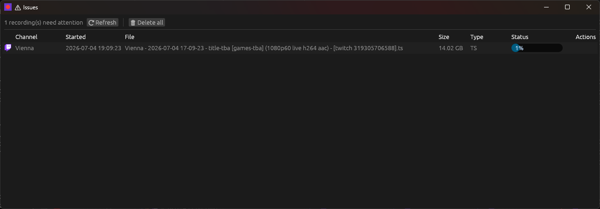

The **⚠ Issues** button in the toolbar (turns amber with a count when issues exist) opens a panel listing recordings that need attention:

- **Needs re-remux** — a recording whose capture finished as `.ts` but was never successfully remuxed to MKV (e.g. after a crash, a detached process, or an automatic remux failure at finalization). The **🔄 Re-remux** button triggers a background ffmpeg remux; the status cell shows a live progress bar with fps / speed / position once ffmpeg is running. The source `.ts` is deleted only on success.

  A startup **repair pass** feeds this section: any recording whose row claims
  a final output file that isn't actually on disk (the app died before or
  during the finalize remux) has its working folder checked (`.sa-cache\`, or
  the pre-rename `.cache\`) — if the capture
  survived there, the row is retargeted to it (a `.ts` lands here; an
  already-final container lands under *stuck in cache*) instead of being
  mislabeled "gone", and its capture is protected from the 24 h cache sweep.
  Only rows with nothing on disk at all are listed as missing. Intact files
  whose status update was simply lost in a crash are promoted to *completed*
  directly.
- **Empty capture** — the capture file is 0 bytes (nothing to recover); Re-remux is disabled.
- **Remux failed** — a previous re-remux attempt failed; hover the status cell for the ffmpeg error. The button is locked to avoid re-triggering a known-bad file.
- **⏸ Marked 'recording' but not being written** — a take still claims to be
  recording, but none of its files (final output or `.sa-cache\` working
  files, checked handle-true against NTFS's lazy metadata) have been written
  for 10+ minutes. Either the capture process died without the app noticing
  (power loss, sleep, forced kill) or the post-capture finalize is still
  waiting for its turn at the disk gate — in the latter case the row shows
  the live remux progress instead of an action. **🛠 Finalize now** promotes
  whatever was captured (remux/move it out of the working folder) and settles
  the row.
- **🧩 Unmerged split captures (recoverable)** — the download tool died before
  merging its per-format files (SABR/DASH write video and audio separately and
  merge at the very end), so the final file was never written and the take
  finalized as 0 bytes — but the media survived as parts in `.sa-cache\`. Never
  listed as plain "gone": the **Merge into MKV** button losslessly muxes the
  parts into the final file (gated + throttled like any finalize pass, with a
  live progress bar in Background jobs and the same pacing watchdog as the
  finalize remux), promotes it, and marks the recording completed.

  This also covers takes whose tool died **mid-write** (machine slept, power
  loss): the unfinished `.part` sequences are recovered too — the largest
  sequence per format is merged (marked *(interrupted)*; the very tail may be
  cut). Since the stream usually continued past that point, each row also
  offers **📼 Download VOD** to archive the whole published broadcast. When
  the tool's log shows the failure was a network/DNS outage (e.g. the machine
  woke from sleep before the network came up), the 🔍 details say so
  explicitly instead of leaving a bare `getaddrinfo failed`.
- **🔗 Head backfill can't join the live capture** — the head and the live
  capture carry different stream parameters, so the lossless `full.mkv` concat
  is impossible. The row shows the actual probed params (e.g. *head 1080p60 vs
  live 720p60* — the capture joined before Twitch listed the source
  rendition). Fixes: **re-fetch the head at the live capture's rendition** (so
  the join succeeds), **download the published VOD at source quality** (the
  full stream at the better resolution), or dismiss and keep both parts as
  separate playable files. The *quality upgrade* watcher (see Streams)
  prevents new cases at the root.

Every grid row carries a **🔍** action that opens the status-cell hover text (DB status, exit code, path, tool-log excerpt / ffmpeg error) in a details window — selectable, scrollable, with a **📋 Copy** button — so long errors don't have to be read from a transient tooltip.

Every recording finalize (in-session, startup re-drive, resume, or manual) is announced as a **Background job** with live ffmpeg progress, so a take that is queued behind other remuxes on the disk gate is visibly *finalizing* instead of silently stuck. While a remux or split-merge is **waiting for its disk-gate turn**, its status line updates every few seconds with what it's waiting behind — `⏳ queued for disk gate 45s — running now: remux (312s) · 3 in queue` — both in Background jobs and inline on the Issues row (the unmerged section swaps its Merge button for the live status once its merge is underway); ffmpeg speed/position stats replace it the moment its own pass starts. Remux passes whose `-readrate` pacing collapses retry unthrottled **while keeping their disk-gate turn** — previously a killed pass re-queued at the back, and a backlog of remuxes could carousel for hours without any file finishing.

The Issues panel refreshes every 5 s while open and every 5 min while closed — shortened to 15 s after something changed (a recording finalized, a re-attach, …), but never once-per-event: each sweep stats every recording on disk and holds the DB briefly, so an event storm must not stack sweeps. **⟳ Refresh** forces an immediate rescan.

**In-tree badges.** The recording tree also surfaces the same issue as a **⚠ needs remux** badge at the take row, rolling up to the stream, instance, and channel rows, so you can see there is a problem without opening the panel.

> The active re-remux job is a background tokio task and does not survive an app restart. The source `.ts` is always preserved, so after a restart the file reappears in the Issues panel and can be re-triggered.

### Notifications, background jobs & process manager

- **🔔 Notifications** — the bell button in the toolbar (badges with the unread
  count) opens a window logging live/offline transitions, VOD/recovery
  completions, trigger matches, new community posts, and more, with a kind
  filter and text search; **Mark all read** clears the badge. The same events
  also raise a **desktop toast** (with a "Watch stream"/"Watch VOD" action
  where relevant). On Windows the toasts are attributed to **StreamArchiver**
  (own name + icon, registered at startup — no installer needed), and
  clicking a toast's body calls back into the app: it focuses the window (or
  relaunches the app to the tray and raises it if it wasn't running), and
  error / DMCA-mute toasts open the 🔔 feed directly. The registration is
  HKCU-only and refreshed on every launch; to remove it entirely, delete
  `HKCU\Software\Classes\AppUserModelId\BluABK.StreamArchiver`,
  `HKCU\Software\Classes\CLSID\{A4E2B7D1-5C3F-4B8E-9A61-0D2C47F3E9B2}`, and
  `toast_icon.png` in the app data dir.

  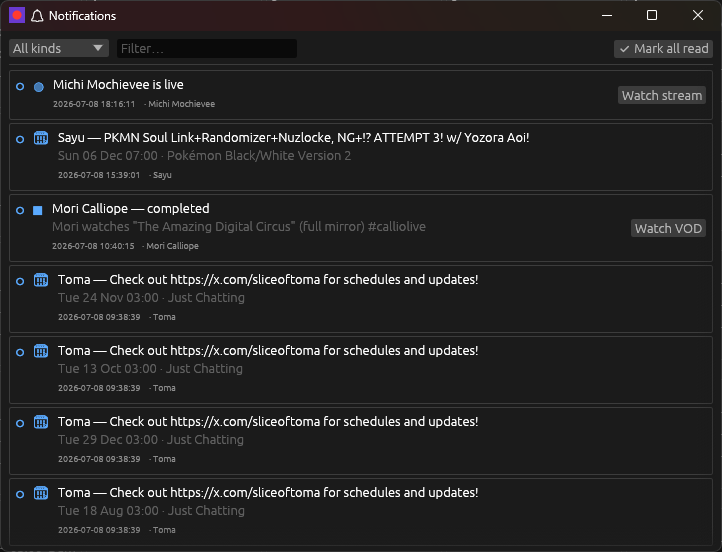
  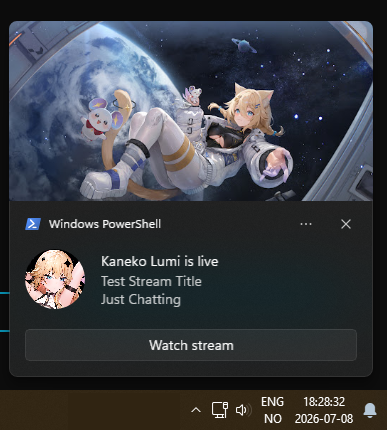
- **Do Not Disturb** (Settings → Notifications) — suppresses desktop toasts
  without touching anything else: the 🔔 feed, Background view, and recording
  itself all keep working exactly as normal. Two independent switches: a
  manual **Do Not Disturb** toggle for right now, and **Automatically during a
  daily time range** (e.g. `22:00`–`08:00` overnight, or `09:00`–`17:00` for
  work hours) that engages on its own every day — either one suppresses
  toasts on its own, so leaving the manual toggle off doesn't disable the
  schedule. A start later than the end spans midnight.
- **Background** tab — lists every recurring background job (Live poll,
  Schedule refresh, Ad-free/sub refresh, YouTube WebSub poll, Channel asset
  refresh, YouTube posts refresh, Scheduled recordings) with its interval and
  a live countdown to the next run; each has its own on/off toggle (turning
  off **Live poll** pauses all detection/recording). Below that, **Active**
  and **Recent** tables show in-flight and just-finished tasks (head
  backfills, re-remuxes, asset fetches) with live progress and outcome.

  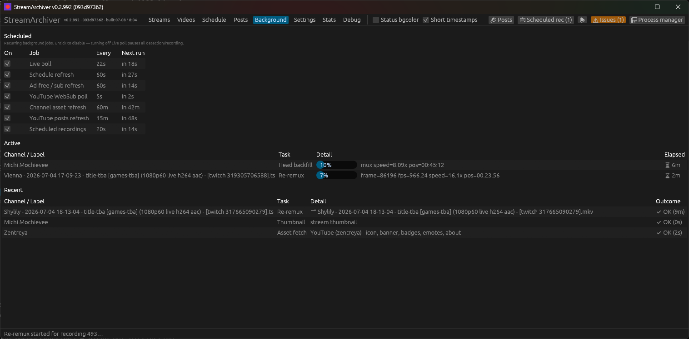
- **🖥 Process manager** — lists every spawned external process (streamlink /
  yt-dlp / ffmpeg) with its PID, tool, status, and uptime, plus per-process
  **Stop** (graceful), **Kill** (force-terminate the tree), **Log**, and
  **Folder** actions — useful for diagnosing a stuck capture without leaving
  the app.

  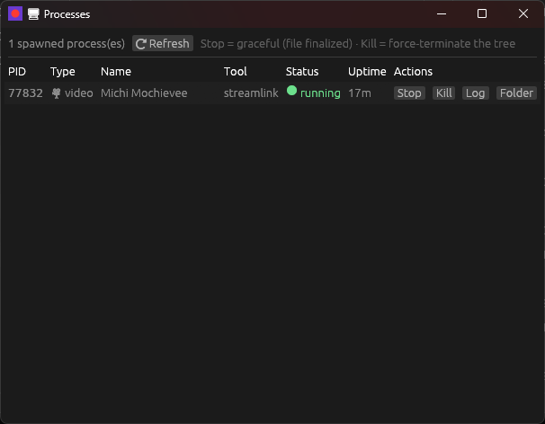

### Twitch VOD recovery (deleted & muted VODs)

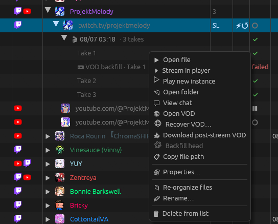

Twitch DMCA-**mutes** VODs (silencing flagged segments) and, on deletion,
**unpublishes** them — but the underlying `.ts`/`.mp4` segments linger on Twitch's
CDN for roughly **60 days**. StreamArchiver can reconstruct a muted or deleted VOD
from those surviving segments and mux them into an MKV, entirely from metadata (no
Twitch login required).

**How it finds a VOD.** A VOD's playlist URL is derivable from the streamer login,
the **broadcast/stream id** (the number in a `/streams/<id>` tracker URL — *not* the
`/videos/<id>` archive id), and the stream's UTC start second:
`sha1("{login}_{broadcast}_{start}")[:20]` names its CDN folder, which the app probes
across a self-updating list of CDN hosts (a symmetric ±window absorbs start-time
imprecision). For a VOD that's still published (merely muted), the app takes a more
robust shortcut: it asks Twitch's public API for the VOD's *exact* CDN folder, so it
never depends on the host list.

**Un-muting & salvage.** A muted VOD lists its flagged segments under a dead
`-unmuted` pointer; the app rewrites each to the segment that actually survives —
preferring the pre-mute **original** (a true un-mute, when Twitch hasn't purged it)
and otherwise the silenced `-muted` copy (silence over a hole). Deleted VODs are
salvaged segment-by-segment, dropping any that are gone, so a partially-expired VOD
still yields everything that remains.

**Recording badges.** In the recording-history tree, a Twitch take shows its VOD
state: **⚠ no VOD** (never published), **✂ muted** (the published VOD has DMCA-muted
content — your local recording is the authoritative copy). Once a recovery has run,
it gets its **own sibling row** — **🛟 VOD recovery** — right under the take (same
tree depth as a take, expand the stream to see it even for a single take), with a
live progress bar while running and a final status (**recovered** / **partial**
(some segments were gone) / **gone** (past the ~60-day window) / **failed**)
afterwards.

**Recovering one:**

- **From a tracked recording** — right-click a Twitch take (especially one badged
  **⚠ no VOD** or **✂ muted**) → **🛟 Recover VOD…**. The dialog is pre-filled from
  the recording's stored broadcast id + go-live time, and the recovered MKV is
  attached back onto that recording (right-click the **🛟 VOD recovery** row →
  **Open recovered file**, or **Retry recovery** if it failed or the segments are
  gone).
- **Manually / any VOD** — the **🛟 Recover Twitch VOD…** button on the **Videos**
  tab opens the same dialog blank. Enter the streamer login + broadcast id + UTC
  start, or **paste a URL**: a `twitch.tv/videos/<id>` link resolves everything via
  Twitch's API in one click, or a TwitchTracker / StreamsCharts / SullyGnome
  `/streams/<id>` link is parsed (with a best-effort start-time scrape). A recovery
  that isn't tied to a tracked recording lands in the **Videos** list.
- **Probe first** — the dialog's **🔎 Probe** button checks availability before
  downloading, reporting the host, the resolved true start, the available qualities,
  and a `present / total · un-muted · missing` segment count (warning when the
  recovery would be partial).

**Automatic & bulk recovery** (Settings → *Twitch VOD recovery*):

- **Auto-recover muted / deleted VODs** — when the background VOD checker finds a
  tracked stream's VOD muted or unpublished, recover it automatically (off by
  default — it's network-heavy).
- **Recover deleted/muted VODs** — a one-shot bulk sweep of every eligible recording
  inside the ~60-day window.
- **Default quality**, **max concurrent probes**, and **extra CDN hosts** are
  configurable.

**Keeping the CDN host list current.** Twitch rotates its CDN distributions, so a
fixed host list goes stale. The list is **self-updating**: it seeds from a built-in
set, learns the serving host from every successful recovery, and a **Refresh CDN
hosts** button harvests the currently-active hosts from your own published VODs via
Twitch's API. (For the common muted case the host list is moot anyway — the API
returns the exact host.)

> Recovery is Twitch-only and needs a broadcast/stream id, so it's offered on takes
> the app detected with an id (Helix/EventSub) or via manual entry. Twitch usually
> purges the pre-mute **original** audio quickly, so muted recoveries typically yield
> the silenced copy — a complete, playable file with silence over the muted stretch —
> rather than restored audio; the `un-muted` count in the probe tells you which you
> got. The public-API lookups use Twitch's read-only web client id (no account).
> To get original audio *despite* a mute, the best defenses are the ones that run
> **before** the mute lands: the immediate post-stream [VOD
> download](#post-stream-vod-download-archive-the-published-vod) (races the mute pass)
> and the mid-stream [head backfill](#streams-live-monitoring) for a late-joined
> capture.

### Trigger words (force-record on title/game match) ⚡

Streams titled **"unarchived"** or **"karaoke"** usually mean there will be **no
VOD** (or a heavily muted one) — the live capture is the only copy you'll ever
get. **Trigger rules** make sure those get recorded even on channels you don't
auto-record: when a monitored channel is live and its **title or game/category**
matches a rule, recording starts **even with Auto off**. The check runs at
go-live *and on every poll*, so a streamer flipping the title to "unarchived
karaoke" 20 minutes in still triggers on the next poll (Auto-off monitors are
polled regardless).

**Rule anatomy.** Each rule is structured, not just a word:

- **Field** — match against the *Title*, the *Game* (category), or *Any field*.
- **Match** — *Contains* (case-insensitive substring; phrases like `no vod`
  match as a whole) or *Regex* (case-insensitive by default — start the pattern
  with `(?-i)` to opt out; an invalid regex is shown in red and never matches).
- **From start** — a per-rule override of the instance's *capture from start*
  flag for the recording the rule starts: *Inherit* keeps the instance setting,
  *On* forces the DVR head backfill / live-from-start path (usually what you
  want for unarchived streams), *Off* forces it off.
- **Lead** — backfill this many seconds from the Twitch live-VOD CDN from
  *before* the match was detected (reuses the [head backfill](#streams-live-monitoring)
  mechanism, so **Twitch only**), in case the title/game update landed a
  little late relative to when the segment actually started. `0` = off.
- **Only while matching** — instead of recording until the stream itself
  ends, stop once this rule no longer matches — e.g. archiving just one game
  segment of a multi-day event like GamesDoneQuick. When on, an **End delay**
  field appears: keep recording this many seconds after the unmatch before
  actually stopping, a grace period for a title/game that flips back (or
  updated a little early). Checked on the same ~60s cycle that logs title/game
  changes during a recording, so small End delay values effectively round up
  to the next check. Survives an app restart (a re-attached recording keeps
  enforcing it).
- An **enabled** checkbox per rule, so seasonal rules can be kept but parked.

**Three-level control.** Rules resolve through the same inheritance chain as the
VOD options — **global < per-channel < per-instance** — but as a *list*, each
level picks a mode: **Inherit** (use the level above unchanged), **Extend**
(inherited rules *plus* this level's own), **Replace** (only this level's
rules), or **Off** (no triggers here at all, inherited ones included). Global
rules live in **Settings → Downloads → Trigger words**; the channel and
instance overrides in their **Properties** windows ("Trigger words" section).

**What you see when one fires.** A **⚡ Trigger matched** notification + rich
toast (which rule matched, the matching title/game text, and what it did); the
recording and its takes carry a **⚡ badge** (hover shows the match, e.g.
`title ~ "karaoke" · capture-from-start forced on`, or
`title ~ "boss rush" · lead 30s · stops when unmatched (+15s)`); and the
take's Properties window gets a **Trigger** row. While the recording is
running, the ⚡ badge also bubbles up to the instance row and the (collapsed)
channel row — same for the 💬 chat-download badge — so a trigger-started
recording is visible without expanding the tree; once it ends, the badges stay
on the stream/take history rows only. With Auto *on*, rules still
run — the per-rule *From start*/*Lead*/*Only while matching* overrides apply
to the automatic recording and the match is recorded the same way.

> Platform notes: Twitch (Helix) and Kick polls carry title+category natively.
> Twitch **EventSub** pushes don't include a title, so a matching-capable
> follow-up check fetches it automatically. YouTube's *scrape* detection carries
> the title; the quota-based *Data API* method does not — use scrape for
> channels you want triggers on.

### Blacklist triggers (prevent recording on title/game match) 🚫

The exact inverse of trigger words: while the live title or game matches a
blacklist rule, **automatic recording is suppressed** — for streams you never
want archived, like "rerun", "24/7", a specific game, or sponsored segments.
Rules use the same shape (field, Contains/Regex pattern, per-rule enable) and
the same **global < per-channel < per-instance** Inherit/Extend/Replace/Off
resolution; global rules live in **Settings → Downloads → Blacklist
triggers**, overrides in the Properties windows ("Blacklist triggers"
section). Semantics:

- A blacklist match vetoes **both** Auto-record starts and trigger-word
  starts — an explicit "don't record this" beats "record this".
- A **manual ▶ Start always records** — the blacklist only gates automation.
- Checked at go-live and on every poll. A recording that is **already
  running** is *not* stopped by a mid-stream match (the veto gates starts
  only) — but with the stream still matching, the take won't auto-restart
  after a stop.
- Detection/metadata keep running: the channel still shows **live** with
  title/game/thumbnail in the Streams grid, it's just not recorded.
- When a start is vetoed you get a one-per-broadcast **🚫 Blacklist blocked**
  notification (which rule matched and the matching text).
- Push signals without a title (Twitch EventSub) fetch the metadata via a
  follow-up check before starting whenever blacklist rules exist. If the
  metadata can't be fetched at all, the recording proceeds (fail-open — an
  archiver errs on capturing).

### Scheduled recordings (force-record at a time or on a weekly repeat) 📅

Trigger words fire on *content* (title/game); **scheduled recordings** fire on
*time* — a specific date+time (**Once**) or a **Weekly** repeat on chosen
days, at a chosen time. Like a trigger match, a due schedule **force-starts
the recording even with Auto off** (and works on a **Disabled**-detection
instance, which has no automatic liveness check at all) — for channels you
know the schedule of but don't want kept on Auto.

- **Manual scheduling**: the **📅 Scheduled rec (n)** toolbar button opens a
  management window listing every rule (channel, instance, recurrence, next
  run, duration) with **Edit / Delete / + Add new** actions.
- **Right-click scheduling**: in the Schedule view, right-click any calendar
  entry → **📅 Schedule recording…** to prefill a one-off rule from that
  entry's channel, start time, and (when known) duration.
- **Duration**: optional — leave it off to record until the stream ends
  naturally, or set a fixed number of minutes to auto-stop.
- **Weekly rules** support an optional **until** date to stop the recurrence,
  and every day/time is evaluated in your local timezone.
- The Schedule view's month grid shows a small **⏺ rec** badge under the day
  number on any day with a scheduled recording (hover for details); the
  Streams grid has a matching **Scheduled rec** column (hidden by default —
  enable it from the column header).
- A background job checks for due rules every ~20s; it can be paused from the
  Background view like any other periodic job ("Scheduled recordings").

### Post-stream VOD download (archive the published VOD)

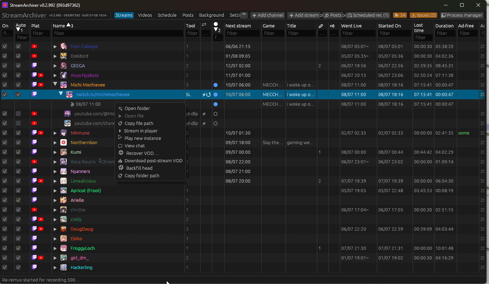

After a stream ends the platform publishes its own **post-processed VOD** — Twitch's
clean transcode, YouTube's finished recording, Kick's VOD — often higher quality /
gap-free vs. the real-time capture. StreamArchiver can **download that VOD after the
stream ends** to sit *alongside* the live recording, and — as a separate option —
**replace the live recording with the VOD, but only if the download succeeded** (so a
failed or unavailable VOD never costs you the footage you already captured).

**Three-level control.** Both options resolve through an inheritance chain —
**global default < per-channel < per-instance** — so you can turn archiving on
everywhere and off for one noisy channel, or on for a single instance. Each level is a
tri-state **Inherit / On / Off**:

- **Global** (Settings → *Post-stream VOD download*): two checkboxes — *Download the
  published VOD after a stream ends*, and *Replace the live recording when the download
  succeeds*.
- **Per-channel** (right-click a channel → **Properties/rename**): *Download VOD after
  end* and *Replace with VOD* dropdowns (Inherit follows global).
- **Per-instance** (edit an instance): the same two dropdowns (Inherit follows the
  channel, then global).

**How it works.** When a recording ends and the platform's VOD becomes available, a
detached **yt-dlp** download is queued (it shows in the Videos tab with a progress bar,
survives an app restart, and is stoppable) and lands next to the live file as
`{stem}.vod.mkv`. On Twitch the VOD is matched to the recording by its **broadcast
(stream) id** — Helix archive videos carry the originating stream id, so back-to-back
streams can never shadow each other's VODs; a publish-time window is only used for
old recordings that never learned their stream id. A completed download must also pass
a **sanity check** (ffprobe-readable, and at least 90% of the expected duration) before
it's trusted as the archive — a failed check marks the download failed instead of
silently archiving the wrong or truncated file. If **Replace** is on and the download succeeds (and, for Twitch, the
VOD isn't DMCA-muted), the live capture is swapped out: the VOD is renamed to the live
file's name — so the recording's chat/thumbnail sidecars stay matched — and the old file
is deleted only *after* the VOD is confirmed good.

**Racing the DMCA mute (Twitch).** Twitch publishes the VOD within **seconds** of
stream end, but applies DMCA mutes **minutes later** — and the mute pass also scrubs
the original segments from the CDN, so speed decides whether you get original audio.
The VOD check therefore polls **immediately** at stream end, then every 25 s for the
first ~10 minutes, then backs off to 5-minute polls (~1 h window) — a clean VOD's
archive download typically starts within seconds of publication. After a clean VOD is
found, a **mute watcher** keeps re-checking it for another ~2 hours:

- Mute lands **after** your download completed → **you won the race**: the archive
  keeps its state and the **📼 VOD backfill** row shows **archived (pre-mute)** (or
  **replaced (pre-mute)**) — your copy has the original audio even though the online
  VOD is now silenced.
- Mute lands **before/during** the download → the normal muted flow below runs (a
  mid-mute download may already contain silenced segments, so it's flagged, never
  trusted as clean).

**Muted VODs are handled specially.** A DMCA-muted Twitch VOD is silenced, so it's
**never** downloaded as-is and **never** replaces the live recording (which has the full
audio). Instead the [CDN recovery](#twitch-vod-recovery-deleted--muted-vods) runs to
un-mute what it can, a desktop notification fires, and the take is listed in the **⚠
Issues** panel under *DMCA-muted VODs* with buttons to **Open live recording**, **Open
recovered VOD**, **Re-run recovery**, or **Keep live / dismiss**.

**Download integrity.** A "completed" archive is only trusted after it proves itself:
tool working/side files (logs, `.part`, `.ytdl`) can never be picked up as the output,
a nonzero exit code must pass an `ffprobe` check, and before the file is archived (or
allowed to replace anything) its probed duration must be plausible (≥ 90 % of the live
capture / broadcast span). Anything failing these checks lands the **📼 VOD backfill**
row in a **failed** state, retryable — the live recording is never touched. Download
filenames are also length-capped so the tool's temp paths stay under Windows'
260-character limit (yt-dlp/streamlink are Python and can't use long paths, even when
the app itself can). On every start a **reconcile pass** repairs interrupted state:
archive downloads that finished while the app was down get filed properly, and any
`archived` row whose file turns out bogus is demoted to `muted`/`failed` so it
surfaces in Issues instead of masquerading as done.

**Its own row.** A published-VOD download gets a **sibling row** in the recording
tree — **📼 VOD backfill** — right under the take it belongs to (same tree depth as a
take; expand the stream to see it even when there's only one take), showing a live
progress bar while downloading and a final status once done: **archived** (downloaded
alongside), **replaced**, **archived (pre-mute)** / **replaced (pre-mute)**, **muted**,
or **failed**. Right-click a take for **📥 Download post-stream VOD** (on-demand /
retry); once a job exists, right-click the **📼 VOD backfill** row itself for **Open
downloaded VOD** or **Retry download**.

> **Notes.** This re-downloads the whole stream, so it doubles storage/bandwidth — hence
> it's opt-in and granular. Twitch is the most reliable path (instant VOD publication +
> the fast poller). YouTube/Kick VOD readiness after a stream is less deterministic —
> the download retries for up to ~1 hour and, if the VOD still isn't available, marks
> the archive `failed` without ever touching the live recording (use **📥 Download VOD
> now** to retry later).

### Audio & subtitle tracks

Both the Streams add/edit form (live recordings) and the Videos download form
(one-shot VOD/video downloads) have **Audio tracks** and **Subtitle tracks**
fields, but the two forms handle them differently — live recordings land in
per-channel subdirs where a sidecar file is unambiguous; Video downloads all
land in **one flat folder**, where a lingering `clip.en.vtt` next to the file
is just clutter, so that path embeds instead.

**Streams (live recordings):**
- **Audio tracks** — which audio tracks to capture, via streamlink's
  `--hls-audio-select`. Empty = the tool's default (one track); **`all`** (or
  `*`) = every audio track; or a comma-separated list of language codes/names
  (e.g. `en,de`). Honored by **streamlink**; the **ffmpeg** tool keeps all
  video+audio tracks via its capture mapping (it can't select a *subset*), and
  **yt-dlp** ignores it (it captures its default audio).
- **Subtitle tracks** — which subtitles to capture, via yt-dlp's `--sub-langs`,
  written as **sidecar files** next to the recording (e.g. `clip.en.vtt`) — a
  lossless, replayable archive, **not** embedded into the container. Empty =
  none; **`all`** (or `*`) = every subtitle; or a comma-separated list of
  language codes. Honored by **yt-dlp** only — **streamlink can't mux
  subtitles**. Best-effort for live streams (live subtitle availability varies by
  platform).

The **MKV remux** on clean stop preserves *all* captured video/audio/subtitle
tracks (not just one per type), and subtitle sidecars are moved along if the file
is later renamed (see *Filename media info*), so the tracks you select are the
tracks you keep.

**Videos (on-demand downloads):**
- **Audio tracks** — same field meaning, but for **yt-dlp** it now actually
  does something: a language (list) synthesizes a `-f` format selector picking
  those audio-only formats as separate muxed streams (e.g. `en,de` →
  `bv*+ba[language^=en]+ba[language^=de] --audio-multistreams`), so a YouTube
  video's dub tracks or descriptive audio come along instead of whatever single
  track yt-dlp would've defaulted to. Language codes match by *prefix*, so
  plain `en` also matches `en-US`/`en-GB`. The synthesized selector always ends
  in a `/b` fallback, so sites without separate audio streams still download:
  muxed-only video (NRK) takes its best combined rendition and audio-only pages
  (NRK radio/podcasts) take their best audio, instead of dying with
  `Requested format is not available`. Ignored when **Quality** is set to a
  custom yt-dlp format string — that always wins outright rather than trying to
  merge two `-f` selectors. Streamlink/ffmpeg behave the same as above.
- **Subtitle tracks** — yt-dlp still fetches them the same way, but they're
  then **embedded into the file itself and the sidecar deleted**, with a
  `language` tag per stream parsed from the filename. No-op when nothing was
  fetched.

**New** instances/videos default both fields to **`all`** (maximum archival).
**Existing** ones keep their previous behavior (empty) until you edit them.
Power-user **Extra args** are appended after these, so they can still override.

### Title & category change log

While a stream records, StreamArchiver polls its metadata and logs every **title**
and **game/category** change for that take — so the archive captures *what* the
broadcast was, not just the footage. (The normal scheduler pauses polling during a
recording, so this runs as a dedicated per-recording poller.)

- **Game** and **Title** columns show the *current* (latest-logged) value of the
  most recent recording, updating live as the stream changes. Both are narrow and
  truncated — **hover** to read the full value.
- A **Changes** column counts only *actual* changes for the latest take — the
  value each field *started* with is the initial state, not a change, so it isn't
  counted or listed (it still shows as the `old` side of the first real change).
  **Hover** a stream/take row's count to see the list inline, or **double-click**
  it to open a scrollable, copyable log window; each entry shows the offset from
  the take's start, the kind, and `old → new`.
- **Sources, per platform:**
  - **Twitch** — Helix (`Get Streams`); needs Twitch credentials (Settings), the
    same app/user token as live detection. Title + the game/category.
  - **Kick** — the public v2 channel JSON (no credentials). Title + category.
  - **YouTube** — scraped from the `/live` page (no credentials). Title, plus the
    broad *content category* (e.g. “Gaming”) — YouTube has no public per-stream
    game field, so the category is the closest stable signal.
  - Generic URLs have no metadata source, so they log nothing.
- Polling is coarse (about once a minute) since changes are infrequent, so the cost
  is low — one request per active recording. (Twitch and Kick hit small JSON
  endpoints; the YouTube path fetches the full `/live` watch page each poll.)

The categories played can also be folded into the filename — see `{games}` below.

**All-time title/category history, independent of recording.** The change log
above only exists for a take that's actually being recorded. Separately,
StreamArchiver keeps a **continuous** title/category history per instance —
fed by the normal live poll whenever a channel is live but not recording (Auto
off, or Enabled-but-idle) and by the same in-recording poller while it is —
so a channel's full history survives regardless of Auto/Enabled state. Open it
from a stream row's right-click menu → **📝 Title/category history**: a
scrollable, copyable, newest-first log with real dates/times (not
take-relative offsets).

### Upcoming stream schedule

The **Next stream** column shows when a channel's next stream is scheduled.
**Hover** it for the title; **double-click** it for a popup listing all upcoming
streams (datetime — title, with the category when known).

- **Twitch** — the Helix *Get Channel Stream Schedule* API (needs Twitch
  credentials, same as detection). Includes the segment title + category; canceled
  occurrences are skipped.
- **YouTube** — scraped from the channel's `/streams` page (no API key / quota);
  reads each upcoming livestream's scheduled start + title. Can optionally use the
  Data API instead — see *Settings → YouTube Data API usage*.
- **Kick / generic URLs** have no schedule source, so the column stays blank.

Schedules are refreshed in the background a few hours apart (new monitors are
picked up within a minute) and stored, so the column is populated on launch.

#### YouTube: scrape vs Data API

By default the YouTube features above (and live detection) get their data by
**scraping** public pages — free, no API key, but they can break when YouTube
changes a page. If you set a **YouTube API Key** (Settings → Detection
credentials), the **YouTube Data API usage** section lets you opt individual
operations into the API for more reliable results, at a quota cost (the free
daily quota is ~10,000 units):

- **Live detection** — `search.list` (~100 units/check) instead of scraping
  `/live`, for monitors whose detection method is *Scrape*. Use a long poll
  interval. (Monitors set to the *YouTube Data API* detection method already use
  it.)
- **Upcoming schedule** — the Data API (~100 units per channel per refresh)
  instead of scraping `/streams`.

Each is a checkbox; off = keep scraping. Live title/category logging always
scrapes (the API needs the live video id and returns no better category).

### Schedule (calendar)

The **Schedule** tab shows every upcoming scheduled stream (from the same Twitch +
YouTube sources as the Next stream column) in a calendar, with **Month**, **Week**,
**Day**, and **Agenda** views (picked from the buttons in the header):

- **Month** — a 6×7 grid; each day cell shows up to three streams as chips
  (platform icon + start time + channel). **Click** a day number, or the
  **+N more…** when a day is busy, to open that day's full list.

  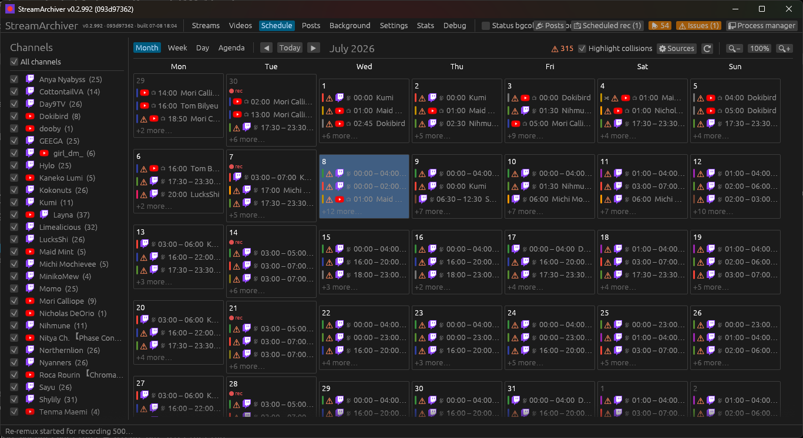
- **Week** — seven day columns (Mon–Sun), each listing *all* of that day's streams.
  The day header also shows the **avatars of channels with a scheduled recording
  due that day** (see *Scheduled recordings* above), and any stream long enough
  to count as an **all-day event** (20h+ — covers both a full-day placeholder and
  a genuine multi-day range like a subathon) draws as a continuous horizontal bar
  under the day numbers, Google-Calendar style, instead of a clipped time-grid
  block.

  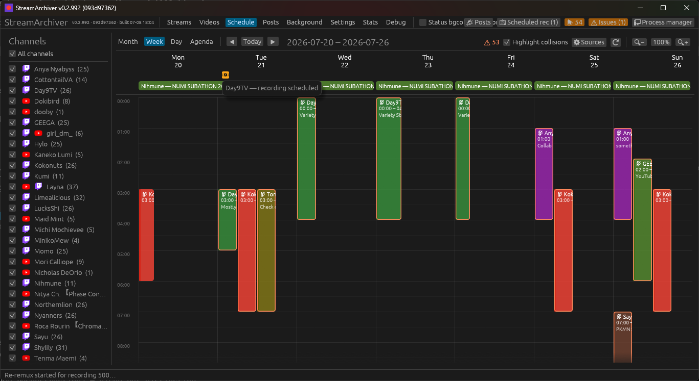
- **Day** — a detailed, time-sorted list of one day's streams (time · platform ·
  channel — title (category)).

  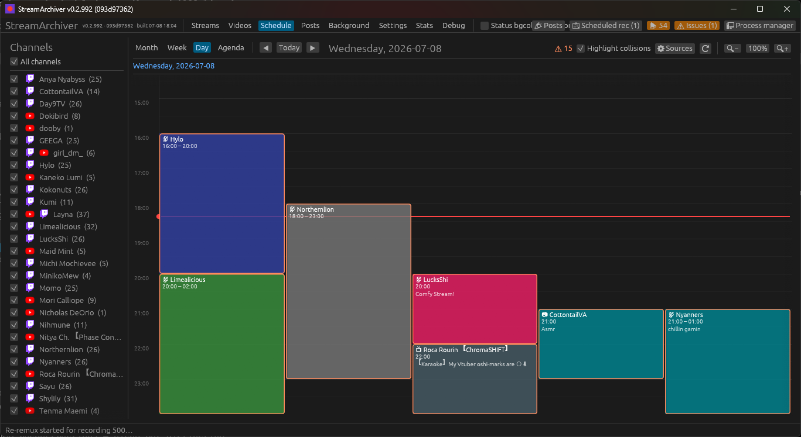
- **Agenda** — a flat, date-grouped list of every upcoming stream across all
  visible channels, most useful for scanning far ahead at a glance.

  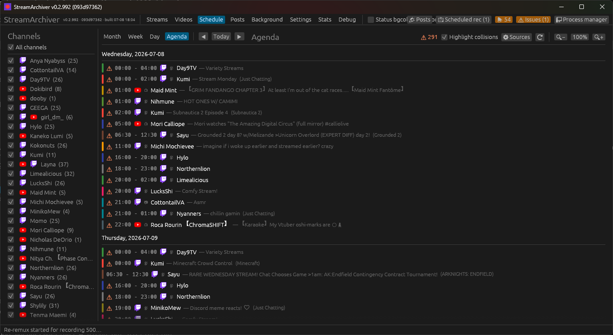
- **Navigation** — `◀` / `▶` step by the current view (month/week/day), **Today**
  returns to now. Today is tinted/highlighted.
- **Right-click** any stream (chip, day list, or popup) to **copy** its URL,
  platform, title, channel, or full details, or **open it in the browser**. The
  day popup also has **Copy all**. Hover a stream for its full details.
- **Left sidebar** filters which channels are shown: an **All channels** toggle
  plus a per-channel checkbox (with each channel's platform icon and upcoming
  count). Newly-added channels default to visible. Each row carries the
  channel's **calendar color** as a swatch + tinted name, so the sidebar
  doubles as the legend for the event blocks.
- **Channel colors** are the *same* ones the Streams list uses: a manually
  chosen custom color wins, else the streamer's own **Twitch name color**
  (darkened just enough that white block text stays readable), else the
  automatic palette. Every schedule surface — event blocks, month chips,
  agenda stripes, day lists, the sidebar legend — resolves through this one
  map, so an event is recognizable by color across views.
- **Highlight collisions** (on by default) flags with a `⚠` any streams whose
  times overlap — handy for spotting clashes across channels. YouTube upcoming
  streams carry no end time, so they're treated as two hours long for the overlap
  check. The header shows how many overlapping streams are visible in the current
  view.
- **Compact** (header checkbox, persisted): collapses every Week/Day event
  block to a **one-line chip at its start time** (`HH:MM Channel — Title`)
  instead of a duration-height block — a quick at-a-glance overview when many
  overlapping streams would otherwise shred the columns into slivers. Chips
  only split into side-by-side lanes when *start times* land within the same
  chip, not for the whole real duration; hover any chip for the full details.

Times respect the **date format** setting (12- vs 24-hour). `⟳` (or **F5** on the
tab) **fetches the latest schedules from Twitch/YouTube right away** — it doesn't
just re-read the stored copy — and the calendar updates when the fetch returns
(schedules also refresh in the background every few hours).

**Zoom** (calendar body only — the toolbar/sidebar stay normal size): the
**🔍−** / **percentage** / **🔍+** buttons in the header, or **Ctrl+Plus** /
**Ctrl+Minus**, scale the calendar's font and element sizes from 60% to 200%;
**Ctrl+0** (or clicking the percentage button) resets to 100%. Session-only —
resets to 100% on restart.

> **Note:** the schedule comes from a channel's *published upcoming schedule*.
> On Twitch that's the streamer's **Schedule** feature — if a channel hasn't set
> one up, Twitch's API returns no segments and the channel shows nothing here,
> even though its *past* broadcasts still appear on the channel's Twitch schedule
> page. YouTube uses the channel's upcoming/scheduled livestreams. For channels
> that only post their schedule on Discord, see below.

#### Discord schedule import (opt-in, experimental)

Many streamers publish their schedule as **Discord scheduled events** in their
community server rather than via Twitch/YouTube. **Settings → Discord schedule
import** can pull those in:

1. Paste your **Discord user token** and tick **Import schedules from Discord
   events**.
2. The app periodically sweeps the servers *you're already in* for scheduled
   events and matches each one to a monitored channel by the **stream URL** found
   in the event's location/description (e.g. `twitch.tv/<name>`). Matched events
   appear on the calendar (hover shows *Source: Discord event*).
3. Discord events are only used for channels that **don't** publish a
   Twitch/YouTube schedule, so the two never duplicate. Events with no recognizable
   stream URL are ignored.

> ⚠ **This uses your personal Discord token.** Automating a user account token is
> against [Discord's Terms of Service](https://discord.com/terms) and could get
> your account suspended or banned. It's off by default; enable it only if you
> accept that risk. The token is stored locally (like your other credentials) and
> never displayed or logged. A compliant bot can't read events in servers where
> you're only a member (a bot must be invited by that server's admin), which is
> why this path uses your own account.

#### Schedule sources & OCR

Many streamers publish their weekly schedule as an **image** — a Twitch offline banner, a YouTube community post, or a pinned tweet — rather than using platform schedule features. The **⚙ Configure schedule sources** button in the Schedule toolbar opens a dialog to choose which sources are enabled and in what priority order. Sources are tried top-to-bottom per channel; **the first to return a non-empty schedule wins** and later sources are skipped.

| Source | Platform | Notes |
|---|---|---|
| **Twitch schedule** | Twitch | Helix `/schedule` API; needs Twitch credentials. Default: on. |
| **YouTube Data API** | YouTube | `search.list` + `videos.list`; self-gates on a configured API key. Default: on when key is set. |
| **YouTube scrape** | YouTube | `/streams` page scrape; no API key needed. Default: on. |
| **Twitch banner OCR** | Twitch | OCR the already-downloaded offline banner via the `claude` CLI. |
| **YouTube community post OCR** | YouTube | Fetches recent community posts and OCRs the latest attached schedule image. |
| **Twitter/X pinned tweet OCR** | Any | OCRs the image on the channel's pinned tweet. Requires the handle set in Properties → Schedule. Best-effort — X actively limits unauthenticated access. |
| **Other image (OCR)** | Any | OCR a user-supplied path or URL configured per-channel in Properties → Schedule. |
| **Discord events** | Any | Discord scheduled events (existing opt-in import; see above). Lowest priority by default. |

OCR and scraping sources run on the **slow (6 h) cadence** only, never the 60 s live-detection tick, and re-OCR is skipped when the source image is byte-identical to the last run.

**OCR settings** (Settings → Schedule → OCR): the CLI command (default `claude`), primary model (default `haiku`), fallback model (default `sonnet`), default timezone name and UTC offset. Per-channel overrides for timezone, offset, Twitter/X handle, and the "other image" path live in **right-click → Properties → Schedule sources**.

The **Stats** tab tracks cumulative **Claude OCR** usage (invocations, cache
hits, parse failures, tokens and cost per model) alongside **YouTube Data API**
quota usage (units and search calls against the daily cutoff), so you can see
what these features are actually costing you.

**Detection / API requests** (same tab) tracks cumulative poll/detect request
counts **per platform** (Twitch, YouTube, Kick, NRK, Nebula, Generic) across every
detection method — batched Twitch Helix polls, the WebSub/scrape fallback
check, YouTube/Kick API probes, generic HTTP probes — with an error count,
error rate, and the timestamp + detail of the most recent failure (hover the
timestamp for the full message). This is meant to surface *instability* that
would otherwise only show up by combing the log: a platform's error rate
climbing, or a recent DNS/auth failure repeating. A platform never polled
(e.g. no Kick channels configured) simply doesn't appear.

Below the counters, **⚠ Recent errors** expands to the actual individual
failures behind the numbers — the last 50 per platform, newest first, each
with its timestamp, platform, channel, detection method, and error detail
(long messages are truncated in the cell; hover for the full text).

Two **history graphs** plot the same request stream over time, with a
timespan selector (**1 h / 6 h / 12 h / 24 h / 7 d / 30 d** — wider spans use
wider buckets, from 1 min at 1 h up to 12 h at 30 d):

- **Error rate per platform** — failed checks as a percentage of all checks,
  one line per platform in its brand color (matching the log tags).
- **Requests per kind** — request volume per detection method (Helix API,
  Scrape, Probe, YT API, Kick API, …), all platforms combined.

The graph data is stored at minute resolution in the database (`poll_history`
table) and kept for 60 days; coarser views are aggregated at query time.
**Reset** clears the counters, the recent-error list, and the graph history
together; everything otherwise persists across restarts.

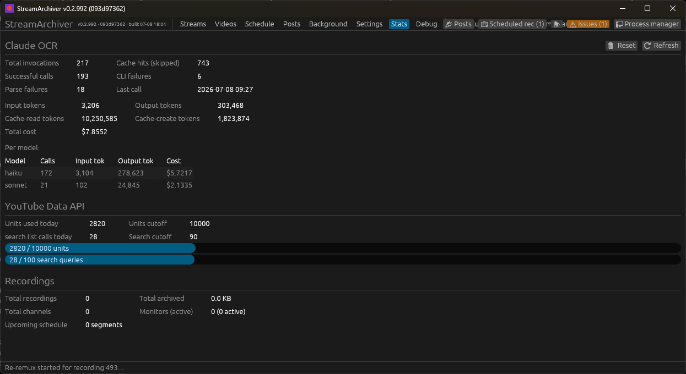

### Chat logs

Tick **Log chat** on an instance to archive chat alongside the recording (new
instances default it on):

- **Twitch** — a built-in **anonymous** chat logger (read-only, no account
  needed) connects over Twitch's IRC-over-WebSocket gateway and writes a
  **`<name>.chat.jsonl`** sidecar — one JSON object per message with timestamp,
  login, display name, text, color, and badges. Works with any tool (it's a
  separate connection, independent of streamlink/yt-dlp).
- **YouTube** (with the **yt-dlp** tool) — yt-dlp's `live_chat` writes a
  **`<name>.live_chat.json`** sidecar (folded into `--sub-langs` with any
  subtitles you selected).
- Other platform/tool combinations don't capture chat. Kick chat isn't supported
  yet.

The same **Log chat** option is on the Videos download form: a one-shot yt-dlp
download captures `live_chat` (e.g. a YouTube VOD's chat replay) the same way.

Chat sidecars sit next to the video and **follow it** if the file is renamed
(see *Filename media info*), so they stay matched to their recording.

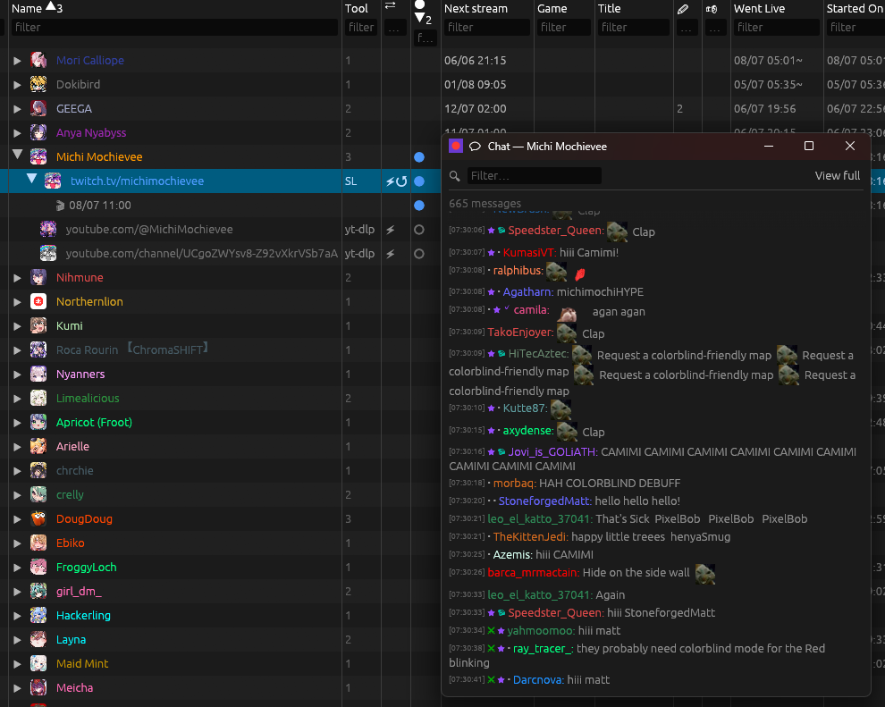

### YouTube community posts (📣 Posts)

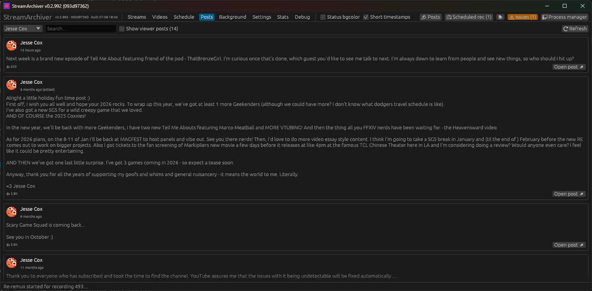

StreamArchiver archives the **community posts** of every monitored YouTube
channel — text (with clickable links), attached images, author avatar, and like
count — into the database and the channel's asset cache (`posts\` folder). The
feed is browsable in the **Posts** top-level tab or the pop-out **📣 Posts**
window, with a channel filter and text search; each new post also raises a
notification. To keep the feed responsive with a large backlog, only 30 posts
are laid out at a time — a **Show 30 more** button at the bottom reveals
further ones (filtering/search apply to the whole backlog either way, not just
what's currently shown).

- **Post kinds.** A channel's community tab mixes the channel's **own posts**,
  **viewer posts** (fans posting in the channel's Community space), and
  **reshares** (the channel quoting another post). StreamArchiver tells them
  apart by the owner-highlight YouTube renders on the channel's own posts and by
  matching author channel ids against the page owner. Viewer posts are archived
  but **hidden by default** — a *Show viewer posts (N)* toggle reveals them with
  a *viewer* badge — and **only the channel's own posts raise notifications**. A
  reshare renders the resharer's comment above an indented quote card showing
  the original author, text, and images (all archived, so the quote survives if
  the original is later deleted).
- **Ordering.** Posts sort by their (approximate) **publish time**, derived
  from YouTube's relative timestamps ("2 weeks ago") the first time a post is
  seen — not by when the archiver happened to discover them. Hover the
  timestamp for the estimated absolute date. The estimate is pinned at first
  sight (the relative buckets only get coarser with age), so re-scans never
  shuffle the feed.
- **Full-history backfill.** The first time a channel's posts are fetched,
  StreamArchiver walks the community tab's *older posts* pages until the very
  first post, so the whole backlog lands in the archive — paced like a person
  scrolling (a few seconds between pages), without notifications, and resumable
  if the app shuts down mid-walk. Afterwards each periodic round only reads the
  first page; if an *entire* first page turns out to be new (more than a page
  of posts landed between rounds), a bounded gap-fill walk fetches deeper until
  it reaches already-archived posts, so nothing is ever skipped.
- **Cadence.** Fetching is trickled to look like a human occasionally opening a
  community tab: one channel at a time, randomized order and jitter, each
  channel revisited roughly every 6 hours (Background → **YouTube posts
  refresh** toggles the whole job).

### Channel assets & change history

To make chat replay look right offline — and to archive a channel's *visual
identity* over time — StreamArchiver downloads each channel's icon, banner,
badges, emotes, the broadcaster's chat name colour, and the channel's **About
page** (see *About page archive* below) into a per-channel asset cache, and
records every change it sees on later refetches.

The cache is keyed **per account**: `channel_assets/{channel}/{platform}/{account}/`,
where `{account}` is derived from the instance's URL (Twitch login, Kick slug,
YouTube handle or UC-id). A channel container holding **two instances on the same
platform** (a streamer's main + alt Twitch account) therefore keeps two fully
separate asset trees — icons, emotes, name colours, and change histories never
overwrite each other — while two tools pointed at the *same* URL share one tree.
Chat replay, notifications, and the streams-list tint all read the account
belonging to the specific instance involved, and each **instance row** in the
Streams table shows its own account's avatar next to its URL (the container row
keeps showing the channel-level icon chosen by the *Icon source* picker). On first launch after upgrading,
existing per-platform asset folders are migrated automatically into the first
matching instance's account subfolder (a `.accounts_migrated` stamp marks it
done; already-downloaded community-post and schedule images stay where their
database records point and re-home on their next fetch).

**What's fetched, per platform:**

- **Twitch** (needs Twitch credentials — the same app/user token as detection):
  profile icon, offline banner, channel + global chat **badges**, first-party
  **emotes**, plus third-party **BTTV / FFZ / 7TV** emotes (the channel's sets,
  fetched from its Twitch broadcaster id), and the broadcaster's chosen chat
  **name colour** (tints the channel's name in the Streams list and chat replay).
- **YouTube** (needs a **YouTube Data API key**, Settings → Detection): profile
  icon + channel banner via the Data API. Without a key the background refresh
  **skips** YouTube (the manual Refetch button still explains why); when the API
  returns no banner it falls back to scraping the channel page's header banner.
  YouTube has no badge/emote set, so only icon + banner are archived.
- **Kick**: profile icon + banner via the public v2 channel API (no credentials).
- Generic URLs have no asset source.

Shared third-party emotes (BTTV/FFZ/7TV) and global Twitch badges are
**deduplicated** into one platform-wide cache rather than copied per channel, and
superseded icons / banners are **archived** rather than overwritten (see *change
history* below).

**Where it shows up — channel Properties** (right-click a channel → **Properties**).

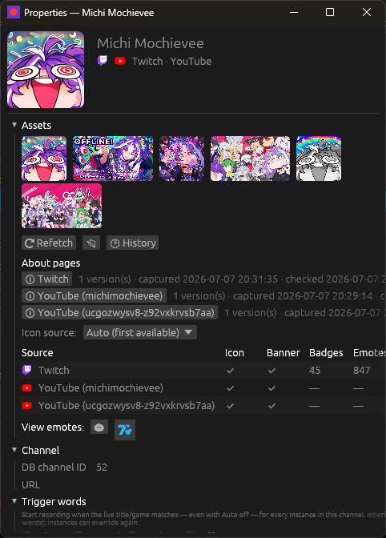

The window is organized into collapsible sections (**Assets · Channel · Schedule
sources** — the last starts collapsed) and scrolls when content outgrows it;
collapse/expand choices are remembered across restarts:

- The header avatar plus an **Assets** thumbnail strip of every original
  icon/banner across the channel's accounts — hover for pixel size, hold **Alt**
  to preview full-size, click to open the file.
- A per-**account** status grid (**Icon · Banner · Badges · Emotes · Updated**),
  one row per account — labelled like `Twitch (geega_alt)` when a platform has
  siblings — each with its own **⟳** to refetch just that account, and an **Icon
  source** picker choosing which *account's* profile pic represents the channel.
- **⟳ Refetch** fetches **every** account now (ignores the 24 h cache); **📂**
  opens the channel's asset folder; **🕑 History** opens the change log (below;
  entries name the account when a platform has more than one).
- **About pages** — one row per account (version count + captured/checked
  timestamps), each **ℹ** button opening that account's archived About page
  viewer (see *About page archive* below).
- **View emotes** — one launcher per account+provider that has emotes, opening an
  **emote viewer**: a grid of every emote with its chat code (animated emotes play
  when *Animate emotes* is on in Settings). Codes still listed in the manifest whose
  image has gone from the cache are shown separately under **Deprecated (no longer
  available)**. Sibling accounts open separate viewer windows.

  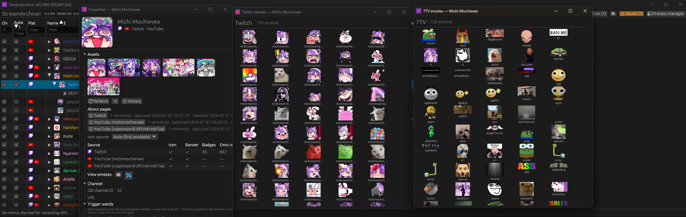

**Instance Properties** (right-click an instance row → **Properties**) shows the
same asset data scoped to *that instance's own account*: the header uses the
account's avatar and links its source URL, and an **Assets (this account)**
section carries the account's icon/banner thumbnails, its status row, **⟳
Refetch** (this account only), **📂** (this account's folder), **🕑 History**
(this account's changes only), **ℹ About** (this account's archived About
page), and its emote-viewer launchers. It uses the same
collapsible-section layout (**Monitor · Assets · Schedule sources**, the last
collapsed by default) with a scrollbar when needed.

**Change history.** Manifests and images are overwritten wholesale on each
refetch, so a removed emote code or a swapped banner would otherwise vanish with
no trace. Instead, every refetch is diffed against the previous state: the changes
are appended to a per-channel log (`asset_changes.jsonl`), the superseded emote
manifest is snapshotted under `emotes/history/`, and replaced icons/banners under
`history/`. The **🕑 History** popup lists the changes newest-first across all the
channel's platforms:

- **Emotes** — `+ code` added / `− code` removed (keyed by the code as typed in
  chat, so id/CDN churn alone isn't a change).
- **Icon / Banner** — *replaced* (the prior image is kept in `history/`).
- **Name colour** — set / cleared / changed.

Removed emotes stay in the history even after they're gone from the channel's
manifest — so the log is a durable record of what the channel *used* to have. If
the emote viewer or History window is open when a background refetch for that
channel lands, an amber **"assets were refetched — reopen"** banner appears (the
History window also reloads itself in place).

**About page archive.** Alongside the visual assets, every asset fetch also
captures the channel's *About page* — the free-text self-description streamers
change (and delete) over time — **versioned**: a new snapshot row is stored only
when the content actually changed; an identical re-capture just bumps the
"checked" timestamp. What's captured, per platform:

- **Twitch** — the channel bio (from the same Helix call as the icon) plus the
  full **About panels** (title, markdown body, image, link) via an anonymous
  read-only GQL query (no credentials beyond the ones detection already uses).
  Panel images are stored content-addressed under the account's `about/` folder,
  and the version hash uses the image *bytes* — a CDN re-serving the same image
  from a new URL is not a new version.
- **YouTube** — the channel description from the Data API response already
  requested for the icon/banner (zero extra quota), plus the external links from
  a best-effort `/about` page scrape (redirect-wrapped URLs are unwrapped).
- **Kick** — the bio + social links (Twitter/Instagram/Discord/…) from the same
  v2 response the icon/banner fetch already uses (zero extra requests).

If an *optional* source fails (Twitch GQL, the YouTube scrape), the round is
**degraded**: it may establish the very first baseline, but it never overwrites
existing history with a stripped-down version — so a temporary API outage can't
fake an "everything was removed" edit. A genuine change is also logged to the
**🕑 History** window (`about changed`).

The **About viewer** (the **ℹ** buttons above) shows any archived version via a
**version picker** (newest = *current*): the description and Twitch panel bodies
render as real markdown, panel images decode lazily (Alt-preview / click-to-open
like the thumbnails), and panel/external links open in the browser. The window
reloads in place when a background refetch lands. Versions live in the database
(`about_snapshot`), keyed per (channel, platform, account) like the asset dirs.

**Refresh cadence.** Per instance, **Fetch chat assets** (on by default) controls
whether that channel participates. A background job (**Channel asset refresh**,
toggleable like the other jobs) rescans hourly and refetches any channel whose
assets are older than **24 hours**; recording channels are handled by their own
record path, and YouTube is skipped without an API key. The **⟳ Refetch** button
bypasses both the 24 h staleness check and the per-instance toggle.

**Limitations & caveats:**

- The **first** fetch is a silent **baseline** — it establishes the initial state,
  so nothing is logged as a "change" until a *later* refetch differs from it.
- Tracking is **diff-on-refetch**, not continuous: a change is recorded only when a
  refetch sees a state different from the last stored one. A code added and removed
  entirely between two refetches is never seen. Timestamps are whole seconds, so
  two changes in the same second sort arbitrarily within that second.
- A provider returning a **transient empty** set isn't treated as "all removed":
  the previous manifest is kept until a non-empty refetch, so a provider outage
  doesn't log a mass-removal. (Flip side: a genuine removal of *every* emote isn't
  recorded until the provider responds non-empty again.)
- **Twitch first-party emotes** aren't change-tracked — they're files on disk with
  no manifest of chat codes; only BTTV/FFZ/7TV (which carry such a manifest) are.
- The on-disk history is **append-only** and never pruned by the app; deleting the
  channel's asset folder (via **📂**) is what clears it.

### Filename templates

The **filename template** sets the output file's *name*. The separate **Output
folder** field sets the directory, and the extension (`.mkv`/`.ts`) is appended
automatically — don't include either. The template is available on the Streams
add/edit form, the Videos download form, and the per-platform defaults. Leaving it
blank uses `{name}_{date}_{time}`.

These are the **only** variables (it's the app's own scheme — not streamlink's or
yt-dlp's output templates):

| Variable | Expands to |
|---|---|
| `{name}` | **Streams:** the channel (container) name. **Videos:** the **Name** field if set, else the auto-detected title, else `video`. |
| `{title}` | The stream/video title. **Videos only**, and only when **Auto-detect** is on (live recordings don't resolve a title, so it's empty there). |
| `{channel}` | The uploader/channel name. **Videos only**, when **Auto-detect** is on; empty otherwise. |
| `{video_id}` | The platform **stream/video id**. **Streams:** set when detection knows it (Twitch Helix/EventSub, YouTube Data API, Kick API); empty for id-less methods (scrape / generic probe). **Videos:** set when **Auto-detect** is on. |
| `{quality}` | The **configured quality selector** (e.g. `1080p60`, `best`, `bv*+ba`) — what you asked for, not necessarily the actual resolution (see `{resolution}`). |
| `{resolution}` | **Actual** capture resolution `WxH` (e.g. `1920x1080`). Requires media probing — see *Filename media info* below; empty when off/unavailable. |
| `{width}` / `{height}` | Actual width / height in pixels (e.g. `1920` / `1080`). Same probing requirement. |
| `{fps}` | Actual frame rate, rounded to a whole number (e.g. `60`, `30`). Same probing requirement. |
| `{vcodec}` | Actual video codec (e.g. `h264`, `hevc`, `av1`). Same probing requirement. |
| `{take}` | **Streams:** this monitor's attempt number (1, 2, 3, …) — a built-in way to keep names unique when you omit `{date}`/`{time}`. Empty for Videos. |
| `{games}` | **Streams:** the distinct game/category names played during the recording (Twitch, Kick & YouTube — see *Title & category change log*), in order of first appearance, joined with `, ` and length-capped. Only known once the stream ends, so it's filled by a **post-capture rename** (see below). Empty for generic URLs / Videos / when no category was logged. |
| `{date}` | Capture-start date, **UTC**, `YYYYMMDD` (e.g. `20260620`). |
| `{time}` | Capture-start time, **UTC**, `HHMMSS` (e.g. `183001`). |
| `{timestamp}` | Capture start as a **Unix timestamp** (whole seconds). |

Notes:

- `{date}`/`{time}` are **UTC** (not local time) and use the moment the
  capture/download *started*.
- Characters illegal in filenames (`< > : " / \ | ? *`) and control characters are
  replaced with `_` and the result is trimmed — so `{channel}/{name}` does **not**
  create subfolders (use the Output folder for the directory).
- Unknown `{…}` tokens are left as literal text; only the variables above are
  substituted.
- If a template expands to nothing usable, it falls back to `{name}_{date}_{time}`.
- **Collisions are handled automatically:** if the target file already exists, the
  app appends ` (2)`, ` (3)`, … (file-manager style) rather than overwriting — so
  even a template with no unique part (e.g. just `{name}`) never clobbers an
  earlier recording. Use `{take}` (or `{date}`/`{time}`/`{video_id}`) if you'd
  rather the difference be part of the name itself.
- **Very long titles are shortened automatically** (marked with `...`) so the
  resulting filename stays under NTFS's per-component limit and — separately —
  so the working path streamlink/yt-dlp actually write to (under the hidden
  `.sa-cache\` folder) stays under Windows' 260-character path limit for those
  Python tools. Both caps apply to live recordings and on-demand downloads
  alike; you shouldn't ever see a recording fail to start over a long title.

#### Filename media info ({resolution}/{fps}/…)

Actual resolution/fps/codec aren't known when the filename is first chosen (it's
picked before recording starts), so **Settings → Defaults → Filename media info**
selects how they're obtained — only relevant when your template uses one of those
variables:

- **Off** (default) — don't probe; those variables stay empty.
- **Pre-probe (before recording)** — probe the stream first so the name is final
  from the start. Adds a little latency and is best-effort: the probed format can
  differ from what actually gets recorded (or shift mid-stream). Use a
  post-rename mode for guaranteed-accurate values.
- **Post-capture rename** — record first, then probe the finished file and rename
  it. Most accurate; the final name only appears once the capture completes.
- **Pre-probe + rename** — pre-probe for an initial name, then correct it after
  capture if the actual media differs.

Probing uses the capture tool to resolve the stream and `ffprobe` to read it
(post-rename `ffprobe`s the finished file). Applies to both Streams and Videos.

`{games}` works the same way but is independent of this setting: because the
categories played are only known once the stream ends, a template using `{games}`
always gets a post-capture rename (and any subtitle/chat sidecars are moved along
with the file).

Examples: `{name}_{date}_{time}` → `Layna_20260620_183001.mkv`; for a Videos
download with **Auto-detect** on, `{channel} - {title} [{video_id}]` →
`SomeChannel - Cool Stream [dQw4w9WgXcQ].mkv`.

### Authentication

Two separate concerns:

**Platform API (detection).** OAuth2 / API-key, per platform (all optional —
scrape works without any):
- **Twitch** → Client ID + Secret (app token) *or* **Connect Twitch** (Settings →
  *Twitch account*) OAuth2 **device-code** login (also `--twitch-login`), which
  stores a refreshable user token detection prefers (Secret then optional).
  Register at <https://dev.twitch.tv/console/apps>.
- **YouTube** → **API key** (Settings) enables the *YouTube Data API* method.
  Create one in a Google Cloud project with the YouTube Data API v3 enabled.
- **Kick** → **Client ID + Secret** (Settings) enables the *Kick official API*
  method (client-credentials app token). Register at <https://kick.com/settings/developer>.

**Authenticated downloads** (sub-only / members-only / ad-reduced / higher quality).
Set a global default in Settings → *Download authentication*, and/or override
per channel in the add/edit form (a per-channel value always wins):
- **Browser cookies** → yt-dlp `--cookies-from-browser <browser>` (works for
  Twitch sub/Turbo and YouTube members). No manual export needed — yt-dlp reads
  the cookies straight from the browser's profile at download time.
- **Cookies file** → yt-dlp `--cookies <cookies.txt>`.
- **Auth token** → streamlink `--twitch-api-header=Authorization=OAuth <token>`
  for Twitch.

> **Browser profiles / sessions.** The browser value accepts yt-dlp's
> `browser:profile` form, so you can point at a *specific* logged-in profile
> instead of the browser's default (most-recently-used) one — exactly what you
> want for a dedicated "YouTube" Firefox profile. Use the **Profile / session**
> field in Settings → *Download authentication*, or type it inline in any
> per-platform / per-channel / per-video **Browser** field, e.g.
> `firefox:dmrf6eed.YouTube`. The profile is the **folder name** under
> `…\Mozilla\Firefox\Profiles\` (find it at `about:profiles`) or an **absolute
> path** to that folder. Leaving the profile blank uses the browser default —
> which is why a separate login can otherwise be missed. (Chromium browsers use
> a profile *directory* name like `Default` or `Profile 1`.) Tip: the profile DB
> can be locked while that browser is open; if a read fails, close it (or that
> profile) and retry.

> Note: streamlink (Twitch) authenticates via the token header; yt-dlp uses
> cookies. The form offers each tool the form it actually supports.

### YouTube live capture-from-start (SABR)

YouTube has moved live streaming to **SABR** (Server Adaptive Bit Rate). Stable
`yt-dlp` only sees the legacy HTTP-adaptive/DASH formats, which lack the metadata to
rewind reliably — so plain `yt-dlp --live-from-start` on a YouTube live now fails
(the formats show `MISSING POT` and the stream returns `ATTESTATION_REQUIRED`).
Capturing a YouTube stream **from its start** therefore needs three things working
together:

1. **A SABR-capable yt-dlp.** SABR support currently lives only in bashonly's
   [`feat/youtube/sabr`](https://github.com/yt-dlp/yt-dlp/pull/13515) dev fork, not
   in stable yt-dlp. Build/obtain that binary and keep it **separate** from your
   normal yt-dlp — the fork doesn't track yt-dlp master and will drift, so the app
   uses it *only* for the SABR capture (everything else stays on the system yt-dlp).
2. **A JavaScript runtime** (e.g. [Node](https://nodejs.org)). SABR extraction
   solves JS challenges; add `--js-runtimes node` to **Settings → yt-dlp default
   arguments** and keep `node` on `PATH`.
3. **A GVS PO-token provider.** SABR refuses to serve media without a per-request PO
   token. The standard provider is
   [`bgutil-ytdlp-pot-provider`](https://github.com/Brainicism/bgutil-ytdlp-pot-provider):
   its token server (HTTP, default port **4416**) must be running **and** its yt-dlp
   plugin installed *for the SABR binary*. The app launches and supervises the
   server itself — see [Managed GVS PO token server](#managed-gvs-po-token-server)
   below — so only the plugin install remains manual.

#### Settings → "YouTube SABR (live-from-start)"

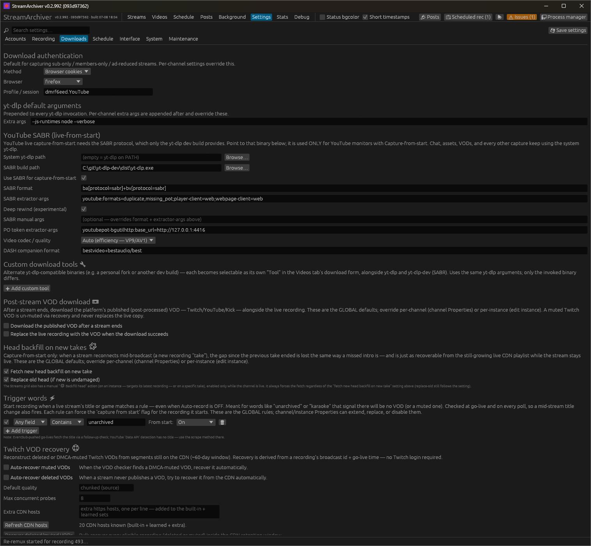

| Field | Purpose |
|---|---|
| **System yt-dlp path** | Your normal yt-dlp (chat, VODs, DASH). Empty = `yt-dlp` on `PATH`. |
| **SABR build path** | The SABR dev-build binary. **Empty disables SABR** — capture-from-start falls back to the normal path. |
| **Use SABR for capture-from-start** | Master toggle. |
| **SABR format** | Format selector. Default `ba[protocol=sabr]+bv[protocol=sabr]`. |
| **SABR extractor-args** | Default `youtube:formats=duplicate,missing_pot;player-client=web;webpage-client=web`. |
| **PO token extractor-args** | A *separate* `--extractor-args` entry for the token provider. Default `youtubepot-bgutilhttp:base_url=http://127.0.0.1:4416`. Empty = rely on the plugin's own auto-detection. |
| **SABR manual args** | When set, **replaces** the SABR format + extractor-args preset entirely (put your own `-f` / `--extractor-args` here). The PO-token args still apply. |
| **DASH companion format** | Format selector for the DASH companion of *dual capture* (below). |

For **live monitors**, the SABR binary is used **only** when a monitor is
**YouTube**, its tool is **yt-dlp**, and **Capture from start** is ticked.
Everything else — live-chat sidecars, channel/chat assets, thumbnails, and
on-demand **Videos**/VOD downloads — stays on the **system** yt-dlp by
default, so the stale fork can't break them. The Videos tab's **Tool**
dropdown can still opt an individual on-demand download into the SABR build
explicitly (see [Videos (on-demand downloads)](#videos-on-demand-downloads)),
but nothing switches to it automatically. SABR captures write the final
**MKV directly** (SABR merges separate audio+video, which the `.ts`
intermediate can't hold).

#### Installing the bgutil PO-token provider

bgutil has two parts — a **token server** and a **yt-dlp plugin** — and *both* must
be reachable by the **SABR binary**:

1. **Have the server available.** Clone/build the bgutil repo's Node server once
   (`server\build\main.js` after `npx tsc`); the app launches and supervises it
   from then on ([Managed GVS PO token server](#managed-gvs-po-token-server)). The
   **PO token extractor-args** field already points at its default
   `127.0.0.1:4416`. (Running it yourself — e.g. the Docker image — still works;
   the app detects an already-listening server and leaves it alone.)
2. **Install the plugin for the SABR binary.** This is the easy step to get wrong:

> ⚠ **A standalone/frozen `yt-dlp.exe` does NOT load plugins from Python
> `site-packages`.** A `pip install bgutil-ytdlp-pot-provider` is only visible to a
> *pip* yt-dlp, not to a PyInstaller-built SABR exe — which then logs
> `Plugin directories: none` / `PO Token Providers: none` and still fails with
> `requires a GVS PO Token`. Install the plugin into a directory the binary scans,
> **with the required nesting**:
>
> ```
> %APPDATA%\yt-dlp\plugins\bgutil-ytdlp-pot-provider\yt_dlp_plugins\extractor\
>     getpot_bgutil.py
>     getpot_bgutil_http.py
>     getpot_bgutil_script.py
> ```
>
> (or a `yt-dlp-plugins\<package>\yt_dlp_plugins\…` folder next to the exe). The
> `<package>\yt_dlp_plugins\` wrapper is required — pointing a `yt-dlp-plugins`
> folder *straight at* a `yt_dlp_plugins` directory doesn't load.

**Verify out-of-band** before recording in the app:

```sh
"<SABR build>\yt-dlp.exe" --verbose -F "https://www.youtube.com/@<channel>/live"
```

You want to see `Plugin directories: …\bgutil…`,
`PO Token Providers: bgutil:http-… (external)`, and `Retrieved a gvs PO Token`.
Once that lists formats, StreamArchiver will capture too.

> A separate error — `n challenge solving failed … No video formats found` — is the
> **n-sig (EJS) challenge solver**, not PO tokens: ensure a JS runtime + the
> `yt_dlp_ejs` distribution are present (see yt-dlp's EJS wiki).

#### Managed GVS PO token server

A SABR capture whose token server is down doesn't fail politely — it downloads
for a while, then dies mid-stream with `PoTokenError: This stream requires a
GVS PO Token to continue` (`sps:ATTESTATION_REQUIRED`), and every retry against
the dead server fails identically, burning a fresh take per backoff cycle. So
the app manages the server itself instead of assuming it's running:

- **Auto-launch at startup**: if nothing answers `GET /ping` on the configured
  port, the app runs `node main.js -p <port>` from the server directory
  (windowless). If a server is already listening — Docker, a manual shell,
  whatever — it's detected as **external** and used as-is: never restarted,
  never killed.
- **Health watchdog**: pings every 30 s. A managed server that crashes is
  restarted (exponential backoff 30 s → 5 min if it keeps dying), with **one**
  🔔 notification per down-episode and the exit status + last log lines in the
  app log.
- **On-demand recovery**: when a capture dies with a PO-token error, the app
  brings the server up *first* and then lets the in-flight SABR retry resume
  the **same take** from its `.state` files — no orphaned fragments, no burned
  take. Failures that aren't same-take-resumable still kick the watchdog so the
  server is healthy before the monitor's ≥30 s backoff expires and the next
  take succeeds. This on-demand start happens even with auto-launch off (the
  capture proved the server is needed); an explicit **Stop** is always
  respected.
- **Port** comes from parsing `base_url=` out of the **PO token
  extractor-args** setting, so the managed server and yt-dlp can't disagree.

**Settings → Downloads → "GVS PO token server 🎫"** holds the config (
**Auto-launch at startup**, **Server directory** — the folder containing
`main.js`, **Node binary** — empty = `node` on `PATH`), a live status line
(`running (managed) · pid … · v… · up …` / `external` / `starting` / `down` /
`failed: …`), **▶ Start** / **⏹ Stop** buttons (Stop only applies to a managed
server and holds for the session), **📜 View log** (a live-tailing window), and
**📂 Open log file**. The **Background** view shows the same status one-liner
with a log shortcut.

When the server is **external**, two extra buttons appear: **⏹ Stop
external** looks up which process owns the listening port (IPv4 or IPv6) and
kills it, staying stopped for the session; **⚡ Take control** does the same
kill but immediately starts an app-managed instance in its place — from then
on the watchdog supervises it (crash restarts, working Stop button, pid
re-adoption across app runs). Caveat: for a server inside Docker/WSL the
port's owner is the Docker/WSL *port proxy*, not the server — stop the
container yourself instead of using these buttons.

The server's combined stdout+stderr goes to
`%APPDATA%\StreamArchiver\data\logs\pot_server.log`, truncated at the first
launch of each app run (restarts within a run append, so crash evidence
survives). Quit behavior matches downloads: a normal quit **leaves the managed
server running** (detached SABR captures still need tokens; the next app run
re-adopts it by pid), while **Quit & stop recordings** kills it too.

#### Dual capture (SABR + DASH)

Live **DASH** and live **SABR/HTTP** formats can't be downloaded in one yt-dlp
process, so a per-monitor **Dual capture (SABR + DASH)** checkbox (YouTube only)
runs a **second** concurrent capture — the **system** yt-dlp grabbing the DASH-only
formats (configurable via *DASH companion format*) from the live edge — alongside
the SABR capture. The two produce **two recordings** that belong to the **same
take** (labelled `· SABR` / `· DASH` in the history tree); a single **Stop** ends
both. Use it only when the formats you want are split across both protocols.

#### Watching SABR captures & live-edge previews

Mid-capture, a SABR recording on disk is **two separate growing files** — one
per selected format (video + audio), each a progressively-appended fragmented
MP4 or Matroska (`….f<id>….sq<N>.part`) — plus small `.state` resume sidecars.
The single MKV only exists after the stream ends and the merge runs, so there
is no one file to just "open".

**Resume on failure.** Those `.state`/`.part` files are also how a from-start
SABR capture survives dying mid-download without losing what it already has.
If yt-dlp exits abnormally — crashed, killed, or hit a transient local error
like antivirus/backup briefly locking the `.state` file mid-write (Windows
`PermissionError`/`Access is denied`) — and the failure wasn't the stream
itself ending, the take retries in place up to 3 times (5 s apart) with the
identical output path, so yt-dlp's own SABR resume continues from the
surviving fragments instead of restarting from scratch. The 3-retry cap
guards against tight *crash loops* (attempts dying seconds apart against, say,
a dead token server) — an attempt that ran **10+ minutes** before dying
refunds the whole budget, so a multi-hour take can absorb an occasional
transient every hour indefinitely instead of being finalized as failed by its
fourth one ever. The same resumability
check also runs at app startup for a capture still mid-flight when the app
was closed or crashed, picking it back up on the next launch.

**Checkpoint locks (why they can kill a stock build, and why they don't kill
this one).** yt-dlp saves each checkpoint atomically (write a temp file,
rename it over the old `.state`) — and on Windows that rename dies with
`Access is denied` if **any** other process holds an open handle on the
`.state` at that instant, however politely shared: CPython ≥ 3.12 renames via
`FILE_RENAME_INFO`, which rejects an open destination regardless of sharing
mode. A backup/AV/indexing tool peeking at the file for half a second is
enough to kill the entire download over one checkpoint. (The app briefly
shipped a "deny-read guard handle" scheme to keep scanners off these files —
it was removed after field data showed the guard's own handle triggered the
exact same failure: *no* handle-holding scheme can coexist with that rename.)
The durable fix lives in the bundled SABR dev build itself: its `.state`
writer retries the rename for up to ~3 s and, if the file is still locked,
skips that one checkpoint with a warning instead of dying — the next segment
rewrites it seconds later. The in-flight retry above remains as backstop for
stock builds without the patch.

**Lock-culprit logging.** When a capture death *is* an access-denied file
lock, the retry log line is followed by a `lock culprit:` line naming the
process(es) currently holding the file (e.g. `bztransmit.exe (pid 4712,
service)`) — queried right at death, while the scanner's lock is typically
still live. Because a Python tool's stderr can mangle non-ASCII path
characters (the app forces UTF-8 output on the tools it spawns, but belt and
suspenders), the query also covers the capture's surviving on-disk `.state`
files discovered by directory listing, not just the paths parsed from the
error line. The actionable fix is almost always adding the capture cache dirs
to that tool's exclusion list. The player features handle this
(full behavior in [Watching in a media player](#watching-in-a-media-player)):

- **⏵ Stream in player** finds the growing pair and merges it *in mpv*: the
  video file plays via mpv's `appending://` protocol (which follows a growing
  file) with the audio file attached as an external track — watchable from the
  capture's very start, including deep-rewound footage, while the download
  continues.
- **▷ Play new instance** runs a second, throwaway SABR download from the
  **live edge** into `%TEMP%\streamarchiver-preview\` and plays it as a
  **locally generated live HLS playlist**: the app walks the growing files'
  fragment structure, coalesces it into byte-range segments, and rewrites the
  playlists every couple of seconds (ending them properly when the stream
  ends). A live HLS playlist is the one local transport a player follows at
  the live edge indefinitely — plain growing-file playback stalls once it
  catches up. The preview prefers H.264/mp4 + m4a formats because HLS can't
  address Matroska; a VP9-only pick falls back to direct `appending://`
  playback, which plays but stops at the edge.

Both SABR paths are **mpv-only**; other players get the DASH companion's `.ts`
(dual capture) or finished files only.

## Data & locations

- Config/state DB: `%APPDATA%\StreamArchiver\data\streamarchiver.sqlite3` (SQLite, WAL).
- Override the DB path with `STREAMARCHIVER_DB`, default output dir with
  `STREAMARCHIVER_OUT` (handy for testing).
- Recordings + sidecars (`.chat.jsonl`, `.live_chat.json`, subtitle `.vtt`): your
  configured output folder (default: `Videos\StreamArchiver\`). Companion video
  files share the recording's stem: `{stem}.vod.mkv` (downloaded published VOD),
  `{stem}.head.mkv` (backfilled missed start), `{stem}.full.mkv` (head + live
  joined), and a recovered VOD from CDN recovery.
- In-progress captures live in a hidden **`.sa-cache\`** working folder and
  are promoted (same-volume rename) to the output folder on finish. Layout:
  - Default: a `.sa-cache\` subfolder inside each output folder.
  - **Capture cache location(s)** (Settings → Recording): central folder(s) —
    e.g. `A:\streams\.sa-cache; G:\streams\.sa-cache` — each holding one
    subfolder per channel (`…\.sa-cache\{channel}\…`). This gives backup tools
    **one excludable subtree per drive**, for tools like Backblaze whose
    exclusions are path-based with no wildcard support (a per-channel
    dot-folder can't be excluded there). Recordings can span drives: list one
    location per drive, separated by `;` — each only applies to output folders
    on *its* drive (promotion must stay a rename, never a multi-GB cross-drive
    copy); drives without one keep the per-folder layout. Changing the setting
    is safe at any time: files are *found* under all layouts (central,
    per-folder, legacy `.cache\`), takes started before the change finish
    under their original layout, and drained working folders are removed by
    the startup sweep.
  Exclude the `.sa-cache` folder(s) from backups to keep multi-GB transient
  capture files out of backups and off the spindle during recording.
- App logs: `%APPDATA%\StreamArchiver\data\logs\` (daily-rotated, 7-day
  retention). Per-download tool output (`streamlink`/`yt-dlp`/`ffmpeg`
  stdout+stderr) lands in `logs\captures\` on the same drive — *not* next to
  the recording — so its constant small appends and tail-reads never touch the
  recordings disk; same 7-day retention (previously these were deleted at
  finalize, so surviving a week is a debugging upgrade). The I/O monitor's 1 s
  sample log (see *I/O monitor*) lands in `logs\iomon\session-*.jsonl`, 14-day
  retention. The managed PO token server writes `logs\pot_server.log`
  (truncated per app run, appended across in-run restarts — see *Managed GVS
  PO token server*).
- Asset cache: `%APPDATA%\StreamArchiver\data\asset-cache\` (see *Channel assets &
  change history*):
  - `channel_assets\{name}\{platform}\{account}\` — per channel + platform +
    account (the account is the URL-derived login/slug/handle, so a main + alt
    on one platform never collide):
    - `icon.<ext>`, `banner.<ext>` (current), `name_color.txt`, `.assets_fetched_at`
      (24 h freshness stamp).
    - `badges\`, `emotes\twitch\` (first-party files), `emotes\{bttv,ffz,7tv}.json`
      (third-party emote manifests).
    - `history\` — superseded icons/banners; `emotes\history\` — superseded emote
      manifests; `asset_changes.jsonl` — the append-only change log.
    - (`posts\` and `schedule_src\` may still sit at the platform level for
      pre-migration downloads — their paths are recorded in the DB.)
  - `platform_assets\` — deduplicated shared emote images + global Twitch badges
    (referenced by every channel, stored once).

## CLI / diagnostics

```sh
streamarchiver --probe <url>                      # one-shot live check
streamarchiver --add "<name>" <url> [method] [tool]
streamarchiver --list                             # monitors + state
streamarchiver --recordings                       # recent recording log
streamarchiver --capture-test <tool> <url> <secs> # record N s, kill tree, remux
streamarchiver --run-for <secs>                   # headless: run core then stop
streamarchiver --twitch-login                     # OAuth2 device-code Connect flow
streamarchiver --hidden                           # start to tray (no window)
streamarchiver --debug                            # enable the Debug tab (always on in debug builds)
```

## Widget inspector (F12)

A DevTools-style inspector for the UI itself, available in all builds. Press **F12**
(while the main window is focused) to toggle the 🔍 Inspector window.

- **Elements** lists every widget instrumented with `.inspect()` during the last frame.
  Click a row to select it (click again to deselect); hovering a row highlights the
  widget on screen with a blue outline — this works in the main window **and** inside
  child windows (Processes, Properties, …). The properties panel shows the widget's
  name, id, rect/size, enabled/hovered/clicked state, viewport, custom props, and the
  exact source location (`file:line:column`) of the `.inspect()` call, with a 📋
  copy button. A selected widget that isn't on screen shows "(not on screen this
  frame)" and the selection is kept.
- **Layout / Memory / Style** delegate to egui's built-in `inspection_ui`, `memory_ui`,
  and `settings_ui` debug panels (per-frame stats, id/state memory, live style editing).

Widgets opt in from code by chaining on the `egui::Response`
(`use crate::inspector::Inspectable`):

```rust
ui.button("💾 Save settings").inspect("Settings: Save button", &[]);
// Hot paths (per-row cells): props are only built while the inspector is open.
resp.inspect_with("Streams grid: instance Name cell",
    || vec![("channel", row.channel.name.clone())]);
```

Registration is a single atomic load + branch when the inspector is closed, so
instrumentation is effectively free in normal use. Caveats: egui auto-ids derive from
layout order, so a selection inside a dynamic list can shift to a different row when
the list changes (wrap loop widgets in `push_id` with a stable key for stable
selection); the source location always identifies the call site regardless. F12 is
read from the main window's input, so it doesn't toggle while a child window has
focus.

## Architecture

Single binary; the tokio core (scheduler + download supervisor) runs regardless of the
window. One shared scheduler batches detection (e.g. one Twitch Helix call covers up to
100 channels) rather than one thread/process per channel. The supervisor spawns tools as
child processes, captures logs, and kills whole process trees on stop. State lives in
SQLite; the UI subscribes to an event bus (no hot-polling).

```
tray ── open/quit ──► core (tokio): store · scheduler · detectors · supervisor · events
                                   └── child processes: streamlink / yt-dlp / ffmpeg
egui window (on demand) ◄── events ──┘
```

### Source layout

The three biggest modules are split into directories; each keeps a small facade
file (`src/store.rs`, `src/downloader.rs`, `src/ui.rs`) holding the core
type(s) and re-exports, with the implementation spread over
`src/<module>/*.rs` submodules (`impl` blocks continue across files):

- `src/store/` — SQLite persistence: `migrations`, plus per-domain query
  clusters (`recordings`, `monitors`, `scheduled`, `vod`, `posts`, `videos`).
- `src/downloader/` — capture pipeline: `cache` (`.sa-cache` layout),
  `tools`, `plan`, `supervisor`, `process`, `backfill`, `vod`, `remux`,
  `naming`, `finalize`.
- `src/ui/` — egui app: `app` (pump/persistence), one module per view
  (`streams`, `videos`, `schedule`, `settings`, `files`, `io_view`, `posts`,
  `background`, `issues`, `debug`), window clusters (`dialogs`, `properties`,
  `chat`), and shared helpers (`grid`, `calendar`, `format`, `player`,
  `assets_helpers`).

Unit tests live in a `#[cfg(test)] mod tests` inside the submodule whose code
they cover (they exercise private items and compile out of release builds).

## Roadmap

- Installer / packaging (the AppUserModelID + branded toasts already work
  installer-free via HKCU registration).
- macOS/Linux polish (tray via `ksni`, process-group kill).
- Re-remux survival across app restarts (register ffmpeg in the detached-process registry so an in-progress `.ts` → MKV re-remux triggered from the Issues panel is not lost when the app is restarted; the `.ts` source is always preserved on failure or interruption, so the re-remux can be re-triggered from the Issues panel).
- Kick chat logging.
