# StreamArchiver

A lightweight, always-on desktop app (Windows-first, cross-platform-friendly) that
monitors an arbitrary number of channels/links, detects when they go **live**, and
automatically records them using `streamlink`, `yt-dlp`, and `ffmpeg`.

Written in **Rust** with a **native egui UI** (no web/Chromium). Runs in the system
tray with the window opened on demand; idle CPU is ~0% and the resident footprint is
small.

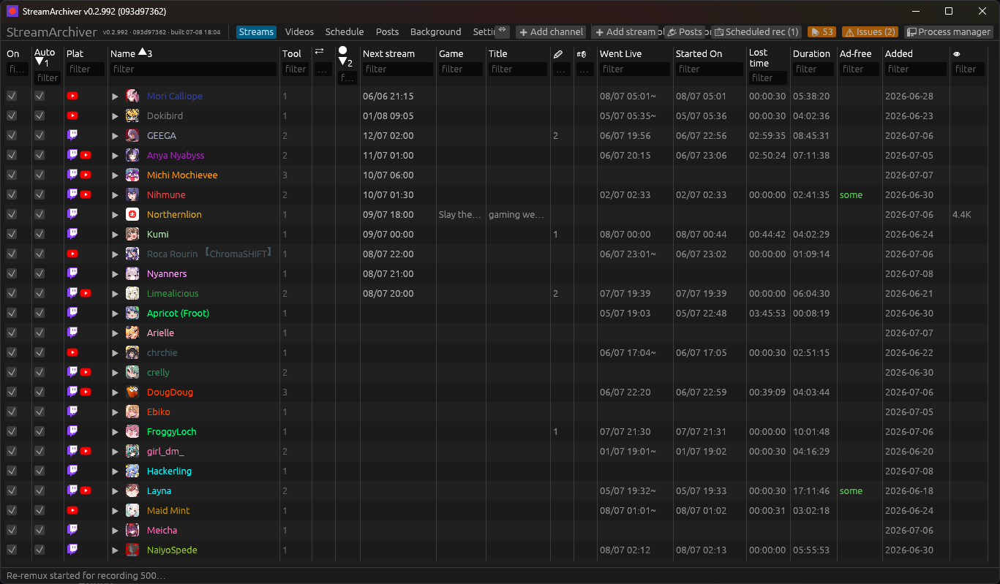

## Status

| Phase | State |
|---|---|
| 1 — Tray app, on-demand UI, SQLite store, settings, autostart | ✅ |
| 2 — Shared batched poll scheduler + detectors (Twitch API, YouTube/Kick scrape, generic probe) | ✅ |
| 3 — Download supervisor (record → `.ts`, remux → MKV, tree-kill, backoff, orphan recovery) | ✅ |
| 4 — Graceful finalize-on-stop, desktop notifications | ✅ |
| 4 — Twitch EventSub real-time push (conduit) | ✅ (needs live Twitch creds to verify) |
| 4 — Installer / packaging | ⏳ planned |

## Requirements

- **Runtime tools** on `PATH`: [`streamlink`](https://streamlink.github.io/),
  [`yt-dlp`](https://github.com/yt-dlp/yt-dlp), [`ffmpeg`](https://ffmpeg.org/).
- **To build**: Rust (stable) + the MSVC toolchain on Windows.
- **Optional, for YouTube live capture-from-start:** a SABR-capable `yt-dlp` dev
  build, a JS runtime (Node), and a GVS PO-token provider (bgutil). See
  [YouTube live capture-from-start (SABR)](#youtube-live-capture-from-start-sabr).
- **Optional, for watching recordings while they record:** [mpv](https://mpv.io)
  as the configured media player. See
  [Watching in a media player](#watching-in-a-media-player).

## Build & run

```sh
cargo build --release
./target/release/streamarchiver        # opens the window; closing it hides to tray
./target/release/streamarchiver --hidden   # start straight to the tray (used by autostart)
```

The window stays invisible until its first frames have actually painted and
settled, then appears fully drawn — it is never shown as a bare white
surface being resized through startup (which used to read as rapid
flashing, a hazard for photosensitive users).

Right-click the tray icon → **Open** / **Quit (keep recording)** / **Quit &
stop recordings** — or click the **StreamArchiver** label in the window's top
bar for the same two quit actions (handy when a notification storm makes the
tray icon hard to reach). The default Quit detaches active downloads and chat
sidecars (they keep running and re-attach on the next launch); **Quit & stop
recordings** asks for confirmation (an always-on-top dialog, so it can't get
lost behind the main window), then stops all active recordings (finalizing
the MKV) before exiting.

A Windows shutdown / restart / logoff is never held up: the app answers the
session-end signal immediately with a detach-quit — any pending confirmation
dialog is dismissed and the hide-to-tray close cancel is bypassed. Whatever
the OS then terminates is picked up by the next launch's crash-recovery
reconcile, same as any other interrupted session.

Only one instance runs at a time (a loopback-port guard, held for the process's
lifetime). Launching the app again while it's already running — including
minimized — un-minimizes and focuses the existing window instead of opening a
second copy or silently doing nothing.

Pop-out windows (chat, properties, Warnings, Posts, the widget inspector — every
window the app opens beside the main one) are **independent OS windows**: they
stay open, in place, and keep updating when the main window is minimized or
closed to the tray, and they are not dragged along when it is. Minimizing the
main window used to destroy them and re-open them at a default position on
restore; it no longer does.

The window has three tabs: **Streams** (monitor channels for live broadcasts),
**Videos** (on-demand downloads), and **Settings**.

## Using it

**📌 Add to Start Menu** (Settings → Interface, under App icon) creates — or
repairs — a Start Menu shortcut pointing at the exact binary currently
running, with its folder as the working directory. It's purely a launcher:
toasts and the taskbar identity never depended on a shortcut (the app
registers its own AppUserModelID at startup), so there is nothing else to
install. Click it again after moving or rebuilding the exe and the shortcut
follows.

**Selected text stays selected.** Every periodic refresh in the app — the
Issues/Warnings rescans, the Videos and Process Manager lists, the I/O and
stats readouts, the log tail, a live chat window's own tail — pauses while you
have text highlighted anywhere, because rebuilding a label out from under a
selection is exactly what cancels it (and half these views refresh every
second, which made copying anything a race). The pause is capped at ~45
seconds for a settled selection — an abandoned highlight can't freeze the
readouts forever — and the clock restarts while you're still dragging one out,
so a slow selection is never cut short. Whatever a view skipped catches up in
one batch the moment the selection clears.

The other half of the fix is egui 0.36: before it, text selection state was
global to the whole app, and ANY window repainting deselected a highlight
made in a different window — the root repaints once a second, so a selection
in a popup (Issues, chat, Properties) was dead within a second of making it;
the highlight only *looked* alive until your next mouse move or keypress
repainted the popup, which read as "the UI cancels my selection the moment I
touch anything." egui 0.36 keeps selection state per window, so a highlight
now survives every other window's repaints and Ctrl+C works normally.


### The top bar

The **StreamArchiver** label on the far left is a menu: **⏻ Quit (keep
recording)** (detach downloads/chat and exit — the tray's default Quit) and
**⏹ Quit & stop recordings** (confirmation dialog, then stop-and-finalize) —
so both quit paths work without touching the tray icon.

Every view is an always-visible tab, shown as an icon only at 2x the normal
button size — big enough to hit without hunting — (hover any tab for its
name, plus a description for the less-obvious ones): **📺 Streams, 🎬
Videos, 🗓 Schedule, 📣 Posts, 🎛 Background, 📁 Files, 👤 Users, 📈 Channel
Stats, 📊 App Stats, 🖴 I/O** (same HDD glyph as the Background tab's disk
gate), and **🐞 Debug** when enabled. Four tabs carry a live count badge next to their
icon, computed in-memory every frame (no extra DB load) so it's always
current even if you never open the tab: **🗑 Trash** — soft-deleted files
still sitting in a trash folder (amber, since these quietly eat disk space
until you deal with them); **📣 Posts** — unread posts (shares the 🔔 feed's
read state — its own "Mark all read" clears this too, opening the tab alone
does not); **📺 Streams** — `<recording>/<live>`, e.g. `3/10` for 3 of 10
currently-live channels being recorded (hidden entirely while nothing is
live); **🎬 Videos** — downloads currently in progress. The rest of the
left-hand side — **»**, **⋯**, **📖**, and **⚙** — renders at that same
doubled size:

- **⋯** — the two display toggles (*Status bgcolor*, *Short timestamps* —
  the menu stays open while toggling).
- **📖** — this manual, rendered in-app (see below). Version/build/commit
  info and the app's data locations are the "About" page inside it (the
  sidebar's first entry) rather than a separate top-bar button.
- **⚙** — Settings (also `Ctrl+,`).

At narrow window widths the tabs collapse (right-to-left) into a **»**
overflow menu instead of overlapping the status buttons on the right. Those
status buttons stay at their normal (non-doubled) size and are icon-only
where a duplicate icon wouldn't be ambiguous: **🖥** Process manager, **⚠**
Issues, **🚨** Warnings, **🔔** notifications, **📅** Scheduled rec, and
**📣🗗** to pop the Posts feed into its own window (the trailing 🗗
distinguishes it from the plain 📣 Posts tab). All keep a hover tooltip
explaining what they do, and stay visible and clickable regardless of window
width.

**📖 Help** renders this README inside the app — table of contents on the
left (with a filter box), one section at a time, screenshots included, and
cross-reference links that jump between sections. Everything is embedded in
the binary at build time, so it works offline and always matches the running
version.

### Table columns (Streams, Videos, Background, Processes, Issues)

Every data table's columns can be **hidden/shown** and **resized** by
dragging a header edge — both persist across restarts. Right-click any
header for: sort, a filter box, **Hide** this column, and **⇕ Reorder
columns…**, which opens a small window to freely move columns up/down (and
toggle visibility) without touching the live table — nothing changes until
you hit **Apply**, so moving a column across many positions doesn't cause a
resize/flicker on every intermediate step. **⇔** (Streams toolbar) re-fits
all columns to their content.

Column filters are case-insensitive substring matches — and in the Streams
list they search **deep**: a filter matches not just the channel row's own
(rollup) value but everything its sub-rows show, *whether or not they're
expanded* — each instance's URL, tool, and detection method, every
instance's current title/game (not only the one instance the rollup
follows), and **every title and category its stream history ever logged**
(sourced from the same change log the 📝 history shows, so mid-stream
retitles match too). The matching channel row stays visible; expand it to
find the matching stream. Without this, a finished stream's title was
plainly visible on its sub-row yet filtering for it found nothing, because
the top-level row only carries the primary instance's *current* title —
blank while offline.

The grid then shows you **where the hit lives**, since a surviving channel
row alone can't tell you which of its instances matched:

- The **instance / stream / take rows that contain the match are tinted
  teal** — including a collapsed instance whose hit sits inside its
  unexpanded stream history, so "expand the tinted rows" is the whole
  trail from channel to matching stream. An instance whose own data
  *doesn't* match stays untinted (a channel kept visible by its YouTube
  instance's stream title no longer makes its Twitch instance look equally
  relevant), and a filter satisfied purely at channel level (e.g. the
  channel name) tints no instance at all.
- The **matched substring itself is highlighted** in the Game/Title cells
  that display it, on every row level, so you can see at a glance *why* a
  row is in the result.

### Streams (live monitoring)

A **channel** is a *container* (just a name) holding one or more **instances**.
Each instance has its **own URL/platform** + tool + detection + output, so one
channel can mix sources — e.g. the same creator on **Twitch *and* YouTube**, or
two tools on one URL.

1. **Add stream** → name the channel and add its **first instance**: paste a URL
   (platform auto-detected; tool + detection default to it), then adjust poll
   interval, quality, **container** (MKV default), output folder, filename
   template, auth. (Or **Add channel** to create an empty container and add
   instances to it afterwards.)
2. **➕** on a channel row (or **Add instance to channel** in the menu) adds
   another instance — including one on a **different platform** (paste a YouTube
   URL on a Twitch channel, etc.).

   Containers can also be **reshaped after the fact**:
   - **⮫ Move to another channel…** (instance right-click) moves one instance
     into a different channel container. Everything that belongs to the
     instance moves with it — recordings, schedule, stats/chat history, posts,
     and about-page archive. Channel-*level* configuration does **not**
     follow: the destination's own Auto/Enabled, color, triggers, and scope
     overrides apply to the instance from then on. (Cached asset files on
     disk stay where they are and re-fetch under the new channel's folder;
     nothing breaks meanwhile.)
   - **⇋ Merge into another channel…** (channel right-click) moves **all** of
     a channel's instances into another channel (same rules as above, and
     group memberships carry over too), then deletes the emptied source
     channel — only if it is actually empty. Handy for collapsing an
     accidental duplicate ("GEEGA" + "geega") into one container. The source
     channel's own settings (color, trigger scopes, schedule hides) are not
     merged; the destination's win.
3. **Two independent switches**, each at both the channel and instance level
   (the channel checkbox gates *all* its instances at once; each instance has
   its own — pause just YouTube for the day, keep Twitch). Both also appear on
   the add/edit instance form:
   - **Enabled** (the **On** column, left of Auto; default on) is the **master
     switch**. Off = **fully dormant**: no detection, recording, or asset/About/
     posts/schedule fetch — the channel does nothing until you act manually
     (▶ **Start**, ⟳ **Refetch**). Its State cell shows **⏸** and its live info
     freezes. Use it to shelve a channel without deleting it.
   - **Auto** (default on) controls **only the automatic recording to disk** — a
     disk-space control. It does **not** gate detection, metadata, posts,
     schedules, or assets: an Auto-off (but Enabled) channel is still fully
     monitored — liveness is polled/pushed as usual (the State column shows
     *live*, and the **Title/Game/👁 Viewers/Went Live/Started On/Duration**
     columns show its current stream even though nothing is recording),
     everything keeps refreshing into the archive, and the ▶ **Start** button
     always records on demand. Recording auto-starts only when **both**
     Enabled and Auto are on (or a trigger word matches). Went Live/Started
     On/Duration come from detection's own go-live tracking in this case (the
     same "known even without a recording" data as Title/Game) — Started On
     mirrors Went Live and Lost time is blank, since nothing is being captured.
     The stream isn't forgotten once it ends, either: it gets its own **👁 not
     recorded** take row in the Streams grid (title/category/start/end time,
     no file — hover the state icon for the note, which names *why* it wasn't
     captured: Auto-record off, or *Simulcast dedup* recording it on another
     instance), the same way a real recording would, so an Auto-off channel's
     history still shows *that* it streamed even though nothing was captured. **Chat still is**, though —
     by default an Auto-off broadcast gets a chat-only sidecar attached to
     that row (see *Chat without a recording*), because chat is tiny and
     can't be fetched back later. Turning Auto on (or a trigger/manual Start
     firing) mid-broadcast closes that row and starts a real recording take
     right after it.

   A **channel** (container) row rolls up its instances: the State column shows
   a live/recording indicator when **any** instance is live (with a count after
   the icon, e.g. `⏺ 2`, when more than one is), and its Went Live/Started
   On/Duration/Title/Game/Viewers show whichever live instance went live
   **earliest** — unless a **preferred platform** is configured (useful when
   one platform's metadata is richer, e.g. Twitch's game/category vs.
   YouTube's), in which case that platform's instance wins instead whenever
   it's live. Three-level inheritance, same pattern as VOD-download/head-backfill
   overrides: a per-**instance pin** ("Pin as preferred platform" in the
   instance form) beats a per-**channel** override (channel form's "Preferred
   platform when multiple live") beats the **global default** (Settings →
   Interface → Display). None configured = the original earliest-live
   behavior, unchanged. This preference is **display only** — for which
   instance actually gets *recorded* when a channel simulcasts, see *Simulcast
   dedup* below.

   A take whose capture has **ended** but whose finalize (the remux/promote
   into the output dir) is still running — or waiting in the disk-gate queue,
   which can be hours behind after a restart recovers many interrupted takes —
   shows **⌛ finalizing** instead of ⏺ recording, at the take, stream,
   instance, and channel levels. The Background view shows the actual
   remux progress and queue position. (Previously these kept showing
   "recording" until the remux finished.) A finalizing take no longer blocks
   the monitor either: polling resumes and a new take can start the moment
   the capture process exits, so a stream that drops and comes back is
   re-captured immediately even while the old take's remux is still queued.

   Similarly, a capture whose **stream has already ended** but whose tool is
   still running — a live-from-start capture draining the stream's recorded
   backlog (which can take hours, especially with I/O throttling), or yt-dlp
   muxing a huge file — shows a **⏬ badge** next to the recording state on
   the instance and channel rows, so a post-stream drain doesn't read as
   "live". Detected from the in-recording metadata refresh (two consecutive
   authoritative "offline" answers); the recording completes normally on its
   own, and ⏹ still stops it early if you don't want the rest.

   The instance and channel rows represent **present state only** — once an
   instance is neither recording nor live, its Went Live/Started On/Duration/
   Lost time cells go blank rather than showing a past recording's numbers
   (which would otherwise read as "currently live for 3h" when it isn't).
   That history isn't lost — it's exactly what expanding the instance's row
   shows, one row per past stream/take.

   When **Add stream** creates a brand-new channel, the channel's Enabled/Auto
   start out matching the first instance's — so a new instance added with Auto
   off doesn't leave its channel showing Auto on (both flags AND together, so
   this was never a functional bug, just a confusing mismatch in the grid).
   Adding an instance to an *existing* channel never touches the channel's own
   switches.

   Adding a channel fetches its assets/About immediately, and its live state +
   title/game/viewers appear within one poll cycle (≤30s). **✏** renames the
   channel; the per-instance **✏** edits that instance (incl. its URL). **🗑**
   deletes a channel (and its instances) or a single instance.
4. **Settings** → Twitch/YouTube credentials, default output folder, max concurrent
   downloads, and **start at login** (autostart). Folder fields have a **Browse…**
   button.

#### Simulcast dedup (⇄)

Many channels here have several **instances** — the same streamer on Twitch
*and* YouTube. When they simulcast, both go live and both record, giving you two
copies of one broadcast at double the disk and I/O, neither better than the
other. The extra instances are meant to be redundancy, not duplicate archives.

Turn on **Settings → Automation → Simulcast dedup** and pick a platform: when a
channel is live on more than one at once, only that one records. Two rules keep
it from ever costing you a broadcast:

- **Exclusives still record.** If nothing is live on the preferred platform,
  whatever *is* live records exactly as before — a platform-exclusive stream is
  never skipped waiting for a channel that isn't broadcasting.
- **The others stay armed.** A held-back instance ("standing by", ⇄ next to its
  live state) keeps polling, and takes over if the preferred instance is live
  but never actually starts capturing — Auto off there, repeated errors, or a
  capture that dies mid-stream. That's genuine failover, not a disabled row.

**The ad-free override.** The usual reason to prefer YouTube is Twitch's ad
breaks: an ad is a hard cut in the captured file. But on a channel you're
**subscribed** to, Twitch has no ad breaks either — so *"…but prefer this
platform when it's ad-free"* flips the choice for exactly those channels. It
fires when the instance on that platform is marked ad-free by hand **or** has a
detected Twitch subscription (Settings → Accounts, refreshed every few hours),
and only while that instance is actually live.

**Three tiers**, the usual chain: instance (its own form) beats channel
(channel form) beats the global default, and the two fields resolve
independently — a channel can pick the everyday platform while one instance
overrides only the ad-free rule. Setting an instance to **Off** is an
exemption: always record this one, even when a preferred sibling is live.

**The settle window** ("Wait for the preferred platform for N minutes", default
3) covers the fact that instances poll independently, so the non-preferred one
often notices the broadcast first. Within that window the preferred instance
**takes over**: the duplicate capture is stopped (no restart hold — it stays
armed) and recording continues on the preferred platform, which loses almost
nothing since Twitch head-backfill and YouTube live-from-start both recover the
opening. After the window, the running capture is the intact copy of that
broadcast and is left alone — the preferred instance stands by instead of
starting a second, later, worse copy. The same number decides how long a
standby waits for the preferred instance to get going before taking the
broadcast itself.

**What you see.** The standby instance shows ● live with a **⇄** badge (hover
it for which platform has the broadcast), and once the stream ends it keeps a
**👁 not recorded** row whose hover names the reason. Its **chat is still
archived** — chat is per-platform, tiny, and unrecoverable, so the two
platforms' conversations are both kept even though only one video is. And
because the broadcast wasn't missed, it's excluded from the missed-stream VOD
backfill and the discovery scan, which would otherwise "recover" the exact
duplicate this feature exists to prevent.

Worth knowing: dedup is across platforms, not within one — two instances on the
*same* preferred platform still both record. A takeover leaves the stopped
capture's partial take on disk; nothing here ever deletes a file. And a manual
▶ **Start**, a scheduled recording and a trigger-word match all bypass dedup
entirely — those are explicit instructions to record *this* instance.

#### Channel groups (🏷)

Organize channels into named groups from the Streams toolbar's **🏷 Groups**
button (create/rename/delete — a group is just a label, deleting one never
touches any channel's recordings or settings). A channel can belong to any
number of groups, but has at most one **primary** group and any number of
**secondary** ones — both set from that channel's own Properties dialog
("Primary group" dropdown + "Also in these groups" checklist).

- **Primary group** drives the Streams grid's default clustering: channels
  render under a collapsible header per primary group (alphabetical,
  ungrouped channels first, un-collapsed by default). A channel with no
  primary group renders flat, exactly as if groups didn't exist — so this is
  a zero-behavior-change default until you actually assign one.
- **Secondary** groups don't affect that default clustering — they only
  matter to the toolbar's **group filter** dropdown, which narrows the whole
  grid to one group's members (primary or secondary alike) and — while
  active — replaces the header clustering with a flat list of just that
  group, since there's only one group in view.
- Right-click a group's header for bulk actions: set **Auto** on/off, or
  **Enable**/**Disable** (the master switch), for every channel currently in
  that group at once.

#### Recording groups — tagging streams across a span of time

Unlike channel groups (organize *channels*), a **recording group** is a
free-form tag spanning any number of *streams* (broadcasts) — e.g. "Numi
Subathon 2025" tying together every stream across a week-long subathon,
regardless of which day or how many takes each one has.

- **Select streams**: ctrl/shift-click Stream rows in the Streams grid (a
  plain click selects just the one clicked) — selected rows tint like a
  keyboard-selected row. A bar appears above the grid showing the count, an
  **➕ Add to group…** button, and **✕ Clear**.
- **➕ Add to group…** opens a small dialog to add every take of every
  selected stream to an existing recording group or a brand-new one (typed
  inline). Manage existing groups (rename/delete) from the same **🏷
  Groups** dialog channel groups use — it's a second section there.
- The toolbar's second dropdown (next to the channel-group filter) narrows
  the Streams grid to one recording group: channels/instances with no
  matching stream are hidden entirely, and the ones that remain
  force-expand down to their matching streams — no manual expanding needed
  to see the whole collection at a glance. Right-click a stream while this
  filter is active for a one-click **➖ Remove from "…"**.
- Deleting a channel or a take cascades its recording-group memberships
  automatically; deleting a recording group only drops the tag, never
  touches any recording/file.

The toolbar's **Only stored** checkbox is a filter of the same shape (and
combines with an active recording-group filter rather than overriding it):
hide any channel/instance/stream with no take that actually has a file on
disk — detected-but-never-recorded streams (Auto off at the time) and
failed/missed attempts disappear, and the ones that remain force-expand down
to their stored takes just like a recording-group filter does. Either filter
loads every monitor's recording history to decide this (not just the
already-expanded ones) — a collapsed channel/instance you'd never manually
opened still shows correctly if it has stored takes, instead of looking
empty just because nothing had been fetched for it yet.

#### Saved views: sort, grouping, and filter presets

The Streams toolbar's **Group** checkbox turns primary-group header
clustering (above) on or off independent of whether a channel actually has a
primary group assigned — off always shows a flat list, e.g. for a layout
sorted purely by "last added" where clustering would just get in the way.

A **saved view** bundles that checkbox together with the grid's column
sort, per-column filters, and the Group/Recording-group toolbar selections
under a name you choose, so you can jump between layouts (grouped and
sorted by name, flat and sorted by last-added, filtered to one platform,
…) with one click instead of re-configuring every control by hand:

- The **Views** dropdown (next to **Group**) is both the switcher and the
  manager — no separate window. Open it to see a name field (**💾** to
  snapshot the grid's current state under that name) plus one row per
  existing view: click the name to apply it, **💾** overwrites it with the
  current state, **✏** renames it in place, **🗑** deletes it (no
  confirmation prompt, same as channel/recording groups — deleting a view
  never touches any data, only the preset itself). The dropdown stays open
  across these clicks, same as any egui popup, so you can rename/delete
  several in one go.
- Views are per-install (stored in the local database, not per-channel/
  recording), and which view is currently applied is session-only — it
  isn't remembered across a restart, though the views themselves are.

#### Bulk import: followed / subscribed channels (📥)

Instead of adding channels one by one, import the ones you already follow:

- **Twitch** — Settings → Accounts → *📥 Import followed channels* (needs a
  connected Twitch account; older connections may need a reconnect to grant
  the *follows* permission).
- **YouTube** — Settings → Accounts → *📥 Import subscriptions* (needs a
  connected Google account via the "Connect YouTube" device-code flow).

A confirmation dialog lists every candidate with a search filter, an **All**
master checkbox, and per-row choices:

- **Import** — create the channel + monitor (same max-archival defaults as a
  manual Add stream: chat log, thumbnails, chat assets, all audio/subtitle
  tracks).
- **Auto** (default off) — let the scheduler auto-record it. The channel's own
  Auto switch is seeded to match, so a fresh import never starts with the
  channel/instance mismatch the grid would AND together.
- **Disabled** — import with the **master Enabled switch off** (channel and
  instance): fully dormant — no polling, detection, or fetches — until you
  enable it in the grid. Useful for "archive the list now, activate later".

**Dedup**: channels you already monitor are greyed out ("added") — matched by
Twitch login / Kick slug / YouTube channel id. **Hide already added** clears
them from the list entirely — useful for working through a large
follow/subscription list a batch at a time across several sessions (each
newly-added channel fetches its icon/About/posts immediately, so importing
a few dozen at once instead of all 300+ in one go is gentler on the
platform) without the already-imported ones cluttering the view each time. YouTube monitors that were
added by **@handle** URL (where the `UC…` id isn't in the URL) are resolved to
their channel id in the background (a one-time channel-page scrape per URL,
cached persistently), so they also match exactly. Only when resolution fails
does the fallback name match kick in: a candidate whose *name* equals an
existing channel's is flagged "(maybe added)" and left unticked, but can still
be imported deliberately.

**Import into an existing channel**: a per-row **"Import into"** dropdown
adds the candidate as a *new instance* of an existing channel instead of
creating a new one — for the common case where you're followed/subscribed to
the same person on a platform you don't track them on yet. **🔗 Guess
existing channels** fills this in automatically for every not-yet-decided
row, checking (in order) whether an existing channel's own archived **About
page** links out to the candidate's URL (the strongest signal available
short of a live cross-check), then falling back to a loose name match (e.g.
followed as "Tenma" on Twitch, already tracked as "Tenma Maemi" via YouTube —
agency/group bracket tags like "【Phase Connect】" are stripped before
comparing). Neither signal is treated as certain: a guessed row is marked
**"auto-assumed"** with a confirm checkbox and is held back from the import
batch entirely until you tick it — reviewing and confirming (or leaving
unticked to skip) is always a manual step.

**Overrides for this import** (collapsed section in the dialog): optionally
set a **quality** and/or **output directory** applied to every channel this
batch creates, instead of the per-platform defaults — e.g. point a hundred
subscriptions at a spare drive at 720p in one go. Individual monitors can
still be edited afterwards.

Kick has no import (no user-level OAuth flow to read a follow list from).

### Videos (on-demand downloads)

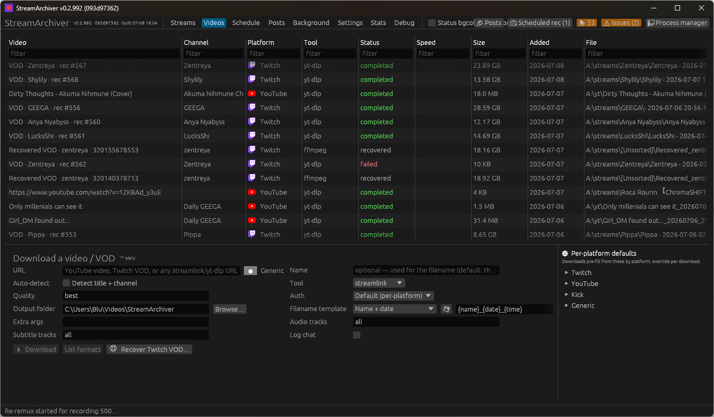

The **Videos** tab downloads a *specific* video or VOD now — a YouTube video, a
Twitch VOD, or any `streamlink`/`yt-dlp` URL — rather than watching a channel for
live streams. Paste a URL in the form at the bottom, adjust the settings shown
alongside it (**tool**, **quality**, **auth**, output folder, filename template,
extra args), and click **Download**. Output is always **MKV** (yt-dlp remuxes to
MKV; streamlink/ffmpeg capture to `.ts` then remux). Downloads share the same
global concurrency limit as live recordings.

**Tool.** Alongside `streamlink`, `yt-dlp`, and `ffmpeg`, the dropdown also
offers **yt-dlp-dev (SABR)** — the same [SABR dev
build](#youtube-live-capture-from-start-sabr) configured in Settings →
Downloads, usable here for any on-demand download, not just live
capture-from-start — plus any **custom tools** defined in Settings →
Downloads → *Custom download tools*. A custom tool is any other
yt-dlp-compatible binary (e.g. a personal fork) registered there with an
alias + path; it uses the same yt-dlp argument template as `yt-dlp`, only the
invoked binary differs. Picking SABR or a custom tool whose binary path is
unset/no-longer-valid falls back to the system yt-dlp at download time.

> **YouTube note:** YouTube now refuses VOD media to clients without a **PO
> token** (downloads would fail with `HTTP Error 403` right after a successful
> extraction). Video downloads therefore automatically use the bgutil PO-token
> provider when configured — the same **PO token extractor-args** setting as
> [SABR](#youtube-live-capture-from-start-sabr) — together with a
> still-served player client (`mweb`). Both are appended *before* your extra
> args, so a per-download or global `--extractor-args youtube:…` can override
> them if YouTube's client landscape shifts again.
>
> YouTube also sometimes **revokes a media URL mid-download** (HTTP 403 partway
> through a track). Downloads automatically retry up to 3 attempts — each re-run
> re-extracts fresh URLs + PO token and resumes the partial file from the
> capture cache. A download whose merge never completed (only a per-format
> `.fNNN.*` intermediate exists — e.g. video downloaded, audio died) is marked
> **failed**, never promoted as a finished video.
>
> With **🕶 Anonymous public YouTube** on (Settings → Downloads, the default),
> YouTube video downloads run **without account cookies** even when the
> configured auth is a cookies source — cookies invite the PO-token
> attestation experiments and account flagging. If the video turns out to
> need entitlement (members-only / sign-in error), the retry escalates to the
> configured cookies auth automatically.

**Quality.** The Quality dropdown offers **auto-best presets** — the app builds
the right format selector and the tool resolves the actual best formats per
video, so you never have to list format IDs by hand:

- **Auto — best available**: the highest resolution the site offers, no cap
  (8K included), merged with the best audio.
- **Auto — up to 2160p/1440p/1080p/720p/480p**: best video no taller than the
  cap, merged with the best audio. (Every preset also degrades gracefully on
  sites that only publish pre-merged files.)
- **Audio only**: best audio track, no video.
- **My presets**: any value can be saved as a named preset with **💾** (stored
  in the database; **×** in the dropdown deletes one), and **✏** opens the
  preset manager where saved presets can be renamed, their selectors edited in
  place, added, or deleted. The text field beside the dropdown always shows
  the value actually used and accepts `best`, `<N>p` (e.g. `1080p`), `audio`,
  plain format IDs (`137+140`), or any **raw yt-dlp `-f` selector** as the
  full escape hatch — a raw selector wins over the *Audio tracks* field,
  since yt-dlp only honours one `-f`. Typical custom-preset flow: pick an
  Auto preset, tweak the value in the text field, 💾 under your own name.

The symbolic values combine with **Audio tracks**: e.g. `1080p` + `all`
downloads ≤1080p video with one audio track *per language* (dubs). For
streamlink the same presets translate to its rendition names
(`1080p60,1080p,best`; `audio` → `audio_only`).

> Historical note: quality `best` + audio tracks `all` (the form default)
> previously produced an invalid yt-dlp selector whose fallback silently
> picked the best *pre-merged* format — **360p on YouTube**. The presets
> above generate verified selectors; `best` now always means best.

**List formats.** Click **List formats** to probe the URL with the selected tool
(`yt-dlp --list-formats`, streamlink's stream list, or `ffprobe`) and show the
available formats/qualities in a window — handy for picking a **Quality** value.
For YouTube this probe uses the same `mweb` + PO-token client-mix fix as the
actual download (above); without it, yt-dlp's default client (`tv_downgraded`)
fails the probe outright with `ERROR: The page needs to be reloaded.` even
though the download itself would have worked.

**Auto-detect title + channel.** Tick **Auto-detect** to look up the real
title *and* channel/uploader (via yt-dlp) at download time. These populate the
**Channel** column and the `{title}`/`{channel}` template variables — and
`{title}` is used for `{name}` when **Name** is left blank (so files aren't named
`video_…`). See [Filename templates](#filename-templates) for the full variable
list.

**Per-platform defaults.** The form pre-fills from saved defaults for the pasted
URL's platform; edit any field to override it for that download. The
**⚙ Per-platform defaults** panel to the right of the download form sets the
default tool/quality/auth/output/filename/extra args for Twitch, YouTube, Kick,
NRK, Nebula, and Generic (each collapsible) — saved automatically. **NRK**
(`nrk.no` incl. `tv.nrk.no` and `radio.nrk.no` — TV, live channels, podcasts,
radio theatre; audio-only downloads still land in MKV) and **Nebula**
(`nebula.tv`) are recognized as
their own platforms — own icon, defaults, and log tag — but ride yt-dlp's
extractors (no platform-specific detection or channel-asset fetching; Nebula
needs your subscription cookies via the Auth field). **Generic** covers every
other URL — any of yt-dlp's ~1800 supported sites (Vimeo, …) — and defaults to
**yt-dlp** for exactly that reason: streamlink is a live-stream tool and fails
on a plain video page with `error: No plugin can handle URL` (the form shows an
inline ⚠ warning if you combine such a URL with streamlink; defaults saved
before this change are healed to yt-dlp once, automatically). The form's **Auth** has a **Default
(per-platform)** option (selected by default, uses the platform default's auth)
plus the explicit choices; **Inherit (global)** stays available and chains to the
Settings → *Download authentication* default.

**Audio / subtitle tracks + chat.** Like monitors, each download can pick which
**audio tracks** (streamlink `--hls-audio-select`) and **subtitle tracks** (yt-dlp
`--sub-langs`, written as sidecars) to capture, and can **Log chat** (yt-dlp's
`live_chat` → a `.live_chat.json` sidecar, e.g. a YouTube VOD's chat replay). New
downloads default to *all* audio + subtitle tracks (chat off); the choices are
sticky across downloads. See [Audio & subtitle tracks](#audio--subtitle-tracks).

Each row shows the title, **Channel** (when detected), status (`queued` →
`downloading` → `completed`/`failed`/`stopped`), live **Speed** (download rate
while active; yt-dlp downloads only), size, and the **File** path on disk, with a
platform favicon and per-column header tooltips. Rows are **tinted by status**
(in-flight — queued/downloading — = accent, failed = red), honoring the top-bar
**Status bgcolor** toggle; **hover a failed row** to see why it failed (the
captured error + exit code). Per-row inline actions plus a **right-click context menu** offer: **Open
file**, **Open folder**, **Copy URL**, **Copy file path**, **Stop**/**Retry**, and
**Delete** (removes the row; the file is kept). A download left in flight by a
crash/quit is marked `orphaned` on the next start.

**Sort & filter.** Click any column header to sort by it (click again to reverse;
a ▲/▼ shows the active column); type in the box under a header to filter that
column (case-insensitive substring). Filters combine across columns. This works on
the **Videos** and **Streams** tables alike.

The channel table shows, per channel: **On** (master switch — dormant when off),
Auto (auto-record on/off), Name, Platform (with a
brand badge), Tool, Detection, **Polled** (when it was last checked, with the poll
interval in parentheses — e.g. `2026-06-21 14:02:33 (60s)`), State, **Next stream**
(the next scheduled stream — see below), **Game** and
**Title** (the current category/title — the live stream's when detected, else the
latest recording's), **👁 Viewers** (live viewer count when live), **Went Live** (the
platform's go-live time — `~`-prefixed when only our first-detected time is known,
e.g. for scrape), **Started On** (when we began recording), **Lost time** (how
much of the stream we missed), **Duration** (live, `HH:MM:SS`), and **Added** (when
the channel was added). Timestamps follow the **Date format** chosen in Settings
(default ISO).

> The console log (run with `RUST_LOG=info,streamarchiver=debug`, the default)
> reports detection: a `DEBUG scheduler: polling N monitor(s) due […]` line per
> cycle, a `DEBUG poll: <name> [<method>] <result>` line per check, and an
> `INFO poll: <name> [<method>] <old> -> <new>` line whenever a channel's state
> changes (with the go-live time when it goes live, or the error detail).

**Recording history (collapsible).** Each channel row is a tree you can expand
(the ▶ triangle) to see its **past streams**, and each stream that took more than
one attempt expands again to its individual **takes**. Every level — channel,
instance, Week/Month/Year header, stream, and take — reports its size in the
**💾 Disk use** column, summing as it goes up: a stream sums its takes, a
period header sums its streams, an instance sums its streams, and a channel
sums its instances. A still-recording take shows its *live* size, not the
stale 0 B a plain directory listing would give a file another process still
has open for writing — it's read from the file handle directly and updates
every couple of seconds. A finished take whose file is no longer on disk
(deleted, trashed, or a VOD backfill/recovery attempt that failed after an
earlier attempt had already recorded a size) shows **no size at all** rather
than the stale byte count from before, and that absence propagates up through
every stream/period total above it — confirmed by the same never-blocking
probe as everything else here, so it can lag a couple of seconds behind an
on-disk change. The channel and instance rows are the one exception: expanding
every channel just to keep their totals live isn't affordable, so those two
levels show a **stored** total instead (refreshed whenever the grid reloads,
not confirmed against disk) — hover either for the distinction, and expand
down to a stream/take for the exact, disk-confirmed figure. Since nothing
watches the filesystem, a file deleted (or moved) **outside** the app leaves
that stored total wrong until something checks — right-click a channel or
instance row and choose **🔄 Rescan disk usage** to check every one of its
takes against disk and clear any that are gone, or use the same-named button
in the Streams toolbar to check every channel at once; either runs in the
background and the status bar reports what it found. A take finalized
before 2026-07-26 may show a **⚠** on its Duration cell (and in the take's
Properties window): a since-fixed bug stamped the end time *after* its remux
finished rather than when the capture actually stopped, so a take whose remux
happened to queue for hours at the disk gate can show a duration longer than
the broadcast really was — the capture itself is still complete, only the
timestamp is off; compare against the file's own duration to check.

Beside it, the **🖴 Drives** column answers "where does this actually live?" —
the drive letters a row's recordings are stored on, comma-separated (`A:, G:`).
It rolls up the same way: a take shows its own drive, a stream/period/instance/
channel shows every drive anything beneath it sits on, so a channel that
straddles two disks reads `A:, G:` while collapsed. Handy before a disk swap,
and for spotting a channel still writing to the drive you meant to retire —
sort by it to group everything on one disk together. Like Disk use, it's read
from the *recorded paths* rather than confirmed against disk (a file moved
outside the app still counts until its row is disposed of), and network (UNC)
paths have no drive letter, so they're blank.

Once a channel has been recording long enough, its streams also subgroup into
collapsible **Week → Month → Year** headers so the list doesn't turn into a
wall of text. A level only appears once it would actually group more than one
bucket (a channel whose whole history is still within one week shows no
headers at all, exactly as before); only the single most recent bucket at
each level starts expanded, so a channel you've been recording for years
still opens straight to its newest streams, with everything older one click
away:

```
                                                                          💾
▼ Layna            twitch  streamlink  recording                      312 GB
   ▼ 2026                                          · 41 streams        312 GB
      ▶ Jan 2026                                    · 4 streams         28 GB
      ...
      ▼ Jun 29 – Jul 5                               · 3 streams        22 GB
         ▼ 🎬 2026-07-02 18:00   recording   · 2 takes                 7.4 GB
              Take 1   18:00–18:12   failed       (crashed)            1.1 GB
              Take 2   18:13–…       recording                         6.3 GB
         ▶ 🎬 2026-06-30 21:30   completed                             5.8 GB
   ▶ 2025                                          · 187 streams       1.4 TB
```

A channel with **multiple capture instances** (e.g. streamlink *and* yt-dlp on the
same channel) instead expands to one row per instance, and each instance expands
to its own streams → takes. The app groups attempts into one stream by the
platform's **stream/video id** when detection knows it (Twitch Helix/EventSub,
YouTube Data API, Kick API); for id-less methods (scrape/probe) it groups attempts
that share a go-live time or that abut in time (a crash + retry, or a manual
stop+restart, becomes one stream with several takes). A take row offers **Open
file / Open folder / Copy file path / Remove from list** (the file is kept).

**Lost time & capture-from-start.** Normally Lost time is `Started On − Went Live`
— the gap before we began. But with **Capture from start** enabled (yt-dlp
`--live-from-start` / streamlink `--hls-live-restart`) the early footage isn't
actually lost; it's pulled from the platform's DVR. So for those recordings the
app watches the capture and **drops Lost time to 0 once it catches up to the live
edge** (confirmed again at the end by checking the captured length covers the
whole broadcast). If a from-start capture *doesn't* reach the live edge — it's
stopped, crashes, or the stream ends first — the not-yet-downloaded part is the
recent *tail*, not the beginning, so we don't claim a "lost" figure: the column
just shows the provisional `Started − Went Live` estimate until catch-up is
confirmed.

**Twitch head backfill (missed-start recovery, while live).** On Twitch,
streamlink's `--hls-live-restart` only rewinds within its own DVR view and
usually can't reach the true start of a long-running stream. But the published
VOD's playlist already exists on Twitch's CDN and **grows while the stream is
live** — so when a *Capture from start* recording joined ≥ 1 minute late, a
background job (visible in the **Background** panel as *Head backfill*) locates
that live playlist (same derivation as [VOD
recovery](#twitch-vod-recovery-deleted--muted-vods); no published VOD needed),
downloads **just the missed beginning**, and saves it as `{stem}.head.mkv` next
to the recording. Doing this *during* the stream matters: DMCA mutes are applied
minutes **after** the stream ends and scrub the original segments — a head
fetched mid-stream carries the **original, un-muted audio**.

The head is cut at a **PTS-exact splice point**: the live capture's raw `.ts`
and the CDN playlist's segments carry the *same* broadcast MPEG-TS timeline, so
comparing their `start_time`s pinpoints exactly where the capture joined, and
the head ends precisely there — no duplicated seconds at the seam. (A pure
wall-clock estimate systematically overshoots by the broadcast latency, ~5–15 s,
which used to appear as a short backwards jump-cut at the `full.mkv` splice.)
The capture's first PTS is also saved on the take the moment it finishes —
before the MKV remux resets timestamps — so a later manual *Backfill head* can
still splice exactly. If either PTS anchor is unavailable, or the two disagree
by more than 60 s (timestamp discontinuity, non-TS capture), the job logs it
and falls back to the wall-clock estimate.

Once the live recording finishes, the head and the capture are **losslessly
concatenated** (stream copy, no re-encode) into `{stem}.full.mkv` — a true
full-stream file — and, by default, **both parts are kept**. Keeping the parts
means a joined stream occupies double its size, so an opt-in **After full.mkv
join** setting (Settings → Post-processing → *Automatic deletion*; overridable
per-channel and per-instance) can instead delete just the head, or both parts —
in which case the take's main file becomes the full. The cleanup only runs
after the join passes its duration sanity check, and removals follow the
configured [deletion method](#automatic-deletion) (trash folder / Recycle Bin /
permanent), so nothing is irrecoverably gone unless you chose that.

The setting is read **at the moment a join lands**, so changing it later does
nothing for streams already joined — they keep both parts forever. *Settings →
Maintenance → **Re-run join cleanup*** is the catch-up pass: it re-applies the
current setting to every already-joined take. It deletes nothing on trust —
each take's `full.mkv` is probed and must account for the parts still sitting
beside it (a full shorter than its own parts is kept, not cleaned), and any
take that can't be verified is left completely alone and counted in the result.
The take shows a **🧩 head**
badge while only the head exists and **🧩 full** once the join lands — visible
on the stream's row directly for the common single-take case, and rolled up
onto the stream row (in addition to each take's own row) when a reconnect
produced more than one take. The join
is skipped (parts kept, warning logged) if the capture ran at a transcoded
quality whose codec parameters differ from the source-quality head, and a
duration sanity check discards a broken join rather than promoting it. An
interrupted join is retried on the next app start. Nothing runs when catch-up
already zeroed Lost time.

Before any of that, the job intentionally waits ~2 minutes (letting the CDN's
live-VOD folder appear and streamlink's own rewind settle — this grace period
applies even when the recording joined right at the live edge, not just a late
join) before it can even tell whether there's anything to backfill. During
that window the take's row shows an **⏳ backfill queued** badge, switching to
**⏳ backfilling…** once the fetch actually starts, so there's always
something visible from the moment the recording begins — not just once the
job finishes its settle wait. The **Background** panel's *Planned* section
lists every currently-queued take with an ETA for when it'll be checked.
The planned state is persisted, but the job itself is in-memory — if a restart
kills a job mid-wait, the next launch **re-drives it** (or clears the state
when the row can no longer be backfilled), so a *Planned* entry can never
survive as a permanent ghost across restarts.

**Fetch new head backfill on new take.** A stream reconnect mid-broadcast (a
new recording "take") loses footage the same way a missed intro does — and
it's just as recoverable from the same still-growing CDN playlist while the
stream stays live. With this setting on (**default**), every take gets its own
fresh, **full** head backfill (go-live through *that* take's start, not just
the incremental gap since the previous take), not only the stream's first.
Global default in Settings → Automation → *Head backfill on new takes*;
override per-channel or per-instance like the other 3-level toggles. Turning
it off restores the original behavior (first take only). Before doing that
full fetch, it checks whether an earlier take of the same broadcast is
already recording (or already recorded) that same span — if so, it skips
entirely rather than re-downloading footage another take already has. A
second, independent safety net also refuses to ever start a new recording
for a monitor while an earlier take's own capture file is still being
actively written to (logged as a warning if it ever fires — a scheduler
consistency check also logs a warning on its own if a monitor's database
row and internal bookkeeping ever disagree about whether it's recording),
so the two mechanisms can't produce a duplicate
recording between them even if something else briefly loses track of an
in-progress take.

**Replace old head (if new is undamaged).** A sub-setting (**default on**):
once a fresh head backfill passes its integrity checks — no CDN segment had to
fall back to a silenced copy, and its duration is plausible — it supersedes
every older take's head file for the same stream (a strict subset of the fresh
one), which is removed via the configured
[deletion method](#automatic-deletion). A fresh head that fails its checks is
still kept, just never used to replace anything, so nothing is ever lost to a
bad check.

**Live-edge player logs.** Every "play at the live edge" tune-in writes its
tools' stderr to `logs\player\{channel} - {time} - {tool}.log` — the yt-dlp
feeding the player's pipe and the player itself for YouTube/Kick, or
Streamlink (which spawns the player itself) for Twitch. These used to be
discarded, which meant a live-edge window that froze or died left no evidence
anywhere of why: a killed feeder, a throttle and a refused PO token all look
identical from outside. Pruned on the same 7-day schedule as the capture logs,
and a log that can't be opened never blocks playback.

**🧪 Platform experiments.** yt-dlp reports when YouTube serves a stream under
a serving experiment (e.g. *"Detected experiment to bind GVS PO Token to video
ID"*). These are surfaced as warnings — in the 🚨 Warnings window and the main
app log — even though an experiment costs no footage by itself. They're the
leading indicator for a whole class of sudden capture failures: the
token-binding experiment was already active on the stream whose tokens YouTube
then started refusing. The line sits at `[debug]` level inside a per-capture
log file, so without this an experiment rollout is invisible until it breaks
something; surfaced, it's a dated per-channel record of when the platform
changed the rules. Each channel gets **one rolling row per experiment**, not
one per take: a retry wave re-logs the same experiment on every attempt and
the channel's next broadcast logs it again, so the row's count and last-seen
advance instead of stacking near-identical 🧪 entries (an acknowledged row
re-surfaces if the experiment fires again later). The row's 📜 Log stays
pinned to the first take that saw it.

**PO token rejections.** A YouTube SABR capture can die because the platform
refuses its GVS PO Token (`sps:ATTESTATION_REQUIRED` — yt-dlp raises
`PoTokenError`). This is **not** a local misconfiguration: the token server
keeps minting fresh, distinct tokens and YouTube refuses each one, so nothing
on this side can fix it, and it clears by itself. The episodes vary wildly in
length, though — the first observed one lifted after ~7 minutes, while an
overnight wave rejected *every* token of two concurrent captures for over
three hours. With the **🎫 PO-rejection fallback** (below) enabled — the
default — the next attempt instead retries promptly via the token-free `tv`
client, so the wall usually costs one short gap. When the fallback is off
(or the fallback take itself was rejected), the ordinary failure ladder
(30 s, 60 s, 90 s…) would just burn takes against that wall, so the capture
gets an **escalating
cooldown — 5, 10, then 15 minutes per consecutive rejection (capped at 15)**
before the next automatic attempt. Either way it files a **🎫 PO token rejected**
entry — a red **error** row, since the killed take genuinely loses the
footage until the next attempt (rows filed as warnings by older builds are
upgraded in place) — in the 🚨 Warnings window (one per take)
explaining what happened, rather than leaving a bare "failed" take whose
only trace is a traceback in a per-capture log. The cap stays at 15 minutes on purpose: live-edge captures
lose the held-off minutes for good once the wave lifts, so waiting longer
would trade take clutter for real footage.

**🚫 Stream suspended by platform (YouTube).** A mid-stream policy takedown
("Stream suspended for policy violations" — e.g. a copyright strike during
the broadcast) is **invisible to the capture tool**: the live feed just ends
(viewers get a violation slate) and yt-dlp exits cleanly, indistinguishable
from a normal stream end. After every substantial YouTube capture ends on its
own, the app probes the video's watch page once (a minute later) and reads
`playabilityStatus` — if the reason is a policy takedown/suspension/account
termination/copyright block, it files a **🚫 Stream suspended by platform**
row in 🚨 Warnings with YouTube's verbatim reason. The row also carries the
important archival guidance: takedowns are often temporary, and when the
published VOD (re)appears it usually contains the **real content** for any
span the live feed replaced with the slate (verified live 2026-08-16:
Dokibird's copyright interruption — the whole "offline'd" segment was intact
on the web VOD, including the streamer's reaction while "offline"), so **📥
Download post-stream VOD** repairs the local capture; if the VOD stays down,
the local capture may be the only surviving copy. The automatic
[post-stream VOD archival](#post-stream-vod-download-archive-the-published-vod)
covers this without any clicking when enabled.

**🍪 Expired cookies.** yt-dlp's own check ("*The provided YouTube account
cookies are no longer valid*") files as a red **error**, not a plain warning —
a rotated/expired browser cookie means every subsequent capture attempt for
that monitor fails identically until you re-authenticate in the browser, so it
gets the same treatment as a PO token rejection instead of blending into
"Other warnings" where it's easy to miss while takes keep failing.

**Rejection storms are detected and named.** When ≥2 takes have been refused
within 15 minutes, the app declares a **🎫 rejection storm**: one 🔔
notification (and a WARN in the log) explains that YouTube is refusing
tokens across channels, that the token server is *working but saturated* —
under the token-binding experiment every mint needs a full attestation
challenge, so the server can be too busy to answer health checks — and that
captures are backing off automatically. While a storm is active, the
POT-server watchdog's "started but never answered /ping" error notification
is suppressed and its status reads *saturated (rejection storm) — retrying*
instead: before this, a relaunch mid-storm raised a misleading "server not
responding" alarm about a server that was busily minting the whole time.
The watchdog's pre-spawn squatter kill is also storm-aware — the last-chance
ping stretches to 30 s and a silent listener is spared entirely while
`pot_server.log` keeps growing, since active minting proves it's alive (see
*Managed GVS PO token server* below). The storm clears (logged) after 15
quiet minutes.

**The saturation itself is fixed at the source.** The local bgutil server
(branch `blu/minter-reuse` in the server repo) reuses its attested
IntegrityToken *minter* across mints instead of running a full BotGuard
challenge per request: the GenerateIT response itself declares one
attestation good for ~100 mints, and yt-dlp's `bypass_cache` (sent on every
rejected-token retry) now only bypasses the token cache — a fresh
attestation is run at most every 30 s under sustained rejection. Before the
patch, one storm day produced 1 518 mints with 1 492 full attestations;
during storms the re-mints cost microseconds, the event loop stays
responsive, and `/ping` keeps answering.

**And the rejections themselves have an automatic way out.** yt-dlp's `tv`
(TVHTML5) client has no GVS PO-token policy at all — no token is minted or
attached, so a rejection wave can't touch it (verified live 2026-07-31
mid-storm: full-speed from-start SABR capture, same itags, deep rewind to
the true stream start, while every web-client token was refused). With
**Settings → Downloads → 🎫 PO-rejection fallback (tv client)** on (the
default), a take that dies to a rejected PO token retries *promptly* on the
ordinary short ladder — not the 5-15 minute cooldown — with
*player-client=tv* swapped into the SABR extractor-args for that retry. The
swap is per-take, sticky across resumes and further failures, and the next
successful capture returns the monitor to normal. The new take's fresh head
backfill re-fetches what the failed take missed, so a storm typically costs
one short gap at worst. The escalating cooldown remains as the last resort
when the fallback is disabled or the fallback take itself gets rejected.

**Quality-gated Twitch channels are captured from the CDN.** For some
channels Twitch withholds the source rendition from non-browser sessions
entirely: every anonymous client — streamlink, yt-dlp, with or without codec
flags, live or VOD — is offered at most 720p60, while the website (logged in)
plays 1080p60 and the CDN's own `chunked/` folder serves the full 1080p60
H.264 source to anyone who asks it directly (measured 2026-08-21; Nyana
Banyana and Ekkomori were being archived at 720p60 this way). The
restart-at-better-quality watcher can't fix that by restarting — the manifest
never improves — so at its last check it now asks the CDN itself: if the
source playlist resolves and its newest segment measures better than the
capture, the take is handed to the **sub-only CDN session machinery** (built
for exactly this "usher won't give us the stream" shape), which captures the
broadcast at source quality with no authentication at all. Fires at most once
per stream, shares the once-per-stream ledger with the ordinary restart, and
a channel whose source genuinely is 720p (the CDN says so) is left alone.
The escalation is reported three ways: the 🔔 feed (as a quality
upgrade), the log, and a 🎚 **Quality-gated channel** entry in the 🚨 Warnings
window — warning severity, not error, because the outcome is good: it exists
so you know the platform gates this channel, that the capture path changed
mid-broadcast, and that takes recorded before the detection existed are still
at the capped quality. One entry per broadcast, not per take.

**Since 2026-08-16, tv is the PRIMARY client for public broadcasts** —
**Settings → Downloads → 📺 Capture public streams via tv client** (default
on). The rejection waves had become a daily occurrence (the Warnings history
shows `po_token_rejected` every day for a week straight, across nearly every
YouTube channel), which meant web-primary was burning a doomed take per
broadcast before falling back to tv anyway. With tv primary, public captures
never mint a PO token in the first place; the 🎫 fallback above stays
relevant for members-only captures (which always run via `web` + account
cookies, since entitlement lives on the account) and for anyone who switches
the primary back to web. Hand-written SABR extractor-args are respected
verbatim for public streams — the client swap only applies to the built-in
preset.

> **The primary client only applies to an ANONYMOUS attempt.** The client is
> not an independent choice: only two of the four (client, auth) combinations
> work at all. Measured live against a public stream on 2026-08-20 —
>
> | client | auth | result |
> |---|---|---|
> | `tv` | anonymous | `Sign in to confirm you're not a bot` |
> | `tv` | cookies | `The page needs to be reloaded` |
> | `web` | anonymous | `Sign in to confirm you're not a bot` |
> | `web` | cookies | **works** |
>
> — so **cookies force `web`**, overriding both the configured primary and any
> hand-written `player-client`, because honouring those would mean shipping a
> combination that cannot fetch anything. This used to be two decisions taken
> apart, reconciled only inside the bot-wall escalation below. When the auth
> ladder inverted and cookies became the *normal* rung, that left ordinary
> public captures — and every live-edge play — running cookies + `tv`, the one
> pairing that fails both ways.

**🕶 Anonymous as a last resort** (Settings → Downloads, default on) is the
bottom rung. Public captures and video downloads run **with** account cookies;
anonymity is tried only after three captures in a row have failed with them and
nothing was captured. It used to be the reverse — public content always captured
anonymously, because cookies change what a PO token must be bound to (account
identity instead of the anonymous visitor data the token server mints for), put
the account inside YouTube's attestation experiments, and expose it to flagging.
That reasoning was sound and held until **2026-08-18**, when YouTube began
refusing every anonymous request from this network, on both clients — at which
point anonymous-first meant capturing nothing at all. The rung is skipped
entirely when the failures *are* the anonymous bot check, since that is a
refusal of anonymity and the attempt cannot help.
Cookies still attach automatically where entitlement genuinely needs them:
members-only broadcasts, a video download that fails with a members-only /
sign-in error (it retries with the configured cookies auth by itself), and —
since 2026-08-19 — **any monitor whose last capture hit YouTube's anonymous
bot check** ("Sign in to confirm you're not a bot").

That last one is not about entitlement at all: the bot check is a judgement
about the *requester*, not the broadcast, so it refuses every client equally
(`tv` and `web` alike, measured) and no amount of retrying anonymously clears
it. The monitor keeps its cookies until a capture succeeds, and the client
moves to `web` in the same step — which is no longer a special case of the
escalation but simply the cookies-imply-`web` rule above applying to it. Until
this existed, a walled monitor simply re-failed on every poll — 144 identical
failures over two days on one archive.
Note that a `--cookies-from-browser` line in the yt-dlp **user config**
(`%APPDATA%\yt-dlp\config`) is applied to every yt-dlp run behind the app's
back and would defeat this switch — keep cookies out of that file and pass
them per-command for one-off manual downloads of gated content.

### Automatic deletion

A few features delete finished recordings on their own: the post-join parts
cleanup above, superseded old heads, and a live capture displaced by *Replace
with VOD*. **Settings → Post-processing → Automatic deletion** controls what such a
delete actually does — with the usual global < channel < instance override
chain (channel Properties / edit instance). A take started by a
[trigger word](#trigger-words-force-record-on-titlegame-match-) can go one
step further: its rule's own **Deletion** override, or the trigger words
section's all-triggers default, beats channel/instance for that take's
disposals — the one case where "which channel/instance this is" isn't the
most specific thing known about a recording.

- **Recycle Bin** (default): the normal Windows bin — restorable, needs no
  setup. Note that drives without a bin (some removable media) delete
  permanently instead; that's a Windows shell behavior.
- **Trash folder**: an instant same-drive rename into a folder you configure
  and prune yourself — never a cross-drive copy of a multi-GB file. Two
  settings work together: a **Default trash folder** template written once
  with a `{drive}` token (e.g. `{drive}:\streams\.sa-trash`) that expands to
  every drive automatically, and **Trash folder overrides** — like the
  capture cache, a `;`-separated list with one explicit folder per drive,
  which wins over the template for any drive it names. A drive covered by
  neither falls back to the Recycle Bin. Name collisions get a ` (1)` suffix.
- **Delete permanently**: gone immediately.

> **Trash folder with nothing configured is the one combination to avoid.**
> It still reads as "Trash folder", but with no override and no `{drive}`
> template every deletion quietly falls back to the Recycle Bin — which frees
> **no space** on a recordings drive until you empty it by hand. Selecting the
> method now fills in the `{drive}` default automatically, and Settings shows a
> standing warning (with a one-click fix) if both fields are ever left blank.
> This is not hypothetical: it went unnoticed long enough to park 133 GB in one
> drive's Recycle Bin.

A failed move or recycle always leaves the file in place (and logs why) — a
disposal failure is never escalated to a more destructive method. Transient
working files (playlists, cache leftovers, `.state`) are not media and are
always plainly deleted regardless of these settings.

**Drop superseded working-dir captures.** A capture is written into the hidden
working folder and moved out on success — but a crash, a failed remux or a
re-attach can leave the original behind, and normally *nothing* removes it:
the cache sweep only age-deletes files matching an allowlist of known tool
byproducts, precisely because "it looks stale" once cost 7.7 h of footage (the
stale-looking `.ts` was the only complete copy). With this setting on
(**default**, next to the deletion method) the startup sweep may finally clear
such a leftover — but only after *proving* it's redundant: the take must have
finished, its final file must exist, and **ffprobe must confirm that file is at
least as long** as the leftover. Anything unprovable — no matching take,
missing final, either probe failing, or a final that comes back *shorter*
(exactly the botched-promotion case) — is left untouched and logged. What does
get removed goes through the deletion method above, so it stays recoverable.
Turn it off to keep every working-dir capture forever.

**Manual "🗑🔥 Delete file from disk…"** (take-row context menu — no hotkey,
deliberately). Removes just the captured MEDIA FILE for one take, following
the exact same method resolution as the automatic deletions above (so it
lands in the Trash view too, restorable if the effective method is "Trash
folder"). The take's history row is kept — title, stats, chat log, chapters,
notes all stay; only the file itself goes, the same as if it had gone
missing on disk. This is the deliberate inverse of "🗑 Delete from list"
(which removes the row but keeps the file).

Because this is the one manual action that can permanently destroy a
recording, it's gated behind **three independent, off-by-default switches**
that must ALL be turned on before the menu item even lights up — not an
inherit chain like most scoped settings, genuinely three separate opt-ins:

1. **Allow deletion** — the Streams view's own toolbar checkbox (shown in
   red), a session-wide master switch.
2. The take's **channel's** own "Allow deleting files" checkbox (channel
   Properties / Rename channel).
3. The take's **instance's** own "Allow deleting files" checkbox (Edit
   instance).

Clicking the menu item still asks for confirmation, naming exactly which
disposal method will run (Trash folder / Recycle Bin / Delete permanently)
before anything happens.

**Bulk "🗑🔥 Delete all take files from disk…"** (stream-row context menu) —
the same action applied to every take of one broadcast at once: every
eligible take's file (skips whichever are still recording, already gone, or
already mid-delete) is disposed of, following each one's own resolved
method — a per-recording trigger override can make them differ, so the
confirm dialog lists a count per method rather than assuming one. History
rows are kept, same as the single-take version. Useful after an
error/retry storm leaves a broadcast with a dozen useless takes: clean up
the disk in one click instead of doing it take by take. Gated by the exact
same three switches above, checked once for the whole instance.

**🗑 Trash view.** Every automatic disposal is logged here — reason (post-join
cleanup, gap-splice cleanup, superseded old head, VOD replace, superseded
working-dir capture), when, the take's **title** (so several disposals from
the same channel don't all render as identical rows), method, state, size,
and its current path — grouped by channel like the Streams grid, with a
channel-name filter and a **Show:** checkbox bank (In trash / Permanently
deleted / Restored, all on by default — check any combination, not just one
at a time). Each channel's header shows the row count plus the total size of
whatever's known, e.g. "girl_dm_ (12, 69.4 GB)". Columns are laid out
**Select/Actions first, Path last** so a long path can never crowd the action
buttons off-screen, every column is individually resizable (drag its border;
the width is remembered), and **Path** stretches to fill whatever room is
left. A **Trash folder** disposal is "soft-deleted": the file still exists in
its trash folder, so its row gets a **selection checkbox**, **↩ Restore**
(moves it back to where it lived), and **🗑 Permanently delete** (asks for
confirmation, then removes it for good). Check several rows — a channel's
header checkbox selects/deselects every soft-deleted row in that channel at
once — and the toolbar's **🗑 Delete selected (N)** permanently deletes all of
them in one confirmation. Because a trash folder is only ever emptied by
hand, the top bar's **🗑** tab carries a **count in amber** whenever
soft-deleted files are still sitting in one — otherwise those files silently
keep occupying the recordings drive with nothing to say so. The badge clears
itself as rows are restored or permanently deleted. Recycle Bin and
permanent-delete rows are history only — Windows owns Recycle Bin recovery,
and a permanent delete has nothing left to act on. Every row also has
**▶ Open file** / **📂 Open folder**, enabled only while the shown path still
exists on disk. The **Size** column shows the file's size at the moment it
was disposed of (captured right before the disposal acts — there's no later
point it could be read back from); it shows **—** for any row whose size
wasn't captured, which is always the case for backfilled rows below. A
**Source** column marks each row **Live** (logged the instant it happened —
exact method/path/time), or, from the **⤵ Import history** button, one of two
backfilled tiers for disposals that predate this view: **Historical (exact
path)** (gap-splice patches, VOD-replace backups — read from a DB column that
still held the real path) or **Historical (inferred path)** (post-join
head/live cleanup — guessed from the `{stem}.head.mkv` naming convention,
since the DB pointer was cleared). Historical rows only import once their
file is confirmed gone from a currently-reachable drive, are always read-only
(no Restore/Permanently delete, no size — the method, exact time, and size
are all unknown), and re-running the import is safe — it never duplicates an
already-logged row. "Superseded old head" disposals are deliberately never
backfilled: nothing distinguishes a recording whose head was superseded from
one that never had a head at all, so guessing would flood the view with false
positives.

**Manual "🧩 Backfill head."** Right-click an **instance** (targets its latest
recording) or a specific **take** for a manual, on-demand head backfill —
Twitch only, and only enabled while the channel is **currently live** (the CDN
playlist this needs stops being reliably pre-mute-safe once the stream ends;
the button is grayed out otherwise, with a tooltip pointing at **📥 Download
post-stream VOD** instead). Unlike the automatic path, this always forces the
fetch regardless of the *fetch new head backfill on new take* setting — it's
user-initiated, so there's no reason to gate it. The *replace old head*
setting still applies as configured.

**Aborting a backfill.** A **⛔ Abort backfill** entry appears on a stream's or
take's right-click menu whenever that take actually has one in flight
(automatic or manual) — matching the **⏳ backfilling…** badge shown on the row
(hover it for the same shortcut). It cancels the fetch as soon as possible: an
already-running ffmpeg mux is killed rather than left to finish, any partial
`{stem}.head.mkv`/playlist scratch file is discarded, and the take's normal
capture is left completely untouched. A later stream restart or manual retry
can always start a fresh backfill.

### Repairs at startup

Four passes run once when the app starts, all comparing what the database
believes against what is actually on disk. **An unreachable drive is never read
as an absent file** — see the note at the end of the section, which is what
stops unplugging a bay from erasing its archive from every total.

**Orphan outputs** promotes a take whose file turned out to be intact after an
unclean shutdown, or re-points it at the capture file still in the cache.

**Stale issues** retires ⚠ Issues entries whose file no longer exists, or is a
0-byte husk — a capture that created its file and then died wrote nothing, and
there is no more to remux there than in a file that was deleted. Every
Issues section is built from database state alone — none of them asks whether
the file is still there — so an entry outlives its subject: a "needs remux" row
keeps asking for a `.ts` that was swept months ago. On one real archive **177 of
465** path-bearing entries pointed at nothing, and of the 199 that remained
**136 were 0-byte husks** — leaving 63 entries of genuine work buried under
three times their number in noise.

**Companion pointers** forgets a `full` / head-backfill / recovery / VOD-download
path whose file is gone. The main recording path is cleared wherever the app
disposes of media, but a companion is a separate file that can vanish
independently — a manual delete, a trash sweep, a drive reorganisation outside
the app — and nothing noticed. One real archive had 35 such pointers across 12
channels, some weeks old; they only surfaced because a path relocation rewrote
four of them onto a new drive where they equally did not exist.

**Recorded media** reconciles every archived take and video download against
the file it names — correcting a size that reads too small, and recording
whether the media is there at all. A take's size is written when its capture finishes, but a later
head-backfill join, gap splice, re-remux or published-VOD replacement swaps in a
*different* file — and five of those paths re-pointed the row without re-measuring
it. The shortfall is exactly the material that was added, so the error is worst
on the takes that needed the most repair: one real archive under-reported **412 GB
across 66 takes**, including a row reading 0.04 GB for a 16.41 GB file. Those are
precisely the rows the storage stats exist to surface, so the totals were blindest
where they mattered most. The repair only ever corrects *upward* — a file smaller
than its row is a truncation or a deliberate capture-cache accounting, and
silently shrinking the row would hide it. (Measured afterwards, that downward
drift totals 2.3 GB across 161 takes — container overhead lost in a `.ts` →
`.mkv` remux. Noise, correctly left alone.)

The same pass records **whether the media still exists**, which `bytes` never
could: `bytes` says how big a take *was*, and nothing clears it when a file is
deleted, trashed, swept as an expired rolling recording, or moved outside the
app. So every space-in-use total counted media that had been gone for months —
**178 takes claiming 413 GB and 37 downloads claiming 335 GB** on one archive,
748 GB of phantom usage in exactly the figures you would consult to find what
is filling a drive. The absence is stamped separately from `bytes` so both
answers survive: **Storage by channel**, the per-channel 🖴 badge, the Files
view's per-directory totals and **Total on disk** all stop charging for it,
while the history row and its recorded size stay intact. It reverses on its own
— remount a drive and its media counts again on the next sweep.

Media the app disposed of **itself** (an expired rolling recording, a manual
delete, a trash sweep) never needed the stamp — disposal clears the take's
path — but the totals used to count those rows anyway, because they filtered
only on the stamp: **217 disposed takes were still counted as 2,265 GB** of
disk usage on one archive. Every space-in-use figure now excludes pathless
rows too, so both ways media leaves are handled: in-app disposals drop out
immediately, outside deletions drop out at the next sweep. A 0-byte husk at a
take's path counts as absent as well — it backs no media, and letting it keep
a stale multi-GB claim is the same phantom usage with a file extension.

**An unreachable drive is never read as an absent file.** Each drive is probed
once per pass and, if its root does not answer, every pointer on it is left
alone and retried next start. A file whose whole parent directory is missing is
skipped too — that is a mount problem, not a deletion. On an archive spread over removable bays this is
the difference between a repair and a cable fault silently erasing a drive's
worth of pointers.

### Capture failures 🩺 and Storage by channel 🖴

Two tables at the bottom of **📊 Stats**, both added after a week where the
answer to "why did this break" took a database query to find out.

**Capture failures** classifies every failed take from its own tool log — the
anonymous bot check, members-only, subscriber-only, PO-token rejection,
attestation, disk full, "wasn't live", and everything else. Causes are
attributed **most specific first** and each excludes the ones above it, so the
rows sum to the failure total instead of double-counting a log that mentions
two things. Above them sit per-platform outcomes for the last 30 days
(completed / failed / not recorded / success rate), because a cause count with
no denominator is unreadable: 144 bot-walls means one thing against 3,000
captures and quite another against 150. Hovering a cause explains what to
actually do about it. **Unclassified** is a floor on the unknowns, not a clean
bill — a truncated log can hide its own cause.

**Storage by channel** answers "what is filling this disk". One row per channel
**per drive**, never summed across them: a channel whose old streams were moved
to another disk would otherwise inflate its row for the disk you are trying to
clear, which is exactly the confusion the table exists to remove. Chips at the
top filter to one drive and show that drive's total; each row gives the
channel's share of it, recordings and downloads separately (different remedies),
and the newest take — a large row nobody has added to in months is the one to
move rather than delete. Channel names link through to Streams.

Sizes are what was recorded at capture time, not a fresh look at disk, and a
take whose media the app has deleted drops out entirely. Downloads join by
channel **name** (the Videos table stores no channel id), so a download that
matches no monitored channel appears as its own row.

### Database backups 🗄

**Settings → System → Database backups** takes periodic, self-contained
snapshots of the app database (channels, monitors, recording metadata,
chapters, settings — not the video files themselves, which live separately on
disk), so a destructive mistake against the live database or a corrupted
database file has something recent to restore from instead of nothing.

- **Enable rolling backups** (default on): each snapshot is a `VACUUM INTO`
  copy taken on its own read-only connection to the database, so a backup —
  which can take a few seconds on a large database — never blocks the app's
  own database access (a recording writing metadata, the scheduler, the UI).
- **Interval (hours)** (default 24) and **Keep** (default 14): how often a new
  backup is taken and how many rolling snapshots survive before the oldest is
  deleted. Both are re-checked at most once a day-equivalent while running
  (same self-throttling shape as log retention below), not just at startup.
- **Back up now**: takes one immediately, regardless of the interval.
- **Open backups folder**: reveals `%APPDATA%\StreamArchiver\data\backups\` in
  Explorer, where snapshots are named `streamarchiver-{unix timestamp}.sqlite3`
  — each one a complete, independently-openable database file.

To restore one: close the app, rename/move the current
`streamarchiver.sqlite3` (plus any `-wal`/`-shm` files next to it) out of the
way, copy a backup file into its place as `streamarchiver.sqlite3`, and
relaunch.

### Row actions & shortcuts

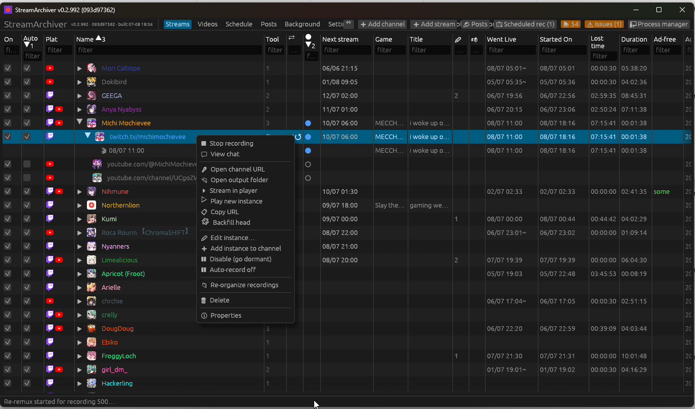

Left-click a row to select it; **right-click** any row — channel, instance,
stream, or take — for a context menu with that row's actions. For an instance:
Start/Stop recording, **Play local recording (start)** / **Play stream (live edge)** (see
[Watching in a media player](#watching-in-a-media-player)), **Open channel URL**
(browser), **Open output folder** (file manager), **Copy URL**, Edit…, Add tool
instance, Enable/Disable, and Delete.

**Stopping holds the restart.** Stop actions live in two submenus (⏹ Stop
recording / ⏹ Stop (allow triggers)), each offering the same three durations
so the menu doesn't grow six items tall: stop and hold **until a new
broadcast**, or for a fixed **6 hours** / **12 hours** regardless of
offline/online cycles.

- **⏹ Stop recording** suppresses *every* automatic restart — polls, pushes,
  **and trigger-word matches** — until the hold ends.
- **⏹ Stop (allow triggers)** still blocks plain Auto-record, but a
  trigger-word match can start a fresh recording during the hold — e.g. you
  stop a stream's main content, and an impromptu karaoke segment later in
  the same broadcast still gets captured because it matches a trigger rule.
  The hold itself doesn't end when a trigger fires — only Start, the
  channel going offline and live again (fresh-broadcast holds), or the
  timer expiring (fixed-hour holds) clears it, so plain Auto-record stays
  suppressed for the rest of that broadcast even after a triggered segment
  ends.

A held instance shows a **✋** badge in its State cell (hover for when the
hold ends and whether triggers are exempted); **▶ Start** always clears
either kind of hold. Holds survive an app restart. Automated stops (a
trigger's *only-while-matching* auto-stop, scheduled stops, the
quality-upgrade restart) never hold. A stream/take row's menu offers the
same two Stop submenus too, right on the take that's actually recording (or
the stream currently capturing it) — not just the instance row — plus Open
folder / Open file / Play local recording (start) / Play stream (live edge) / Copy path (and
Delete for a take). The inline per-row buttons (▶/⏹ ⏵ ▷ ✏ ➕ 🗑) do the same
(the strict Stop, since inline buttons have no room for a submenu — use the
context menu for "allow triggers").

The inline **Actions** column can be hidden via **Settings → Display → Show
Actions column** (applies to the Streams and Videos tables) to reclaim width — the
right-click context menu still provides every action.

Keyboard shortcuts:

| Key | Action |
|---|---|
| `Ctrl/Cmd+N` | Add channel |
| `Ctrl/Cmd+,` | Open Settings |
| `F5` | Refresh the list |
| `Enter` | Edit the selected row |
| `Delete` | Delete the selected row |
| `Esc` | Close the open dialog |

Deleting always asks for confirmation (the recorded files are kept either way).

### Watching in a media player

Set **Settings → Defaults → Media player path** to a player binary (e.g.
`C:\Progs\mpv\mpv.exe`) and every recording row — instance, stream, and take —
gains two playback actions, as inline buttons and context-menu entries:

- **⏵ Play local recording (start)** — open *this* recording in the player.
  For a finished take that's simply the output file; for an **in-progress**
  recording it opens the growing capture straight out of `.sa-cache\`, so you
  can watch a recording **from the start while it is still being captured**.
  On the instance and stream rows it prefers the active capture and falls
  back to the most recent finished file — this works whether or not the
  instance row is expanded to show its take history.
- **▷ Play stream (live edge)** — tune into the channel **at the live edge**,
  like opening the stream in a browser, without touching the recording (and
  without needing one to be running). The player's window title can be
  customized (and, for mpv on non-Twitch tune-ins, kept live-updating) — see
  [Live-edge player title](#live-edge-player-title) below. Disabled once the
  channel doesn't look live (there's no live edge to tune into on a past
  broadcast) — it becomes a small submenu with an enabled **Try anyway**
  entry instead, in case live detection is stale or wrong and you want to
  force it. For a *past* broadcast, use **▷ Play VOD** /
  **🌐 Open VOD webpage** instead (see
  [Missed-stream backfill](#missed-stream-backfill)) — those play/open the
  platform's VOD rather than a live edge, and work whether or not the take
  was ever recorded.
- **🔗 Copy video URL** — copy the broadcast's video page URL to the
  clipboard, **available while the stream is still live** (unlike the VOD
  actions): on YouTube the `watch?v=` URL is the same page during the live
  broadcast and for the VOD afterwards. Twitch copies the VOD page when its
  id is already known, else the channel page. On take rows, stream rows, and
  the Backlog's broadcast rows.

[mpv](https://mpv.io) is strongly recommended — the app hands it live-viewing
flags (`appending://` growing-file URLs, `--keep-open`, a generated live HLS
playlist for SABR) that other players don't understand; the SABR cases below
are **mpv-only** and their buttons say so when disabled. Any player opens
finished files. With no player configured the buttons are disabled and **Open
file** falls back to the Windows file association.

Live-edge plays and the SABR preview downloader pick their client from the
resolved auth exactly as captures do (`web` whenever cookies are attached, the
configured primary only for an anonymous attempt). They do **not** take the
🕶 anonymous rung: that rung is spent by a monitor whose unattended captures
have failed three times running, and watching is a single deliberate request
with no failure chain behind it. They used to anonymise every public YouTube
play unconditionally, which after the ladder inverted meant every live-edge
play took the one path this network refuses outright — the player just sat at
"Cache: 0s" while the downloader died to the bot check.

| Row state | ⏵ Play local recording (start) | ▷ Play stream (live edge) |
|---|---|---|
| Finished take | opens the output file (any player) | live-edge stream, if the channel is live |
| Recording — Twitch / HLS (`.ts`) | the growing `.ts`, from the start; mpv follows it as it grows | streamlink pipes the live edge to the player (`--player`) |
| Recording — YouTube SABR | the two growing SABR files merged in mpv (**mpv only**) | throwaway live-edge download served as live HLS (**mpv only**) |
| YouTube, not recording | most recent finished file | live-edge preview download (**mpv only**) |

**⏵ during a SABR capture.** Until the stream ends, a SABR capture is not one
playable file — it's two separate growing per-format files (video + audio; see
[the SABR section](#watching-sabr-captures--live-edge-previews)). ⏵ detects
the pair and launches mpv with the video as an `appending://` main file and
the audio attached as an external track, playing in sync from the capture's
start. Non-mpv players can't merge the pair, so the button stays disabled for
them (a dual-capture monitor falls back to its DASH companion's `.ts` instead).

**▷ on YouTube.** SABR live streams can't be piped to a player or opened by
URL (stock yt-dlp sees no formats for them), and seeking a multi-GB growing
capture to its end means a minutes-long linear scan — so ▷ starts a small
**throwaway live-edge download** under `%TEMP%\streamarchiver-preview\` and
serves it to mpv as a **locally generated live HLS playlist** that follows the
download as it grows. The player opens once the stream has buffered (~10–30 s;
the status bar says so). Closing the player stops the download and deletes the
temp folder. This path reuses the capture-from-start SABR setup (dev build +
PO-token provider) and downloads the stream a second time while you watch —
the same bandwidth as watching in a browser. Twitch needs none of this:
streamlink feeds the player natively.

Caveats:

- Seeking to the live edge of a *long* in-progress capture from ⏵ is slow (a
  growing file has no seek index, so the player scans linearly). That's what ▷
  is for — it starts *at* the edge.
- ▷'s timeline covers only what the preview has downloaded since you clicked,
  not the whole broadcast; use ⏵ for the recorded-so-far part.
- The preview download is killed when the player closes. If the app exits
  first, the downloader ends on its own when the stream does, and stale
  preview folders are swept on a later preview.

### Live-edge player title

**▷ Play stream (live edge)** used to hand the player nothing but the raw
URL/filename, so its window title was whatever the player itself defaulted
to. **Settings → Defaults → Live-edge player title** sets a template instead
(default `{channel}: 【{game}】- {title_trimmed}`), with four tokens:
`{channel}`, `{game}`, `{title_trimmed}` (the stream title with chat-command
plugs stripped, same as the [filename token](#filename-templates) of the
same name), and `{pos}` (current playback position, `HH:MM:SS`) — add `{pos}`
to your own template if you want it; the default omits it. Leave the field
blank to restore the old behavior (no title override at all).

How live `{pos}` gets, and how the title keeps up after the player opens,
depends on which tool is actually launching the player:

| Path | Player spawned by | Title at open | `{pos}` + auto-update |
|---|---|---|---|
| YouTube / Kick / ffmpeg source | this app, directly | mpv `--title` | **ticks live**; auto-updates (mpv only) |
| Twitch (Streamlink) | Streamlink itself (`--title`, translated internally to mpv/VLC/PotPlayer's own title flag) | Streamlink's fixed title, `{pos}` = `00:00:00` | **ticks live**; auto-updates once mpv's IPC socket is up, ~a second in (mpv only) |

`{pos}` becomes mpv's own `${time-pos}` property-expansion token rather than a
resolved value, so mpv keeps it ticking with no polling on this app's side.
With **Settings → Defaults → Auto-update live title** on (mpv only; default
on), a background thread talks to mpv over its `--input-ipc-server` socket: it
pushes the rendered title as soon as the socket is up, then re-renders it from
the channel's current title/game and pushes again every 20 s. Each push sets
BOTH of mpv's title surfaces — they are separate properties, and updating
only one leaves the other visibly stale: the window `title` (which property-
expands, so it carries a live-ticking `${time-pos}`) and `force-media-title`
(no expansion — `{pos}` renders as `00:00:00`), which feeds the `media-title`
shown on the OSC seekbar, the stats overlay, and playlist labels. The push
happens
every round even when nothing changed — re-setting an identical title is a
no-op for mpv, and the write doubles as a liveness probe, so the thread
notices the window was closed and exits instead of polling behind it
indefinitely. (The socket is also read back and drained after every command:
mpv answers each one, and a client that only ever writes would slowly fill
the pipe's reply buffer.)

That first push is what makes Twitch work at all. Streamlink — not this app —
spawns the player there, resolving its own `--title` once and handing mpv
`--force-media-title`, which can neither tick nor revisit itself; so the
socket is requested *through* Streamlink (`--player-args`) and both title
surfaces are taken over from it the moment mpv answers (before the
`force-media-title` half of the push existed, a mid-stream category change
updated the window bar while the OSC and stats overlay kept the launch-time
title forever). Best-effort throughout: if the socket
never comes up, the title simply stays as opened.

The pushed title tracks the *channel's* current title/game, which the app
keeps current while a recording is in progress as well as while it's merely
watching — a channel switching game two hours into a 12-hour stream retitles
the open player, not just the [Streams grid](#streams-live-monitoring).

#### Channels you don't track

A player opened for a **collab partner** or a **raid target** you don't
monitor runs on a synthetic instance with no monitor row behind it — so there
is no stored title or game, and `{game}`/`{title_trimmed}` would render
empty. The metadata is only one Twitch API call away, but making the play
action wait for it would trade the thing that matters (tuning in instantly)
for the thing that doesn't (a complete window title half a second sooner).

So the call happens *after* launch, on the same IPC socket: the player opens
immediately with whatever the template can fill in, a background thread asks
Helix for the partner's current title and game, and the finished title is
pushed into the running window when the answer arrives. On the Twitch path
the fetch is effectively free — it overlaps the wait for Streamlink to
resolve the stream and spawn mpv, which takes longer than the API call does.

It then keeps refreshing, but **every 2 minutes rather than every 20 seconds**
— a tracked channel's updater re-reads a row the app already keeps fresh,
while every round here is a real API call, and "Play all collab instances"
can open four of these windows at once. Each round probes the IPC socket
*before* touching the API, so a window that has been closed costs exactly
zero further calls: the probe fails and the thread exits.

Needs **Auto-update live title** on and mpv as the player, and fails soft in
every direction — an untracked channel that has already gone offline, or an
API hiccup, leaves the launch title alone rather than blanking it (and the
next round retries, so a hiccup at tune-in still resolves).

### Detection methods

A monitor's **Detection** method is *how* the app learns a channel went live. The
dropdown is filtered to the methods valid for the channel's platform, with a
sensible default pre-selected. Hover the **Detection** field (or the table column)
in-app for a one-line description of each.

| Method | Platforms | Needs creds | Latency | Notes |
|---|---|---|---|---|
| **Twitch API (Helix)** | Twitch | Client ID + Secret, or a connected account | one poll interval | Polls `Get Streams`, batched up to 100 channels/call; scales well. **Default for Twitch.** |
| **Twitch EventSub** | Twitch | Client ID + Secret | ~seconds | Real-time push over a WebSocket (conduit + app token) for both go-live **and** go-offline; ignores the poll interval, idles cheaply, reconciles on (re)connect. No public endpoint needed, no poll fallback. |
| **Twitch EventSub + Helix** | Twitch | Client ID + Secret | ~seconds, with a poll backstop | Does both: EventSub push **and** Helix polling. Whichever sees live first starts the recording, so a missed event (network drop, app started after go-live) is still caught. A longer poll interval is fine — it's just a safety net. |
| **YouTube WebSub (VPS push)** | YouTube | [yt-websub](../yt-websub) relay (URL + token) | ~seconds, with a poll backstop | Push via an external relay on a public VPS: it subscribes to YouTube's WebSub/PubSubHubbub hub and streamarchiver polls it for events. Each notification triggers an **on-demand liveness check** (records only if actually live), with scrape polling as a safety net. A longer poll interval is fine. |
| **YouTube WebSub + slow net** | YouTube | [yt-websub](../yt-websub) relay (URL + token) | ~seconds, with a slow backstop | The same push, with the scrape safety net **floored at 15 minutes** however short the instance's poll interval is. Use it where a missed push would cost you a broadcast. Plain WebSub polls on the instance interval, which at the 60s default across a few dozen channels is ~45,000 page loads a day (~1.1 MB each) — the traffic that got this archive's IP bot-walled by YouTube. Same net, a thirtieth of the cost. |
| **YouTube WebSub (push only)** | YouTube | [yt-websub](../yt-websub) relay (URL + token) | ~seconds, no backstop | Push and nothing else — zero scheduled HTTP requests to YouTube. Lowest traffic, and the only option with **no safety net at all**: a notification the relay misses is a broadcast nobody notices. Good for Auto-off info-only channels, or when the relay is trusted. |
| **YouTube Data API** | YouTube | API key | one poll interval | `search.list?eventType=live`; reports the real go-live time. **Quota-limited (~100 checks/day)** — use a long interval. |
| **Kick official API** | Kick | Client ID + Secret | one poll interval | client-credentials app token; more reliable than scraping (no Cloudflare). |
| **Scrape poll** | YouTube `/live`, Kick, generic | No | one poll interval | **Default for YouTube/Kick**; no credentials, but fragile to site changes. Go-live time is approximate (`~`). |
| **Generic probe** | any streamlink/yt-dlp URL | No | one poll interval | `streamlink --stream-url` liveness test; works anywhere those tools do. For NRK/Nebula monitors the probe uses `yt-dlp --print live_status` instead (streamlink has no plugin for either). |
| **Disabled** | any | No | manual only | No automatic checking at all — not polled by the scheduler, no push subscribed. **▶ Start** records immediately (there's no configured way to check first, so it trusts you) instead of erroring "not live". For channels you only ever want to record by hand. |

**Polling vs. push (Helix vs. EventSub).** Helix *asks* "is it live?" every poll
interval, so you notice within that interval (and the **Lost time** column ≈ the
interval). EventSub is *told* the moment a channel goes live, so it catches the
start within seconds and ignores the per-channel interval — at the cost of holding
a WebSocket. Both report the real go-live time and use the same Twitch app creds;
EventSub specifically needs the **Client Secret** (it authenticates with an app
token). Choose **EventSub** to minimize missed footage, **Helix** for a simpler,
fully stateless poll, or **Twitch EventSub + Helix** for the most robust option —
instant push with a polling backstop so you still start the recording if an event
is ever missed. (Connecting a Twitch account also satisfies Helix — its user token
expires, so the app auto-refreshes it and falls back to the app token; if you'd
rather not reconnect, set a Client Secret and the app token is used.)

> To verify EventSub: set Twitch creds, add a Twitch channel with method **Twitch
> EventSub**, then `streamarchiver --run-for 120` with `RUST_LOG=info` — it logs
> `eventsub: connected (conduit …); N channel(s) subscribed (N offline)` and
> `stream.online -> monitor N` / `stream.offline -> monitor N` as the channel
> goes live/offline.

**YouTube WebSub (push via VPS).** YouTube can *push* go-live notifications over
WebSub/PubSubHubbub, but the hub needs a public callback URL — which a home machine
doesn't have. The companion [yt-websub](../yt-websub) server runs on a small public
VPS: it subscribes to the hub for your channels, durably logs each notification, and
exposes them over a token-authenticated HTTPS API. streamarchiver (at home) **polls**
that API. Because a WebSub notification fires for uploads and metadata edits too —
not just go-lives — each event is treated as a *"check this channel now"* trigger:
streamarchiver runs its normal liveness check and records **only if the channel is
actually live** (so it's safe and idempotent), while the scrape poll stays on as a
backstop.

**Pick the backstop deliberately** — this is where YouTube traffic is won or lost.
Plain **WebSub** polls on the instance's own interval, and at the 60s default that
is one ~1.1 MB page per channel per minute; across 29 channels it measured ~45,000
requests and ~50 GB a day from one residential IP, which is very likely why YouTube
started refusing anonymous requests from it. **WebSub + slow net** keeps a backstop
but floors it at 15 minutes (~1,400 requests/day for the same channels).
**WebSub (push only)** has no backstop at all: nothing polls YouTube, and nothing
catches a missed notification either. To use it: deploy `yt-websub` (see its README), then in **Settings →
YouTube WebSub** set the **VPS base URL** + **bearer token**, and set the relevant
YouTube monitors' **Detection** to **YouTube WebSub (VPS push)**. streamarchiver
auto-resolves each channel to its `UC…` id, pushes the set to the VPS, and the VPS
manages the hub subscriptions.

Since the relay runs headless on a VPS outside this app's process control, the
**Background** view's **📡 WebSub relay** row is how you'd actually notice it
went down: reachable/unreachable (colored like the PO token server row), the
VPS's own subscription count, and — on a yt-websub build new enough to report
them — its process **uptime** and **version**. Hovering the status shows the
last successful contact time and the event cursor vs. the VPS's current max
sequence (how far behind, if at all). There's no Start/Stop here (nothing
local to restart) — **🔄 Poll now** just triggers an immediate check instead
of waiting out the rest of the poll interval.

> Tool tip: use **streamlink for Twitch** (reaches 1440p/2K HEVC) and **yt-dlp for
> YouTube** (`--live-from-start`; streamlink hits YouTube segment 403s). The app
> defaults accordingly. **Note:** YouTube `--live-from-start` now requires the SABR
> setup — see [YouTube live capture-from-start (SABR)](#youtube-live-capture-from-start-sabr).

### Output

Recordings capture to a progressively-flushed `.ts` (so a crash/forced-stop leaves
usable data) and are remuxed losslessly to **`.mkv`** on clean stop. MKV is the
default; pick TS per channel if you prefer. **MP4 is never produced** (poor for
interrupted writes).

**Quality upgrade (Twitch, default on).** A capture that joins seconds after
go-live often sees only transcodes — Twitch lists the **source** rendition
late — so a `best`-quality capture can lock onto e.g. 720p60 while the stream
is really 1080p60. The watcher re-probes the rendition list a few minutes in
and, if something better appeared, restarts the take **once** at the better
quality (a ⬆ notification announces it). The new take's head backfill covers
the seam and — being source quality on both sides — joins into a complete
`full.mkv` at the better quality. Settings → Recording to disable.

**Disk-load management.** All bulk post-processing on the recordings drive is
deliberately bounded so it can never starve (or physically knock out — USB
enclosures *do* drop off the bus under sustained mixed load) the drive the live
captures are writing to:

- Full-file ffmpeg passes — the finalize TS→MKV remux, split merges, head+live
  joins, thumbnail/subtitle embeds — run **one at a time per disk** (default;
  see below). When five takes finish together (a raid ends, a shared event
  closes), their remuxes queue instead of hammering the disk simultaneously; a
  finished take just sits as a playable `.ts` in `.sa-cache\` a few minutes
  longer. The same applies to the leftover finalizes an app restart picks up.
  The current gate holder and queue are shown live at the top of **Background
  jobs**, **one line per drive**: the line names the longest-running pass, and
  **(+N more)** collapses any passes running *concurrently* alongside it (this
  drive allowing more than one permit — hover it for the full list; this is
  distinct from the queue). **▶ View queue** expands the full line-up for that
  drive (every waiting pass with its file and wait time — including passes
  that have no task row of their own, like batch re-remux items, embeds, and
  head joins), and each queued pass with a task row also reports the wait
  there.
- **Emergency pause + kill** (next to each drive's line on the Background
  tab, and a persisted **Paused** checkbox per drive in the Disk I/O limits
  table): for exactly the moment a drive gets into real trouble — a giant
  head+live join eating the disk for hours while gap-recovery/head-backfill
  fetches for OTHER channels starve on the same physical spindle. **⏸
  Pause** blocks *new* concat/remux/embed passes on that one drive so every
  byte of I/O goes to CDN-fed muxes (gap recovery, head-backfill fetches, VOD
  recovery — see below, always racing a CDN window or a post-stream DMCA
  mute) and to live captures themselves, which are never gated at all.
  Pausing can't stop a pass that's *already* running — nothing preempts an
  in-flight ffmpeg pass — so **🗑 Kill current** is the separate, explicit
  action for that: force-terminates whatever the drive's local-pass gate is
  currently holding. Safe by construction for concat/embeds/split-merges
  (they write to a temp file and only replace the real one on success — a
  kill just discards the temp and the source files are untouched); a
  finalize/manual remux killed mid-pass can leave a partial `.mkv` next to
  the original `.ts` — harmless (the app already falls back to the `.ts` on
  any remux failure, kill or otherwise) but not auto-deleted, so a stray
  partial file might sit there until the next remux attempt overwrites it.
  Either way, the killed pass is just treated as an ordinary ffmpeg failure
  and retried later (the next finalize sweep, or manually). Resume with
  **▶ Resume** once the drive has caught its breath.
- CDN-fed muxes (head backfills, VOD recoveries) are capped at **two at a
  time per disk** (default) — DMCA mutes tend to land for several channels
  minutes after a shared stream end, and each recovery writes a full stream to
  the drive. **Never affected by the pause above** — it's a completely
  separate gate, by design: this is exactly the traffic the emergency pause
  exists to protect.
- **Per-disk I/O limits** (Settings → Recording → Disk I/O limits): all four
  knobs — local-pass permits, CDN-mux permits, the read throttle, and the
  download rate limit — are configurable as a **default plus per-drive-letter
  overrides**. Recordings split across a fast NVMe and a fragile USB HDD can
  then run several parallel passes on the SSD while keeping the HDD strictly
  serialized and throttled. Gates are keyed by the target file's drive, so a
  saturated disk never queues work bound for an idle one. Permit changes take
  effect **immediately on Save** — including for passes already queued behind
  the old limit, so raising a limit to drain a stuck backlog doesn't require
  waiting for some unrelated new pass to kick off first. A reduction still
  lets any pass already *running* finish; it only holds back the next one.
- **Dynamic mode** (a **Dynamic** checkbox per drive, default off): instead of
  hand-tuning a fixed permit count, the local-pass/CDN-mux numbers become a
  **ceiling** and a background adjuster grows or shrinks the *live* count
  toward it every few seconds based on the disk's actual queue depth (the
  same "is this disk actually busy" signal Windows' own per-disk activity
  graph reflects — whole-spindle, so other programs' I/O counts too, not just
  this app's). Growth is gradual (a couple of idle checks before adding a
  permit, so a momentarily-quiet disk doesn't snap straight back to the
  ceiling); backing off is fast — the first sign of real contention roughly
  halves the live count immediately, because the whole point is protecting a
  drive that's already been driven off the bus once. The **actual live
  values** appear directly under a ticked Dynamic checkbox once bulk I/O has
  run on that drive: `L 2 /4 · 1 busy` means 2 permits right now, ceiling 4,
  1 currently in use (and the same for `C`, the CDN-mux gate). On the
  **Default** row — which covers every drive without its own override row —
  one such line appears **per active drive**, labelled with its letter. Drag
  the number to **pin** it — the adjuster leaves that gate alone until you
  hit **🔓** to release it back to auto. A drive that hasn't run a pass yet
  shows `L —` / `C —` rather than a real number. Only the permit counts
  adapt — the read
  throttle and download rate limit stay fixed at whatever's configured.
- **Disk throttle** (the default row of the Disk I/O limits table, default
  **30× realtime**)
  additionally caps how fast each pass reads + writes (ffmpeg `-readrate`,
  needs ffmpeg 5.0+; silently unthrottled on older builds). At 30× a 5-hour
  stream finalizes in ~10 minutes while using a fraction of the drive's
  bandwidth. `0` disables the cap. `-readrate` paces against the input's own
  timestamps, which ad-break cuts (or the non-zero start timestamps of
  live-DVR DASH parts) can break — ffmpeg then *crawls* below realtime,
  wedging the queue for hours. A pacing watchdog on both the finalize remux
  and the split-capture merge detects a pass falling hopelessly behind and
  retries that one file unthrottled.
- Tool logs, chat sidecar writes, and the UI's file probes are batched, cached,
  or kept off the recordings drive entirely (see *Data & locations*).
- **Download rate limit** (the default row of the Disk I/O limits table,
  default **off**): a yt-dlp
  `--limit-rate` value (e.g. `4M`) applied to VOD-archive grabs and Videos-tab
  downloads, per target disk. A post-stream VOD download otherwise runs at full CDN speed onto
  the same drive the remaining live captures are writing to — on a busy night
  it's typically the single largest writer. Never applied to live captures
  (throttling the live edge loses data).
- **yt-dlp ffmpeg throttle** (Settings → Recording → Remux, default **off**):
  `--postprocessor-args` specs (several separated by `;;`) forwarded to every
  yt-dlp invocation. The disk throttle above only reaches ffmpeg passes the
  *app* runs — a SABR capture's post-stream **format merge** happens *inside*
  yt-dlp and reads + writes the whole multi-GB take at full disk speed.
  `Merger+ffmpeg_i:-readrate 30` caps those merges at 30× realtime (ffmpeg
  5.0+). In the I/O tab, a job in that phase shows `yt-dlp + ffmpeg` in its
  tool column and `· ffmpeg pass` on its purpose.

### I/O monitor (the **I/O** tab)

Every filesystem operation the app performs — and every byte its spawned tools
move — is tracked, so disk-load problems on the recordings drive can be *seen*
rather than reconstructed after a crash:

- **In-app operations** all flow through one instrumented layer, categorized by
  purpose (chat sidecars, log tails, promote/renames, cache sweeps, asset
  cache, fs probes, database, …) and by storage region (recordings drive /
  appdata / temp). A clippy lint (`clippy.toml` `disallowed-methods`) makes it
  impossible for new code to bypass the layer unnoticed.
- **Tool processes** (streamlink / yt-dlp / ffmpeg — including the ffmpeg a
  yt-dlp launcher spawns) are sampled once a second via per-PID Windows I/O
  counters, each labeled with what it's doing and which file it works on. The
  tool column shows the **live process tree** (e.g. `yt-dlp + ffmpeg` while a
  finished SABR capture runs its format merge), so a sudden burst is
  attributable at a glance. Note the *read* side of a capture tool is mostly
  CDN network traffic; the *write* side is the disk-relevant number.
- **Physical-disk counters** report true bytes/sec and **queue depth** per
  drive (whole spindle, all processes — catches OS write-cache flushes too).
  Sustained queue depth on a USB enclosure is the early-warning signal before
  it drops off the bus; the tab flags depth ≥ 4 in red. Alongside the live
  value the tab keeps **session stats** so pressure doesn't have to be caught
  in the act: average depth, the session max with how long it sat there, and
  (on hover) the **top 5 pressure episodes** — each elevated run (queue ≥ 2)
  with its peak, duration, and when it ended. An **"other"** column shows the
  spindle traffic *not* accounted for by this app or its tools — a backup
  client, antivirus scan, or search indexer hammering the recordings drive
  shows up here (highlighted when it dominates), instead of the queue-depth
  spike being blamed on a capture or remux. A **conn** column (USB flagged,
  since that's the tier where enclosure/cable/hub quality and shared
  bandwidth matter) shows each drive's physical bus — same data and hover
  detail as the Files tab's Drives table, see [File management](#file-management-the-files-tab).

The **I/O** tab shows live totals, a 30-minute rate graph (write/read/queue
series per drive, hover for values), per-region and per-category tables
(cumulative bytes, slow-op counts, max single op), a per-process table, and a
filterable recent-operations log — operations slower than 100 ms are
highlighted, and the thread column exposes anything touching the disk from the
UI thread. **📋 Copy summary** exports the state as text.

**Slow-op log levels.** A slow filesystem op only logs at **WARN** when it
actually blocked work: a sync call on the UI thread (the UI froze for the
duration — always a regression) or a sync call that stalled a tokio async
worker for ≥ 1 s. Everything else — awaited async I/O (the named thread is
just where the task resumed; nothing sat blocked) and sync ops on dedicated
background or blocking-pool threads — logs at **DEBUG**, with the reason it's
harmless spelled out in the message ("the disk was busy" seen from a thread
nothing waits on). Chatty categories carry extra context: fs probes are
metadata-only peeks refreshing in-memory state, cache sweeps scan the on-disk
capture cache for leftover transient files (never finished archives), and
chat appends buffer messages in memory while a slow write is in flight.

**Platform tags in logs.** Lifecycle log messages (poll results, recording
start/finish, chat capture, SABR resume, head backfill, VOD polling, push
notifications) carry a `[Twitch]` / `[YouTube]` / `[Kick]` tag in the
platform's brand color — purple, red, green — when stderr is a real terminal
(debug console runs). The rolling log file gets the same tag in plain text:
an ANSI-stripping writer removes the color escapes before they reach disk.

**Database sub-tab.** The single SQLite connection sits behind a fair mutex
that every store call takes in turn; this tab shows that lock live: the
current **holder** (which thread, from which store call site, held for how
long), the **waiter queue** in line order, session counters (acquisitions,
cumulative hold time, slow waits ≥50 ms, long holds ≥200 ms), and a
**recent-contention log** of the same incidents the `slow DB lock` warnings
report — each wait naming the holder it was blocked behind, so "another
thread held the connection" is never a dead end again.

**Sample log** (Settings → Recording, default **on**): the 1 s samples are also
appended to a JSONL under `logs\iomon\` on the system drive (~2–5 MB/day,
pruned after 14 days), so an overnight stall or a drive disconnect can be
analyzed after the fact even if the app died with it.

### File management (the **Files** tab)

An overview of what is mapped to which path, across every drive recordings
have ever landed on:

- **Drives** — each drive letter in use (online/offline, free/total space, and
  how much recorded material the database places there). Low free space is
  flagged: retarget instances to another drive and the old recordings stay
  where they are, fully tracked. A **connection** column shows the physical
  bus (USB/SATA/NVMe/SAS/…, queried once per drive and cached — never on the
  render path) — USB is flagged, since it's the tier where enclosure/cable/
  hub quality and shared bandwidth with other USB devices are real factors,
  unlike an internally wired SATA/NVMe/SAS/RAID connection. Hover a value for
  the make/model/serial plus Device Manager's own "Policies" tab state:
  write-caching (and whether the device is power-protected, so Windows can
  skip flushing it on every write) and removal policy (Quick removal vs
  Better performance — whichever was last set in Device Manager, or "not set"
  if it never was). The same connection info, keyed to whichever drive is
  actually busy, also appears in the I/O tab's physical-disks table. Not
  detected: whether two USB drives share a physical port/hub/controller —
  Windows only reports that via a much deeper device-topology walk, so two
  drives both flagged USB may or may not actually contend with each other;
  check Device Manager's USB tree if that distinction matters.
- **Instances** — every instance with its **output folder**, editable inline
  (💾 applies; affects future takes only) and in **batch**: select rows and
  apply one folder to all of them (`{channel}` expands per instance). The
  resolved cache dir for the current cache layout is shown per row.
  **Redirect all instances on drive** does the same thing keyed by drive
  letter instead of manual selection — pick the full drive from a dropdown,
  type the destination letter, and every instance currently outputting there
  gets retargeted in one click (only the drive letter changes; the rest of
  each path is kept as-is). The drive-full case: point everything away from
  a nearly-full drive without touching a single existing file.
- **Recording locations** — every folder recordings actually sit in per the
  database, including *history-only* folders no instance points at anymore
  (e.g. the old drive after a move), with existence checks and per-folder
  totals.
- **Relocate recorded paths** — for after you physically move files (drive
  swap, folder rename): rewrites the leading path prefix in the database —
  recordings incl. head/full/recovered/VOD companion paths, video downloads,
  and optionally instance output folders. Preview first, then apply; no files
  are touched.

Instances moving between drives is a first-class case throughout: recordings
store absolute paths, so playback, Issues recovery, chat sidecars, and the
I/O monitor keep working for material on drives no instance currently records
to (those drives stay classified and disk-sampled, and their leftover working
dirs are still swept).

### Issues panel & re-remux

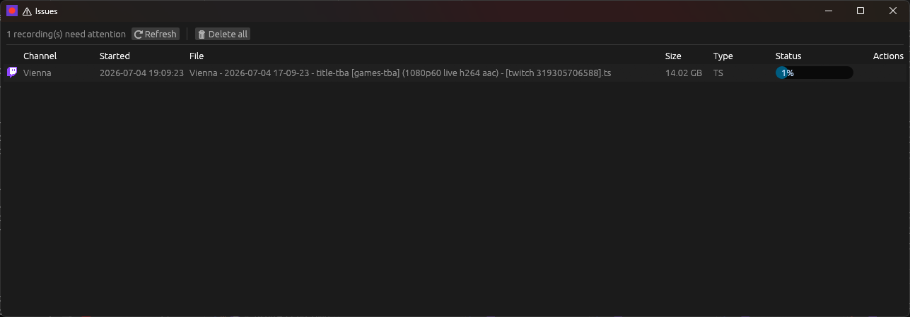

The **⚠ Issues** button in the toolbar (turns amber with a count when issues exist) opens a panel listing recordings that need attention. It is built to stay usable with hundreds of rows in it:

- The row-list sections (stale recordings, unmerged split captures, muted VODs, head mismatches, blocked gap patches) each get a **collapsible header carrying their own count**, and a section holding more than 8 rows **starts collapsed** — a long backlog can't bury the sections under it, the toolbar, or the main table.
- Those sections share a **resizable region** at the top of the window: drag its bottom edge to give them more or less room, and they scroll in place within it. Everything below gets the rest of the window, including any height gained by resizing it.
- Each section row is column-aligned — **name · detail · actions** — with the name **truncated to a fixed width** (full text on hover) and the useful part (part count, size, last-write age, head-vs-live mismatch) in its own column next to it. Capture filenames run to 150+ characters, and without that cap a single long stream title pushed every action button in the section off the right edge of the window.
- The toolbar **wraps** rather than clipping, and carries a **🔍 filter box** (matches a row's channel or file path, case-insensitively, including non-Latin titles) and a **type dropdown** (needs remux / stuck in cache / file missing / failed no-file / failed) for the main table below it. When either is narrowing the list, the toolbar shows `showing N of M`. Both reset when the window is closed; the bulk buttons always act on the *whole* category, never on just what's on screen.

- **Needs re-remux** — a recording whose capture finished as `.ts` but was never successfully remuxed to MKV (e.g. after a crash, a detached process, or an automatic remux failure at finalization). The **🔄 Re-remux** button triggers a background ffmpeg remux; the status cell shows a live progress bar with fps / speed / position once ffmpeg is running. The source `.ts` is deleted only on success. Like chapter embedding (see [Chapters](#chapters-)), an in-progress remux survives an app restart instead of losing its progress — the app re-attaches to it on the next launch rather than starting over.

  A startup **repair pass** feeds this section: any recording whose row claims
  a final output file that isn't actually on disk (the app died before or
  during the finalize remux) has its working folder checked (`.sa-cache\`, or
  the pre-rename `.cache\`) — if the capture
  survived there, the row is retargeted to it (a `.ts` lands here; an
  already-final container lands under *stuck in cache*) instead of being
  mislabeled "gone", and its capture is protected from the 24 h cache sweep.
  Only rows with nothing on disk at all are listed as missing. Intact files
  whose status update was simply lost in a crash are promoted to *completed*
  directly.
- **Empty capture** — the capture file is 0 bytes (nothing to recover); Re-remux is disabled.
- **Remux failed** — a previous re-remux attempt failed; hover the status cell for the ffmpeg error. The button is locked to avoid re-triggering a known-bad file.
- **⏸ Marked 'recording' but not being written** — a take still claims to be
  recording, but none of its files (final output or `.sa-cache\` working
  files, checked handle-true against NTFS's lazy metadata) have been written
  for 10+ minutes. Either the capture process died without the app noticing
  (power loss, sleep, forced kill) or the post-capture finalize is still
  waiting for its turn at the disk gate — in the latter case the row shows
  the live remux progress instead of an action. **🛠 Finalize now** promotes
  whatever was captured (remux/move it out of the working folder) and settles
  the row.
- **🧩 Unmerged split captures (recoverable)** — the download tool died before
  merging its per-format files (SABR/DASH write video and audio separately and
  merge at the very end), so the final file was never written and the take
  finalized as 0 bytes — but the media survived as parts in `.sa-cache\`. Never
  listed as plain "gone": the **Merge into MKV** button losslessly muxes the
  parts into the final file (gated + throttled like any finalize pass, with a
  live progress bar in Background jobs and the same pacing watchdog as the
  finalize remux), promotes it, and marks the recording completed.

  This also covers takes whose tool died **mid-write** (machine slept, power
  loss): the unfinished `.part` sequences are recovered too — the largest
  sequence per format is merged (marked *(interrupted)*; the very tail may be
  cut). Since the stream usually continued past that point, each row also
  offers **📼 Download VOD** to archive the whole published broadcast. When
  the tool's log shows the failure was a network/DNS outage (e.g. the machine
  woke from sleep before the network came up), the 🔍 details say so
  explicitly instead of leaving a bare `getaddrinfo failed`.
- **🔗 Head backfill can't join the live capture** — the head and the live
  capture carry different stream parameters, so the lossless `full.mkv` concat
  is impossible. The row shows the actual probed params (e.g. *head 1080p60 vs
  live 720p60* — the capture joined before Twitch listed the source
  rendition). Fixes: **re-fetch the head at the live capture's rendition** (so
  the join succeeds), **download the published VOD at source quality** (the
  full stream at the better resolution), or dismiss and keep both parts as
  separate playable files. The *quality upgrade* watcher (see Streams)
  prevents new cases at the root.

- **Failed / aborted / orphaned takes** — a recording that errored out, was cut short by app shutdown, or lost track of its file. Each row offers **🔄** (re-remux, if a `.ts` survives), **🗑** (delete the output file and clear it), **✕ Clear** (permanently remove the DB row), and **🔍** for the full error. **✓ Ack** is the non-destructive option: it acknowledges the failure — the row drops off this list and its ⚠ stops bubbling up to the take's instance/channel row (see *In-tree badges* below) — without touching the recording itself; the take's own row keeps its ⚠, just tinted gray instead of red, so the failure stays visible where it happened. The same **✓ Acknowledge failure** / **↺ Un-acknowledge** pair is also on the take/stream row's own right-click menu.

Every grid row carries a **🔍** action that opens the status-cell hover text (DB status, exit code, path, tool-log excerpt / ffmpeg error) in a details window — selectable, scrollable, with a **📋 Copy** button — so long errors don't have to be read from a transient tooltip.

Every recording finalize (in-session, startup re-drive, resume, or manual) is announced as a **Background job** with live ffmpeg progress, so a take that is queued behind other remuxes on the disk gate is visibly *finalizing* instead of silently stuck. While a remux or split-merge is **waiting for its disk-gate turn**, its status line updates every few seconds with what it's waiting behind — `⏳ queued for disk gate 45s — running now: remux (312s) · 3 in queue` — both in Background jobs and inline on the Issues row (the unmerged section swaps its Merge button for the live status once its merge is underway); ffmpeg speed/position stats replace it the moment its own pass starts. Remux passes whose `-readrate` pacing collapses retry unthrottled **while keeping their disk-gate turn** — previously a killed pass re-queued at the back, and a backlog of remuxes could carousel for hours without any file finishing.

The Issues panel refreshes every 5 s while open and every 5 min while closed — shortened to 15 s after something changed (a recording finalized, a re-attach, …), but never once-per-event: each sweep stats every recording on disk and holds the DB briefly, so an event storm must not stack sweeps. **⟳ Refresh** forces an immediate rescan.

**In-tree badges.** The recording tree also surfaces the same issue as a **⚠ needs remux** badge at the take row, rolling up to the stream, instance, and channel rows, so you can see there is a problem without opening the panel. A **failed** take's own ⚠ rolls up the same way — but only the *latest* take's status ever bubbles that far (an old failure buried behind several later successful takes was never re-surfaced this way to begin with), and once acknowledged it stops rolling up at all: only the take/stream row it actually happened on keeps showing it, muted gray instead of red.

> The active re-remux job is a background tokio task and does not survive an app restart. The source `.ts` is always preserved, so after a restart the file reappears in the Issues panel and can be re-triggered.

### 🚨 Warnings & lost-segment recovery

The **🚨 Warnings** button (next to ⚠ Issues) surfaces problems the capture
tools report **in their own log files** — previously these scrolled past
silently and the only trace was a line in the per-capture `.log`. A scanner
tails every running capture's tool log on the stall-watchdog's 60-second
cadence (re-attached captures are scanned from the top of the log when it's
modest-sized, so a restart doesn't hide what happened before it) and turns
matching lines into persistent alerts:

- **Errors (red rows)** — content is actually missing from the capture:
  - streamlink `Sequence gap of N segments at position P` — the live playlist
    window slid past segments that were never downloaded (downloads falling
    behind: network congestion, disk stalls). Each Twitch segment is 2 s, so
    the row shows the real damage: *"74 occurrences · 1,125 segments (~37 min)
    of content lost"*.
  - streamlink `Failed to fetch segment N` — retries exhausted, segment
    skipped.
  - yt-dlp `Skipping fragment N` and `ERROR:` lines.
  - **⛔ Capture failed** — every take that finalizes as *failed* gets an
    error row here, even when nothing in its log matched a known pattern (a
    killed process, an unrecognised failure wording): the row carries the
    log's last line (or the exit code when there's no log) and its category
    chip derives from that line, so a network drop or disk-full death still
    sorts into the right ✔ Ack group. Skipped when an error alert (🎫 PO
    token, tool error) already covers the take — one failure, one row — and
    never filed for user-initiated stops.
- **Warnings (yellow rows)** — non-fatal tool complaints (yt-dlp `WARNING:`,
  other streamlink `[error]` lines), minus known-benign chatter: retry/ad
  notices, the SABR deep-rewind "experimental" banner and format-negotiation
  fallbacks (`Requested format is not available` / `No video formats
  found!`), normal "a new stream may have started" endings, and bgutil
  POT-server ping blips — all of which print on routine captures and carry
  no per-take signal. Genuinely anomalous warnings (e.g. `segment alignment
  mismatch across downloaded formats`) still surface. Premature-spawn
  probes (`This live event will begin in 2 days.` / `The channel is not
  currently live`) are warnings too: nothing was live, so nothing was lost —
  but they flag over-eager liveness detection worth noticing.

Alerts aggregate: one row per take and problem kind, whose counters grow as
more lines appear. The toolbar button badges with the unacked counts (red
fill when any error is unacknowledged, yellow for warnings only); **✔ Ack**
per row or **Acknowledge all** clears the badge while keeping the row for
reference — and *new* occurrences automatically un-acknowledge the row, so
fresh damage always re-lights it. Each row also carries a **category chip**
(💾 Disk full, 🔒 Access denied, 📡 Network drop, 🎫 PO token, 💤 Not live
yet, …) derived from the offending log line; the **✔ Ack group…** menu
acknowledges a whole category at once (e.g. every "Disk full" alert from one
bad night) and the filter box matches category names. A **Hide acknowledged**
checkbox keeps the list down to what still needs attention — rows drop out
once acked and reappear only if fresh damage un-acknowledges them. The menu
also leads with a **✅ Fixed** group — one click acknowledges every *green* row (fully
recovered or superseded) while leaving unhealed red and yellow rows alone.

Rows are built for reading and copying: each shows the channel's **profile
picture** (Alt-hover for full resolution) and names the channel in its **own
colour** — the same identity the Streams grid and 🔔 feed use — with the
metadata (occurrence count as **×N**, first — last occurrence, source tool,
category chip) **inline on the title line** at full size rather than in small
print on a separate line. The **matched log line sits in the row itself** as
selectable text — right-click it to copy the line or the whole alert — where
it used to hide in a hover tooltip (uncopyable, invisible in screenshots,
easily dismissed). A **Row colors** checkbox (persisted, default on) turns
the red/yellow/green tints off for a plainer list; the coloured icon and
title still carry the state. Each row links straight to the tool log (📂),
and the first occurrence per take also lands in the 🔔 feed as a compact
title-only row whose **🚨 Details** button jumps back to this window (errors
additionally raise a desktop toast, DND-gated as usual). Alerts idle for 60
days age out at startup.

**Superseded failures heal themselves.** When a capture attempt dies (e.g.
an antivirus-held rename, a disk-full night that later cleared), the
scheduler starts a fresh take of the same broadcast — and new takes re-fetch
the full stream head (SABR deep rewind / Twitch VOD head backfill), so a
*completed* later take should cover the dead one's content. Error alerts on
such takes automatically flip **green 🔁 "superseded by a later take"**,
stop counting toward the 🚨 badge, and the take row shows a **🔁
superseded** badge instead of a red one — no manual ack needed. (Takes with
outstanding lost ranges keep their normal recovered/unrecovered rendering;
this only applies where a sibling take genuinely covers the broadcast.)

**💽 Drive offline.** Unrelated to log scanning: if the chapters-embed or
gap-splice sweep finds a finalized recording whose output file lives on a
drive that's currently disconnected (an unplugged USB enclosure, say), it
doesn't spam one deferral line per recording — it files one red **Drive
offline** alert per drive (growing the same row's count as more recordings
on that drive are found) and defers them until the drive reconnects.
Chapters retries hourly (below) and gap-splice does too — a deferred
recording no longer needs an app restart to be reconsidered once the drive
comes back mid-session (2026-08-14 fix; previously only the one-shot
app-startup sweep ever revisited it, so a mid-session reconnect could sit
until the next restart).

**In-tree badges & trends.** The Streams grid mirrors the alert state right
on the rows (all clickable — they open the Warnings window): a take (and its
stream row, summed over takes/dual-capture legs) shows **🚨 lost data
(N/M recovered)** while damage is outstanding, **⛔ capture error** for
error alerts with no segment loss attached (a rejected PO token, a fatal
tool error that killed the take — these used to render as a nonsensical
"lost data: 0 segments"), **🩹 recovered** (green, with
a *(muted)* note when the DMCA fallback was used) once every lost range was
re-fetched, **🔁 superseded** (green) when a later completed take covers a
failed one, or **⚠ tool warnings** for warning-only takes. Recovery progress
updates the N/M counter live, after every recovered range. **App Stats**
gains a *Capture health* section: lifetime totals (error/warning alerts,
segments lost, ranges recovered, ✂ muted) plus a per-day trend table
(Errors / Warnings / Lost / Recovered / Muted) — a rising "lost" column
across days points at a systemic cause (saturated disk/uplink, failing
enclosure) rather than one bad stream.

**Lost-segment auto-recovery (Twitch).** For Twitch recordings the lost
content usually still exists: the VOD CDN keeps the broadcast (even for
channels with VODs disabled — the same sha1-folder rails as VOD recovery,
~60-day window). Since live media sequence numbers map exactly to broadcast
time (position × 2 s), every sequence-gap warning yields a precise lost time
range. The scanner pads (±10 s), coalesces (< 30 s apart) and queues those
ranges, and a recovery job re-fetches them **while the stream is still
live** — as soon as the trailing VOD covers a range (~4 min behind the
edge). Fetching immediately matters: DMCA muting hits VODs *after* the
stream, so an in-flight fetch gets the audio intact. Anything left over is
swept at finalize and again at every startup while pending ranges remain
(the CDN window is ~60 days, so even a long downtime doesn't forfeit the
data). Each range lands as a **patch file next to the recording**
(`{stem}.recovered-1h44m24s+36s.mkv`, source quality). Ranges whose clean
segments are already gone fall back to the **DMCA-muted copies** (video
intact, audio silenced — a muted patch beats no patch): those files carry a
`-muted` filename tag and the Warnings row says *"✂ N recovered segments use
DMCA-muted audio"*.

**Gap splice (one seamless file).** Once a take is finished and every one of
its gap ranges has settled (recovered or given up on), the app can
automatically stitch the recovered patches back into the main recording —
one gapless MKV instead of a base file plus sibling patches. This is
correctness-critical (a bad splice would silently corrupt the recording), so
every step fails safe to "leave the patches as untouched sibling files,
exactly like before splicing existed" rather than guess:
- Only runs once the take is fully `completed` and isn't awaiting a
  head+live join; recordings stitched from more than one crash/reconnect
  leg are skipped entirely (no reliable shared timeline to anchor to).
- The exact splice point is computed from the capture's own MPEG-TS PTS
  clock (the same anchor technique used for head+live join), not wall-clock
  math — self-correcting across multiple earlier gaps in the same take.
- A codec-compatibility check (resolution/fps/codecs) must pass across the
  recording and every patch, and the gap-recovery fetch now matches the
  live capture's own quality rendition so this actually lines up.
- After the ffmpeg concat, **every seam is individually re-probed** to
  confirm it landed where intended (not just an aggregate duration check —
  a keyframe-snap error on one cut can hide behind a compensating error on
  another), plus a total-duration sanity check.
- The result is built at a brand-new path and verified before the
  recording is ever re-pointed at it; the pre-splice file and consumed
  patches are only touched afterward, and only per the **Gap splice
  cleanup** setting (Settings → Automation → Twitch VOD recovery), which
  defaults to **Keep** (nothing deleted until you opt in) — same
  Trash/Recycle-Bin disposal path as every other cleanup setting.
- If any check fails or is uncertain, the take is left exactly as-is and
  flagged in the **Issues** panel (🩹 *Recovered gap patches couldn't be
  spliced in*) explaining which check blocked it, with a button to open the
  patch folder and a Dismiss action.
- Toggle: Settings → Automation → Twitch VOD recovery → *Splice recovered
  gaps into a gapless file* (default on).

**Past streams too.** At startup a **retro sweep** scans the existing
capture logs (`logs\captures\`, 7-day retention) for takes that lost data
before the scanner existed — or while the app was down — files the same
alerts, binds each log to its recording via the `[platform stream-id]` in
the filename plus the take timestamp, and queues recovery for finished
Twitch takes. Idempotent: a log with an existing alert is never re-counted,
and still-running takes are left to the live scanner. Recovery progress shows as a Background job, a
**🩹 recovering gaps…** badge on the take row, and a *"5/7 lost ranges
recovered ✔"* line on the Warnings row — and once **every** range is
recovered the row flips **green** ("Lost segments — Nihmune — recovered",
✅) so healed damage stops reading as an open wound; a **🩹 Patches**
button opens the folder with the recovered files. Toggle: Settings → Automation →
Twitch VOD recovery → *Recover lost segments automatically* (default on);
per-range failures retry up to 5 times and never affect the capture itself.

**YouTube auto-heal (from the published VOD).** The YouTube counterpart of
lost-segment recovery — same `gap_range` bookkeeping, same
`.recovered-{tag}.mkv` patch naming, same optional splice — but the donor is
the **published VOD** instead of a CDN, and the missing spans are computed
from the takes themselves: after a broadcast's takes settle, the app measures
what the local files actually cover (ffprobe duration against the go-live
clock) and identifies the **head** (joined late / from-start couldn't rewind
past the DVR window — the 🕘 case), **inter-take gaps** (the capture died
mid-stream to a PO-token wave, a crash, or a platform suspension, and the
retry re-joined later), and a **missing tail** (the broadcast outlived the
last take — detected when the VOD runs meaningfully longer than our
coverage). Each span is downloaded individually with yt-dlp
`--download-sections`, quality-matched to the capture, so a 3-minute hole in
a 6-hour stream costs a 3-minute download — no side-by-side scrubbing, no
manual ffmpeg. The **local capture stays the primary copy** throughout: the
VOD is only a donor for spans the capture provably lacks, because VODs get
trimmed (cut intros), edited, struck after the fact, or never published at
all. A VOD whose duration falls short of our own coverage is treated as
**trimmed/edited** — every timestamp in it is shifted, so auto-heal refuses
(a ✂ Warnings row explains) rather than splice wrong footage into an
archive. Broadcasts with no fetchable VOD (DVR off, never published, still
processing) simply leave their ranges pending — retried when the app
restarts, harmless if the VOD never comes. Toggle: Settings → Automation →
*YouTube: auto-heal from the published VOD* (default on); an approximate
go-live time disables anchoring for that broadcast (sections would cut the
wrong footage), and the *splice* switch governs these patches exactly like
Twitch ones.

### Chapters 📑

Once a take's file is stable — finished, no head backfill pending, and any
gap-splice attempt for it resolved one way or another — the app can embed
chapter markers into the finalized MKV so it's easy to scrub through in a
player (mpv, VLC, …). Five independently-toggleable kinds:
- **Title changes** and **category/game changes** — one chapter per change,
  from the same title/category history the 📝 popup already shows, plus an
  initial chapter at exactly `00:00:00.000` for whatever title/game the take
  started on. A title and category change landing within a configurable
  **coalesce window** (default 30s) of each other merge into one
  *"{category} — {title}"* chapter instead of two — some streamers update
  both together instantly, so a short window is enough; others update them
  minutes apart, so raise it per channel/instance (the usual global →
  channel → instance override, Settings → Post-processing → Chapters / channel
  Properties / edit instance) if a particular streamer's title and game
  changes are landing as separate chapters when they shouldn't. A change is
  judged by the value actually differing from the last one seen, not by
  whether the history row happens to record what it changed *from* — the
  in-memory watcher re-logs the current value fresh (no "from") whenever it
  restarts, including mid-recording after an app restart, and a genuine
  change that happened to land right on such a restart used to be silently
  dropped instead of getting its own chapter.
- **Raids** — one chapter per raid at or above a configurable minimum
  viewer count (default 50), so a string of 1-2-viewer raids doesn't spam
  the chapter list.
- **Recovered gap-splice segments** — brackets every successfully spliced
  lost-segment patch with *"Recovered segment start"*/*"Recovered segment
  end"* chapters, regardless of mute status, so a recovery fix is easy to
  spot-check later.
- **Muted gap-splice segments** — independently brackets only the spliced
  patches whose recovery needed Twitch's muted-fallback copy, with *"Muted
  segment start"*/*"Muted segment end"* chapters (can coexist with
  "Recovered segment" markers on the same patch).

The last two kinds only apply to takes where [gap splice](#-warnings--lost-segment-recovery)
actually completed — for un-spliced takes there's no reliable position to
anchor them to, so they're silently skipped for that take rather than
guessed. Timeline positions are computed from wall-clock/offset arithmetic
(head-backfill duration + each spliced patch's position, ffprobed on the
spot when it isn't already known from the splice that just happened), not a
PTS anchor — deliberately simpler than gap-splice's own splice-point math,
since a chapter landing a few seconds off its real position is a minor
cosmetic miss, not a risk to the recording itself. Embedding is a separate,
non-destructive ffmpeg pass (`-c copy`, chapters only — never touches
audio/video/subtitle streams or existing metadata tags); a take that already
got chapters, or was excluded (a recording stitched from more than one
crash/reconnect leg has no reliable shared timeline), shows no badge and is
never retried automatically. A **📑 chapters** badge appears on the
take/stream row once embedding succeeds, and a matching **ℹ** button on any
"Chapters" row in the Background view's Active/Recent tables opens a popup
with the stream, the file path, and the full embedded chapter list with
timestamps (survives in the Recent table's 100-entry history, so it's
available long after the embed itself finished). The embed pass itself
reports live progress via ffmpeg's `-progress` output (position/speed against
the recording's known duration), so its Active-table row shows a real
percentage bar rather than just an elapsed timer while it runs.

Because embedding is throttled alongside live captures on a busy disk drive,
a large recording's embed can run for many real hours — long enough to
outlast an app restart. The pass **survives** one: it's spawned into a Job
Object that keeps running after the app quits or restarts (the same
mechanism that lets in-progress recordings/downloads survive a restart), and
on the next launch the app re-attaches to it — waiting for it to finish (its
percentage keeps updating) rather than losing the progress and starting
over. A restart that happens to land mid-write for a genuinely-interrupted
pass (a hard crash, not a normal restart) is detected and cleanly re-queued
from scratch instead of silently leaving a corrupt partial file around.

**Existing recordings, and manual control.** A startup sweep retroactively
embeds chapters into every already-finalized recording the first time it
runs after this feature is enabled — no action needed for old recordings.
Genuinely new embed passes in that sweep still run one at a time (to avoid
piling up concurrent full-file ffmpeg passes on a busy drive), but a
recording whose pass already survived a restart is re-attached in the
background first, ahead of that ordered queue — otherwise one very
long-running re-attached pass would block every later recording in the
sweep from finalizing (or even showing live progress in the Processes
window) until it finished, and on a library with a large first-run backlog
a restart could otherwise take a long time to even notice an already-running
pass again. The rest of that ordered queue — everything not yet reached, so
not shown anywhere else — lists in the Background view's own **Queued**
section (alongside the equivalent gap-splice backlog), oldest first with its
take number, position in line, the drive its output file lives on, when it
entered the queue and how long it's been waiting there, and its stream title
(truncated to 40 characters with a hover for the full text), so a large
backlog (a first-run sweep, a bulk re-embed) is never invisible between
"still in the database" and "showing up as an Active row."
For more direct control: right-click a stream/take row → **📑 Embed
chapters** (or **🔁 Re-embed chapters** once it already has some) to run it
immediately instead of waiting for a restart, which also works as a retry
after a `"failed"`/`"skipped"` outcome; and Settings → Post-processing → Chapters
→ **Re-embed chapters** re-runs embedding across every eligible recording in
one go, including ones that already have chapters — useful after changing
which kinds are enabled. Both reconstruct "Recovered"/"Muted" gap markers
from what's still on disk (the pre-splice gap positions plus each patch's
duration) when they weren't already known from a splice that just
happened — if a patch was since deleted by a cleanup policy, that
reconstruction is skipped rather than guessed (title/category/raid chapters
still embed normally either way).

Toggle: Settings → Post-processing → Chapters → *Embed chapters* (default on),
which the channel Properties dialog and per-instance edit dialog can both
override (Inherit / On / Off, same chain as every other feature toggle).
The four/five event kinds and the raid viewer threshold are global-only
settings in the same section.

**Self-healing after a transient failure** (a busy/overloaded drive, a
momentary I/O error — not a corrupt source file): a failed embed pass
requeues itself automatically rather than giving up immediately. An hourly
background job (Settings → Background → *Chapters retry*, toggleable like
every other periodic job) re-runs the full pending sweep — both requeued
failures and takes whose finalize-time trigger never fired at all (e.g. a
precondition read hit a momentary DB error and deferred silently) — so a
one-off hiccup clears up on its own within the hour instead of waiting for
the next app restart. No manual click needed. After 5 automatic attempts still fail, it stops retrying and needs
the manual **📑 Embed chapters** context-menu action on that one recording to
try again. (Settings' **Re-embed chapters** button is a *different*,
much blunter tool — it re-runs every eligible recording regardless of
`chapters_state`, "even ones that already have them," so it's for a
deliberate full-library redo (e.g. after changing which chapter kinds are
enabled), not for nudging a handful of stuck ones: it would needlessly
re-copy every already-embedded recording along the way.) Gap-splice gets
the same hourly self-heal (*Gap-splice retry* in the same Background
section) for its own stuck case: a recording deferred by a **💽 Drive
offline** alert. A one-time migration (v76) also requeued every recording
that was already stuck at `"failed"` from before this retry system existed,
so a pre-existing backlog
self-heals the same way instead of needing that bulk button either.

**If the app closes mid-embed** (crash, forced quit, power loss): the
recording itself is never at risk — embedding writes to a `{stem}.tmp.mkv`
sidecar and only atomically renames over the original on full success, so
an interrupted pass leaves the original completely untouched. `chapters_state`
also stays unset the whole time embedding is in progress, so the next
startup's sweep just retries that take from scratch. Any leftover
`{stem}.tmp.mkv`/`{stem}.chapters.ffmeta.txt` sidecar (from chapters,
thumbnail, or subtitle embedding) is cleaned up automatically by the
startup capture-cache sweep once it's over 24h old — the sweep only ever
deletes recognized tool-byproduct patterns (`.tmp.mkv`, `.part`, `.state`,
`.ffmeta.txt`, thumbnails, etc.); an actual `.ts`/`.mkv` capture is never
touched by age alone, however long it's sat there (a 2026-07 incident lost
~7.7h of a recording when an unconditional version of this sweep deleted a
stale-but-unreferenced raw capture left behind by a botched promotion).
Every step of the
embed pipeline (start, success with timing, failure, and the bulk
re-embed-all run) logs to the app's own log
(`%APPDATA%\StreamArchiver\data\logs\`), so progress is visible without
needing the Background view open.

### Twitch ad-break detection

Streamlink already cuts Twitch ads out of the recording on its own (each
break becomes a hard cut in the finished file) — this feature is purely about
*logging where those cuts happened*, so the **📢 Ads** column (count + total
time, hover for a summary, double-click for the cut-list — offsets into the
finished file) reflects reality instead of staying blank. There are two
independent detectors feeding the same table:

- **Streamlink's own log line** (`Detected advertisement break of N
  second(s)`) — cheap, but only fires when Twitch's ad metadata includes an
  extra commercial-id/roll-type field it doesn't always send. A census of
  real capture logs found this line in **zero** of 155 real Twitch takes,
  despite every one of them showing streamlink's unconditional `Will skip ad
  segments` banner — meaning the detector had been effectively blind since it
  shipped.
- **Live-manifest probe** (Settings → Recording → *Twitch ad-break
  detection*, default on) — polls the live stream's own HLS playlist
  directly, roughly every 10 s, via the same public access every Twitch
  player (and streamlink itself) uses, and reads the `EXT-X-DATERANGE` ad
  markers straight off the manifest. This needs only the tag's start time and
  duration — not the extra fields the log-line detector requires — so it
  catches ad breaks the log line misses entirely. Read-only: it never touches
  the capture, and a sustained failure (an upstream API change, a network
  blip) backs off and files a 🚨 Warnings alert instead of retrying forever
  or failing silently.

### Notifications, background jobs & process manager

- **🔔 Notifications** — the bell button in the toolbar (badges with the unread
  count) opens a window logging live/offline transitions, VOD/recovery
  completions, trigger matches, new community posts, and more, with a kind
  filter and text search; **Mark all read** clears the badge. Each row carries
  the channel's **profile picture** (Alt-hover for the full-resolution one) and
  names it in that channel's **own colour** — the streamer's Twitch chat colour
  where they set one, same as the Streams grid — with the timestamp leading the
  title line. Went-live / finished / trigger rows name the **platform** in the
  title (a channel with several instances makes a bare "X is live" ambiguous),
  and a re-capture of the same broadcast carries its **take number** ("X is
  live (YouTube, take 3)") so a retry wave's repeated rows read as what they
  are instead of looking like a bug. Rows are **tinted by kind and severity** the way 🚨 Warnings rows
  are (red errors, amber warnings, purple went-live, green trigger matched, …);
  already-read rows keep the hue but fade back, and a **Row colors** checkbox
  (persisted, default on) turns the tints off entirely. Capture-alert rows
  stay **compact — title only**: the 🚨 Warnings window is the authoritative
  view of the same alert (explanation, matched log line, Ack/Log actions), so
  the feed stopped repeating its whole paragraph per row — the **🚨 Details**
  button on those rows opens it instead. The action buttons are:
  - **Watch on Web** — opens the channel/VOD/post page in the browser.
  - **Watch in player** — on live-stream rows (went live, trigger matched or
    blocked, quality upgrade) whose instance still exists, tunes into the live
    edge in the configured media player, exactly like ▶ Play in the Streams
    grid. Only shown when a media player is configured.
  - **View post** — on community-post rows, opens that post in the app's own
    📣 Posts window (locally archived text, images and poll) instead of the
    browser; the Posts feed narrows to it and offers **✕ Show all** to go back.

  The same events also raise a **desktop toast** (with a "Watch on Web"/"Watch
  VOD" action where relevant). The stream-title line shows the
  command-plug-trimmed title (same cleanup as the `{title_trimmed}` filename
  token — `!gg !discord` plugs and `#ad` tags stripped), both on the toast and
  in the 🔔 feed row. On Windows the toasts are attributed to **StreamArchiver**
  (own name + icon, registered at startup — no installer needed), and
  clicking a toast's body calls back into the app: it focuses the window (or
  relaunches the app to the tray and raises it if it wasn't running), and
  error / DMCA-mute toasts open the 🔔 feed directly. The registration is
  HKCU-only and refreshed on every launch; to remove it entirely, delete
  `HKCU\Software\Classes\AppUserModelId\BluABK.StreamArchiver`,
  `HKCU\Software\Classes\CLSID\{A4E2B7D1-5C3F-4B8E-9A61-0D2C47F3E9B2}`, and
  `toast_icon.png` in the app data dir. When a trigger word starts the
  recording, only the "⚡ trigger matched" toast pops — the generic "channel
  is live" toast for that same went-live moment is still logged to the 🔔
  feed but not shown as a second desktop popup a few seconds later.

  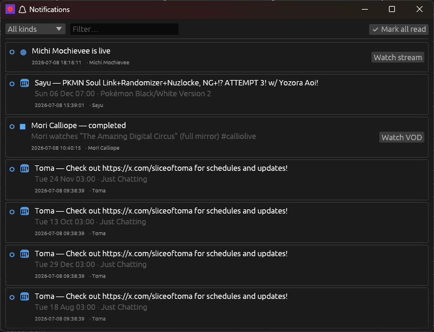
  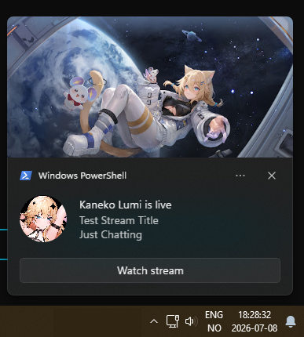
- **Custom app icon** (Settings → Interface → Display) — point "App icon" at
  any image (PNG/JPEG/WebP/GIF/ICO; square, ≥64px recommended) and it
  replaces the built-in purple record-dot icon everywhere it appears at
  runtime: window title bar, taskbar, tray, and the attribution icon on
  desktop toasts. Applies on Save with no restart. Empty = built-in icon; a
  missing/undecodable file falls back to the built-in icon with a logged
  warning. Two things it deliberately does *not* touch: the exe's icon in
  Explorer (there is no embedded resource icon), and the crash/freeze dialog
  icon, which stays its own setting (Settings → System → Diagnostics).
- **Do Not Disturb** (Settings → Notifications) — suppresses desktop toasts
  without touching anything else: the 🔔 feed, Background view, and recording
  itself all keep working exactly as normal. Two independent switches: a
  manual **Do Not Disturb** toggle for right now, and **Automatically during a
  daily time range** (e.g. `22:00`–`08:00` overnight, or `09:00`–`17:00` for
  work hours) that engages on its own every day — either one suppresses
  toasts on its own, so leaving the manual toggle off doesn't disable the
  schedule. A start later than the end spans midnight.
- **Background** tab — lists every recurring background job (Live poll,
  Schedule refresh, Ad-free/sub refresh, YouTube WebSub poll, Channel asset
  refresh, YouTube posts refresh, Scheduled recordings) with its interval and
  a live countdown to the next run; each has its own on/off toggle (turning
  off **Live poll** pauses all detection/recording). Below that, **Active**,
  **Queued**, and **Recent** — in that order — show the disk-gate status plus
  in-flight tasks, the chapters/gap-splice backlog (channel, position in
  line, drive, and when it was queued / how long it's been waiting), and
  just-finished tasks (head backfills, re-remuxes, asset fetches) with live
  progress and outcome. **Active**/**Recent** both have a **Rec ID** column —
  the recording id a task is working on, for cross-referencing a row against
  the app log's `rec_id=…` fields; blank for tasks not tied to one recording
  (bulk sweeps, asset/thumbnail fetches, an untracked follow-raid capture).
  Every section header is collapsible (▶/▼, click to toggle) so a long
  **Recent** history doesn't push **Active**/**Queued** off screen. The long `ffmpeg -c copy` passes among these (chapters/thumbnail
  embed, remux, gap-splice/head-backfill concat, split-capture merge) all
  survive an app restart instead of losing their progress — see
  [Chapters](#chapters-) for the details.

  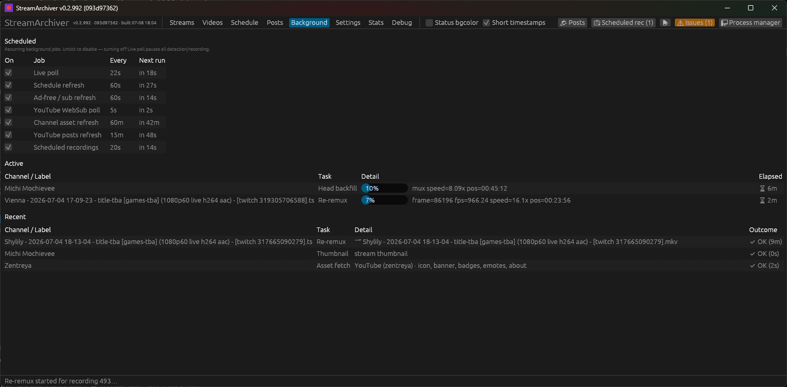
- **🖥 Process manager** (top-bar button shows the live count, e.g. `🖥 3`) —
  lists every spawned external process (streamlink / yt-dlp / ffmpeg) with
  its PID, tool, status, and uptime, plus which **drive** it's writing to and
  a live **I/O** column (`↓ read/s ↑ write/s`, hover for lifetime totals and
  which descendant processes are rolled in — e.g. yt-dlp's own ffmpeg mux)
  so you can spot which process is actually hammering a drive at a glance.
  Columns are resizable and remember their widths like every other table in
  the app; **Name** is always the short channel label, with the (often much
  longer) actual file name broken out into its own **Filename** column at
  the far right, so a long name never crowds out the other columns.
  Per-process **Stop** (graceful), **Kill** (force-terminate the tree),
  **Log**, and **Folder** actions — useful for diagnosing a stuck capture
  without leaving the app (**Log** is disabled, not a dead click into a
  random Explorer window, for the rare row with no log file at all). A
  post-processing pass re-attached after a restart (see
  [Chapters](#chapters-)) shows up here too (Type column names the specific
  pass — chapters embed / remux / thumbnail embed / gap splice /
  head-backfill join / split-capture merge — and the Status column tags it
  **⛓ re-attached**); Stop and Kill both just force-terminate it, since
  there's no supervisor-coordinated graceful stop for a raw ffmpeg pass. Its
  **Progress** column shows a coarse, size-based percentage sampled every
  ~15s (chapters/thumbnail embed only, where the untouched source file's own
  size is a reliable "expected total" — ffprobing the still-growing output's
  *duration* instead would be misleading: a matroska muxer can pre-declare
  the full final duration from the input's own metadata long before all the
  frames are actually flushed) or just bytes written for the other kinds.

  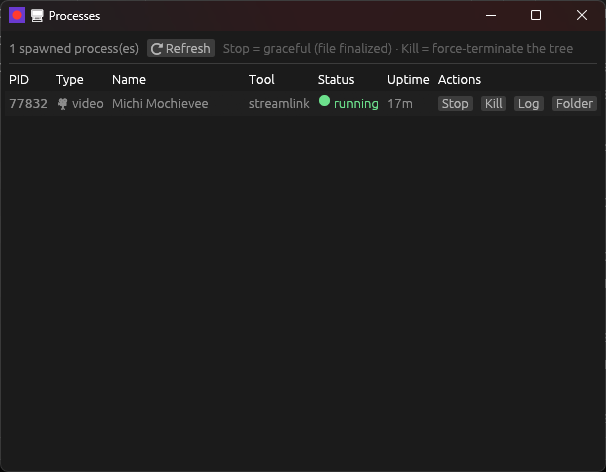

### Subscriber-only streams (🔒 CDN capture)

When a Twitch stream is **subscriber-only** and the connected account isn't
subscribed, the live edge is simply refused — streamlink dies within seconds on
`UNAUTHORIZED_ENTITLEMENTS`, and every retry dies identically. The broadcast is
still archivable, though: its own DVR segments stay readable on Twitch's CDN,
the same ones *Twitch VOD recovery* below reconstructs from.

So instead of retrying a capture that cannot succeed, the app opens a **CDN
capture session** for that broadcast:

- **Nothing spawns streamlink while it runs.** The refusal is a property of the
  broadcast, not a transient fault, so asking again every few minutes only
  produces log noise and doomed take rows. (A manual ▶ **Start** still goes
  through — you might have just subscribed.)
- **Each pass fetches only what's new.** Every few minutes the session pulls the
  span between what it already holds and the live edge into a numbered part
  file. Nothing already captured is re-read or rewritten.
- **The parts are joined when the broadcast ends**, into one file on the take
  that was refused — so a subscriber-only stream leaves a single normal-looking
  archive entry, not a trail of empty takes. Parts are deleted only after the
  joined file exists *and* its duration checks out; a failed join keeps
  everything exactly where it was.
- **It resumes.** Parts carry the broadcast id in their name, so a restart
  mid-stream adopts what's on disk — including a head an earlier take had
  already fetched — and continues from there rather than starting over. That
  id, not the take's name, is also what groups them: a broadcast accumulates
  parts under whichever take was current when each was written, and they play
  and join as one stream.
- **The end of the broadcast is confirmed, never assumed.** A single
  "not live" reading is not evidence: finalizing a refused take leaves the
  monitor at `ended` for about a minute — including the take that opened the
  session — and two pollers can disagree for a cycle. A session that believed
  one reading exited mid-stream, which let the retry cadence spawn another
  doomed capture, which queued its own **full head backfill** of the broadcast
  so far. So a non-live reading is re-asked every 20 s for three minutes before
  it counts.
- **A broadcast already refused is not attempted again**, whether or not a
  session happens to be running at that moment — and the check *revives* the
  session on the original take rather than only declining, so a restart
  mid-broadcast picks archiving back up on the row it started on instead of
  leaving the stream uncaptured.

- **It reads as a capture, because it is one.** A CDN session runs no capture
  tool, so the monitor is absent from every "currently recording" list and the
  refused takes below it are all `failed`. Left alone, that renders as a
  channel that is merely *live* while gigabytes land on disk. Instead the
  instance row carries a **🔒 subs** marker and a **⭳ CDN** badge while a
  session is running, the broadcast's stream row shows the recording state, and
  the anchor take wears ⭳ CDN too — so "which stream is the subscriber-only
  one" has an answer on the row you are looking at.
- **You can watch what has been captured, before it is joined.** The parts are
  complete files, so ⏵ **Play local recording** on a refused take opens them as
  a playlist in order rather than being greyed out. (▶ **Open file** stays
  disabled: there genuinely is no single file until the join.)

**What this costs you.** The archive is assembled behind the live edge by
definition: it lags by up to one refresh interval, and the last minutes before
the stream ends may be missing (the CDN can't serve what hasn't been segmented
yet). The 🔒 badge on the instance and take rows spells out both, including how
far behind the copy currently is. Subscribing with the connected account makes
the stream capture normally instead.

> **Where this came from.** Before this existed the same thing happened by
> accident: each doomed take queued a head backfill, and each backfill
> re-fetched the broadcast **from its start**. One two-hour subscriber-only
> stream produced 22 takes and re-downloaded 11.8 GB per cycle. It worked — at
> roughly quadratic cost, and only because a capture kept failing on a timer.

#### YouTube members-only streams

A **members-only** YouTube stream is gated the same way, but there is **no CDN
fallback** — nothing to archive it from. It also hides itself far better than
Twitch does: to an unauthenticated yt-dlp a members-only stream isn't merely
forbidden, it is *invisible*, and the tool reports `The channel is not currently
live` — indistinguishable from an ordinary "the stream ended between the poll
and the spawn" race.

That `/streams`-tab check costs about a megabyte, so it is throttled to once
every few minutes per channel. Crucially, a poll that **skips** the check
reports *"didn't look"*, not *"offline"* — it serves the last real answer.
Before that, a members-only channel flapped: live on the one poll that paid for
a check, offline on every poll in between, which churned the row's state and
(on Twitch) tore down and rebuilt the CDN capture session. The same holds for a
failed fetch. Only a page that was actually read can say a stream has ended, so
the end still lands — within one throttle window.

The app's own detection knows better (a members-only live stream is badged as
such on the channel's `/streams` tab), so that verdict is recorded on the
instance and consulted when a capture fails. A failure on a broadcast we know is
members-only is treated as a **gated broadcast, not a fault**: it files the 🔒
alert and then asks again only **once an hour** — long enough to notice the
stream being opened to the public, rare enough that it stops producing an empty
take every few minutes for the whole broadcast. Twitch's flat ten-minute cadence
is deliberately *not* used here, because that interval exists to refresh a CDN
backfill that is genuinely archiving footage; with no fallback there is nothing
to gain by asking sooner.

Configuring cookies from a browser signed into an account with that membership
(*Authentication*, below) makes the stream capture normally instead.

Either way — Twitch or YouTube — a refused take shows **🔒 not entitled** in the
Streams grid, not a red capture error. The take genuinely captured nothing, but
it did so because the broadcast wasn't ours, and that is a state of the
broadcast rather than a fault in the capture. The 🔒 alert is the only one filed
for it; the generic "Capture failed" error is deliberately suppressed so the two
don't contradict each other.

That suppression is per **take**, driven by a flag on the take itself (schema
v92), not by the 🔒 alert. The alert is keyed by the *broadcast* — one Warnings
row however many doomed attempts a gated stream takes, rather than a wall of
them — so it can only name one take, and every attempt after the first used to
look like an ordinary failure: a red error each, and a stream row rolled up as
"⛔ capture error" with a single 🔒 take hidden among them. Upgrading to v92
repairs existing takes: every 0-byte failed take of a broadcast already known
gated is marked as such, and the "Capture failed" alerts filed against them on
that false premise are dropped.

### Twitch VOD recovery (deleted & muted VODs)

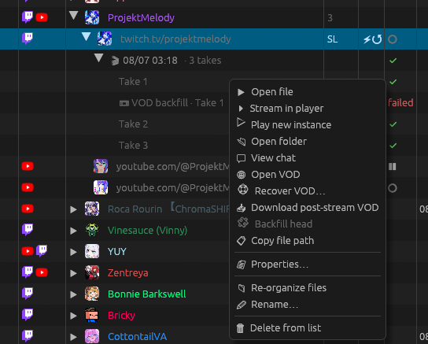

Twitch DMCA-**mutes** VODs (silencing flagged segments) and, on deletion,
**unpublishes** them — but the underlying `.ts`/`.mp4` segments linger on Twitch's
CDN for roughly **60 days**. StreamArchiver can reconstruct a muted or deleted VOD
from those surviving segments and mux them into an MKV, entirely from metadata (no
Twitch login required).

**How it finds a VOD.** A VOD's playlist URL is derivable from the streamer login,
the **broadcast/stream id** (the number in a `/streams/<id>` tracker URL — *not* the
`/videos/<id>` archive id), and the stream's UTC start second:
`sha1("{login}_{broadcast}_{start}")[:20]` names its CDN folder, which the app probes
across a self-updating list of CDN hosts (a symmetric ±window absorbs start-time
imprecision). For a VOD that's still published (merely muted), the app takes a more
robust shortcut: it asks Twitch's public API for the VOD's *exact* CDN folder, so it
never depends on the host list.

**Un-muting & salvage.** A muted VOD lists its flagged segments under a dead
`-unmuted` pointer; the app rewrites each to the segment that actually survives —
preferring the pre-mute **original** (a true un-mute, when Twitch hasn't purged it)
and otherwise the silenced `-muted` copy (silence over a hole). Deleted VODs are
salvaged segment-by-segment, dropping any that are gone, so a partially-expired VOD
still yields everything that remains.

**Recording badges.** In the recording-history tree, a Twitch take shows its VOD
state: **⚠ no VOD** (never published), **✂ muted** (the published VOD has DMCA-muted
content — your local recording is the authoritative copy). Once a recovery has run,
it gets its **own sibling row** — **🛟 VOD recovery** — right under the take (same
tree depth as a take, expand the stream to see it even for a single take), with a
live progress bar while running and a final status (**recovered** / **partial**
(some segments were gone) / **gone** (past the ~60-day window) / **failed**)
afterwards.

**Recovering one:**

- **From a tracked recording** — right-click a Twitch take (especially one badged
  **⚠ no VOD** or **✂ muted**) → **🛟 Recover VOD…**. The dialog is pre-filled from
  the recording's stored broadcast id + go-live time, and the recovered MKV is
  attached back onto that recording (right-click the **🛟 VOD recovery** row →
  **Open recovered file**, or **Retry recovery** if it failed or the segments are
  gone).
- **Manually / any VOD** — the **🛟 Recover Twitch VOD…** button on the **Videos**
  tab opens the same dialog blank. Enter the streamer login + broadcast id + UTC
  start, or **paste a URL**: a `twitch.tv/videos/<id>` link resolves everything via
  Twitch's API in one click, or a TwitchTracker / StreamsCharts / SullyGnome
  `/streams/<id>` link is parsed (with a best-effort start-time scrape). A recovery
  that isn't tied to a tracked recording lands in the **Videos** list.
- **Probe first** — the dialog's **🔎 Probe** button checks availability before
  downloading, reporting the host, the resolved true start, the available qualities,
  and a `present / total · un-muted · missing` segment count (warning when the
  recovery would be partial).

**Automatic & bulk recovery** (Settings → *Twitch VOD recovery*):

- **Auto-recover muted / deleted VODs** — when the background VOD checker finds a
  tracked stream's VOD muted or unpublished, recover it automatically (off by
  default — it's network-heavy).
- **Recover deleted/muted VODs** — a one-shot bulk sweep of every eligible recording
  inside the ~60-day window.
- **Default quality**, **max concurrent probes**, and **extra CDN hosts** are
  configurable.

**Keeping the CDN host list current.** Twitch rotates its CDN distributions, so a
fixed host list goes stale. The list is **self-updating**: it seeds from a built-in
set, learns the serving host from every successful recovery, and a **Refresh CDN
hosts** button harvests the currently-active hosts from your own published VODs via
Twitch's API. (For the common muted case the host list is moot anyway — the API
returns the exact host.)

> Recovery is Twitch-only and needs a broadcast/stream id, so it's offered on takes
> the app detected with an id (Helix/EventSub) or via manual entry. Twitch usually
> purges the pre-mute **original** audio quickly, so muted recoveries typically yield
> the silenced copy — a complete, playable file with silence over the muted stretch —
> rather than restored audio; the `un-muted` count in the probe tells you which you
> got. The public-API lookups use Twitch's read-only web client id (no account).
> To get original audio *despite* a mute, the best defenses are the ones that run
> **before** the mute lands: the immediate post-stream [VOD
> download](#post-stream-vod-download-archive-the-published-vod) (races the mute pass)
> and the mid-stream [head backfill](#streams-live-monitoring) for a late-joined
> capture.

### Trigger words (force-record on title/game match) ⚡

Streams titled **"unarchived"** or **"karaoke"** usually mean there will be **no
VOD** (or a heavily muted one) — the live capture is the only copy you'll ever
get. **Trigger rules** make sure those get recorded even on channels you don't
auto-record: when a monitored channel is live and its **title or game/category**
matches a rule, recording starts **even with Auto off**. The check runs at
go-live *and on every poll*, so a streamer flipping the title to "unarchived
karaoke" 20 minutes in still triggers on the next poll (Auto-off monitors are
polled regardless).

**Rule anatomy.** Each rule is structured, not just a word:

- **Label** — an optional name ("Deletion-flagged title", "Unarchived
  karaoke"). Labeled rules lead with it everywhere a match is reported —
  notifications, the ⚡ badge tooltip — as `Label (title ~ /pattern/)`, so a
  long regex isn't the only identification.
- **📝 Note** — optional free text that stays with the rule in the editor:
  caveats, provenance, warnings ("dangerously broad — watch for false
  positives"). Never used for matching and never shown in notifications.
- **Field** — match against the *Title*, the *Game* (category), or *Any field*.
- **Match** — *Contains* (case-insensitive substring; phrases like `no vod`
  match as a whole) or *Regex* (case-insensitive by default — start the pattern
  with `(?-i)` to opt out; an invalid regex is shown in red and never matches).
- **From start** — a per-rule override of the instance's *capture from start*
  flag for the recording the rule starts: *Inherit* keeps the instance setting,
  *On* forces the DVR head backfill / live-from-start path (usually what you
  want for unarchived streams), *Off* forces it off.
- **Lead** — backfill this many seconds from the Twitch live-VOD CDN from
  *before* the match was detected (reuses the [head backfill](#streams-live-monitoring)
  mechanism, so **Twitch only**), in case the title/game update landed a
  little late relative to when the segment actually started. `0` = off.
- **Only while matching** — instead of recording until the stream itself
  ends, stop once this rule no longer matches — e.g. archiving just one game
  segment of a multi-day event like GamesDoneQuick. When on, an **End delay**
  field appears: keep recording this many seconds after the unmatch before
  actually stopping, a grace period for a title/game that flips back (or
  updated a little early). Checked on the same ~60s cycle that logs title/game
  changes during a recording, so small End delay values effectively round up
  to the next check. Survives an app restart (a re-attached recording keeps
  enforcing it).
- **Deletion** — force the [deletion method](#automatic-deletion) for every
  automatic disposal of a recording *this rule* started. Trigger words usually
  flag content that's easy to lose (unarchived streams, deletion-flagged
  titles), so it can warrant stricter handling than the channel/instance is
  set to — and it beats the channel/instance method (and the all-triggers
  default below it) whenever it applies, precisely so it can't be
  quietly defeated by a laxer setting elsewhere. *Inherit* = no special
  treatment. Frozen into the take at the moment it starts, so a later edit to
  the rule never changes how an already-started take's files get disposed of.
- **🕓 Active period** — optional *From*/*Until* bounds (local time,
  `2026-01-05 18:00` or just `2026-01-05` for midnight; *Until* is exclusive)
  outside which the rule matches nothing: the event-scoped rule. "Record this
  game, but **only during AGDQ/SGDQ week**" is one rule with the event's dates
  — outside the window it sits parked without being deleted or manually
  toggled, ready to be re-dated for the next event. Either side can be left
  empty (no bound on that side; both empty = always active, which is every
  pre-existing rule). The editor shows 🕓💤 while a rule is outside its
  window, and invalid text in the field turns red and changes nothing — a typo
  can never silently widen a window. Two interactions worth knowing: the
  [Schedule dry-run preview](#schedule-%EF%B8%8F) evaluates each event at the
  event's *own start time*, so an AGDQ-week rule already previews ⚡ on next
  week's AGDQ events before its window opens; and for a rule with *Only while
  matching*, the window closing counts as an unmatch — a recording it started
  ends (after the End delay grace) when the event window does. Works on
  blacklist rules too: e.g. suppress a specific game's automatic recordings
  only during a rerun week.
- An **enabled** checkbox per rule, so seasonal rules can be kept but parked.

There's also one **all-triggers default** (Settings → Automation → Trigger
words, below the rule list): applies to any trigger-started take whose own
rule doesn't set a Deletion override, still beating the channel/instance
method. *Inherit* there means trigger-started takes get no special treatment
at all — the individual rules are the only source of "be extra careful with
this one".

**Three-level control.** Rules resolve through the same inheritance chain as the
VOD options — **global < per-channel < per-instance** — but as a *list*, each
level picks a mode: **Inherit** (use the level above unchanged), **Extend**
(inherited rules *plus* this level's own), **Replace** (only this level's
rules), or **Off** (no triggers here at all, inherited ones included). Global
rules live in **Settings → Automation → Trigger words**; the channel and
instance overrides in their **Properties** windows ("Trigger words" section).

**What you see when one fires.** A **⚡ Trigger matched** notification + rich
toast (which rule matched, the matching title/game text, and what it did); the
recording and its takes carry a **⚡ badge** (hover shows the match, e.g.
`title ~ "karaoke" · capture-from-start forced on`, or
`title ~ "boss rush" · lead 30s · stops when unmatched (+15s)`, or
`title ~ "unarchived" · deletion forced to Trash folder`); and the
take's Properties window gets a **Trigger** row. While the recording is
running, the ⚡ badge also bubbles up to the instance row and the (collapsed)
channel row — same for the 💬 chat-download badge — so a trigger-started
recording is visible without expanding the tree; once it ends, the badges stay
on the stream/take history rows only. With Auto *on*, rules still
run — the per-rule *From start*/*Lead*/*Only while matching* overrides apply
to the automatic recording and the match is recorded the same way.

> Platform notes: Twitch (Helix) and Kick polls carry title+category natively.
> Twitch **EventSub** pushes don't include a title, so a matching-capable
> follow-up check fetches it automatically. YouTube's *scrape* detection carries
> the title; the quota-based *Data API* method does not — use scrape for
> channels you want triggers on.

### Blacklist triggers (prevent recording on title/game match) 🚫

The exact inverse of trigger words: while the live title or game matches a
blacklist rule, **automatic recording is suppressed** — for streams you never
want archived, like "rerun", "24/7", a specific game, or sponsored segments.
Rules use the same shape (field, Contains/Regex pattern, per-rule enable, the
optional 🕓 active period) and the same **global < per-channel < per-instance**
Inherit/Extend/Replace/Off resolution; global rules live in **Settings →
Automation → Blacklist triggers**, overrides in the Properties windows
("Blacklist triggers" section). Semantics:

- A blacklist match vetoes **both** Auto-record starts and trigger-word
  starts — an explicit "don't record this" beats "record this".
- A **manual ▶ Start always records** — the blacklist only gates automation.
- Checked at go-live and on every poll. A recording that is **already
  running** is *not* stopped by a mid-stream match (the veto gates starts
  only) — but with the stream still matching, the take won't auto-restart
  after a stop.
- Detection/metadata keep running: the channel still shows **live** with
  title/game/thumbnail in the Streams grid, it's just not recorded. Unlike
  plain Auto-off (above), a blacklist veto does **not** get its own
  **👁 not recorded** take row — an explicit "never archive this" is treated
  as "don't keep a history entry either", not just "don't capture footage".
  For the same reason it gets no chat-only sidecar either (see *Chat without
  a recording*), and neither does a broadcast held back by a **Stop** hold.
- When a start is vetoed you get a one-per-broadcast **🚫 Blacklist blocked**
  notification (which rule matched and the matching text).
- Push signals without a title (Twitch EventSub) fetch the metadata via a
  follow-up check before starting whenever blacklist rules exist. If the
  metadata can't be fetched at all, the recording proceeds (fail-open — an
  archiver errs on capturing).

### Scheduled recordings (force-record at a time or on a weekly repeat) 📅

Trigger words fire on *content* (title/game); **scheduled recordings** fire on
*time* — a specific date+time (**Once**) or a **Weekly** repeat on chosen
days, at a chosen time. Like a trigger match, a due schedule **force-starts
the recording even with Auto off** (and works on a **Disabled**-detection
instance, which has no automatic liveness check at all) — for channels you
know the schedule of but don't want kept on Auto.

- **Manual scheduling**: the **📅 Scheduled rec (n)** toolbar button opens a
  management window listing every rule (channel, instance, recurrence, next
  run, duration) with **Edit / Delete / + Add new** actions.
- **Right-click scheduling**: in the Schedule view, right-click any calendar
  entry → **📅 Schedule recording…** to prefill a one-off rule from that
  entry's channel, start time, and (when known) duration.
- **Duration**: optional — leave it off to record until the stream ends
  naturally, or set a fixed number of minutes to auto-stop.
- **Weekly rules** support an optional **until** date to stop the recurrence,
  and every day/time is evaluated in your local timezone.
- The Schedule view's month grid shows a small **⏺ rec** badge beside the day
  number on any day with a scheduled recording (hover for details); the
  Streams grid has a matching **Scheduled rec** column (hidden by default —
  enable it from the column header).
- A background job checks for due rules every ~20s; it can be paused from the
  Background view like any other periodic job ("Scheduled recordings").

### Post-stream VOD download (archive the published VOD)

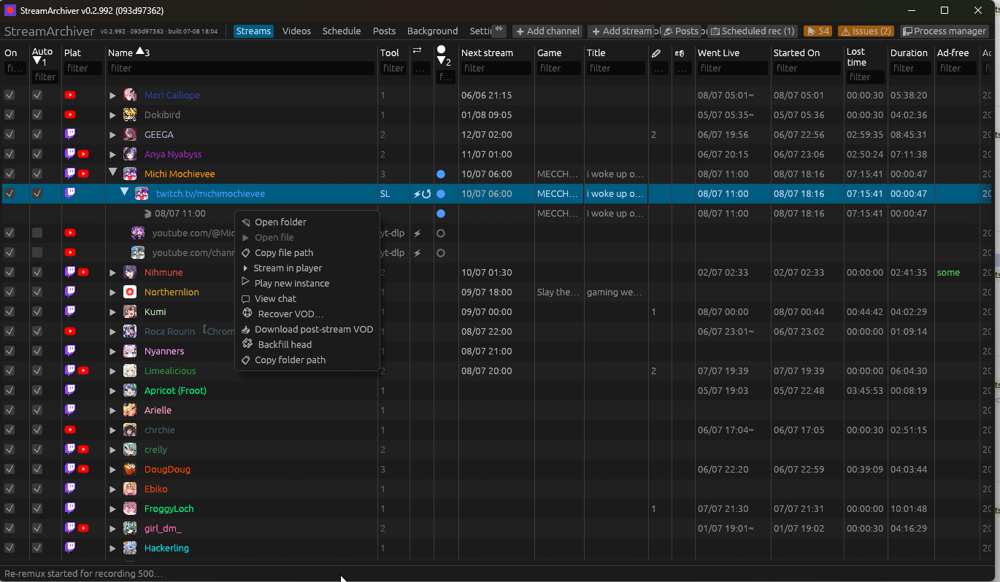

After a stream ends the platform publishes its own **post-processed VOD** — Twitch's
clean transcode, YouTube's finished recording, Kick's VOD — often higher quality /
gap-free vs. the real-time capture. StreamArchiver can **download that VOD after the
stream ends** to sit *alongside* the live recording, and — as a separate option —
**replace the live recording with the VOD, but only if the download succeeded** (so a
failed or unavailable VOD never costs you the footage you already captured).

**Three-level control.** Both options resolve through an inheritance chain —
**global default < per-channel < per-instance** — so you can turn archiving on
everywhere and off for one noisy channel, or on for a single instance. Each level is a
tri-state **Inherit / On / Off**:

- **Global** (Settings → *Post-stream VOD download*): two checkboxes — *Download the
  published VOD after a stream ends*, and *Replace the live recording when the download
  succeeds*.
- **Per-channel** (right-click a channel → **Properties/rename**): *Download VOD after
  end* and *Replace with VOD* dropdowns (Inherit follows global).
- **Per-instance** (edit an instance): the same two dropdowns (Inherit follows the
  channel, then global).

**How it works.** When a recording ends and the platform's VOD becomes available, a
detached **yt-dlp** download is queued (it shows in the Videos tab with a progress bar,
survives an app restart, and is stoppable) and lands next to the live file as
`{stem}.vod.mkv`. On Twitch the VOD is matched to the recording by its **broadcast
(stream) id** — Helix archive videos carry the originating stream id, so back-to-back
streams can never shadow each other's VODs; a publish-time window is only used for
old recordings that never learned their stream id. A completed download must also pass
a **sanity check** (ffprobe-readable, and at least 90% of the expected duration) before
it's trusted as the archive — a failed check marks the download failed instead of
silently archiving the wrong or truncated file. If **Replace** is on and the download succeeds (and, for Twitch, the
VOD isn't DMCA-muted), the live capture is swapped out: the VOD is renamed to the live
file's name — so the recording's chat/thumbnail sidecars stay matched — and the old file
is deleted only *after* the VOD is confirmed good.

**Racing the DMCA mute (Twitch).** Twitch publishes the VOD within **seconds** of
stream end, but applies DMCA mutes **minutes later** — and the mute pass also scrubs
the original segments from the CDN, so speed decides whether you get original audio.
The VOD check therefore polls **immediately** at stream end, then every 25 s for the
first ~10 minutes, then backs off to 5-minute polls (~1 h window) — a clean VOD's
archive download typically starts within seconds of publication. After a clean VOD is
found, a **mute watcher** keeps re-checking it for another ~2 hours:

- Mute lands **after** your download completed → **you won the race**: the archive
  keeps its state and the **📼 VOD backfill** row shows **archived (pre-mute)** (or
  **replaced (pre-mute)**) — your copy has the original audio even though the online
  VOD is now silenced.
- Mute lands **before/during** the download → the normal muted flow below runs (a
  mid-mute download may already contain silenced segments, so it's flagged, never
  trusted as clean).

**Muted VODs are handled specially.** A DMCA-muted Twitch VOD is silenced, so it's
**never** downloaded as-is and **never** replaces the live recording (which has the full
audio). Instead the [CDN recovery](#twitch-vod-recovery-deleted--muted-vods) runs to
un-mute what it can, a desktop notification fires, and the take is listed in the **⚠
Issues** panel under *DMCA-muted VODs* with buttons to **Open live recording**, **Open
recovered VOD**, **Re-run recovery**, or **Keep live / dismiss**.

**Download integrity.** A "completed" archive is only trusted after it proves itself:
tool working/side files (logs, `.part`, `.ytdl`) can never be picked up as the output,
a nonzero exit code must pass an `ffprobe` check, and before the file is archived (or
allowed to replace anything) its probed duration must be plausible (≥ 90 % of the live
capture / broadcast span). Anything failing these checks lands the **📼 VOD backfill**
row in a **failed** state, retryable — the live recording is never touched. Download
filenames are also length-capped so the tool's temp paths stay under Windows'
260-character limit (yt-dlp/streamlink are Python and can't use long paths, even when
the app itself can). On every start a **reconcile pass** repairs interrupted state:
archive downloads that finished while the app was down get filed properly, and any
`archived` row whose file turns out bogus is demoted to `muted`/`failed` so it
surfaces in Issues instead of masquerading as done.

**Its own row.** A published-VOD download gets a **sibling row** in the recording
tree — **📼 VOD backfill** — right under the take it belongs to (same tree depth as a
take; expand the stream to see it even when there's only one take), showing a live
progress bar while downloading and a final status once done: **archived** (downloaded
alongside), **replaced**, **archived (pre-mute)** / **replaced (pre-mute)**, **muted**,
or **failed**. Right-click a take for **📥 Download post-stream VOD** (on-demand /
retry); once a job exists, right-click the **📼 VOD backfill** row itself for **Open
downloaded VOD** or **Retry download**.

> **Notes.** This re-downloads the whole stream, so it doubles storage/bandwidth — hence
> it's opt-in and granular. Twitch is the most reliable path (instant VOD publication +
> the fast poller). YouTube/Kick VOD readiness after a stream is less deterministic —
> the download retries for up to ~1 hour and, if the VOD still isn't available, marks
> the archive `failed` without ever touching the live recording (use **📥 Download VOD
> now** to retry later).

### Clips 🎞

A catalogue of every clip made from your monitored channels, and any clip URL
found in archived chat. Reached from the **🎞 Clips** tab, and from the
**🎞 Clips** row that appears under an expanded broadcast in Streams (which
opens the view filtered to that one broadcast).

**Why it's a catalogue first and a downloader second.** Clips outlive the VOD
they were cut from and can vanish at any time — the channel gets banned, the
clipper deletes it, Twitch prunes it. Knowing a clip *existed*, and holding the
keys that could rebuild it, is worth keeping even where the media was never
downloaded.

**The 🔑 column is the important one.** It says whether a clip still carries its
*recovery keys* — the parent VOD's id and the offset into it. With them, a clip
that later disappears can be cut back out of the broadcast (from Twitch's CDN,
or straight out of your own local recording if you have one). Without them, only
the clip's own copy could ever be fetched, and if that's gone it's gone.

Those keys are **perishable**. Twitch reports them only while the parent VOD
still exists, then drops them permanently. Measured against the live API:

| Clip age | Still reports its recovery keys |
|---|---|
| ≤ 14 days | 100% |
| 30 days | 68% |
| 90 days | 19% |
| 1 year | 5% |

That's the whole reason clips are swept **twice shortly after a broadcast ends**
(at +2h and +24h, configurable) rather than only on a leisurely daily pass. A
clip indexed inside that window keeps its keys forever; one indexed later never
gets them. The daily sweep still runs — it catches clips someone made from an
old VOD today — but those arrive keyless, and the catalogue says so honestly.

**Indexing is on by default; downloading is not.** Metadata for the whole
archive costs tens of megabytes. The media does not: a busy channel accumulates
7,500–12,000 clips, roughly 200 GB. So downloading is gated per channel and off
until you turn it on, and the catalogue is complete either way.

**The ~1000 cap.** Twitch returns at most ~1000 clips per query however far you
paginate, and it orders by view count *within* the queried window — so a
truncated window silently drops the **least-viewed** clips, which for an archive
is exactly backwards. The sweep detects truncation and recursively bisects the
date range until each window fits. Where even an hour-wide window still caps,
that's logged as a warning naming what couldn't be reached, rather than passed
over in silence.

**Rebuilding a clip that's gone.** When a sweep notices a clip has vanished
upstream it tries once, automatically, to rebuild it — then leaves it to the
row's right-click menu. There are four routes, tried in the order that gives the
best result:

| Route | Accuracy | Lifetime |
|---|---|---|
| **Cut from the parent VOD's CDN segments** | frame-exact — `vod_offset` *is* the VOD's own clock, no conversion | dies with the VOD (~60 days) |
| **Cut from your own recording** | approximate (see below) | free, instant, permanent, and higher quality than the clip ever was |
| **The legacy standalone clip object** | exact if it works | usually 403s on modern clips; the only hope for old keyless ones |
| **Bracket the clip's creation time** | a guess, labelled as one | last resort when there are no keys at all |

An exact local cut wins outright. An approximate one only wins once the VOD has
aged out and there's nothing better.

**Why a local cut is approximate.** Your recording isn't on the same clock as
the VOD: you joined after the broadcast started, head-backfill may have put the
missed intro back, you may have captured ad filler the VOD omits, and you may be
missing segments that were never spliced back in. All four are corrected for,
but a cut is only marked **exact** when every term is known and safe — a real
go-live time, no ad filler, no unspliced gap before the point. Otherwise it's
marked **approx** and padded by 30 seconds instead of 3. A wide, obviously-rough
clip is a useful archive; a narrow, confidently-wrong one is worse than nothing,
so the row always says which you got.

**Clips found in chat.** Every chat log the app scans is also swept for clip
links — `clips.twitch.tv/…`, `twitch.tv/<channel>/clip/…` and
`youtube.com/clip/…`. This costs nothing (the lines are already being read) and
finds two things the Helix sweep structurally cannot: YouTube clips, and Twitch
clips of channels you don't monitor. Those are catalogued without a local home
and are never downloaded, but you'll know they existed. A clip spammed twenty
times is one row, not twenty.

> [!NOTE]
> YouTube clips are catalogued but can't be enumerated — YouTube has no API to
> list a video's or a channel's clips, so they're only found via URLs in archived
> chat. A YouTube clip is also just an offset range into its parent video rather
> than a file of its own, so if the parent goes, the clip goes; there's no CDN
> fallback the way there is for Twitch.

### Missed-stream backfill

Retroactively grabs whatever's still recoverable about a stream this app
missed, before the platform prunes/removes it — opt-in, off by default
(Settings → Automation → *Twitch VOD recovery* → **Auto-backfill missed
streams**).

**Is this the same as "📥 Download post-stream VOD"?** No — but they're now
meant to work together. "Download post-stream VOD" only re-downloads a VOD
that's *still published* for a recording that's *already tracked* by a take.
A **👁 "seen live, Auto was off"** row (see *Enabled vs. Auto* above) has no
file, so before this feature it couldn't hang a download off of anywhere —
clicking "Download post-stream VOD" (or "🛟 Recover VOD…") on one silently
did nothing. Both buttons now work correctly on a 👁 row too, computing an
output folder from the channel's own settings instead of an existing
filename. This feature layers automation on top of that fix:

- **On session close** — the moment a 👁 row's broadcast ends, automatically
  try the platform's published VOD first, then (Twitch only) reconstruct it
  from CDN segments if nothing was ever published — the same fallback order
  as the manual **⏬ Backfill missed VOD** button (stream/take row context
  menu), just automatic.
- **Periodic discovery** — separately, once a day per channel, scan the
  platform's own VOD/video listing for broadcasts this app has **no record
  of at all** (it wasn't running or monitoring at the time). Anything found
  is filed as an ordinary 👁 row (title/start/end time, backdated) and
  immediately gets the same backfill attempt as above. Twitch and YouTube
  correlate by the platform's own broadcast/video id (exact); Kick and the
  generic/yt-dlp-listed platforms (NRK, Nebula) correlate by a time-window
  overlap against known takes instead, since their listing id isn't in the
  same space as the stored stream id — best-effort there. Run it on demand
  for one channel via **🔎 Scan for missed streams** (stream row context
  menu), independent of the setting.

**Broadcasts that weren't actually missed are excluded.** A 👁 row created by
*Simulcast dedup* means a sibling instance recorded that same broadcast — so
both paths above skip it, rather than downloading the exact duplicate the dedup
just avoided. Discovery applies the same rule to a VOD it finds in a listing:
if another instance of that channel has a real capture covering that window
*and* dedup is on for this one, the row is filed with the reason instead of
queued for download. With dedup off it behaves as before, because then a
sibling's copy is a separate archive and a failed capture here still deserves
its recovery.

> **Notes.** Twitch is the only platform with a CDN-recovery fallback — the
> segment-reconstruction trick only works within Twitch's own storage
> retention window (see *Twitch VOD recovery* above). YouTube/Kick backfill
> is "published VOD or nothing" — YouTube in particular rarely prunes stream
> VODs, so discovery there mostly just catches app-downtime gaps rather than
> a race against deletion.

**Just want to watch it, not archive it?** A past take/stream row (recorded
or not) also gets **▷ Play VOD** and **🌐 Open VOD webpage** — both resolve
the VOD URL the same way (published VOD, or a Twitch CDN-reconstructed one),
then either open it in the configured media player or your browser. Neither
downloads or archives anything; they're the "just watch it" counterpart to
**⏬ Backfill missed VOD**. Both no-op quietly if nothing resolves (e.g. the
VOD genuinely isn't recoverable). Disabled while the take is still actively
recording — there's a live edge to watch instead at that point (▷ Play
stream (live edge), above).

### Audio & subtitle tracks

Both the Streams add/edit form (live recordings) and the Videos download form
(one-shot VOD/video downloads) have **Audio tracks** and **Subtitle tracks**
fields, but the two forms handle them differently — live recordings land in
per-channel subdirs where a sidecar file is unambiguous; Video downloads all
land in **one flat folder**, where a lingering `clip.en.vtt` next to the file
is just clutter, so that path embeds instead.

**Streams (live recordings):**
- **Audio tracks** — which audio tracks to capture, via streamlink's
  `--hls-audio-select`. Empty = the tool's default (one track); **`all`** (or
  `*`) = every audio track; or a comma-separated list of language codes/names
  (e.g. `en,de`). Honored by **streamlink**; the **ffmpeg** tool keeps all
  video+audio tracks via its capture mapping (it can't select a *subset*), and
  **yt-dlp** ignores it (it captures its default audio).
- **Subtitle tracks** — which subtitles to capture, via yt-dlp's `--sub-langs`,
  written as **sidecar files** next to the recording (e.g. `clip.en.vtt`) — a
  lossless, replayable archive, **not** embedded into the container. Empty =
  none; **`all`** (or `*`) = every subtitle; or a comma-separated list of
  language codes. Honored by **yt-dlp** only — **streamlink can't mux
  subtitles**. Best-effort for live streams (live subtitle availability varies by
  platform).

The **MKV remux** on clean stop preserves *all* captured video/audio/subtitle
tracks (not just one per type), and subtitle sidecars are moved along if the file
is later renamed (see *Filename media info*), so the tracks you select are the
tracks you keep.

**Videos (on-demand downloads):**
- **Audio tracks** — same field meaning, but for **yt-dlp** it now actually
  does something: a language (list) synthesizes a `-f` format selector picking
  those audio-only formats as separate muxed streams (e.g. `en,de` →
  `bv*+ba[language^=en]+ba[language^=de] --audio-multistreams`), so a YouTube
  video's dub tracks or descriptive audio come along instead of whatever single
  track yt-dlp would've defaulted to. Language codes match by *prefix*, so
  plain `en` also matches `en-US`/`en-GB`. The synthesized selector always ends
  in a `/b` fallback, so sites without separate audio streams still download:
  muxed-only video (NRK) takes its best combined rendition and audio-only pages
  (NRK radio/podcasts) take their best audio, instead of dying with
  `Requested format is not available`. Ignored when **Quality** is set to a
  custom yt-dlp format string — that always wins outright rather than trying to
  merge two `-f` selectors. Streamlink/ffmpeg behave the same as above.
- **Subtitle tracks** — yt-dlp still fetches them the same way, but they're
  then **embedded into the file itself and the sidecar deleted**, with a
  `language` tag per stream parsed from the filename. No-op when nothing was
  fetched.

**New** instances/videos default both fields to **`all`** (maximum archival).
**Existing** ones keep their previous behavior (empty) until you edit them.
Power-user **Extra args** are appended after these, so they can still override.

### Title & category change log

While a stream records, StreamArchiver polls its metadata and logs every **title**,
**game/category**, and **tag** change for that take — so the archive captures
*what* the broadcast was, not just the footage. (The normal scheduler pauses
polling during a recording, so this runs as a dedicated per-recording poller.)

- **Game** and **Title** columns show the *current* (latest-logged) value of the
  most recent recording, updating live as the stream changes. Both are narrow and
  truncated — **hover** to read the full value.
- A **Tags** column shows the live stream's tag list (Twitch; Kick when set —
  YouTube has no tag list). Tag changes are archived like title/category ones:
  they appear in the per-take Changes log and the all-time 📝 history as
  `Tags: old → new` rows.
- A **Changes** column counts only *actual* changes for the latest take — the
  value each field *started* with is the initial state, not a change, so it isn't
  counted or listed (it still shows as the `old` side of the first real change).
  **Hover** a stream/take row's count to see the list inline, or **double-click**
  it to open a scrollable, copyable log window; each entry shows the offset from
  the take's start, the kind, and `old → new`.
- **Sources, per platform:**
  - **Twitch** — Helix (`Get Streams`); needs Twitch credentials (Settings), the
    same app/user token as live detection. Title + the game/category.
  - **Kick** — the public v2 channel JSON (no credentials). Title + category.
  - **YouTube** — scraped from the `/live` page (no credentials). Title, plus the
    broad *content category* (e.g. “Gaming”) — YouTube has no public per-stream
    game field, so the category is the closest stable signal.
  - Generic URLs have no metadata source, so they log nothing.
- Polling is coarse (about once a minute) since changes are infrequent, so the cost
  is low — one request per active recording. (Twitch and Kick hit small JSON
  endpoints; the YouTube path fetches the full `/live` watch page each poll.)

The categories played can also be folded into the filename — see `{games}` below.

**All-time title/category/tags history, independent of recording.** The change
log above only exists for a take that's actually being recorded. Separately,
StreamArchiver keeps a **continuous** title/category/tags history per
instance — fed by the normal live poll whenever a channel is live but not
recording (Auto off, or Enabled-but-idle) and by the same in-recording poller
while it is — so a channel's full history survives regardless of Auto/Enabled
state. Open it from a stream row's right-click menu → **📝
Title/category/tags history**, or from the same button in the instance/
channel Properties windows (**Monitor (instance)** section for one instance;
**Channel** section for every instance the channel has — opens one window
per instance when there's more than one, each titled with its platform/URL
so simultaneous windows for the same channel stay distinguishable): a
scrollable, copyable, newest-first log with real dates/times (not
take-relative offsets). Unlike title/category (which clear to blank while a
channel is offline, the same way the live Streams grid does), **tags persist
through offline** as "the channel's usual tags" — the same behavior the grid's
Tags column and Language field already have.

### Stream Together collabs 🤝

Twitch's **Stream Together** (merged/shared chat) collabs are detected, shown
live, and archived:

- **Detection** — the official Helix *Get Shared Chat Session* endpoint (no
  extra scopes; the same Twitch credentials as detection), polled for every
  live Twitch monitor on its own poll cadence, and every minute while it's
  being recorded. Works whether the channel is the session's **host or a
  guest**. Since Shared Chat only covers the members who actually merged
  chats — a Stream Together group can be bigger (seen live: a 5-person
  collab with a 2-person shared chat) — the **full collaboration group**
  (the site's "with A, B, C" line) is also fetched via the web client's own
  anonymous GQL query and unioned in; if that unofficial query ever breaks,
  detection silently falls back to Shared Chat alone. Streams that collab
  without either are still caught heuristically (**default on**, toggle under
  *Settings → Accounts → Detection credentials*): **@mentions in the live
  title** count as collaborators too, shown as `@name` and marked
  "unconfirmed" — a handle already confirmed via Shared Chat or the
  collaboration group is never added a second time as a title mention.
- **Live display** — the channel/instance name gains a
  `nihmune × Shylily`-style suffix while a shared-chat session is live.
  Title-mention partners join the same suffix as `× @zentreya` (`@`-prefixed
  to stay visually distinct from confirmed ones) via **Title-mention collabs
  in Name column** (*Settings → Accounts → Detection credentials*, default
  on) — turn it off to keep the Name-cell suffix confirmed-partners-only and
  see `@mentions` only in the 🤝 Collab column below. Either way, a **🤝
  Collab** column lists everyone (shared-chat partners first, then
  `@mentions`). Hover for the host,
  session start, and source; right-click the channel/instance row →
  **🤝 Collab history**. Stream/take rows show which collab a **past
  broadcast** was. A confirmed partner whose OWN broadcast Twitch currently
  shows as offline (checked via Helix alongside the rest of the collab poll)
  gets a **💤** marker everywhere their name appears — Shared Chat can stay
  merged after a member's stream ends, so being a confirmed partner never
  guaranteed they're still live. No marker at all means "not checked yet" or
  "the check failed," never "confirmed offline" — those two are deliberately
  never conflated. Any partner name that's also one of your own tracked
  channels is coloured with that channel's Streams-grid colour and
  underlined — click it to open that channel's Properties directly, without
  hunting it down in the grid first. A **confirmed** partner name that ISN'T
  one of your tracked channels can be right-clicked → **"➕ Add as new
  instance"** — opens the Add-stream form pre-filled with their Twitch login
  and display name (URL/name still editable before saving), so following up
  on a real collaborator doesn't mean retyping their channel URL by hand.
  Title `@mentions` don't offer this (too unverified to commit to a new
  channel from).
- **Chat replay source indicator** — while a broadcast has a Shared Chat
  session, Twitch tags every message (including your own channel's) with
  which room it actually came from. The chat popup captures that tag
  (`.chat.jsonl`'s `source_room_id`) and, for a message from another
  confirmed partner, shows a small colored dot next to the username —
  hover for "From `<name>`'s chat". Colored the same deterministic way a
  sender with no Twitch USERCOLOR renders, so it's consistent with how
  that channel's own name would look in its own chat. A message from the
  channel you're actually viewing gets no dot (nothing to disambiguate).
  Needs a resolved partner list for that specific broadcast — a take with
  no recorded stream id, or a broadcast where the collab poll never caught
  a session, replays with no dots even if the raw tag is present in the file.
  A noisy merged chat can be filtered down to just this channel's own
  messages with the chat window's **Hide shared** toggle (see *Chat logs*
  below).
- **Watch every angle** — while a collab is live, an instance's right-click
  menu gains **"👥⏵ Play all collab instances (current downloads)"** and
  **"👥▷ Play all collab instances (live edge)"**. "Current downloads" opens
  whatever's already actively capturing for each angle, so it can only ever
  cover partners you also locally track (there's no local file for anyone
  else). "Live edge" tunes in fresh without recording and covers more:
  besides any locally-tracked angle, it also opens every OTHER partner
  confirmed via Shared Chat — even one you don't archive at all — via a
  synthetic instance that borrows this one's tool/quality/auth settings
  (there's no configuration of its own to use). An `@mention` partner
  ("unconfirmed") is never auto-opened this way, only a Shared-Chat-verified
  one — a title mention is just a guess, not confirmation that's really
  their handle. Note that "confirmed via Shared Chat" only means their chat
  is merged in, not that they're currently broadcasting — Twitch allows a
  Shared Chat member to stay merged after their own stream ends. Both bulk
  actions therefore **skip any partner already known to be offline** (the
  ones carrying the **💤** marker described above): there's no live edge to
  tune into, and their "current download" would be a finished take from an
  earlier stream rather than this collab. A partner whose state is simply
  *unknown* is still included — unknown isn't offline. To try an offline
  partner anyway, open it from its own row's right-click menu; for just one
  specific angle in general, the **"👥 Play collab instance…"** submenu lists
  each partner with its own Current download / Live edge pair, unfiltered,
  the same locally-tracked-vs-synthetic distinction applying to that Live
  edge button too.

  Both bulk actions are **Layout** submenus rather than plain buttons —
  Windows' own tiling isn't much help for lining several player windows up,
  so the app places them itself. Pick one of the built-in presets (**Tile
  Equally**, **Main + Tiled Rest**, **Main + Row**), any layout you've saved,
  or **🖌 Custom…**. The custom editor draws every connected display to scale
  in its real arrangement, with one chip per angle showing that channel's
  name and avatar: drag a chip to move it (across displays too), drag its
  bottom-right corner to resize, or **double-click it to fill the display
  it's on** — double-click again to put it back where it was. **Apply now**
  plays with that arrangement; **Save as preset…** also stores it under a
  name, which then appears in both Layout submenus (with a **×** to delete
  it). Saved layouts are stored as fractions of each display's work area, so
  they survive a resolution change, and fall back to the primary display if
  the display they named is gone. Placement uses mpv's own `--geometry` when
  mpv is the configured player, and a Win32 move-after-launch otherwise.
  Tiled mpv windows resize freely afterwards (`--keepaspect-window=no` rides
  along with the geometry — without it the off-aspect tile shape becomes the
  aspect mpv enforces on every later resize, letterbox and all), and tiled
  plays never auto-open docked chats — the tiles ARE the layout; dock a chat
  manually with its 🔗 toggle if you want one.
  Two Settings → Defaults options tune this: **Mute collab instances**
  (default on) silences every OTHER angle opened by the bulk "Play all
  collab instances (live edge)" action — the instance you actually
  right-clicked always keeps its normal audio — so several streams' worth of
  audio don't all play at once; and **Untracked collab partner title** is a
  separate window-title template used only for a synthetic (untracked
  -partner) instance, so those windows can be labelled differently from your
  own channels — default `{channel} (collab)`. Its `{game}`/`{title_trimmed}`
  tokens do resolve: the partner's title and game are fetched from the Twitch
  API just *after* the player opens and pushed into the window over mpv's IPC
  socket, so nothing about tuning in waits on the API — see
  [Channels you don't track](#channels-you-dont-track).
- **History** — every session is stored (who, host, when, how long, source)
  and linked to its broadcast. Right-click a stream row → **🤝 Collab
  history** for the channel's full list; the **Channel Stats** tab has a
  "🤝 Collabs" overview of your most frequent partners across all channels.
  **Click a partner's Sessions count** in that overview for a drill-down —
  every stored session with them, which channel and broadcast it was on,
  how long it ran, and who else was in it (for 3+-way collabs) — with a
  **Jump** button per row that switches to Streams and selects that
  channel. Collab begin/change/end events also land in the 📝 title/category
  history ledger.
- **Schedule** — scheduled streams carry collaborators too: the OCR schedule
  reader's collab field and `@mentions` in segment titles show as a 🤝 marker
  on calendar chips and a "With: …" line in event hovers.
- **EventSub (optional, default on)** — in conduit mode (Client ID + Secret),
  `channel.shared_chat.begin/update/end` subscriptions make collab changes
  show up within seconds instead of at the next poll. The direct-WebSocket
  fallback skips these: Twitch caps that transport's **total** subscription
  cost at 10 (each subscription for another broadcaster costs 1 — today's
  online+offline pair already limits it to ~5 channels), while conduits allow
  10,000. Polling covers collabs either way; toggle under *Settings →
  Accounts → Detection credentials*.

Partner names are resolved via Helix *Get Users* and cached persistently
(`twitch_user_name_cache`), so steady-state polling costs one extra request
per live channel. Session history keeps the names **as observed at the
time** — later renames don't rewrite it.

### Follow raid 🏃

When a monitored Twitch channel raids out to another channel, you can tune
into and/or auto-record the raid target. Auto-record and auto-play are two
fully independent behaviors — either, both, or neither can be on at once:

- **Detection dependency** — raiding out is only ever visible via EventSub's
  `channel.raid` subscription, in **conduit mode** (Client ID + Secret) with
  **"Raids via EventSub"** on (*Settings → Accounts → Detection
  credentials*). Chat only ever sees a raid coming **in**, never going out,
  so without both of those this whole feature is inert — no other detection
  path exists. When both the raider and the target are monitored channels,
  Twitch delivers the same raid as two separate notifications (one per
  matching subscription direction); these are deduplicated internally so
  auto-play/auto-record and their player/capture launches only fire once
  per raid, not twice.
- **Manual play** — a live instance's right-click menu gains **"▷🏃 Follow
  raid"**, enabled once a recent raid-out is known: opens the target at the
  live edge in your media player, same as ▷ Play stream (live edge), without
  recording. Works regardless of either auto setting below.
- **Auto-record (opt-in, default off)** — *Settings → Automation → Follow
  raid* has a master toggle ("Auto-record raid targets", off by default —
  unlike most toggles here, this creates new recordings of channels you
  didn't curate), overridable per channel/instance ("Auto-record my raids")
  the usual global → channel → instance way. When it fires:
  - A raid target that's **already one of your tracked channels** gets
    force-started using its own settings (tool/quality/output folder) if
    it isn't already recording — the same "past Auto-record-off" mechanism
    a manual ▶ Start already uses. Already recording it? Skipped (no
    duplicate). Disabled (**master switch** off, at either channel or
    instance level)? Skipped too, unless **"Skip disabled raid targets"**
    (global, default on) is turned off globally or overridden
    per-channel/instance via **"Record me when I'm a raid target"**
    (Always/Never/Inherit). Note that Auto-record being off does NOT count
    as disabled here (same distinction Trigger Words draw) — a channel/
    instance you've deliberately left in manual-only mode still gets
    recorded via a followed raid; only the master switch means "leave this
    alone entirely."
  - A raid target that **isn't** one of your tracked channels gets a
    lightweight, ad-hoc capture instead: a plain file under the configured
    **ad-hoc capture folder** (supports the `{name}` token) — no
    `Channel`/`Monitor` row, no Streams-grid entry, no history/chapters/VOD
    pipeline. Its only UI surface is a transient row in the Background
    view while it's capturing.
- **Auto-play (opt-in, default off)** — a second, fully independent master
  toggle ("Auto-play raid targets") and per-channel/instance override
  ("Auto-play my raids"), same inheritance shape as auto-record. When it
  fires, it auto-opens the target at the live edge in your media player —
  no recording — the automatic equivalent of the manual "▷🏃 Follow raid"
  button, for BOTH tracked and untracked targets alike. Unlike auto-record,
  it's never gated by the target's disabled state at all (opening a player
  doesn't touch the target's recording/disk configuration) — the only way
  to opt a channel/instance out is its own **"Exclude from auto-play"**
  override (Always/Never/Inherit; default allowed).
  - **"Only when watching the raider" (default on)**: the auto-play only
    fires if the RAIDING instance was open in a player this app launched —
    still open when the raid lands, or closed within the last ~10 minutes
    (players usually exit at end-of-stream moments before the raid event
    arrives, and "I was literally just watching" still counts). Without
    this gate, every auto-play-enabled instance pops an unexplained player
    window whenever it raids out, watched or not. Players opened outside
    the app don't count (the app can't see them); what does count are the
    live tune-ins — ▷ play-stream-live-edge on any tool (streamlink,
    yt-dlp pipe/preview, ffmpeg source) and the collab live-edge angle
    spawns. Playing a finished file doesn't register as watching.
- **Single-hop only**: a followed recording runs until the raid target's own
  stream ends — Twitch has no formal "raid end" event, so this is the
  natural stop signal. A followed player window has no such lifecycle at
  all (nothing tells the app when you close mpv). Following a raid CHAIN
  (the target itself raiding out further) isn't implemented yet, for either
  behavior.

### Backlog & Stream History 📥🗃

Two cross-channel views over your entire recording history (every channel,
newest 500 broadcasts by default — **⬇ Load more** raises the cap):

- **📥 Backlog** — a to-do list for catching up, as a **full grid**: watch
  state, platform, channel, title, game, went live, started, duration, size,
  💾 on disk, 💬 chat (click to open the replay), ✏ changes, 📢 ads, status and
  the media's **File** path. Columns
  hide/show, resize, reorder and sort like every other table, and it defaults
  to **newest first, flat across every channel** — which is exactly why it
  isn't just a mode of 📺 Streams, where rows are grouped under channel
  containers instead. The Channel cell carries the same small profile picture
  as the Streams tree (the capturing instance's account, falling back to the
  channel's own when that account has no icon yet) — hold **Alt** over one for
  a full-size preview. A flat list of every channel at once is much faster to
  scan by face than by name.

  Every broadcast has a watch state: **Unwatched** (default) → **Started** →
  **Skipped**/**Watched**. Opening a finished take (▶/⏵, either the inline
  buttons or the context menu) or tuning into a channel's live edge while it's
  actively recording auto-advances Unwatched/Skipped → Started — it never
  downgrades a take you've already marked Started or Watched. Each row's Watch
  cell also sets the state directly. The **Show:** chips at the top filter
  which states are visible (defaults to hiding Watched). Watch state belongs
  to the *broadcast*, not any one file — a reconnect that produces multiple
  takes for the same stream shares one state.

  **💾 On disk** answers a question **Size** cannot: whether the media is still
  there. Size comes from the database, which is written once when a capture
  finishes and can be years out of date; this column probes the filesystem
  instead — **✔** every take present, **◐** some gone, **✖** nothing left,
  blank if the broadcast was never captured at all (which is not the same thing
  as losing it). While a check is still in flight it shows **…** rather than
  guessing — a column that says a file is missing before it has looked is worse
  than no column. Sort it ascending to bring the gaps to the top.

  **File** shows where the media actually lives — the newest take's path, so the
  drive is readable at a glance, which matters once takes have been relocated
  between disks or a channel's output folder has changed. It takes the leftover
  width, and its filter box accepts a plain substring, so typing `P:` narrows
  the grid to one disk.

  **Double-click a row to play it** — the configured media player if you've set
  one, the system handler otherwise, which is exactly what the menu's two
  entries do rather than a third behaviour. **Right-click any row** for the
  parts of the Streams take-row menu that make sense for a finished broadcast: **▶ Open file**, **⏵ Play local recording**,
  **▷ Play VOD** and **🌐 Open VOD webpage** (both re-resolve the URL live, so
  they work even on a broadcast that was never captured locally), **💬 Chat
  replay**, **📂 Open folder**, **📋 Copy file path**, **📄 Properties…**, and
  **📺 Show in Streams** to jump to that channel. Rolling recordings also get
  their Keep/Unkeep here, so you don't have to scroll back up to the section
  for it. Opening or playing a broadcast advances it to *Started*, same as
  from Streams. Anything to do with managing a live capture — start/stop,
  re-remux, backfill, recovery, acknowledging a failure — deliberately stays
  in 📺 Streams. On a broadcast split into several takes by a reconnect, file
  actions use the newest take that still has a file and VOD actions the newest
  with a platform stream id; per-take precision is on the Streams take rows.

  At the top sits the **🕰 Rolling recordings** section — see below.

### Rolling recordings 🕰

A channel or instance can be put in **rolling mode**: everything it captures
is deleted automatically once a set time has passed, unless you say to keep
it. It's the "record everything, review, throw most of it away" workflow —
without it a channel is either archived forever or not recorded at all.

Turn it on in **Settings → Post-processing → Automatic deletion** (off by default,
one week), or override it per channel / per instance in their edit forms —
the usual three-level chain, with the switch and the retention resolving
**independently**, so a channel can be rolling while one of its instances
keeps its own retention (or opts out entirely).

- **Only captures started after you turn it on are affected.** The retention
  is stamped onto each take when its recording starts and frozen there, the
  same way a trigger rule is. Enabling rolling mode can never put something
  you already have at risk, and changing the retention never re-times takes
  that already exist. Turning it back **off** likewise doesn't rescue takes
  already counting down — Keep those individually.
- **What expiry actually deletes is the video file, nothing else.** It goes
  through the same deletion method as any other automatic cleanup (trash
  folder / Recycle Bin / permanent), and the take's history row survives
  intact: title, stats, chat log, chapters and notes are all kept. Channel
  Stats and the Backlog entry stay correct; only the media is gone.
- **A take whose file is already gone still expires on schedule.** Deleting
  the video by hand ends the countdown immediately — there is nothing left for
  it to delete. If the file went missing some other way (moved outside the app,
  a drive re-pointed), the countdown simply runs out as normal and the take is
  marked **🕰🗑 expired** when its time comes. It used to be skipped
  instead, which sounds harmless and isn't: the take kept counting down for
  ever, and because a channel's badge reports the *soonest* deadline anywhere
  beneath it, one such take pinned its whole channel at **🕰 N (due)**
  permanently. Nothing was wrong with the files; the badge simply had no way
  to clear.
- **The 🕰 Rolling recordings section** at the top of 📥 Backlog lists
  everything still counting down, **soonest first** (a countdown list wants
  urgency, not recency), **however old**, with its remaining time — yellow-to-red by how much
  of the retention is left, exactly as the 📺 Streams rows show it — and a
  **📌 Keep** button. It ignores the Show: watch-state chips on purpose: a
  file about to be deleted has to be visible whether or not you've watched
  it. Tick **Show kept** to also list the ones you've rescued, each with
  **↩ Unkeep**, which restarts the countdown from now rather than resuming it
  (so un-keeping something old never deletes it seconds later). It also ignores
  the **Load more** cap on the grid below: the section runs its own query, so a
  week-old take counting down is listed even when the page only reaches back a
  few hours. It used to be filtered out of the loaded page instead, which meant
  the busier your archive the less this list could be trusted — the one place
  that must never quietly omit something. **Its rows behave like the grid's**:
  double-click to play, right-click for the same full menu, and the Watch and
  💬 cells work rather than swallowing the click. These are the files most worth
  watching *now* — they are the ones about to be deleted — so making them harder
  to open than an ordinary archived stream had it backwards.
- **Markers elsewhere.** *Every* level of the 📺 Streams tree shows the
  countdown, so no amount of collapsing can hide an imminent deletion:
  - **Take rows** — **🕰 6d 4h** while counting down, **🕰📌** once kept
    ("kept from a rolling recording"), **🕰🗑** once expired ("the video is
    gone, everything else was kept").
  - **Stream (broadcast) rows** — the same badge, rolled up from that
    broadcast's takes (soonest deadline wins). A reconnect splits a broadcast
    into several takes under one retention, and this is the row the Keep
    action targets, so it's the one that has to show the clock.
  - **Period rows** (the Week / Month / Year headers), **instance**,
    **channel** and **channel-group** rows — **🕰37 (2d 4h)**: how many takes
    underneath are counting down, and how long the *first* of them has left.
    The count alone was never the useful half — 37 rolling takes is fine if
    the next goes in a week and urgent if it goes tonight. Every level reports
    the soonest deadline anywhere beneath it, so the figure on a collapsed
    channel is the same one you'll find by expanding down to the take.
- **The countdown is coloured by how much of its retention is left**, ramping
  from yellow at the full window through orange to red as it runs out. Never
  green: every one of these files is scheduled for deletion, so the calmest
  state is still a warning. The ramp is a *fraction of that take's own
  retention* rather than a fixed number of hours — "1 day left" is most of a
  30-hour window still to run, and the last scrap of a 30-day one.
- **A sortable 🕰 column**, hidden by default (enable it from the column
  header's ⇕ list). It shows the same countdown as the badges, on every row
  kind — group, channel, instance, period, broadcast and take — and sorting by it
  ascending puts whatever expires first at the top of the grid. Rows with
  nothing counting down sort last rather than as "zero seconds left".
- **🗃 Stream History** — the same list with a checkbox filter bank instead:
  Missing/deleted VOD, Muted VOD, VOD check pending, Recorded, Remux
  pending, Remuxed, Chapters embedded/pending, Failed (unacked),
  Head-backfill pending, Gap-recovered, and Stuck in cache (ticking several
  shows rows matching *any* of them), plus a channel-name search box. Rows
  with relevant state get **ℹ VOD** / **ℹ Remux** / **ℹ Chapters** buttons —
  the chapters one opens the exact same detail window as the Background
  view's chapters button.

### Channel stats & viewer history 📈

Live viewer counts (and, on Kick, follower totals) are **sampled into a
persistent time series** — one sample per minute while a channel is live,
from the regular poll when idle and from the in-recording metadata refresh
while recording. Discrete **stream events** are archived alongside:

- **Tracked usernames are colour-coded and clickable** — an event's actor or
  target, a top-gifter/cheerer leaderboard entry, or a 🤝 collab partner name
  (see below) that happens to name one of your own tracked channels is shown
  in that channel's Streams-grid colour (custom colour, else its fetched
  Twitch broadcaster colour, else the deterministic palette) and underlined;
  click it to open that channel's Properties. An untracked name (an ordinary
  viewer) is shown plain, same as before. Chat-event names match by the
  literal chat username; the 🤝 Collabs table below matches by the partner's
  **Twitch login** specifically (not the local channel container's own
  display name), so it still resolves correctly even when you've renamed a
  tracked channel to something other than its current Twitch display name.
- **Subs, resubs, gift subs and bits** are parsed live out of the Twitch
  chat feed (IRC `USERNOTICE`s and `bits` tags), so they're captured whenever
  the chat logger is running — which, by default, includes broadcasts that
  aren't being recorded at all (see *Chat without a recording*). Community
  gift batches count
  once (the batch announcement carries the size; its per-recipient notices
  are skipped so nothing double-counts). Resubs carry the shared **streak**,
  gifts the gifter's **lifetime total**. Third-party donations only appear
  if a bot posts them as bits/chat — there's no API for them — but **Hype
  Chats** (Twitch's paid pinned messages) ARE captured, with their real
  amount and currency.
- **First-time chatters, watch-streak milestones and mod announcements**
  are archived from chat too (first chats stay off the graphs — too dense —
  but are in the filterable event list).
- **Raids** (incoming *and* your channels' outgoing raid targets) arrive via
  EventSub `channel.raid` in conduit mode (no extra scopes; toggle under
  *Settings → Accounts → Detection credentials*, default on) — even while
  nothing is recording. Incoming raids are also caught from chat whenever the
  chat logger is running; the two sources dedup against each other.
- **Moderation events** — message deletions (with the deleted text), timeouts,
  bans, chat clears, chat-mode changes and badge-inferred role changes, also
  from the logged chat (see *Chat logs* below for the replay integration, and
  for what each platform does and doesn't disclose). YouTube contributes
  deletions and **"all messages removed"** rows, harvested from its chat
  sidecar once a capture finishes. All of them roll up as **Mod acts** in the
  overview table.
- **Hype trains** are captured three ways, one event row per train:
  - **Confirmed** — the app polls Twitch's *public* hype-train state
    (the same anonymous GQL data every logged-out viewer sees on the site;
    no credentials or scopes) for every live Twitch channel: one batched
    request per poll tick, plus once a minute per recording channel. A
    confirmed train keeps updating its row while it runs — **level, total
    points, top contributors (conductors), golden-kappa flag** — and
    supersedes any inferred sibling on every confirmed poll for as long as
    the train runs (not just its first sighting, so a later contribution
    burst re-inferred mid-train still gets cleaned up). Toggle under
    *Settings → Stats → Hype trains* (default on). Twitch's
    streamer-set kickoff thresholds
    themselves aren't readable anonymously — and don't need to be, see
    auto-tune below.
  - **Inferred** — the fallback when polling is off or broken: the recorded
    chat scores every sub/gift/bits/Hype Chat contribution in **points**
    (configurable weights; tier-2/3 subs count 2×/5×) and flags a
    train-like burst when a window's summed points, event count and
    distinct-chatter count all pass their thresholds. Everything is
    editable under *Settings → Stats → Hype trains*, with optional
    **per-channel sensitivity overrides** (⚙ in the Channel Stats view) for
    channels much smaller/bigger than your average.
  - **Manual** — 🚂 *Mark hype train* (Channel Stats button, channel/instance
    right-click, or right-click a sub/bits event → *"a train started
    here"*) records a train the automatic capture missed, with a
    minutes-ago or absolute start time and optional duration.

  **Auto-tune** (default on) calibrates the inference against ground truth:
  a confirmed or manually-marked train the inference missed **loosens** the
  thresholds toward what was actually observed before kickoff; an inferred
  burst Twitch never confirmed — or one you 🗑-delete from the event list —
  **tightens** them past that burst's size. Every adjustment is listed in
  the tuning log in Settings; floors and caps keep a single odd sample from
  disabling detection either way.

Where to look:

- **Channel Stats tab** — an all-channels comparison table (peak / average
  viewers, sampled airtime, followers, subs/bits/raids/mod-acts in the
  selected span) plus, per channel:
  - a **viewer graph**, a separate **events graph** right below it (subs,
    bits, raids, hype trains, … as diamonds at their exact time, plotted at
    the event's own size — a raid's party size lands near the viewer level
    it delivered, a hype train near its point total), and a **follower
    graph** when the platform exposes one. The events graph is kept off the
    viewer graph's own scale on purpose — a single big hype train's point
    total (tens of thousands) used to share the viewer-count axis and
    flatten the viewer line to nothing. Both the viewer and events graphs
    show the same category-change and 🤝 collab-change lines for context.
    Hovering an event marker names **who did it** (gifter, cheerer, raider —
    stacked markers list everyone under the pointer). The x-axis shows
    **local clock time** (matching the event list) and viewer lines plot at
    bucket centers so they line up with the markers.
  - **🎁 Top gifters / 💎 Top cheerers** leaderboards — like Twitch's weekly
    panels, but over your own archive and the selected span.
  - **⚔ Raid history** — every incoming/outgoing raid with time, partner,
    and party size.
  - a **per-broadcast breakdown table** (started, airtime, peak/avg viewers,
    subs, bits, raids, mod acts per stream — 📈 opens the graph clipped to
    that broadcast), and a **filterable event list** (type a name to see
    everything one user did).

  Every **name in the event list is coloured and clickable** — the same
  per-name colour chat gives that person, so they read consistently across the
  replay, the 🔔 feed and here. One of your own tracked channels opens its
  channel Properties; anyone else opens **user Properties**: what this channel
  has recorded about them (bits, gift subs, raids, subs) and their 🔨
  moderation record — deletions, timeouts, bans, with dates and the deleted
  text. It's scoped to that one channel's archive on purpose, not a
  platform-wide profile, and it says so. Works from both the Stats tab and the
  📈 popup.

  Span selector from **1 m** to **All**; an **Auto refresh** checkbox re-runs
  the queries once a minute while the tab is open. The 🤝 Collabs partner
  overview lives here too. (The old Stats tab is now **App Stats** and keeps
  the app/system-health content.)
- **📈 popups** — right-click a channel/instance → **Viewer stats** (or
  double-click the 👁 cell) for the same graphs in a window; right-click a
  stream row → **📈 Stream stats** for the graph clipped to just that
  broadcast.
- **👁 sparkline** — the Viewers column shows a tiny last-hour trend line
  next to the live count (widen the column if it's cut off).
- **👁 per-take badge** — an expanded stream's individual take rows show a
  small peak-viewers badge in the Viewers column once the take has ended
  (hover for the average, tracked airtime, and sub/bits/raid totals). Scoped
  strictly to that one take — matched by stream id, or by its own time
  window when the platform never stamped one — so a channel with two
  simultaneous instances never gets one capture's numbers blended into the
  other's. The same numbers also appear in that take's **Properties**
  window ("Viewer stats" section) as a permanent, no-hover reference.

Viewer history is **kept forever** by default (a sample row is ~30 bytes).
Under *Settings → Stats → Channel stats history* you can compress old
samples into 10-minute buckets — peaks and total airtime are preserved
exactly (buckets store the peak; aggregation is peak-preserving all the way
up) — either once via **Compress now** or automatically past a configurable
age. Follower counts: Kick's is exact (from its channel JSON), YouTube's is
the watch page's rounded subscriber figure; Twitch's needs a moderator-scoped
token, so it isn't tracked. YouTube live viewers are scraped from the watch
page's "watching now" figure.

### Upcoming stream schedule

The **Next stream** column shows when a channel's next stream is scheduled.
**Hover** it for the title; **double-click** it for a popup listing all upcoming
streams (datetime — title, with the category when known).

- **Twitch** — the Helix *Get Channel Stream Schedule* API (needs Twitch
  credentials, same as detection). Includes the segment title + category; canceled
  occurrences are skipped.
- **YouTube** — scraped from the channel's `/streams` page (no API key / quota);
  reads each upcoming livestream's scheduled start + title. Can optionally use the
  Data API instead — see *Settings → YouTube Data API usage*.
- **Kick / generic URLs** have no schedule source, so the column stays blank.

Schedules are refreshed in the background a few hours apart (new monitors are
picked up within a minute) and stored, so the column is populated on launch.

#### YouTube: scrape vs Data API

By default the YouTube features above (and live detection) get their data by
**scraping** public pages — free, no API key, but they can break when YouTube
changes a page. If you set a **YouTube API Key** (Settings → Detection
credentials), the **YouTube Data API usage** section lets you opt individual
operations into the API for more reliable results, at a quota cost (the free
daily quota is ~10,000 units):

- **Live detection** — `search.list` (~100 units/check) instead of scraping
  `/live`, for monitors whose detection method is *Scrape*. Use a long poll
  interval. (Monitors set to the *YouTube Data API* detection method already use
  it.)
- **Upcoming schedule** — the Data API (~100 units per channel per refresh)
  instead of scraping `/streams`.

Each is a checkbox; off = keep scraping. Live title/category logging always
scrapes (the API needs the live video id and returns no better category).

### Schedule (calendar)

The **Schedule** tab shows every upcoming scheduled stream (from the same Twitch +
YouTube sources as the Next stream column) in a calendar, with **Month**, **Week**,
**Day**, and **Agenda** views (picked from the buttons in the header):

- **Month** — a 6×7 grid; each day cell shows up to three streams as chips
  (platform icon + start time + channel). **Click** a day number, or the
  **+N more…** when a day is busy, to open that day's full list.

  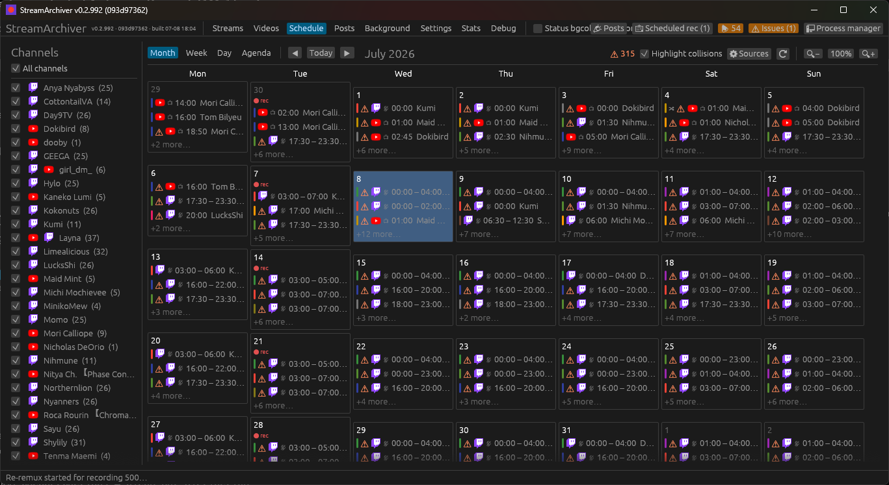
- **Week** — seven day columns (Mon–Sun), each listing *all* of that day's streams.
  The day header also shows the **avatars of channels with a scheduled recording
  due that day** (see *Scheduled recordings* above), and any stream long enough
  to count as an **all-day event** (20h+ — covers both a full-day placeholder and
  a genuine multi-day range like a subathon) draws as a continuous horizontal bar
  under the day numbers, Google-Calendar style, instead of a clipped time-grid
  block. A subathon reported by the platform as one recurring segment **per
  day** (each day's segment overlapping the next, rather than one clean
  multi-day segment — Twitch's own schedule API does this) still draws as
  ONE continuous bar across every day it spans, even when another channel's
  own all-day event happens to start partway through it: adjacent/overlapping
  same-channel, same-title segments are coalesced for display regardless of
  what else is on the calendar that week (hover the bar — it says how many
  daily segments got combined). When two channels both need an all-day row,
  each stays in its own consistent lane across the whole visible range rather
  than trading places from day to day.

  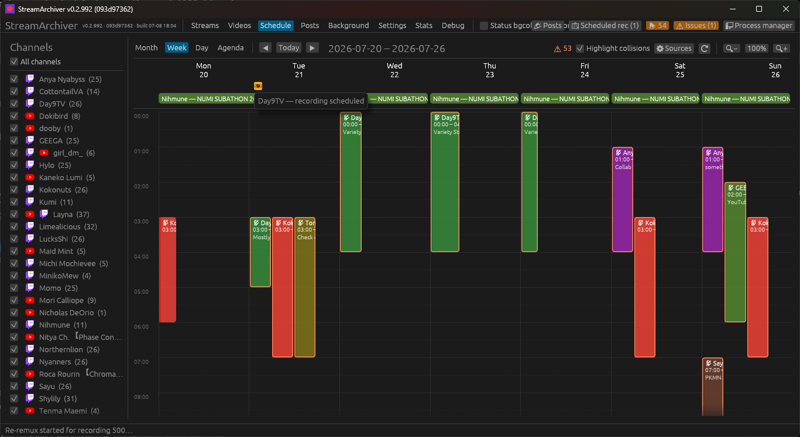
- **Day** — a detailed, time-sorted list of one day's streams (time · platform ·
  channel — title (category)).

  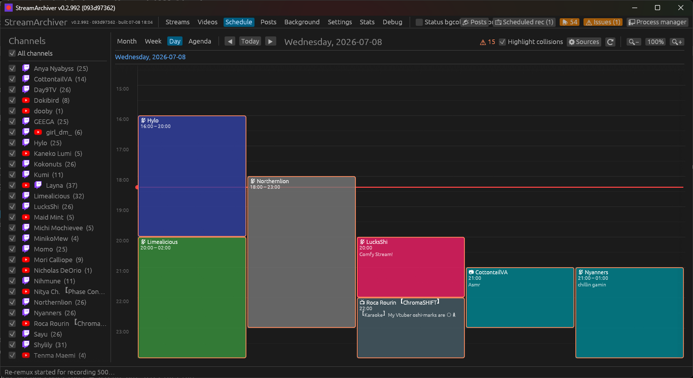
- **Agenda** — a flat, date-grouped list of every upcoming stream across all
  visible channels, most useful for scanning far ahead at a glance.

  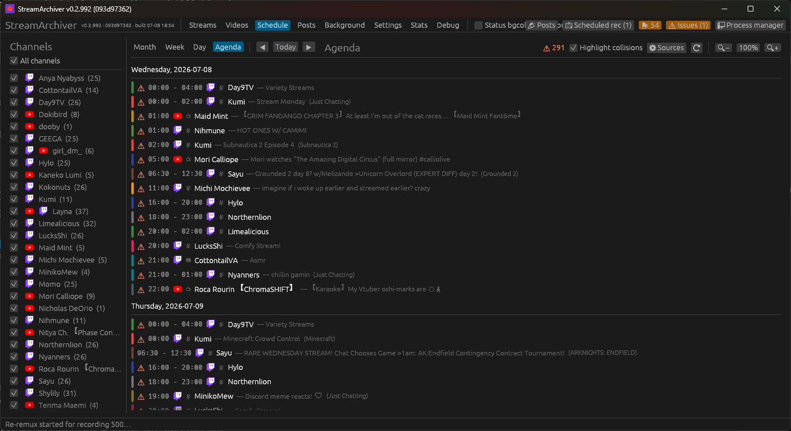
- **Navigation** — `◀` / `▶` step by the current view (month/week/day), **Today**
  returns to now. Today is tinted/highlighted. Which of Month/Week/Day/Agenda
  the tab opens to is **Settings → Display → Default Schedule view**
  (default: Week).
- **Right-click** any stream (chip, day list, or popup) to **copy** its URL,
  platform, title, channel, or full details, or **open it in the browser**. The
  day popup also has **Copy all**. Hover a stream for its full details.
- **🔍 Filter bar** (under the toolbar) — type to narrow **every view**
  (Month, Week, Day, Agenda) to events whose **channel name, title,
  category, or collaborators** contain the text (case-insensitive
  substring). While active, a live **"N matching streams"** count sits next
  to the box, and the collision `⚠` badge/count only considers matching
  events, so what's flagged always agrees with what's drawn. `Esc` (or the
  ✕ button) clears it; the filter is session-only and independent of the
  sidebar's channel filter — that one narrows the *sidebar list*, this one
  narrows the *calendar*. The day pop-up window intentionally still shows
  everything (it's the "show me all of this day" detail view, hidden
  entries included).
- **Left sidebar** filters which channels are shown: a **Filter…** box narrows
  the list to matching channel names (case-insensitive substring), an **All
  channels** toggle plus a per-channel checkbox (with each channel's avatar,
  platform icon, and upcoming count). Newly-added channels default to
  visible; unchecking one **persists** across a restart (e.g. a channel whose
  schedule is a permanent dummy placeholder stays hidden without re-hiding it
  every launch). Each row carries the channel's **calendar color** as a
  swatch + tinted name, so the sidebar doubles as the legend for the event
  blocks. A channel with schedules from **more than one instance** gets an
  expander (⏵): each instance inside has its **own hide checkbox** (also
  persisted), for when one instance publishes permanent filler/dummy slots
  every day forever while the other carries the real schedule — the
  instance hide ANDs with the channel checkbox, the collapsed row shows
  **(shown/total)** whenever instance hides are filtering something, and
  ticking *All channels* clears both levels.
- **Channel avatars** appear on the sidebar list, every all-day bar, every
  timed event block, Month-view chips, and Agenda-view rows — so a channel is
  identifiable by its picture at a glance, not just its name or color. On a
  narrow block (many overlapping streams squeeze lanes thin) the icon shrinks
  to fit rather than disappearing — it's most useful exactly when
  similarly-colored blocks are hardest to tell apart.
- **Channel colors** are the *same* ones the Streams list uses: a manually
  chosen custom color wins, else the streamer's own **Twitch name color**
  (darkened just enough that white block text stays readable), else the
  automatic palette. Which Twitch account's color that is defaults to the
  icon-source account (else the first Twitch instance) — right until a
  container holds two personas of one streamer, where only you know which
  persona is current: **Rename channel → Name colour source** pins it to a
  specific instance, and the **↺ Reset** button beside the hex field forgets
  both the custom color and the cached broadcaster color, so a stale one
  (a persona switch, a color the streamer changed) is re-read from the
  source account immediately instead of surviving indefinitely.
- **The sidebar's show/hide list names every channel**, not just those with
  loaded events. It used to be built from the events themselves, which made
  a hidden channel vanish from the very list needed to un-hide it — hidden
  once, its schedule was gone with no way back short of editing the setting
  by hand. Channels with nothing upcoming simply show a zero count. Every schedule surface — event blocks, month chips,
  agenda stripes, day lists, the sidebar legend — resolves through this one
  map, so an event is recognizable by color across views.
- **⋯ Display** (header dropdown) holds four persisted toggles, collapsed
  into one menu so the header doesn't fight the date/heading for room:
  - **Highlight collisions** (on by default) flags with a `⚠` any streams
    whose times overlap — handy for spotting clashes across channels.
    YouTube upcoming streams carry no end time, so they're treated as two
    hours long for the overlap check. A count of overlapping streams
    visible in the current view stays shown in the header itself (not
    inside the menu) whenever it's non-zero.
  - **Compact** collapses every Week/Day event block to a **one-line chip
    at its start time** (`HH:MM Channel — Title`) instead of a
    duration-height block — a quick at-a-glance overview when many
    overlapping streams would otherwise shred the columns into slivers.
    Chips only split into side-by-side lanes when *start times* land
    within the same chip, not for the whole real duration; hover any chip
    for the full details.
  - **Large avatars** draws a bigger channel picture in the body of each
    non-compact Week/Day event block, below its text — full size (the
    source profile pic's own resolution) when there's room, shrunk to fit
    a narrow or short block, never enlarged past the source image. Uses a
    sharper source than the small inline icon, since it's shown much
    bigger. Off by default; has no effect in Compact mode (a one-line chip
    has no body to put it in).
  - **Icons only (Month)** replaces each Month day cell's chip list with a
    mosaic of channel pictures — one tile per distinct channel streaming
    that day (a channel streaming twice appears once), uniformly scaled so
    **all** of them fit inside the cell. That's the point over chips:
    nothing ever folds into "+N more", so a busy Saturday reads as a wall
    of faces at a glance. Hover a picture for that channel's streams that
    day (times, titles, categories); click opens the day popup, exactly
    like a chip. Channels whose profile picture isn't cached show a square
    in their schedule color with the channel's initial instead of silently
    vanishing. Tiles keep the calendar's state cues: a channel whose
    entries are all hidden ghosts out, and one whose entries are all
    auto-off dims grey (same signal as the chip tint). Uses the full-res
    profile pictures (same sharp source as Large avatars), since tiles in
    a roomy cell are far bigger than the 64px chip icons. Off by default;
    only affects the Month view.
- **Title wrapping**: a non-compact Week/Day block's title wraps across
  however many lines the block's actual height allows, instead of clipping
  to a single line — a tall block (a long stream, or few overlapping lanes)
  shows more of a long title rather than cutting it off while sitting mostly
  empty below. Still clips (with an ellipsis) once even that space runs out.
- **Auto-record tint**: an event whose instance isn't set to **Auto** (the
  Streams grid's Auto column) is dimmed on every surface — Month/Week/Day
  blocks, chips, the Agenda list, the day popup — so it's obvious at a
  glance which upcoming streams won't actually be recorded.
- **⚡ Trigger preview**: if a configured trigger-word rule's pattern already
  matches the event's *known* title/game, its tile shows **⚡** (would
  force-record even with Auto off) or **🚫** (a blacklist rule vetoes it) —
  a way to verify a trigger rule before the stream actually goes live.
  Hover any tile for which rule matched and why.
- **🔴 Recording now**: a tile whose broadcast is currently being recorded
  shows **🔴** (distinct from the month cell's own "⏺ rec" Scheduled
  Recording badge, which means something else — a force-record rule is due
  that day, not that a capture is in progress).

Times respect the **date format** setting (12- vs 24-hour). `⟳` (or **F5** on the
tab) **fetches the latest schedules from Twitch/YouTube right away** — it doesn't
just re-read the stored copy — and the calendar updates when the fetch returns
(schedules also refresh in the background every few hours).

**Zoom** (calendar body only — the toolbar/sidebar stay normal size): the
**🔍−** / **percentage** / **🔍+** buttons in the header, or **Ctrl+Plus** /
**Ctrl+Minus**, scale the calendar's font and element sizes from 60% to 200%;
**Ctrl+0** (or clicking the percentage button) resets to 100%. Session-only —
resets to 100% on restart.

> **Note:** the schedule comes from a channel's *published upcoming schedule*.
> On Twitch that's the streamer's **Schedule** feature — if a channel hasn't set
> one up, Twitch's API returns no segments and the channel shows nothing here,
> even though its *past* broadcasts still appear on the channel's Twitch schedule
> page. YouTube uses the channel's upcoming/scheduled livestreams. For channels
> that only post their schedule on Discord, see below.

#### Discord schedule import (opt-in, experimental)

Many streamers publish their schedule as **Discord scheduled events** in their
community server rather than via Twitch/YouTube. **Settings → Discord schedule
import** can pull those in:

1. Paste your **Discord user token** and tick **Import schedules from Discord
   events**.
2. The app periodically sweeps the servers *you're already in* for scheduled
   events and matches each one to a monitored channel by the **stream URL** found
   in the event's location/description (e.g. `twitch.tv/<name>`). Matched events
   appear on the calendar (hover shows *Source: Discord event*).
3. Discord events are only used for channels that **don't** publish a
   Twitch/YouTube schedule, so the two never duplicate. Events with no recognizable
   stream URL are ignored.

> ⚠ **This uses your personal Discord token.** Automating a user account token is
> against [Discord's Terms of Service](https://discord.com/terms) and could get
> your account suspended or banned. It's off by default; enable it only if you
> accept that risk. The token is stored locally (like your other credentials) and
> never displayed or logged. A compliant bot can't read events in servers where
> you're only a member (a bot must be invited by that server's admin), which is
> why this path uses your own account.

#### Schedule sources & OCR

Many streamers publish their weekly schedule as an **image** — a Twitch offline banner, a YouTube community post, or a pinned tweet — rather than using platform schedule features. The **⚙ Configure schedule sources** button in the Schedule toolbar opens a dialog to choose which sources are enabled and in what priority order. Sources are tried top-to-bottom per channel; **the first to return a non-empty schedule wins** and later sources are skipped.

| Source | Platform | Notes |
|---|---|---|
| **Twitch schedule** | Twitch | Helix `/schedule` API; needs Twitch credentials. Default: on. |
| **YouTube Data API** | YouTube | `search.list` + `videos.list`; needs a configured API key. Spends real quota (`search.list` is 100 units/call) — **opt-in, default: off**, even once a key is set. |
| **YouTube scrape** | YouTube | `/streams` page scrape; no API key needed. Default: on. |
| **Twitch banner OCR** | Twitch | OCR the already-downloaded offline banner via the `claude` CLI. |
| **YouTube community post OCR** | YouTube | Fetches recent community posts and OCRs the latest attached schedule image. |
| **Twitter/X pinned tweet OCR** | Any | OCRs the image on the channel's pinned tweet. Requires the handle set in Properties → Schedule. Best-effort — X actively limits unauthenticated access. |
| **Other image (OCR)** | Any | OCR a user-supplied path or URL configured per-channel in Properties → Schedule. |
| **Discord events** | Any | Discord scheduled events (existing opt-in import; see above). Lowest priority by default. |

OCR and scraping sources run on the **slow (6 h) cadence** only, never the 60 s live-detection tick, and re-OCR is skipped when the source image is byte-identical to the last run.

**OCR settings** (Settings → Schedule → OCR): the CLI command (default `claude`), primary model (default `haiku`), fallback model (default `sonnet`), default timezone name and UTC offset. Per-channel overrides for timezone, offset, Twitter/X handle, and the "other image" path live in **right-click → Properties → Schedule sources**.

If the CLI can't be spawned at all (e.g. it's on `PATH` now but wasn't when this app was last launched), the app retries once against the standard install location (`%USERPROFILE%\.local\bin\<name>.exe`) before giving up — and every OCR job that fails this way also files a **🚨 Warnings** entry (one row per channel, growing in place on repeat failures) plus a live 🔔 notification, so a broken CLI doesn't just quietly fail every scheduled OCR job unnoticed.

**Misread hardening + per-event Properties.** Two distinct failure modes were hardened against, both found on a real banner that misread "Tootie Pies Collab" as "Rootie Pies Collab" scheduled on the wrong day: (1) stylized/decorative fonts producing a well-formed but wrong *title* (a decorative letter misread as another), and (2) a card getting matched to the wrong *day/date* — often because the model tried to free-count through blank "nothing scheduled" filler graphics as if every calendar day got exactly one slot, silently skipping or double-counting days whenever one of those fillers appeared. The prompt now: warns explicitly about font-letter ambiguity; tells the model to read each visible card's own printed day-of-week label as ground truth rather than counting grid positions, using the label sequence only as a non-decreasing sanity check; and anchors date math to the graphic's own date marker (a "WEEK OF …" header or corner date-range badge) rather than free-associating a date. The model self-reports a `confidence` ("high"/"low") per event covering both the title and the day/date match — a `"low"` confidence on the cheap primary model automatically triggers the stronger fallback model on the same image, even when the primary call parsed fine (previously the fallback only fired on outright JSON-parse failure). Every scanned event now shows **which model produced it and its confidence** in its own **Properties** window (click any event tile) — along with a **🔄 Rescan this event** action: pick a model (haiku/sonnet/opus) and effort level and force a fresh OCR pass over that event's source image on the spot. Because a rescan replaces every upcoming event from that same source image at once (not just the one you clicked), the Properties window closes afterward — check the calendar for the corrected result.

**Day properties moved to right-click.** Clicking an event tile now opens that event's own Properties instead of the whole day's list. To see every event on a day at once, right-click blank calendar space or a day header/title (Month cell background, the Week view's per-day header, the Day view's big date heading, or an Agenda date group heading) and pick **📅 Day properties…** — the Month view's day-number and "+N more" links still open it directly on click too.

The **App Stats** tab tracks cumulative **Claude OCR** usage (invocations, cache
hits, parse failures, tokens and cost per model) alongside **YouTube Data API**
quota usage (units and search calls against the daily cutoff), so you can see
what these features are actually costing you. (Per-channel numbers live in the
separate **Channel Stats** tab — App Stats is app/system health only.)

The **Recordings** section's lifetime totals are followed by a **Breakdown**
period selector (**Day / Week / Month / Year**):

- **Day** lists the 7 days of the current calendar week (Monday–Sunday), each
  with its own recording count and bytes archived; days later in the week
  that haven't happened yet show `—`.
- **Week / Month / Year** each show two rows instead of a long trend table:
  the current, still-elapsing period and the last fully-elapsed one (e.g.
  "This week" / "Last week"), with a recordings-per-day and archived-per-day
  average alongside the totals. The current period's average divides by the
  days elapsed so far (not a flat week/month/year), so it isn't dragged down
  by days that haven't happened yet.

The daily unit bar itself is color-segmented by call type, iPod-storage-bar
style, instead of one flat fill — each segment's width is that call type's
share of the daily cutoff, and hovering a segment shows its exact unit count
and what it's for. Underneath, a **"Units spent by call type today"**
breakdown grid repeats the same numbers with matching color swatches, split
across `search.list` (orange — 100 units/call — live-detection polls and the
upcoming-schedule refresh), `videos.list` (blue — 1 unit/call —
title/scheduled-start/actual-start lookups), and `channels.list` (green — 1
unit/call — resolving an `@handle` URL to its channel id; a monitor added via
`/channel/UC…` never needs this call). This is the same total as the bar
above it, just split out so a sudden jump is traceable to a specific cause
instead of an opaque number.

**Detection / API requests** (same tab) tracks cumulative poll/detect request
counts **per platform** (Twitch, YouTube, Kick, NRK, Nebula, Generic) across every
detection method — batched Twitch Helix polls, the WebSub/scrape fallback
check, YouTube/Kick API probes, generic HTTP probes — with an error count,
error rate, and the timestamp + detail of the most recent failure (hover the
timestamp for the full message). This is meant to surface *instability* that
would otherwise only show up by combing the log: a platform's error rate
climbing, or a recent DNS/auth failure repeating. A platform never polled
(e.g. no Kick channels configured) simply doesn't appear.

Below the counters, **⚠ Recent errors** expands to the actual individual
failures behind the numbers — the last 50 per platform, newest first, each
with its timestamp, platform, channel, detection method, and error detail
(long messages are truncated in the cell; hover for the full text).

Two **history graphs** plot the same request stream over time, with a
timespan selector (**1 h** up to **All** — wider spans use wider buckets,
from 1 min at 1 h up to 1 week at All):

- **Error rate per platform** — failed checks as a percentage of all checks,
  one line per platform in its brand color (matching the log tags).
- **Requests per kind** — request volume per detection method (Helix API,
  Scrape, Probe, YT API, Kick API, …), all platforms combined.

The graph data is stored at minute resolution in the database (`poll_history`
table) and kept for 60 days; coarser views are aggregated at query time.
**Reset** clears the counters, the recent-error list, and the graph history
together; everything otherwise persists across restarts.

#### Network / downloads

**Network / downloads 🌐** (same tab) answers "what is the uplink actually
doing, and where did all those bytes come from?" — split by what the traffic
was *for*, because a live capture, a manual video download, and a VOD repair
pass have very different reasons to be saturating the line:

| Class | What it covers |
| --- | --- |
| **Recordings** | Live stream captures — streamlink/yt-dlp pulling a broadcast's live edge, including companion captures of the same stream. |
| **Downloads** | On-demand downloads started from the **Videos** view (and ones re-attached after a restart). |
| **Chat** | Chat sidecars that run as their own tool process. Twitch chat is logged in-process, so it lands in the app's own traffic instead. |
| **Recovery** | CDN-fed repair traffic: head backfill, lost-segment gap recovery, and VOD recovery. |

Three panels, all fed from the same numbers:

- **Live table** — current rate per class, how many tool processes are in it
  right now, and the total downloaded per class **this session** (including
  tools that have since finished). If the I/O sampler stalls, the age of the
  last sample is called out rather than silently reading as `0 B/s`.
- **Download rate graph** — average B/s per class over a selectable timespan
  (**1 m** through **All**), one colored line per class, with the same
  bucket-width behavior as the detection graphs above. Idle minutes store no
  row at all, so gaps are bridged — a flat stretch equally means "nothing
  downloading" or "app not running".
- **Breakdown** — bytes per class by calendar period, with the same
  **Day / Week / Month / Year** selector as the Recordings breakdown (Day
  lists the 7 days of the current week; the others show the current period
  and the last fully-elapsed one).

Measurement comes from each spawned tool's own process I/O counters — the
same source the **🖴 I/O** tab uses — whose read side while downloading is
essentially its CDN throughput. Two things are excluded on purpose so this
reads as *network* traffic rather than "bytes the tools moved": local
post-processing (remux, concat, embedding), which reads off disk, and a
download tool's own child ffmpeg, which is the **merge** pass reading the
finished parts back in (counting it would roughly double a multi-format
download). The app's own API polls and image fetches aren't included either —
those show up as *unattributed* in the I/O tab. Because the class can't be
inferred reliably from a tool name (the same `ffmpeg` binary both fetches from
a CDN and remuxes locally), it's declared explicitly where each tool is
spawned.

History is stored at minute resolution (`net_history` table) and kept for 60
days, same as the detection graphs; **Reset** clears it, while the live rates
and session totals keep running.

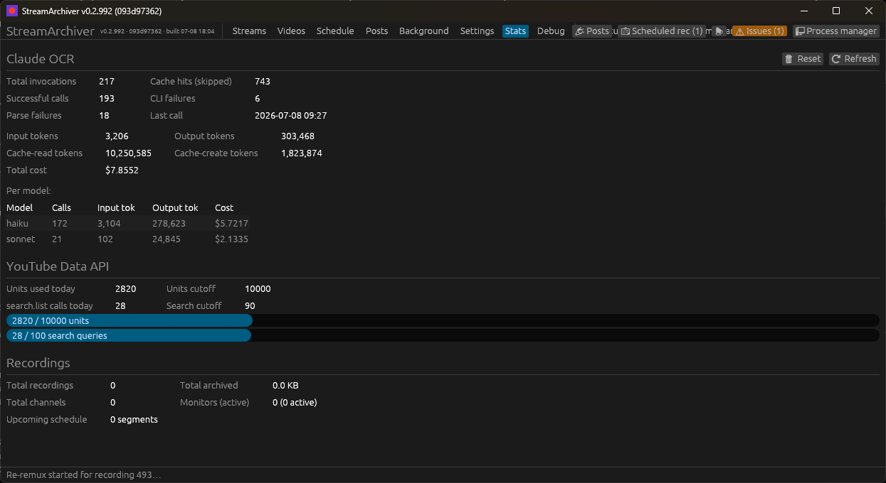

### Chat logs

Tick **Log chat** on an instance to archive chat alongside the recording (new
instances default it on):

- **Twitch** — a built-in **anonymous** chat logger (read-only, no account
  needed) connects over Twitch's IRC-over-WebSocket gateway and writes a
  **`<name>.chat.jsonl`** sidecar — one JSON object per message with timestamp,
  login, display name, text, color, and badges. Works with any tool (it's a
  separate connection, independent of streamlink/yt-dlp).
- **YouTube** (with the **yt-dlp** tool) — yt-dlp's `live_chat` writes a
  **`<name>.live_chat.json`** sidecar (folded into `--sub-langs` with any
  subtitles you selected).
- Other platform/tool combinations don't capture chat. Kick chat isn't supported
  yet.

The same **Log chat** option is on the Videos download form: a one-shot yt-dlp
download captures `live_chat` (e.g. a YouTube VOD's chat replay) the same way.

Chat sidecars sit next to the video and **follow it** if the file is renamed
(see *Filename media info*), so they stay matched to their recording.

#### Dedicated chat logs folder (on another drive)

Chat appends are small but constant, and on a drive that's simultaneously
recording several streams they're pure seek churn. **Settings → Recording →
Defaults → Chat logs folder (dedicated)** moves ALL chat writes to their own
folder — ideally on another, quieter drive. Empty (the default) keeps sidecars
next to the recordings.

- **Mirrored layout, drive letter on top** — the recording's folder structure
  is reproduced under the root so the trees can be re-merged by hand later:

  ```
  A:\VODs\Twitch\GEEGA\take.mkv          (recording, unchanged)
  D:\ChatLogs\A\VODs\Twitch\GEEGA\take.chat.jsonl
  D:\ChatLogs\G\Streams\YUY\take.mkv.live_chat.json

  remerge:  robocopy D:\ChatLogs\A\ A:\ /E     (one per drive folder)
  ```

- Applies to **every chat shape**: a Twitch take's built-in logger, a YouTube
  take's yt-dlp `live_chat` sidecar, and chat-without-recording sessions.
  Each take's sidecar location is persisted on the recording row
  (`chat_path`), so **💬 View chat**, post-capture **renames** (the chat file
  follows the title rename inside the chat folder — always a same-drive
  rename), head-backfill joins, and gap splices all keep resolving it.
- **Existing files don't move on their own.** **Settings → Maintenance →
  Migrate chat logs** is the one-shot catch-up: each old sidecar is copied,
  size-verified, then deleted from the source; still-running sessions are
  skipped (run it again later). It also sweeps unlinked chat files out of the
  output dirs (and their `chat/` subdirs).
- Interplay with other file features: the *File management* subdirectory
  split doesn't apply inside the chat folder (the dedicated root IS the
  segregation); the Files view's **Relocate prefix** now rewrites `chat_path`
  too, so relocating the chat root itself is a normal prefix relocation; and
  **Redirect drive** on the recordings changes where FUTURE takes' chat
  mirrors land automatically. Chat-drive I/O shows up in the I/O monitor as a
  recordings surface, on its own drive row.

While a chat capture is running, its row shows the **💬 badge** (bubbled up
to the instance and collapsed channel rows) and the context menu offers
**💬 Stop chat download** — for *all three* shapes: a YouTube recording's
external yt-dlp sidecar, a chat-only session, and a Twitch recording's
built-in logger. The Twitch-recording case is a 2026-08-01 fix: the in-process
logger never registered itself as a running chat, so recording Twitch rows
showed no 💬 while YouTube ones did, and Stop had nothing to act on.

#### Chat without a recording

**Auto-record off doesn't mean chat off.** Auto-record is a *disk-space*
control — "don't spend 30 GB on this stream" — while a chat log is a few MB
and, unlike the video, is **unrecoverable** once the broadcast ends: Twitch
publishes no transcript and YouTube's live-chat replay dies with the stream.
So when a monitored channel goes live with **Auto** off, chat is still
captured on its own. This is on by default and switched off under
**Settings → Recording → Chat logging**.

- It still needs the instance's own **Log chat** tick, and the same
  platform support as above (Twitch, or YouTube with yt-dlp). Turning **Log
  chat** off for an instance turns this off for it too.
- The sidecar is exactly the file a recorded take would have produced —
  `<name>.chat.jsonl` / `<name>.mkv.live_chat.json` in the instance's output
  folder (or its mirror under the *dedicated chat logs folder*, when one is
  configured), named from its usual filename template — so the chat replay, the
  subdirectory split (*File management*), and the 💬 badge all work
  unchanged. `{title}` and `{games}` are filled from what detection knows at
  the time rather than the usual `title-tba` placeholders, since there's no
  post-capture rename pass to resolve them later.
- It hangs off the same **👁 "seen live, not recorded"** take row the Streams
  grid already shows for an Auto-off broadcast, so it starts and ends with
  that broadcast, and **💬 View chat** on that row opens it. If the app is
  restarted mid-broadcast the session resumes into a *new* sidecar rather
  than reopening the old one (never append to a file we can't vouch for);
  the take row then points at the newer file, and the earlier part stays on
  disk next to it.
- If a recording *does* start mid-broadcast (a trigger word matched, or you
  hit ▶ Start), the chat-only capture is stopped first and the recording's
  own chat logger takes over — you get two sidecars for the broadcast, one
  per session, never two writers at once.
- Deliberately **not** applied when a **blacklist trigger** vetoed the
  recording or a **Stop hold** is active: those both mean "skip this
  broadcast", not "save the disk".
- If the YouTube sidecar's yt-dlp exits on its own within 15s of spawning —
  rather than being stopped by a shutdown, a user action, or the broadcast
  ending — the next attempt backs off **5 minutes** instead of retrying on
  every ordinary poll (~65-70s). Covers a broadcast some *other* detection
  method still considers live but yt-dlp categorically can't see for its
  whole runtime (observed cause: members-only content the configured account
  has no entitlement to) — without that, a multi-hour broadcast burned a
  failed spawn (and a browser cookie re-extraction) every poll for its
  entire length.

**Moderation is archived too.** On **Twitch** the logger records single-message
**deletions**, **timeouts/bans** and **full chat clears**, chat-mode changes
(slow / subs-only / emote-only / followers-only / unique-chat), and
badge-inferred **role changes** (someone starts or stops chatting with a
mod/VIP badge — the only signal available anonymously, so it's best-effort
and only visible when the person actually chats). On **YouTube** the same two
actions the platform exposes are read out of yt-dlp's chat sidecar: a single
message being deleted, and a moderator removing **everything one person
said**. In the chat replay, deleted/removed messages render **struck-through
with the original text preserved** — the live chat hides what mods remove; the
archive keeps receipts — and on Twitch the timeouts, bans, clears, mode
changes and role changes also appear as muted ℹ notice lines. Old chat logs
load unchanged; they just predate the markers. Replies carry a small **↩ name**
prefix showing who they answer, and **📣 mod announcements** show as notice
lines too.

Where the two platforms differ, the app says so rather than guessing:

- **Nobody says WHO moderated, or why.** Neither platform tells an anonymous
  listener which moderator acted or what reason they gave — that needs
  broadcaster-level credentials. Every moderation record here names the person
  it happened *to*, never the person who did it.
- **YouTube can't tell a timeout from a ban.** Its "remove this author's
  messages" action is the same whether someone was muted for ten minutes or
  banned outright, so those are recorded as their own **`chat_purge`** kind
  ("all messages removed") instead of being filed under a `timeout` or `ban`
  that might be wrong. Twitch reports the duration, so Twitch rows do
  distinguish them.
- **Twitch is recorded live; YouTube is recorded at the end.** Our own IRC
  client sees Twitch actions as they happen. YouTube chat is captured by
  yt-dlp with no hook of ours in the loop, so a background sweep reads the
  finished sidecar once the capture ends (a few takes a minute, so an existing
  archive backfills itself over time). The strikethrough in the replay is
  parsed straight from the file and doesn't wait for that — only the recorded
  *statistics* do.
- **Un-bans are invisible.** No platform announces one to a listener, so a
  recorded ban only ever means "banned as of the last thing we saw", which is
  how the UI words it.
- **Kick** chat isn't captured at all yet, so none of this applies there.

All of it lands in the **Channel Stats** event history (with a "Mod acts"
column in the overview), in each chatter's **usercard**, and in the **Chat
moderation** section of instance **Properties**.

Emote images in the replay have the app's standard image affordances:
**Alt-hover** shows a full-resolution floating preview, and **right-click**
offers *Copy Image*, *Open File*, and *Open Folder* for the cached emote
file.

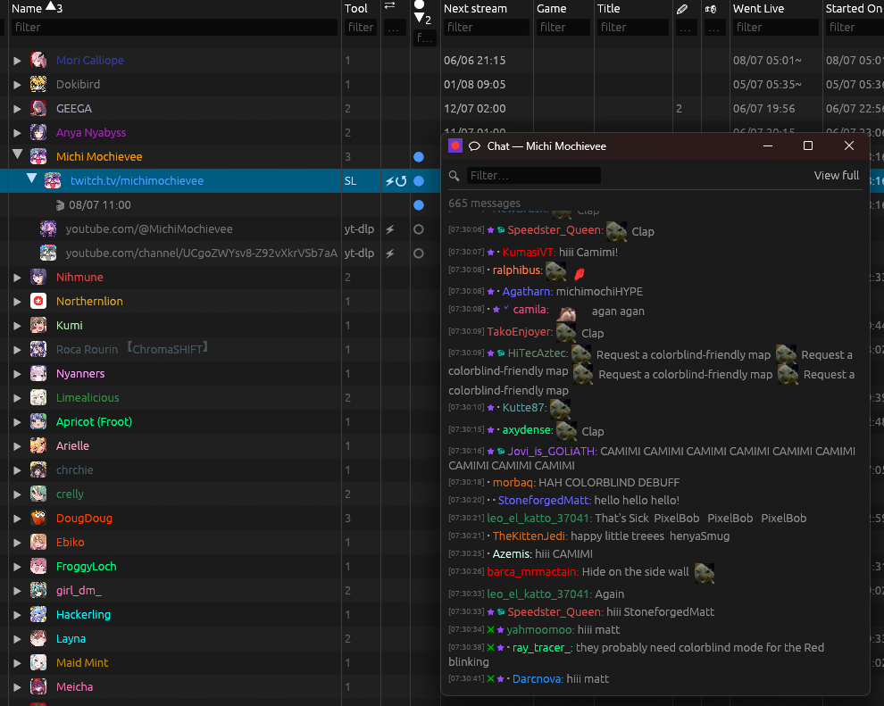

**Twitch-parity look and accessibility controls.** Badges (subscriber/mod/VIP/
broadcaster/etc.) render as the same cached icon images Twitch itself uses
(fetched by the normal channel-asset refresh — see *Channel assets* below),
not glyph symbols — hover any badge for its name. Falls back to a glyph for
an id that isn't cached locally yet. Every row reserves a **fixed-width badge
column** (3 slots) regardless of how many badges that particular message
actually has, so usernames line up in a straight column instead of drifting
left/right with each sender's badge count — only a message with more than 3
badges at once (rare) overflows its own row.

**7TV gradient usernames ("paints")** render for chatters who have one, from
7TV's v4 GraphQL API. That API scores query complexity and the ceiling moves
without notice — on 2026-08-19 batches of 50 that had worked since the feature
shipped started coming back `Query is too complex`, and every paint quietly
stopped resolving. Measured that day, 18 aliases pass and 19 do not, so the app
asks for 12 at a time and, on a complexity refusal, halves the batch and
retries rather than giving up. A future tightening costs extra requests against
a 24-hour cache instead of taking the feature out. It is an approximation, and the shape of the
approximation is worth knowing: egui colours text one *run* at a time, so a
gradient is quantized into at most 12 flat-coloured runs across the name —
enough to read as a smooth sweep at chat sizes, and bounded so a screen full
of painted senders stays cheap. Only the gradient's **horizontal** component
is expressible, so a vertical paint (by far the most common) renders as a
single colour — its midpoint — rather than sweeping the wrong way. Image
paints and drop shadows aren't drawn at all, and **animated paints render
static**: recolouring per frame would bust egui's text-layout cache for every
painted name every frame, and the repaint driving it comes from a child
viewport that can starve the main window's frame loop.

Paints are fetched **once per channel per day**, batched, only for chatters
actually in the loaded log, and cached to `paints.json` beside that channel's
emotes — including the *misses*, since most chatters have no paint and
re-asking about every unpainted regular on each reopen would be the bulk of
the traffic. Never per message. Toggle in *Settings → Interface → Display*;
any failure leaves usernames rendering exactly as they did before.

**How far behind you are is shown, not guessed at.** While a broadcast is
live, the message-count line reads `2,289 messages · 🕒 2.4s behind` — when the
newest messages arrived, that is how old Twitch said they were. The lag is
real and structural: this window reads a *file* rather than holding its own
connection, and chat is captured by an IRC client that buffers to disk every
2 s while the window re-reads it every 3 s.

Two things the number deliberately does **not** do. It isn't the age of the
newest message — that would climb steadily on a quiet chat while nothing was
actually wrong — so it's sampled only when new messages land, and a reading
older than 30 s is marked *(chat quiet)* rather than presented as current.
And it's never negative: it compares this machine's clock against Twitch's, so
a system clock running fast is clamped to zero rather than shown as
time-travel. A badly-set clock will still show up here as lag that isn't real,
which the hover says.

Putting that number on screen immediately earned its keep: it read **30+
seconds behind** on a live channel, confirmed against Twitch's own chat side
by side. The cause was that new messages parsed fine but never asked *the chat
window* to redraw — each popup is its own OS window, and the background
loader was waking the main window instead. So on a channel with no animated
emotes and no Hype Train running, nothing was asking the chat window to
repaint at all, and messages surfaced only when the mouse happened to cross
it. Fixed, and the expected reading is now a couple of seconds.

**Mentions are not affected by any of this** — a ping fires from the capture
client the moment the message arrives, even though its row appears here a
couple of seconds later.

A chat sidecar is created **as soon as the logger joins**, empty, rather than
on the first message — so a quiet stream still has a chat log you can open
(and send the first message from) instead of *"No chat log file found for this
stream"*.

**Sending messages.** A live Twitch take's chat window gets a **Send a
message** bar at the bottom, via Twitch's supported `POST
/helix/chat/messages` — the archival chat capture stays anonymous and
read-only, untouched. The box is multiline and grows with wrapped content
instead of scrolling a long message off to the right; Enter still sends
(Shift+Enter inserts a literal newline) since a Twitch message is
fundamentally one line — this is about seeing what you're typing, not
composing multi-line messages. The **Send** button is a large filled pill
(Twitch's own "Chat" button weight), with a configurable colour including an
option to inherit the channel's own accent (*Settings → Interface →
Display*, same idiom as the Creator Goal bar's colour setting). The bar is
**absent entirely** on archived takes and non-Twitch channels rather than
sitting permanently disabled on every historical view.

**Message history.** Up/Down recalls previously sent messages from this
window while the box is empty. Once there's text, plain arrows move within
it instead — Alt+Up/Alt+Down recall history regardless of content. Paging up
away from an unfinished draft stashes it, so paging back down past the
newest sent message restores exactly what you were typing.

**Emotes, two ways.** The 🙂 button opens a picker of every emote cached for
this channel — its own Twitch, 7TV, BTTV and FFZ sets, then each provider's
globals — grouped under headings with a search box; click one to drop its code
into the message. Or just type: `:spin` suggests matching codes inline, with
↑/↓ to move, Tab or Enter to accept and Esc to dismiss. Enter completes rather
than sends while that list is open, because a half-typed `:spin` is never what
you meant to say. One-character emoticons (`:)`, `:D`, `:3`) never open it,
and neither does a colon inside a word, so `10:30` and `https://` are safe.

The picker offers Twitch's first-party emotes even though the replay never
word-matches those (it renders them from the tags Twitch sends instead) — you
can genuinely type them, so leaving them out would be the wrong kind of
consistency. It is virtualized: a channel with every provider's globals runs
past a thousand emotes, and only the rows on screen are decoded.

**Click an emote to Gigantify it** — shows it much larger right there in the
row; click again to shrink it back. This is a local echo of Twitch's
Bits-powered Gigantify effect, not a replay of real historical ones: Twitch
only signals an actual Gigantify over the newer EventSub API
(`channel.chat.message`'s `power_ups_gigantified_emote`), which the anonymous
IRC capture this app uses never receives, so there's no way to know which
messages were genuinely gigantified live. It's also just "bigger" — no
zoom/bounce transition. Toggle in *Settings → Interface → Display*, on by
default.

**@mentions** work the same way: type `@` and a list of chatters who've
recently spoken in the currently-loaded log opens, ranked by prefix/substring
match against what you've typed so far — or, on a bare `@` with nothing typed
yet, just the most recent chatters first. Same keyboard controls as the emote
list (↑/↓, Tab/Enter, Esc), and the two never conflict since a `:` token and
an `@` token can't both sit immediately before the caret.

This needs the `user:write:chat` scope, and Twitch cannot widen an existing
grant — **a Twitch account connected before this must be reconnected once**
(*Settings → Accounts*) before the box appears. Everything else about the
connection keeps working in the meantime.

A local budget refuses a send before it leaves the app: 1.5 s between
messages, 20 per rolling 30 s (Twitch's non-moderator allowance), over 500
characters, or an exact repeat of your last message — Twitch drops repeats
silently, which reads as the app being broken. Helix's structured reply is
surfaced verbatim, so an AutoMod hold says so instead of vanishing. A sent
message shows immediately as a faded pending row and resolves when the
sidecar returns it; the real round trip is IRC → the logger's 2 s flush → the
window's 3 s tail poll, so 2–5 s of otherwise unexplained silence. If chat
capture isn't running for that channel the row can never resolve, so after 30
seconds it says so plainly rather than fading forever.

> **Unproven end-to-end, deliberately.** Every response branch — sent, AutoMod
> hold, 401, 403, 429, malformed body — is unit-tested, and the rate policy is
> a pure function tested without a network. But nothing in this repo has ever
> posted to anyone's chat: no probe, no test. The first real send is yours, and
> it may surface something only a live round trip can.

**Be pingable.** *Settings → Interface → Chat highlights* has a **"Notify me
when someone says my name"** switch — off by default, since it's the one
setting that can make an unattended machine start talking to you — plus a list
of **custom highlights**: a word, a phrase, or a regex, each with an optional
name, a *Whole word* option (so `art` doesn't fire on "start") and its own
*Notify* tick. Rules highlight matching rows in the chat window; only mentions
and rules that opted in raise a toast. If a rule lights up rows but never
interrupts you, that tick is why.

A matched rule and a **watched chatter** are drawn in *different* colours —
red for a hit, the selection colour for a chatter — and a hit wins when both
apply. These used to be one flag, which had two consequences: you could not
tell which had fired, and the trigger check was skipped entirely for a watched
chatter, so a rule matching someone you were already watching changed nothing
on screen at all.

Matching runs in the **chat logger itself, not the chat window** — so you get
pinged with no window open, and it works for channels being logged without a
recording at all. A mention counts whether it's `@name` or your name on its
own, because that's how people actually address each other; your own messages
never ping you. Do Not Disturb still suppresses the toast, the 🔔 feed row is
recorded either way, and there's at most **one toast per channel per 10
seconds**, so a chat spamming your name can't spawn fifty. Rules are re-read by the chat
logger every 30 seconds and by open chat windows immediately, so a rule added
mid-stream starts working without restarting anything.

**🔗 Dock the chat to the player.** The toolbar's 🔗 toggle sticks that
window to the mpv instance playing the same channel — video|chat as one
unit, the way the website lays it out. While docked, the pair **moves
together**: drag either window and the other follows (the video is the
primary — if both move at once, the chat re-pins to the player), the chat
always matches the player's height, and its width is whatever you last
dragged its outer edge to (remembered across restarts). Minimize is
**player-primary**: minimizing the player takes the pair down and restoring
either window brings the pair back — but minimizing the **chat** collapses
just the chat while the video keeps playing; restore it from the taskbar
and it snaps straight back onto the player's edge.
Quitting the player **closes a docked chat with it**; closing the chat leaves
the player running. Player fullscreen (`f` in mpv) suspends the dock — the
chat stays where it is and re-snaps when fullscreen ends. The toggle is
disabled (with a hover explaining why) until a player window for that
instance exists.

With **Settings → Interface → Dock chat to player** on (the default),
**▷ Play stream (live edge)** does all of this in one click: the chat window
opens by itself, already docked. It fires once per play — manually detaching
a chat is respected until the next play — and only for live plays, never for
a local recording or VOD. **Docked chat side** (same section) flips the pair
to chat-left. Docking follows the *player window*, whoever spawned it, so it
works on every launch path: Streamlink (which spawns mpv itself), the
YouTube SABR live preview, and the direct pipe/URL players.

Archived material gets the pair too: **🛟 Open recovered file** and **📼 Open
downloaded VOD** (right-click a recovery/backfill row) play the file in the
media player with that take's **chat replay opened and docked beside it** —
the recorded log, scrollable with broadcast-relative timestamps, not synced
to the playback position. The same *Dock chat to player* setting governs it,
and with no media player configured the file opens in the system default app
with the chat window undocked.

**Players survive restarts — and the dock finds them again.** Quitting the
app deliberately leaves players running, so after a restart a chat window
can face an mpv the app no longer knows. Clicking 🔗 then **rediscovers the
running player** (every player window carries an invisible title tag naming
its channel instance; older untagged windows match by channel name) and
re-binds to it as if the app had spawned it — docking, close-with-player,
all of it. If nothing is found, a ⚠ next to the toggle says so.

**Ended players pile up? Two tools.** Live players keep their last frame
open when the stream ends (mpv `--keep-open`, useful for rewinding), so
they accumulate if never closed. **Background → Player windows** lists
every mpv window recognized as this app's — channel, recording state,
title — with per-window **✖ Close** and a **Close all not recording**
sweep; unrelated mpv windows are never listed or touched. And **Settings →
Interface → Close player when the stream ends** (off by default) closes a
player automatically the moment its live feed exits — only ever windows
carrying the app's own title tag.

**Two clocks, one click apart.** The 🕒 toolbar toggle switches that
window's timestamps between **time into the broadcast** (`[00:40:10]`, the default —
this is an archive tool, and it's what lets you seek the local recording to a
moment) and **wall-clock time** (`19:30`, as Twitch's own popout shows, which
is what you want while watching live). Whichever isn't shown is on each
timestamp's **hover**, so the occasional "what offset was that at?" needs no
click at all. Either way the timestamp stays monospace so the column lines up.
Logs recorded before this existed carry no absolute time and always show the
relative form.

The toggle is **per instance**: flipping one channel's chat doesn't reformat
every other open window. *Settings → Interface → Display* sets the default an
instance follows until you tell it otherwise — and setting an instance back to
that value *clears* its override rather than pinning it, so it follows the
default again if you change the default later.

The events behind those rows are recorded by the chat logger itself, so a
sidecar stands on its own: the `first-msg` tag, the `custom-reward-id` a
channel-point message carries, and one `{"marker":"event"}` line per
USERNOTICE. Old logs simply have none of it and render exactly as before, and
an older build reading a newer log ignores what it doesn't recognise —
compatibility in both directions comes free from the marker parser's `_ =>
None`. **Two limits are structural, not oversights:** a channel-point reward
with *no message input* ("Hydrate!") never touches IRC at all — it's PubSub,
which needs the broadcaster's own token — so only redemptions carrying a
message can ever appear; and IRC never names the reward, only its id, so a
redemption reads as "a channel-point reward" until the title lookup resolves
it (*Highlight My Message* is the exception, which Twitch identifies directly).

**Rows are decorated the way Twitch decorates them** — a coloured 3px bar down
the left edge plus a matching tint: purple for a **first message** in the
channel (with a `FIRST MESSAGE` tag) and for **channel-point redemptions**,
blue for **subs / resubs / gifts** and **watch streaks**, green for **raids**,
amber for **mod announcements**. Event rows use Twitch's own `system-msg` text
verbatim, so tier wording, pluralisation and localisation are right by
construction rather than reinvented. Explicitly highlighting a chatter (🔔 on
their usercard) outranks all of it — you asked for that one. The accent gutter
is reserved on every row, not just decorated ones, so text doesn't shift
sideways as notices scroll past.

**Pick your own fonts** — *Settings → Interface → Display* has two pickers,
**App font** (the whole interface) and **Chat font** (the chat replay only),
each listing every font installed on the machine with a live preview in that
face and a **Reset**. They're independent: a display face for chat, something
plainer for the UI, or vice versa.

Neither pick *replaces* egui's bundled font — it goes in front of it — because
the bundled font carries the UI icon glyphs used outside the chat window, and
the system CJK/emoji fallbacks stay behind both, so a font with no Japanese
coverage still renders a Japanese channel name. The chat gets its own
registered font family for exactly this reason. Two caveats worth knowing:
picking a face from a font *collection* (`.ttc`) loads its first face, so a
specific weight of a collected family may come out as the regular one; and
the bracketed stream-relative timestamp deliberately stays monospace whatever
you pick, because it's a column and a proportional face destroys the
alignment that makes it scannable.

Changes apply immediately — the font atlas is rebuilt and every cached text
layout is invalidated, which is why this is done exactly once per change and
never per frame. The choice is stored by font *name*, not path, so it survives
the font being reinstalled somewhere else; a name that no longer resolves
falls back to the default rather than leaving the app unreadable.

**Info cards above the log.** Twitch's popout puts its channel furniture in
translucent rounded panels that sit *on* the chat rather than boxing it in,
and the chat window now does the same: **Creator Goals** ("BONUS STREAM
SATURDAY · 73/100 New Subs"), a **channel info** card (this broadcast's top
supporters — gift subs and bits), and a **Hype Train** card. The
fill is the panel colour lifted (or deepened, in light mode) and made partly
transparent, so a card reads as part of the same surface instead of a widget
bolted on top.

Each card has a **toolbar toggle** (🚂 and 🎁) that collapses it in that
window for the session, and a **feature switch** in *Settings → Interface →
Display* that decides whether it exists at all. **A Hype Train starting
re-opens the per-window toggle** — you asked to see a new one even after
hiding the last — but it never overrides the feature switch. The toggles are
disabled rather than hidden when a broadcast has nothing to put in that card,
so the toolbar doesn't reflow every time a train starts or ends.

The goal bar's colour is configurable (*Settings → Interface → Display*),
including **"use the channel colour"** — the same colour the Streams grid and
the notifications feed give that channel. The default is a muted version of
Twitch's goal red: theirs is tuned to catch the eye on a live page, and in a
chat window sitting open for hours it reads as harsh.

**Creator Goals are archived, not just displayed.** Helix's `/goals` needs
`channel:read:goals` on the *broadcaster's own* token, which is no use for
archiving someone else's channel, so goals come from the same anonymous Twitch
GQL surface the Hype Train check already uses — read on the same ~60 s poll,
and written into the broadcast's event history rather than fetched when you
look. Open a six-month-old take's chat and you still see what the channel was
working toward at the time. Only goals Twitch marks `ACTIVE` are shown, so an
old completed one doesn't linger; a goal type we haven't seen before still
renders, with a best-effort noun rather than being dropped.

**Channel-point redemptions get their real name.** IRC hands a redeemed
message only the reward's UUID, so the channel's public reward list is fetched
alongside its emotes and badges into `rewards.json` and used to turn
`abc-123…` into "redeemed Hydrate! ⏱500". Un-fetched or since-deleted rewards
fall back to "a channel-point reward" with the id on hover — no lookup, no
loss.

**A finished Hype Train says so, then gets out of the way.** While it runs the
card is a live bar (level, points, countdown); for **five minutes** after its
timer lapses it stays as a greyed "Hype Train ended · Lvl 4 · 10,600 pts · 3m
ago"; after that it hides itself — **but only while following a live
recording**. Open the chat for a three-week-old take and the train is still
there as a reached-level summary, because that is what an archive is for.
Rows with no timing at all (pre-v86, or chat-inferred trains Twitch's GQL
never confirmed) are always that summary. Two caveats the hover text repeats:
Twitch sends no explicit start or end event, so all of this rides on this
app's own ~60 s poll — "ended" can be up to a minute late, and a train that
finishes early by completing its last level sits as running until the timer it
was last seen with lapses.

**The chat window's affordances are real icons, not emoji.** egui rasterizes
glyph *outlines* and ignores a font's colour tables (COLR/CPAL), so every 🔍
⚙ 👥 🎁 💎 🚂 rendered as a flat monochrome silhouette — and as tofu on a
system without an emoji font at all. They are now SVGs (`assets/ui/*.svg`),
rasterized to RGBA at build time by the same `build.rs` pass that handles the
platform favicons and provider logos, so no SVG decoder ships in the binary.
The sources are pure white with an alpha channel and are **tinted at draw
time**, so a single asset covers both themes and every hover/pressed state.
Each icon keeps its original emoji as a declared fallback next to it in the
table, for any path that renders before the textures are uploaded.

A **⚙** button on the chat window's toolbar opens **Chat Appearance**: an
exact point-size field for the message/username text (not a preset slider), a
separate timestamp-size field expressed *relative* to that (default -1pt — a
hair smaller reads as a timestamp, not a fourth column of body text; 0
matches Twitch's own popout, which renders both the same size), a separate
pixel-size field for emotes/emoji (independent of the text size — go big
text/small emotes or vice versa), a **second** size field just for "wide"
emotes (7TV's walk-cycle/banner-style emotes, commonly 2-4:1 width:height —
without a separate target, a single size + a flat max-width cap crushes a
wide emote's HEIGHT short of the configured size long before a regular one
is affected, since the cap binds first), a row-spacing field (default 6px —
Twitch's own popout gives each line noticeably more breathing room than a
hairline gap), and separate color pickers for the timestamp and the message
body (default white for both — the old hardcoded grey read too dark to
follow comfortably; each color picker also has a `#RRGGBB` field beside it
you can type or **paste** into, since egui's own color wheel only offers a
*copy* button with no matching paste target). These are shared preferences,
so a change applies instantly to every open chat window; **Reset to
defaults** restores 14pt text / -1pt timestamp / 24px emotes (both sizes) /
6px spacing / white/white.

Chat rows are laid out **bottom-aligned**, not vertically centered — Twitch
anchors every item on a line to the text's baseline, so an oversized emote
grows upward from that shared line instead of being centered in a box tall
enough to fit it (which, next to text that has extra "descender" space baked
into its own line box, reads as the image being pushed down even though both
are numerically centered correctly).

**Hide shared**, next to *View full*, filters a merged Shared Chat session
down to just this channel's own messages — useful when the combined chat is
too noisy to follow (see *Chat replay source indicator* above for how a
message's origin channel is determined).

**A URL in a message renders as a clickable link** (underlined, opens in your
default browser), not plain text — trailing sentence punctuation (`.`, `,`,
`)`, …) is trimmed off first, so "check this out: https://example.com/x." doesn't
turn the closing period into part of the address. Right-click a link for
**Copy Link** / **Open in Browser**.

**Right-click a username** for a context menu: **View user info** (the same
card a left click opens), **Reply to @name** (inserts `@name ` into the send
box — only offered on a window that has one at all), and — only when that
chatter is themselves one of this app's own monitored channels, e.g. a fellow
streamer chatting during a raid or a Shared Chat collab, not just any viewer —
**Open Properties** for their channel directly from the chat window.

**Click a username** to open its usercard: a decorative color banner (Twitch
exposes no per-viewer banner image via its public API, so this is generated
locally from the sender's own chat color, not fetched), real badge icons,
and — when the raw `badge-info` tag has it — "Subscriber · Tier N · M
months", plus how many messages that person sent and when they first
appeared in the currently-loaded log, all available instantly with no
network call. Below that, **This channel:** cross-references the sender's
Twitch display name against this channel's locally-recorded event history
(bits cheered, subs gifted, raids brought in, timeouts/bans) — again purely
local, no network — and **Recent messages in this log** shows a scrollable
feed of up to their last 50 messages in the log currently open.

**🔨 Moderation** is its own section on the card: their last known state
(clean / has had messages deleted / timed out — with the time left if the
timeout hasn't run out yet / banned / all messages removed), the counts behind
it, and a scrollable log of the actual actions with dates and the deleted
text. It covers **every broadcast this channel has recorded**, not just the
one you're looking at, and it's matched both by display name and by the
platform's stable id (Twitch's account id, YouTube's channel id) so a rename
doesn't lose someone's history. The clean case is shown too — "no moderation
actions on record" is the answer you opened the card for, and a section that
quietly disappears can't tell you apart from one that wasn't checked.

A 🔔 **"Highlight messages of this user"** toggle tints that person's rows
throughout the chat so they're easy to track while scrolling (one
highlighted user per chat window at a time). A message of theirs that also
matches a highlight rule switches to the rule's own colour — that message is
the new information, and the rest of their rows still mark them. Turning on **Settings →
Interface → Display → "Fetch live Twitch info for chat usercards"** (off by
default) additionally fetches that user's live avatar and Twitch
account-created date via the Helix API each time a card opens; a failed
lookup shows **N/A** for those two fields and files a warning in the 🔔 feed
/ 🚨 Warnings window rather than blocking the rest of the card. "Copy
username" and a profile link round out the card.

**YouTube chatters get a card too**, built from the same log and the same
recorded moderation history — everything except the live Twitch lookup, which
has no YouTube equivalent (so no avatar or account-created row), and the
profile button opens their YouTube channel instead. Very old logs captured
before this shipped carry no per-chatter identity at all, so their names stay
plain labels.

A **👥** button opens **Users in chat**: every unique sender in the
currently-loaded log, grouped by role (Broadcaster → Moderators → VIPs →
Subscribers → Users, alphabetical within each group) using their most recent
message's badges — so a mid-broadcast promotion shows their current role,
not whoever they were when they first spoke. A filter box narrows by name;
clicking anyone opens their usercard the same as clicking their name in
chat. Built entirely from the already-archived log (no network) — there's no
"Chat Bots" group like Twitch's own list since nothing in an anonymous chat
capture reliably marks an account as a bot.

**Top supporters and Hype Train**, shown inline above the message list
whenever a broadcast has data for them — both reconstructed entirely from
this app's already-recorded `stream_event` history (gift subs, bits, Hype
Train polls), no new capture. The leaderboard ranks that broadcast's top 5
gift-sub and top 5 bits contributors; it won't match Twitch's own live
carousel exactly (that includes follow/viewer-count data this app has no
access to), but it's an accurate reflection of what was actually recorded.
Only the broadcast's MOST RECENT Hype Train is shown (a long, generous
broadcast can have several — showing the full history read as a wall of
text with no clear "this one's current" signal): while it's still within
its countdown window, a real colored progress bar (level, points/goal,
time remaining) — driven by `goal`/`expiresAt` fields this app's periodic
(anonymous, unofficial, ~60s) Twitch poll already receives but previously
discarded — refreshed on the same cadence as everything else while the
recording is live, so it can lag Twitch's own bar by up to that interval,
never a live push update. Once the countdown lapses (or for an older
broadcast reviewed later, whose train ended between polls) it falls back to
a plain "reached Level N" summary line instead of a bar.

### Users 👤 (who chatted where)

The **Users** tab answers a question the archive could always have answered but
never could *afford* to: **who is this person, and where have I seen them?**

Search a chatter by display name, Twitch login, or an exact platform id (a
Twitch `user-id` or a YouTube `UC…` channel id) and get their whole record
across **every** channel you capture:

- **📺 Streams** — every stream they chatted in, per channel, with their message
  count and first/last message time. Clicking a row opens that take's chat
  replay with them highlighted.
- **💬 Messages** — everything they said, with a full-text filter scoped to
  them. There is also a search box at the top of the view that searches **every
  indexed message from every channel** at once — type words as you would in any
  search box; add `*` for a prefix search (`poggers*`). Punctuation and
  operator-looking text (`:)`, `NOT`, `@name`) are searched literally rather
  than treated as query syntax.
- **💎 Contributions** — bits, subs, gift subs and raids, grouped by channel
  (the same cross-reference the chat usercard shows).
- **🔨 Moderation** — timeouts, bans, deleted messages and removals, with the
  channel each happened in.

The per-channel **user Properties** window (the one you get by clicking a name
in a stats table or the chat) is unchanged and still answers the narrower "what
does *this* channel have on record" — it now has a **👤 Full user info** button
that hands the name to this view.

**Only people who actually said something are indexed.** Lurkers leave no trace
in a chat log, so absence from this view means "never spoke here", not "never
watched".

#### Identity: ids, not names

Chatters are keyed on the platform's own account id wherever one exists —
Twitch's `user-id`, YouTube's `UC…` channel id — because logins and display
names are both freely renameable and a name is not a person.

There is one gap, and the view is explicit about it rather than papering over
it: **Twitch chat logs written before 2026-08-05 carry no account id at all**
(roughly two thirds of an archive that predates that). Those chatters are filed
under their login and marked **⚠ name-matched**. A background pass looks those
logins up through Twitch's API, 100 at a time, and folds each one into the real
account when it resolves — after which searching the *old* name still finds the
person, and their aliases are listed on the identity.

The catch, stated where you'll see it: a login resolves to whoever holds that
name **today**. If a chatter renamed since those old logs were written, some of
that history may belong to someone else. An identity that has folded in
name-matched streams says how many, and a lookup that Twitch can't answer is
left alone rather than guessed at.

#### The chat index

Behind all of it is a background index of the chat logs, built once and
maintained from then on. Without it, "which streams was this person in" means
reading every chat sidecar on disk — gigabytes.

- **Nothing is written while a stream is being captured.** Chat logs are read
  only after a take has ended, a few per minute, behind the same disk gate that
  keeps everything else out of a running capture's way. Indexing can never slow
  a recording down.
- **It lives in its own database file** (`chat_index.sqlite3`), deliberately not
  inside the main one. Three reasons: the rolling [database backups](#database-backups-)
  stay small and fast (the index is fully rebuildable from the chat logs, so
  it is not worth backing up); its writes get their own lock and so can never
  block the app's own queries; and "rebuild it" is just deleting a file.
- **A stream becomes searchable when it ends**, not while it runs. The chat
  replay already covers the live case.
- The header line says how many chat logs are still to read. Until that reaches
  zero, an empty result is **not** proof of absence — and it says so.

**Watching it work.** The **🎛 Background** tab carries a **👤 Chat index** row
with a live progress bar (`read/total`), the chatter and message counts, size on
disk, how many chat logs were missing, and how many legacy names are still to
resolve — plus **⏩** to finish the backlog at full speed and a shortcut into the
Users tab. It's the same picture the Users header and Settings show, in the place
where the app's other background jobs live.

**What it costs.** Measured over 377 real chat logs (743 MB, 1.8M messages): the
index came to **0.30 MB per MB of chat log** — so an archive with 2.7 GB of chat
sidecars produces roughly **800 MB** of index — and read them at **~21 MB/s**,
i.e. a couple of minutes of CPU for that whole archive, spread over hours at the
default pace. The presence data (who was in which stream) is a small fraction of
that; the bulk is the full-text message index.

The readouts above are deliberately cheap to produce and cached for 15s, because
they are read from the UI thread: the per-stream totals come from a small
bookkeeping table rather than counting millions of message rows. One consequence
worth knowing: **appearances** can read a hair high (0.01% on a real index) once
legacy names start merging into real accounts, since that collapses rows the
per-stream totals can't see. Everything else is exact.

**Indexing one channel now.** The row above the results indexes a chosen
channel's most recent chat logs ahead of the queue — for when you are looking
someone up and that channel's streams haven't been read yet. It skips anything
already indexed and still yields to any capture using the same drive.

**Settings → System → Chat index 👤** has the master switch, the pace ("streams
per sweep"), a full readout — chatters, messages, appearances, size on disk,
progress, unreadable logs, legacy names still to resolve, and the slowest single
log on record — plus **Index all now** (full speed) and **Rebuild index** (throw
it away and read everything again). Switching indexing off stops all of it
immediately; anything already indexed stays searchable, it just stops growing.

**If it ever misbehaves**, it says so in the log before you feel it: one line per
indexed chat log with the parse and write times split out and the throughput, a
warning for any log that takes more than two seconds, and a warning for any
index query slower than 200 ms. The **I/O → Database** tab shows the index's
lock as a **separate lane** from the main database's, so index contention can
never be mistaken for the app being slow.

### YouTube community posts (📣 Posts)

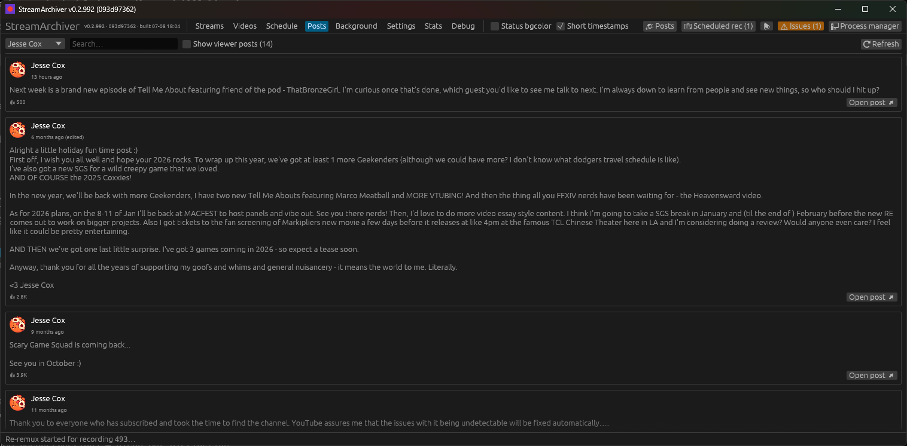

StreamArchiver archives the **community posts** of every monitored YouTube
channel — text (with clickable links), attached images, author avatar, and like
count — into the database and the channel's asset cache (`posts\` folder). The
feed is browsable in the **Posts** top-level tab or the pop-out **📣 Posts**
window, with a channel filter and text search; each new post also raises a
notification. To keep the feed responsive with a large backlog, only 30 posts
are laid out at a time — a **Show 30 more** button at the bottom reveals
further ones (filtering/search apply to the whole backlog either way, not just
what's currently shown). Attached images have the app's standard image
affordances: **Alt-hover** shows a full-resolution floating preview, **click**
opens the archived file, and **right-click** offers *Copy Image* (to the
clipboard), *Open File*, *Open Folder*, and *Copy URL* (the original source
URL).

- **Excluded channels.** The **🚫** button next to the channel filter opens
  a management window listing every channel with a checkbox — checking one
  hides its posts from this feed (and from the channel filter dropdown)
  immediately. This is display-only: an excluded channel's posts are still
  fetched and archived exactly as before, so un-hiding it later shows the
  full history, nothing was lost while it was hidden.
- **Post kinds.** A channel's community tab mixes the channel's **own posts**,
  **viewer posts** (fans posting in the channel's Community space), and
  **reshares** (the channel quoting another post). StreamArchiver tells them
  apart by the owner-highlight YouTube renders on the channel's own posts and by
  matching author channel ids against the page owner. Viewer posts are archived
  but **hidden by default** — a *Show viewer posts (N)* toggle reveals them with
  a *viewer* badge — and **only the channel's own posts raise notifications**. A
  reshare renders the resharer's comment above an indented quote card showing
  the original author, text, and images (all archived, so the quote survives if
  the original is later deleted).
- **Ordering.** Posts sort by their (approximate) **publish time**, derived
  from YouTube's relative timestamps ("2 weeks ago") the first time a post is
  seen — not by when the archiver happened to discover them. Hover the
  timestamp for the estimated absolute date. The estimate is pinned at first
  sight (the relative buckets only get coarser with age), so re-scans never
  shuffle the feed.
- **Full-history backfill.** The first time a channel's posts are fetched,
  StreamArchiver walks the community tab's *older posts* pages until the very
  first post, so the whole backlog lands in the archive — paced like a person
  scrolling (a few seconds between pages), without notifications, and resumable
  if the app shuts down mid-walk. Afterwards each periodic round only reads the
  first page; if an *entire* first page turns out to be new (more than a page
  of posts landed between rounds), a bounded gap-fill walk fetches deeper until
  it reaches already-archived posts, so nothing is ever skipped.
- **Cadence.** Fetching is trickled to look like a human occasionally opening a
  community tab: one channel at a time, randomized order and jitter, each
  channel revisited roughly every 6 hours (Background → **YouTube posts
  refresh** toggles the whole job).

### Channel assets & change history

To make chat replay look right offline — and to archive a channel's *visual
identity* over time — StreamArchiver downloads each channel's icon, banner,
badges, emotes, the broadcaster's chat name colour, and the channel's **About
page** (see *About page archive* below) into a per-channel asset cache, and
records every change it sees on later refetches.

The cache is keyed **per account**: `channel_assets/{channel}/{platform}/{account}/`,
where `{account}` is derived from the instance's URL (Twitch login, Kick slug,
YouTube handle or UC-id). A channel container holding **two instances on the same
platform** (a streamer's main + alt Twitch account) therefore keeps two fully
separate asset trees — icons, emotes, name colours, and change histories never
overwrite each other — while two tools pointed at the *same* URL share one tree.
Chat replay, notifications, and the streams-list tint all read the account
belonging to the specific instance involved, and each **instance row** in the
Streams table shows its own account's avatar next to its URL (the container row
keeps showing the channel-level icon chosen by the *Icon source* picker). On first launch after upgrading,
existing per-platform asset folders are migrated automatically into the first
matching instance's account subfolder (a `.accounts_migrated` stamp marks it
done; already-downloaded community-post and schedule images stay where their
database records point and re-home on their next fetch).

Because the whole tree is keyed off the channel's **display name**, renaming a
channel (Properties → Name) moves its `channel_assets/{old name}/` folder to
`{new name}/` automatically, so the avatar, banner, emotes, and cached Twitch
name colour follow the rename instead of silently orphaning (previously a
rename could make a channel look freshly-uncached after the next restart — a
custom-observed Twitch chat colour, for example, would fall back to the
generic palette).

**What's fetched, per platform:**

- **Twitch** (needs Twitch credentials — the same app/user token as detection):
  profile icon, offline banner, channel + global chat **badges**, first-party
  **emotes**, plus third-party **BTTV / FFZ / 7TV** emotes — both the channel's
  own sets (fetched from its Twitch broadcaster id) and each provider's
  **global** set, the emotes every Twitch channel gets for free (7TV's `xdx`,
  BTTV's `catJAM`, and so on). Globals belong to no channel, so they're fetched
  once per provider per day for the whole app rather than per channel; where a
  channel aliases a global's code to an emote of its own, the channel's wins,
  exactly as Twitch renders it. FFZ ships several global sets but only the ones
  it marks as defaults are cached — the rest are opt-in on Twitch, and
  rendering them here would show emotes nobody watching actually saw. Also
  fetched: the broadcaster's chosen chat
  **name colour** (tints the channel's name in the Streams list and chat replay).
  First-party emotes are fetched per-channel, but any subscriber can use their
  sub emotes in ANY channel's chat — so the **chat replay** also falls back to
  every OTHER archived channel's already-cached emote set before giving up, on
  the (common) chance the poster's home channel is also monitored here. If it
  still isn't found anywhere, **Settings → Interface → Display → "Fetch
  unknown emotes from Twitch"** (on by default) fetches that specific emote
  straight from Twitch's public CDN by numeric id — no login needed, and no
  need to add the poster's channel here at all — into a shared cache, so chat
  renders 1:1 regardless of which channels you actually track. Only the
  static image (not the animated version) is fetched this way, since there's
  no way to know ahead of time whether an unknown id is animated without a
  Helix call this app can't make for a channel it doesn't track. This fetch
  is normally on-demand — it only runs for a log you actually open — so
  **Settings → Maintenance → "Fetch missing chat emotes"** is the catch-up
  pass: a one-shot sweep over every archived Twitch chat log (Twitch only;
  skips still-recording takes) that backfills the same way, so logs recorded
  before this existed — or simply never reopened — render correctly too,
  without waiting for each one to be viewed. Every miss across every log is
  deduplicated before any request goes out (one spammed emote across
  thousands of messages still costs exactly one fetch), and downloads are
  paced 150ms apart — same as every other bulk emote fetch in this app —
  since a large archive can turn up hundreds of distinct missing ids in one
  run.
- **YouTube** (needs a **YouTube Data API key**, Settings → Detection): profile
  icon + channel banner via the Data API. Without a key the background refresh
  **skips** YouTube (the manual Refetch button still explains why); when the API
  returns no banner it falls back to scraping the channel page's header banner.
  YouTube has no badge/emote set, so only icon + banner are archived.
- **Kick**: profile icon + banner via the public v2 channel API (no credentials).
- Generic URLs have no asset source.

Shared third-party emotes (BTTV/FFZ/7TV) and global Twitch badges are
**deduplicated** into one platform-wide cache rather than copied per channel, and
superseded icons / banners are **archived** rather than overwritten (see *change
history* below).

**Where it shows up — channel Properties** (right-click a channel → **Properties**).

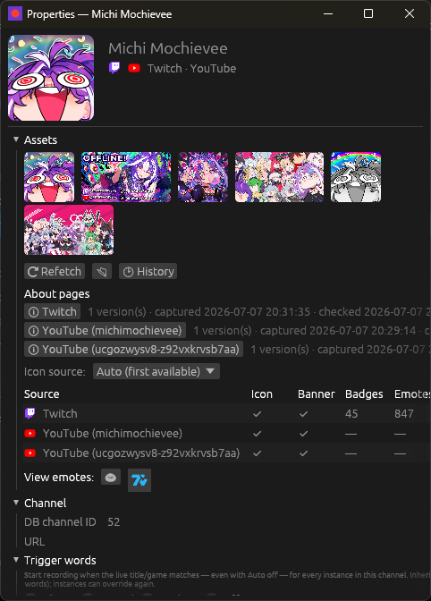

The window is organized into collapsible sections (**Assets · Channel · Schedule
sources** — the last starts collapsed) and scrolls when content outgrows it;
collapse/expand choices are remembered across restarts:

- The header avatar plus an **Assets** thumbnail strip of every original
  icon/banner across the channel's accounts — hover for pixel size, hold **Alt**
  to preview full-size, click to open the file.
- A per-**account** status grid (**Icon · Banner · Badges · Emotes · Updated**),
  one row per account — labelled like `Twitch (geega_alt)` when a platform has
  siblings — each with its own **⟳** to refetch just that account, and an **Icon
  source** picker choosing which *account's* profile pic represents the channel.
- **⟳ Refetch** fetches **every** account now (ignores the 24 h cache); **📂**
  opens the channel's asset folder; **🕑 History** opens the change log (below;
  entries name the account when a platform has more than one).
- **About pages** — one row per account (version count + captured/checked
  timestamps), each **ℹ** button opening that account's archived About page
  viewer (see *About page archive* below).
- **View emotes** — one launcher per account+provider that has emotes, opening an
  **emote viewer**: a grid of every emote with its chat code (animated emotes play
  when *Animate emotes* is on in Settings, at browser-accurate speed — capped at
  30 fps so an animating pop-out can't starve the main window of repaints). A 🔍
  **filter** box narrows the grid by code (case-insensitive; the tally shows
  *matches of total*), and a **Sort** dropdown orders by name A→Z / Z→A or
  animated-first. Codes still listed in the manifest whose image has gone from
  the cache are shown separately under **Deprecated (no longer available)**.
  Sibling accounts open separate viewer windows.

  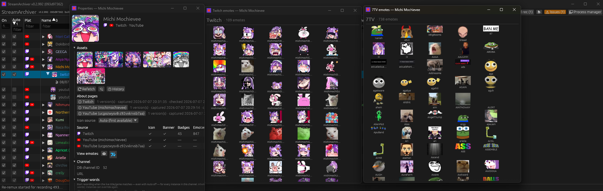

**Instance Properties** (right-click an instance row → **Properties**) shows the
same asset data scoped to *that instance's own account*: the header uses the
account's avatar and links its source URL, and an **Assets (this account)**
section carries the account's icon/banner thumbnails, its status row, **⟳
Refetch** (this account only), **📂** (this account's folder), **🕑 History**
(this account's changes only), **ℹ About** (this account's archived About
page), and its emote-viewer launchers. It uses the same
collapsible-section layout (**Monitor · Assets · Chat moderation · Trigger
words · Schedule sources**, the last few collapsed by default) with a
scrollbar when needed.

**Chat moderation** (collapsed by default) is the read-only history side of
what the chat logger captured for *this* instance: how many messages were
deleted, how many timeouts and bans, YouTube's "all messages removed" count,
chat clears, room-mode changes, the last mode change seen, the five chatters
with the most actions against them, and a scrollable log of the recent ones.
It's loaded once when the window opens (history doesn't move while you read
it) and says so plainly when there's nothing recorded — no moderation seen,
chat logging off, or a platform whose chat isn't captured. See *Chat logs* for
what each platform does and doesn't disclose.

**Change history.** Manifests and images are overwritten wholesale on each
refetch, so a removed emote code or a swapped banner would otherwise vanish with
no trace. Instead, every refetch is diffed against the previous state: the changes
are appended to a per-channel log (`asset_changes.jsonl`), the superseded emote
manifest is snapshotted under `emotes/history/`, and replaced icons/banners under
`history/`. The **🕑 History** popup lists the changes newest-first across all the
channel's platforms:

- **Emotes** — `+ code` added / `− code` removed (keyed by the code as typed in
  chat, so id/CDN churn alone isn't a change).
- **Icon / Banner** — *replaced* (the prior image is kept in `history/`).
- **Name colour** — set / cleared / changed.

Removed emotes stay in the history even after they're gone from the channel's
manifest — so the log is a durable record of what the channel *used* to have. If
the emote viewer or History window is open when a background refetch for that
channel lands, an amber **"assets were refetched — reopen"** banner appears (the
History window also reloads itself in place).

**About page archive.** Alongside the visual assets, every asset fetch also
captures the channel's *About page* — the free-text self-description streamers
change (and delete) over time — **versioned**: a new snapshot row is stored only
when the content actually changed; an identical re-capture just bumps the
"checked" timestamp. What's captured, per platform:

- **Twitch** — the channel bio (from the same Helix call as the icon) plus the
  full **About panels** (title, markdown body, image, link) via an anonymous
  read-only GQL query (no credentials beyond the ones detection already uses).
  Panel images are stored content-addressed under the account's `about/` folder,
  and the version hash uses the image *bytes* — a CDN re-serving the same image
  from a new URL is not a new version.
- **YouTube** — the channel description from the Data API response already
  requested for the icon/banner (zero extra quota), plus the external links from
  a best-effort `/about` page scrape (redirect-wrapped URLs are unwrapped).
- **Kick** — the bio + social links (Twitter/Instagram/Discord/…) from the same
  v2 response the icon/banner fetch already uses (zero extra requests).

If an *optional* source fails (Twitch GQL, the YouTube scrape), the round is
**degraded**: it may establish the very first baseline, but it never overwrites
existing history with a stripped-down version — so a temporary API outage can't
fake an "everything was removed" edit. A genuine change is also logged to the
**🕑 History** window (`about changed`).

The **About viewer** (the **ℹ** buttons above) shows any archived version via a
**version picker** (newest = *current*): the description and Twitch panel bodies
render as real markdown, panel images decode lazily (Alt-preview / click-to-open
like the thumbnails), and panel/external links open in the browser. The window
reloads in place when a background refetch lands. Versions live in the database
(`about_snapshot`), keyed per (channel, platform, account) like the asset dirs.

**Refresh cadence.** Per instance, **Fetch chat assets** (on by default) controls
whether that channel participates. A background job (**Channel asset refresh**,
toggleable like the other jobs) rescans hourly and refetches any channel whose
assets are older than **24 hours**; recording channels are handled by their own
record path, and YouTube is skipped without an API key. The **⟳ Refetch** button
bypasses both the 24 h staleness check and the per-instance toggle.

**Limitations & caveats:**

- The **first** fetch is a silent **baseline** — it establishes the initial state,
  so nothing is logged as a "change" until a *later* refetch differs from it.
- Tracking is **diff-on-refetch**, not continuous: a change is recorded only when a
  refetch sees a state different from the last stored one. A code added and removed
  entirely between two refetches is never seen. Timestamps are whole seconds, so
  two changes in the same second sort arbitrarily within that second.
- A provider returning a **transient empty** set isn't treated as "all removed":
  the previous manifest is kept until a non-empty refetch, so a provider outage
  doesn't log a mass-removal. (Flip side: a genuine removal of *every* emote isn't
  recorded until the provider responds non-empty again.)
- **Twitch first-party emotes** aren't change-tracked — they're files on disk with
  no manifest of chat codes; only BTTV/FFZ/7TV (which carry such a manifest) are.
- The on-disk history is **append-only** and never pruned by the app; deleting the
  channel's asset folder (via **📂**) is what clears it.

### Filename templates

The **filename template** sets the output file's *name*. The separate **Output
folder** field sets the directory, and the extension (`.mkv`/`.ts`) is appended
automatically — don't include either. The template is available on the Streams
add/edit form, the Videos download form, and the per-platform defaults. Leaving it
blank uses `{name}_{date}_{time}`.

These are the **only** variables (it's the app's own scheme — not streamlink's or
yt-dlp's output templates):

| Variable | Expands to |
|---|---|
| `{name}` | **Streams:** the channel (container) name. **Videos:** the **Name** field if set, else the auto-detected title, else `video`. |
| `{title}` | The stream/video title. **Streams:** the title at recording start (from the *Title & category change log*) — only known reliably once metadata polling has run, so it's filled by the **post-capture rename** (the file carries a `title-tba` placeholder until then); empty for generic URLs. **Videos:** when **Auto-detect** is on. |
| `{title_trimmed}` | Like `{title}`, but with Twitch chat-command plugs stripped: `!gg !stoneforged !tangia`-style tokens, emoji glued to them (`🩸!youtube 💬!discord`), `#ad`/`#sponsored` tags, and the `\|`/`-` separators they leave dangling all go — `COWGIRL NUMI DEBUT!! SUBATHON TIME! [DAY 2] \| !gg !stoneforged !tangia` becomes `COWGIRL NUMI DEBUT!! SUBATHON TIME! [DAY 2]`. Real exclamations (`YAHOO!!`, `Karaoke !`) survive, interior text (`… \| 18+`) is untouched, and a title consisting of nothing but commands falls back to the full title. |
| `{channel}` | The **per-instance** account login/handle, parsed straight from that instance's own URL — distinct from `{name}`, which is the shared Channel container's display name. Matters when one Channel groups several instances of the same account/platform combo, e.g. a main + alt Twitch account (`twitch.tv/GEEGA` and `twitch.tv/notGEEGA` both filed under a "GEEGA" Channel): `{name}` renders "GEEGA" for both, `{channel}` tells them apart as "GEEGA" and "notGEEGA". Case is preserved as typed in the URL. Empty for platforms with no login parser (generic URLs). **Videos:** the detected uploader/channel name instead, when **Auto-detect** is on; empty otherwise. |
| `{video_id}` | The platform **stream/video id**. **Streams:** set when detection knows it (Twitch Helix/EventSub, YouTube Data API, Kick API); empty for id-less methods (scrape / generic probe). **Videos:** set when **Auto-detect** is on. |
| `{quality}` | The **configured quality selector** (e.g. `1080p60`, `best`, `bv*+ba`) — what you asked for, not necessarily the actual resolution (see `{resolution}`). |
| `{resolution}` | **Actual** capture resolution `WxH` (e.g. `1920x1080`). Requires media probing — see *Filename media info* below; empty when off/unavailable. |
| `{width}` / `{height}` | Actual width / height in pixels (e.g. `1920` / `1080`). Same probing requirement. |
| `{fps}` | Actual frame rate, rounded to a whole number (e.g. `60`, `30`). Same probing requirement. |
| `{vcodec}` | Actual video codec (e.g. `h264`, `hevc`, `av1`). Same probing requirement. |
| `{take}` | **Streams:** this monitor's attempt number (1, 2, 3, …) — a built-in way to keep names unique when you omit `{date}`/`{time}`. Empty for Videos. |
| `{games}` | **Streams:** the distinct game/category names played during the recording (Twitch, Kick & YouTube — see *Title & category change log*), in order of first appearance, joined with `, ` and length-capped. Only known once the stream ends, so it's filled by a **post-capture rename** (see below). Empty for generic URLs / Videos / when no category was logged. |
| `{platform_short}` | Short platform tag to shave filename length: `ttv` `yt` `kick` `gen` `nrk` `neb` (`TTV` `YT` `Kick` `Gen` `NRK` `Neb` in the *Branded* token style). |
| `{date}` | Capture-start date, **UTC**, `YYYYMMDD` (e.g. `20260620`). |
| `{time}` | Capture-start time, **UTC**, `HHMMSS` (e.g. `183001`). |
| `{timestamp}` | Capture start as a **Unix timestamp** (whole seconds). |

Notes:

- `{date}`/`{time}` are **UTC** (not local time) and use the moment the
  capture/download *started*.
- Characters illegal in filenames (`< > : " / \ | ? *`) and control characters are
  replaced with `_` and the result is trimmed — so `{channel}/{name}` does **not**
  create subfolders (use the Output folder for the directory).
- Unknown `{…}` tokens are left as literal text; only the variables above are
  substituted.
- If a template expands to nothing usable, it falls back to `{name}_{date}_{time}`.
- A restart landing in the narrow window between a capture's file landing at
  its final path and the post-capture rename running can strand a `title-tba`/
  `games-tba` placeholder permanently — the startup orphan-repair pass now
  patches this on the next launch (once the real title/games are known),
  swapping just those two markers in place rather than re-deriving the whole
  filename (which would risk picking up a since-changed `{take}` count for an
  old file).
- **Token style & overrides** (Settings → Defaults): the machine-value tokens
  (`{vcodec}` `{acodec}` `{platform}` `{platform_short}` `{tool}` `{mode}`)
  default to the tools' own lowercase values (`h264`, `aac`, `twitch`).
  Switching **Filename token style** to *Branded* renders proper
  trademark/spec casing instead — `H.264`, `HEVC`, `AV1`, `AAC`, `Opus`,
  `Twitch`, `YouTube`, `SABR`, `VOD`, `FFmpeg` (yt-dlp stays lowercase; that
  IS its brand). **Token text overrides** go further: one `value=Text` line
  per mapping (`h264=x264`), optionally scoped to one token kind
  (`platform_short:youtube=YT2`) — overrides beat the branded map, matching
  is case-insensitive, unknown values always pass through unchanged. Applies
  to new names (and post-capture renames) from the moment you Save; existing
  files are never renamed.
- **Collisions are handled automatically:** if the target file already exists, the
  app appends ` (2)`, ` (3)`, … (file-manager style) rather than overwriting — so
  even a template with no unique part (e.g. just `{name}`) never clobbers an
  earlier recording. Use `{take}` (or `{date}`/`{time}`/`{video_id}`) if you'd
  rather the difference be part of the name itself.
- **Very long titles are shortened automatically** (marked with `...`) so the
  resulting filename stays under NTFS's per-component limit and — separately —
  so the working path streamlink/yt-dlp actually write to (under the hidden
  `.sa-cache\` folder) stays under Windows' 260-character path limit for those
  Python tools. Both caps apply to live recordings and on-demand downloads
  alike; you shouldn't ever see a recording fail to start over a long title.

#### Output folder tokens

The separate **Output folder** field (Settings → Defaults → *Default output
folder*, the per-platform/global rows under *Monitor defaults*, and an
instance's own Output folder in the Add/Edit form) supports its own small
token set — `{name}` (channel name, with `{channel}` as an alias) and
`{platform}`/`{platform_short}` — as real path segments, e.g.
`G:\streams\{platform}\{name}`. Unlike the
filename template, `/`/`\` in an output-folder template **do** create real
subfolders; a token's expanded value that happens to contain `/`/`\`
instead gets sanitized within its own segment, so it can never inject an
extra directory level of its own.

**Anything else is flagged in place, under the field.** An unsupported token
doesn't fail — it stays literal and becomes part of the *folder name*, and
because a template is shared by every channel that uses it, they all land in
that one folder together. `{channel}` was the way this bit: it is a real
token in the *filename* template, so it reads as the obvious word, and typing
it here produced a directory called `{channel}` holding seven channels'
recordings. It's an alias now, and any remaining unknown token is called out
before the folder can be created. Paths already written with a literal
`{channel}` are repaired on upgrade (schema 93) — the *files* aren't moved,
so takes whose media is still at the old path show up in the Issues panel as
missing, and the Files view can relocate them.

Only these identity tokens are supported — no `{date}`/`{title}`/
`{quality}`/etc. That's a deliberate, permanent limit, not a missing
feature: an instance's `output_dir` is resolved **once**, when the channel/
instance is created (or its URL's platform changes) or you Save the
Add/Edit form, and then stored as a fixed literal path for every future
recording (see `build_plan`) — it does not re-expand if you later rename
the channel. A folder whose meaning silently changed every time it was
read (`{date}` always meaning "today", not "when this channel was added")
would be far more surprising than a per-recording filename token that
does. If a template segment expands to nothing, that folder level is
dropped rather than backfilled with a placeholder.

**Video downloads use a separate default.** *Default video download folder*
(Settings → Defaults) is a distinct setting from *Default output folder* —
on-demand video downloads (the Videos tab, and manually recovering a VOD the
app never tracked) aren't stream recordings, so they don't inherit that
default. It seeds the Videos tab's per-platform *Download defaults* (only
filling in a platform's output folder while it's still empty — each
platform can still be pointed elsewhere independently) and supports the
same `{platform}`/`{platform_short}` tokens (no `{name}`: a platform-wide
download bucket has no single channel), e.g.
`G:\downloads\{platform}` seeds Twitch downloads to `G:\downloads\twitch`,
YouTube to `G:\downloads\youtube`, and so on. Unset, it defaults to a
`Downloads` subfolder alongside the recordings default rather than
silently reusing it.

#### Filename media info ({resolution}/{fps}/…)

Actual resolution/fps/codec aren't known when the filename is first chosen (it's
picked before recording starts), so **Settings → Defaults → Filename media info**
selects how they're obtained — only relevant when your template uses one of those
variables:

- **Off** (default) — don't probe; those variables stay empty.
- **Pre-probe (before recording)** — probe the stream first so the name is final
  from the start. Adds a little latency and is best-effort: the probed format can
  differ from what actually gets recorded (or shift mid-stream). Use a
  post-rename mode for guaranteed-accurate values.
- **Post-capture rename** — record first, then probe the finished file and rename
  it. Most accurate; the final name only appears once the capture completes.
- **Pre-probe + rename** — pre-probe for an initial name, then correct it after
  capture if the actual media differs.

Probing uses the capture tool to resolve the stream and `ffprobe` to read it
(post-rename `ffprobe`s the finished file). Applies to both Streams and Videos.

`{games}`, `{title}` and `{title_trimmed}` work the same way but are independent
of this setting: because the categories played (and, for some platforms, the
title) are only known after metadata polling / once the stream ends, a template
using them always gets a post-capture rename (and any subtitle/chat sidecars are
moved along with the file).

Examples: `{name}_{date}_{time}` → `Layna_20260620_183001.mkv`; for a Videos
download with **Auto-detect** on, `{channel} - {title} [{video_id}]` →
`SomeChannel - Cool Stream [dQw4w9WgXcQ].mkv`.

### Authentication

Two separate concerns:

**Platform API (detection).** OAuth2 / API-key, per platform (all optional —
scrape works without any):
- **Twitch** → Client ID + Secret (app token) *or* **Connect Twitch** (Settings →
  *Twitch account*) OAuth2 **device-code** login (also `--twitch-login`), which
  stores a refreshable user token detection prefers (Secret then optional).
  Register at <https://dev.twitch.tv/console/apps>.
- **YouTube** → **API key** (Settings) enables the *YouTube Data API* method.
  Create one in a Google Cloud project with the YouTube Data API v3 enabled.
- **Kick** → **Client ID + Secret** (Settings) enables the *Kick official API*
  method (client-credentials app token). Register at <https://kick.com/settings/developer>.

**Authenticated downloads** (sub-only / members-only / ad-reduced / higher quality).
Set a global default in Settings → *Download authentication*, and/or override
per channel in the add/edit form (a per-channel value always wins):
- **Browser cookies** → yt-dlp `--cookies-from-browser <browser>` (works for
  Twitch sub/Turbo and YouTube members). No manual export needed — yt-dlp reads
  the cookies straight from the browser's profile at download time.
- **Cookies file** → yt-dlp `--cookies <cookies.txt>`.
- **Auth token** → streamlink `--twitch-api-header=Authorization=OAuth <token>`
  for Twitch.

> **Browser profiles / sessions.** The browser value accepts yt-dlp's
> `browser:profile` form, so you can point at a *specific* logged-in profile
> instead of the browser's default (most-recently-used) one — exactly what you
> want for a dedicated "YouTube" Firefox profile. Use the **Profile / session**
> field in Settings → *Download authentication*, or type it inline in any
> per-platform / per-channel / per-video **Browser** field, e.g.
> `firefox:dmrf6eed.YouTube`. The profile is the **folder name** under
> `…\Mozilla\Firefox\Profiles\` (find it at `about:profiles`) or an **absolute
> path** to that folder. Leaving the profile blank uses the browser default —
> which is why a separate login can otherwise be missed. (Chromium browsers use
> a profile *directory* name like `Default` or `Profile 1`.) Tip: the profile DB
> can be locked while that browser is open; if a read fails, close it (or that
> profile) and retry.

> Note: streamlink (Twitch) authenticates via the token header; yt-dlp uses
> cookies. The form offers each tool the form it actually supports.

### YouTube live capture-from-start (SABR)

YouTube has moved live streaming to **SABR** (Server Adaptive Bit Rate). Stable
`yt-dlp` only sees the legacy HTTP-adaptive/DASH formats, which lack the metadata to
rewind reliably — so plain `yt-dlp --live-from-start` on a YouTube live now fails
(the formats show `MISSING POT` and the stream returns `ATTESTATION_REQUIRED`).
Capturing a YouTube stream **from its start** therefore needs three things working
together:

1. **A SABR-capable yt-dlp.** SABR support currently lives only in bashonly's
   [`feat/youtube/sabr`](https://github.com/yt-dlp/yt-dlp/pull/13515) dev fork, not
   in stable yt-dlp. Build/obtain that binary and keep it **separate** from your
   normal yt-dlp — the fork doesn't track yt-dlp master and will drift, so the app
   uses it *only* for the SABR capture (everything else stays on the system yt-dlp).
2. **A JavaScript runtime** (e.g. [Node](https://nodejs.org)). SABR extraction
   solves JS challenges; add `--js-runtimes node` to **Settings → yt-dlp default
   arguments** and keep `node` on `PATH`.
3. **A GVS PO-token provider.** SABR refuses to serve media without a per-request PO
   token. The standard provider is
   [`bgutil-ytdlp-pot-provider`](https://github.com/Brainicism/bgutil-ytdlp-pot-provider):
   its token server (HTTP, default port **4416**) must be running **and** its yt-dlp
   plugin installed *for the SABR binary*. The app launches and supervises the
   server itself — see [Managed GVS PO token server](#managed-gvs-po-token-server)
   below — so only the plugin install remains manual.

#### Settings → "YouTube SABR (live-from-start)"

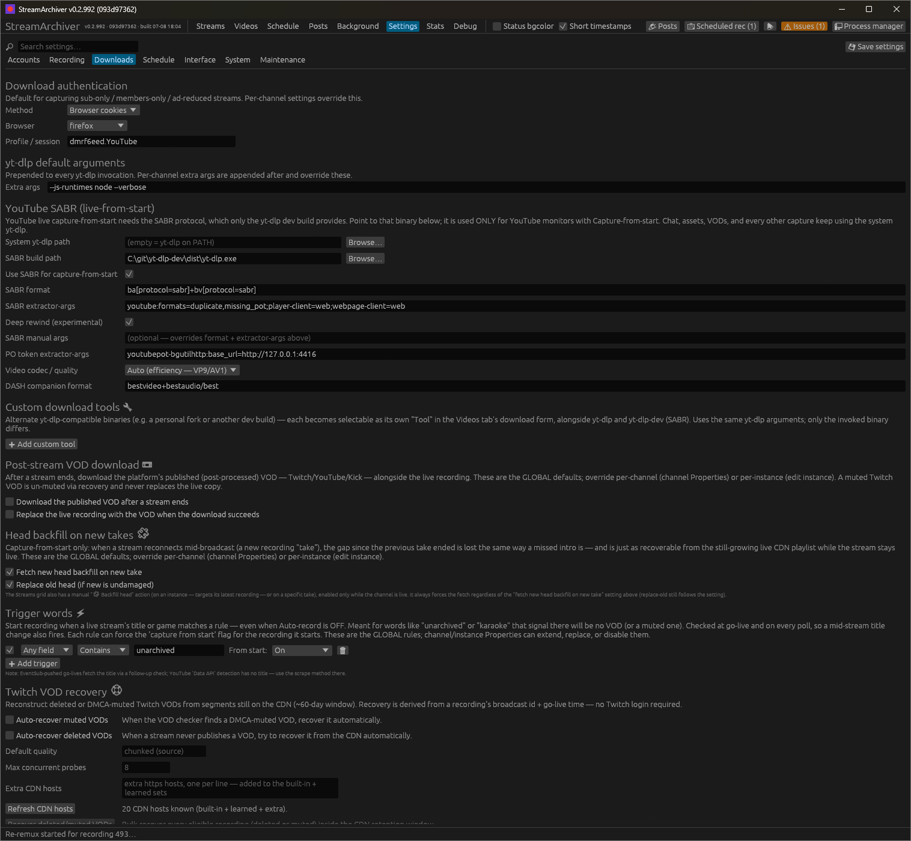

| Field | Purpose |
|---|---|
| **System yt-dlp path** | Your normal yt-dlp (chat, VODs, DASH). Empty = `yt-dlp` on `PATH`. |
| **SABR build path** | The SABR dev-build binary. **Empty disables SABR** — capture-from-start falls back to the normal path. |
| **Use SABR for capture-from-start** | Master toggle. |
| **SABR format** | Format selector. Default `ba[protocol=sabr]+bv[protocol=sabr]`. |
| **SABR extractor-args** | Default `youtube:formats=duplicate,missing_pot;player-client=web;webpage-client=web`. |
| **PO token extractor-args** | A *separate* `--extractor-args` entry for the token provider. Default `youtubepot-bgutilhttp:base_url=http://127.0.0.1:4416`. Empty = rely on the plugin's own auto-detection. |
| **SABR manual args** | When set, **replaces** the SABR format + extractor-args preset entirely (put your own `-f` / `--extractor-args` here). The PO-token args still apply. |
| **DASH companion format** | Format selector for the DASH companion of *dual capture* (below). |

For **live monitors**, the SABR binary is used **only** when a monitor is
**YouTube**, its tool is **yt-dlp**, and **Capture from start** is ticked.
Everything else — live-chat sidecars, channel/chat assets, thumbnails, and
on-demand **Videos**/VOD downloads — stays on the **system** yt-dlp by
default, so the stale fork can't break them. The Videos tab's **Tool**
dropdown can still opt an individual on-demand download into the SABR build
explicitly (see [Videos (on-demand downloads)](#videos-on-demand-downloads)),
but nothing switches to it automatically. SABR captures write the final
**MKV directly** (SABR merges separate audio+video, which the `.ts`
intermediate can't hold).

**When the DVR window is exceeded.** SABR can only rewind so far into a
live broadcast — roughly 4 hours (**Deep rewind**, Settings → Downloads,
experimental, extends this a bit further but doesn't remove the limit). A
`--live-from-start` attempt on a broadcast already older than that stalls
immediately with `not near live head`, every single time, no matter how
many times it's retried. After a couple of consecutive stalls the app
stops trying and captures that one take from the **live edge** instead —
strictly better than retrying a doomed fetch forever, but it means no
missed-intro head for that take. This shows as a **🕘 live edge only**
badge on the take/stream row (right where the 🧩 head/full backfill badges
would otherwise be) so it reads as a known limitation rather than a silent
gap or a failure — hover it for the explanation.

#### Installing the bgutil PO-token provider

bgutil has two parts — a **token server** and a **yt-dlp plugin** — and *both* must
be reachable by the **SABR binary**:

1. **Have the server available.** Clone/build the bgutil repo's Node server once
   (`server\build\main.js` after `npx tsc`); the app launches and supervises it
   from then on ([Managed GVS PO token server](#managed-gvs-po-token-server)). The
   **PO token extractor-args** field already points at its default
   `127.0.0.1:4416`. (Running it yourself — e.g. the Docker image — still works;
   the app detects an already-listening server and leaves it alone.)
2. **Install the plugin for the SABR binary.** This is the easy step to get wrong:

> ⚠ **A standalone/frozen `yt-dlp.exe` does NOT load plugins from Python
> `site-packages`.** A `pip install bgutil-ytdlp-pot-provider` is only visible to a
> *pip* yt-dlp, not to a PyInstaller-built SABR exe — which then logs
> `Plugin directories: none` / `PO Token Providers: none` and still fails with
> `requires a GVS PO Token`. Install the plugin into a directory the binary scans,
> **with the required nesting**:
>
> ```
> %APPDATA%\yt-dlp\plugins\bgutil-ytdlp-pot-provider\yt_dlp_plugins\extractor\
>     getpot_bgutil.py
>     getpot_bgutil_http.py
>     getpot_bgutil_script.py
> ```
>
> (or a `yt-dlp-plugins\<package>\yt_dlp_plugins\…` folder next to the exe). The
> `<package>\yt_dlp_plugins\` wrapper is required — pointing a `yt-dlp-plugins`
> folder *straight at* a `yt_dlp_plugins` directory doesn't load.

**Verify out-of-band** before recording in the app:

```sh
"<SABR build>\yt-dlp.exe" --verbose -F "https://www.youtube.com/@<channel>/live"
```

You want to see `Plugin directories: …\bgutil…`,
`PO Token Providers: bgutil:http-… (external)`, and `Retrieved a gvs PO Token`.
Once that lists formats, StreamArchiver will capture too.

> A separate error — `n challenge solving failed … No video formats found` — is the
> **n-sig (EJS) challenge solver**, not PO tokens: ensure a JS runtime + the
> `yt_dlp_ejs` distribution are present (see yt-dlp's EJS wiki).

#### Managed GVS PO token server

A SABR capture whose token server is down doesn't fail politely — it downloads
for a while, then dies mid-stream with `PoTokenError: This stream requires a
GVS PO Token to continue` (`sps:ATTESTATION_REQUIRED`), and every retry against
the dead server fails identically, burning a fresh take per backoff cycle. So
the app manages the server itself instead of assuming it's running:

- **Auto-launch at startup**: if nothing answers `GET /ping` on the configured
  port, the app runs `node main.js -p <port>` from the server directory
  (windowless). If a server is already listening — Docker, a manual shell,
  whatever — it's detected as **external** and used as-is: never restarted,
  never killed.
- **Health watchdog**: pings every 30 s. A managed server that crashes is
  restarted (exponential backoff 30 s → 5 min if it keeps dying), with **one**
  🔔 notification per down-episode and the exit status + last log lines in the
  app log. Three guards keep the watchdog from making things *worse* when the
  port situation is messy (all three fired for real on 2026-07-31, when a
  slow ping during a token storm led to a second server half-binding the
  other address family and every later spawn EADDRINUSE-looping):
  - A live server (the managed child, an adopted one, or any foreign
    listener on the port) gets **three missed pings of grace** (4 s timeout
    each, re-checked ~5 s apart) before any respawn — heavy BotGuard minting
    can peg node past the ping timeout while the server is perfectly healthy.
  - A spawned child that **dies to a port race while something else answers
    `/ping`** is treated as finding an external server — adopted and used —
    instead of being mis-credited as "up" (which made the watchdog see its
    "managed server exit" 30 s later and respawn in a loop) or counted as a
    failed start.
  - If a respawn attempt has already failed once and a process is **still
    squatting the port without answering `/ping`**, it gets one generous
    last-chance ping (10 s; 30 s during a rejection storm) — answering means
    it's adopted as external, not killed. During a storm a listener that
    stays silent is *still* spared as long as `pot_server.log` keeps
    growing, since active minting proves it's alive and merely saturated
    (on 2026-07-31 the kill fired 45 s after a storm was declared and took
    out a warm, busily-minting server). Only a listener that's silent *and*
    not minting is killed before the next spawn, so a genuinely wedged
    orphan still can't hold token serving hostage indefinitely.
- **On-demand recovery**: when a capture dies with a PO-token error, the app
  brings the server up *first* and then lets the in-flight SABR retry resume
  the **same take** from its `.state` files — no orphaned fragments, no burned
  take. Failures that aren't same-take-resumable still kick the watchdog so the
  server is healthy before the monitor's ≥30 s backoff expires and the next
  take succeeds. This on-demand start happens even with auto-launch off (the
  capture proved the server is needed); an explicit **Stop** is always
  respected.
- **Port** comes from parsing `base_url=` out of the **PO token
  extractor-args** setting, so the managed server and yt-dlp can't disagree.

**Settings → Downloads → "GVS PO token server 🎫"** holds the config (
**Auto-launch at startup**, **Server directory** — the folder containing
`main.js`, **Node binary** — empty = `node` on `PATH`), a live status line
(`running (managed) · pid … · v… · up …` / `external` / `starting` / `down` /
`failed: …`), **▶ Start** / **⏹ Stop** buttons (Stop only applies to a managed
server and holds for the session), **📜 View log** (a live-tailing window), and
**📂 Open log file**. The **Background** view shows the same status one-liner
with the same **▶**/**⏹** quick actions plus a **📜 Log** shortcut — routine
restarts don't need a trip to Settings; Stop external/Take control (the rarer
external-server actions) stay Settings-only.

When the server is **external**, two extra buttons appear: **⏹ Stop
external** looks up which process owns the listening port (IPv4 or IPv6) and
kills it, staying stopped for the session; **⚡ Take control** does the same
kill but immediately starts an app-managed instance in its place — from then
on the watchdog supervises it (crash restarts, working Stop button, pid
re-adoption across app runs). Caveat: for a server inside Docker/WSL the
port's owner is the Docker/WSL *port proxy*, not the server — stop the
container yourself instead of using these buttons.

The server's combined stdout+stderr goes to
`%APPDATA%\StreamArchiver\data\logs\pot_server.log`, truncated at the first
launch of each app run (restarts within a run append, so crash evidence
survives). Quit behavior matches downloads: a normal quit **leaves the managed
server running** (detached SABR captures still need tokens; the next app run
re-adopts it by pid), while **Quit & stop recordings** kills it too.

#### Dual capture (SABR + DASH)

Live **DASH** and live **SABR/HTTP** formats can't be downloaded in one yt-dlp
process, so a per-monitor **Dual capture (SABR + DASH)** checkbox (YouTube only)
runs a **second** concurrent capture — the **system** yt-dlp grabbing the DASH-only
formats (configurable via *DASH companion format*) from the live edge — alongside
the SABR capture. The two produce **two recordings** that belong to the **same
take** (labelled `· SABR` / `· DASH` in the history tree); a single **Stop** ends
both. Use it only when the formats you want are split across both protocols.

#### Watching SABR captures & live-edge previews

Mid-capture, a SABR recording on disk is **two separate growing files** — one
per selected format (video + audio), each a progressively-appended fragmented
MP4 or Matroska (`….f<id>….sq<N>.part`) — plus small `.state` resume sidecars.
The single MKV only exists after the stream ends and the merge runs, so there
is no one file to just "open".

**Resume on failure.** Those `.state`/`.part` files are also how a from-start
SABR capture survives dying mid-download without losing what it already has.
If yt-dlp exits abnormally — crashed, killed, or hit a transient local error
like antivirus/backup briefly locking the `.state` file mid-write (Windows
`PermissionError`/`Access is denied`) — and the failure wasn't the stream
itself ending, the take retries in place up to 3 times (5 s apart) with the
identical output path, so yt-dlp's own SABR resume continues from the
surviving fragments instead of restarting from scratch. The 3-retry cap
guards against tight *crash loops* (attempts dying seconds apart against, say,
a dead token server) — an attempt that ran **10+ minutes** before dying
refunds the whole budget, so a multi-hour take can absorb an occasional
transient every hour indefinitely instead of being finalized as failed by its
fourth one ever. The same resumability
check also runs at app startup for a capture still mid-flight when the app
was closed or crashed, picking it back up on the next launch.

**Checkpoint locks (why they can kill a stock build, and why they don't kill
this one).** yt-dlp saves each checkpoint atomically (write a temp file,
rename it over the old `.state`) — and on Windows that rename dies with
`Access is denied` if **any** other process holds an open handle on the
`.state` at that instant, however politely shared: CPython ≥ 3.12 renames via
`FILE_RENAME_INFO`, which rejects an open destination regardless of sharing
mode. A backup/AV/indexing tool peeking at the file for half a second is
enough to kill the entire download over one checkpoint. (The app briefly
shipped a "deny-read guard handle" scheme to keep scanners off these files —
it was removed after field data showed the guard's own handle triggered the
exact same failure: *no* handle-holding scheme can coexist with that rename.)
The durable fix lives in the bundled SABR dev build itself: its `.state`
writer retries the rename for up to ~3 s and, if the file is still locked,
skips that one checkpoint with a warning instead of dying — the next segment
rewrites it seconds later. The in-flight retry above remains as backstop for
stock builds without the patch.

**Lock-culprit logging.** When a capture death *is* an access-denied file
lock, the retry log line is followed by a `lock culprit:` line naming the
process(es) currently holding the file (e.g. `bztransmit.exe (pid 4712,
service)`) — queried right at death, while the scanner's lock is typically
still live. Because a Python tool's stderr can mangle non-ASCII path
characters (the app forces UTF-8 output on the tools it spawns, but belt and
suspenders), the query also covers the capture's surviving on-disk `.state`
files discovered by directory listing, not just the paths parsed from the
error line. The actionable fix is almost always adding the capture cache dirs
to that tool's exclusion list. The player features handle this
(full behavior in [Watching in a media player](#watching-in-a-media-player)):

- **⏵ Play local recording (start)** finds the growing pair and merges it *in
  mpv*: the video file plays via mpv's `appending://` protocol (which follows
  a growing file) with the audio file attached as an external track —
  watchable from the capture's very start, including deep-rewound footage,
  while the download continues.
- **▷ Play stream (live edge)** runs a second, throwaway SABR download from the
  **live edge** into `%TEMP%\streamarchiver-preview\` and plays it as a
  **locally generated live HLS playlist**: the app walks the growing files'
  fragment structure, coalesces it into byte-range segments, and rewrites the
  playlists every couple of seconds (ending them properly when the stream
  ends). A live HLS playlist is the one local transport a player follows at
  the live edge indefinitely — plain growing-file playback stalls once it
  catches up. The preview prefers H.264/mp4 + m4a formats because HLS can't
  address Matroska; a VP9-only pick falls back to direct `appending://`
  playback, which plays but stops at the edge.

Both SABR paths are **mpv-only**; other players get the DASH companion's `.ts`
(dual capture) or finished files only.

## Data & locations

- Config/state DB: `%APPDATA%\StreamArchiver\data\streamarchiver.sqlite3` (SQLite, WAL).
- Override the DB path with `STREAMARCHIVER_DB`, default output dir with
  `STREAMARCHIVER_OUT` (handy for testing).
- Rolling database backups: `%APPDATA%\StreamArchiver\data\backups\` — see
  *Database backups* (Settings → System).
- Chat index: `%APPDATA%\StreamArchiver\data\chat_index.sqlite3` (SQLite, WAL) —
  a **second, separate** database holding who chatted in which stream and the
  full-text message index behind the [Users](#users--who-chatted-where) tab.
  Deliberately outside the main DB so it never bloats the backups above and its
  writes can't block the app's queries. It is rebuildable from the chat logs, so
  it is **not** backed up and can be deleted at any time — the background sweep
  reads everything again.
- Recordings + sidecars (`.chat.jsonl`, `.live_chat.json`, subtitle `.vtt`): your
  configured output folder (default: `Videos\StreamArchiver\`). Companion video
  files share the recording's stem: `{stem}.vod.mkv` (downloaded published VOD),
  `{stem}.head.mkv` (backfilled missed start), `{stem}.full.mkv` (head + live
  joined), and a recovered VOD from CDN recovery.
- In-progress captures live in a hidden **`.sa-cache\`** working folder and
  are promoted (same-volume rename) to the output folder on finish. Layout:
  - Default: a `.sa-cache\` subfolder inside each output folder.
  - **Capture cache location(s)** (Settings → Recording): central folder(s) —
    e.g. `A:\streams\.sa-cache; G:\streams\.sa-cache` — each holding one
    subfolder per channel (`…\.sa-cache\{channel}\…`). This gives backup tools
    **one excludable subtree per drive**, for tools like Backblaze whose
    exclusions are path-based with no wildcard support (a per-channel
    dot-folder can't be excluded there). Recordings can span drives: list one
    location per drive, separated by `;` — each only applies to output folders
    on *its* drive (promotion must stay a rename, never a multi-GB cross-drive
    copy); drives without one keep the per-folder layout. Changing the setting
    is safe at any time: files are *found* under all layouts (central,
    per-folder, legacy `.cache\`), takes started before the change finish
    under their original layout, and drained working folders are removed by
    the startup sweep.
  Exclude the `.sa-cache` folder(s) from backups to keep multi-GB transient
  capture files out of backups and off the spindle during recording.
- App logs: `%APPDATA%\StreamArchiver\data\logs\` (daily-rotated, 7-day
  retention). Per-download tool output (`streamlink`/`yt-dlp`/`ffmpeg`
  stdout+stderr) lands in `logs\captures\` on the same drive — *not* next to
  the recording — so its constant small appends and tail-reads never touch the
  recordings disk; same 7-day retention (previously these were deleted at
  finalize, so surviving a week is a debugging upgrade). The I/O monitor's 1 s
  sample log (see *I/O monitor*) lands in `logs\iomon\session-*.jsonl`, 14-day
  retention — this is normally the largest contributor by far (several MB/hour
  with multiple concurrent captures, not the few MB/day a quiet session
  produces). The managed PO token server writes `logs\pot_server.log`
  (truncated per app run, appended across in-run restarts — see *Managed GVS
  PO token server*). Retention is enforced at startup **and** re-checked at
  most once a day while running — the app is meant to stay up for weeks at a
  stretch, and a startup-only sweep would otherwise let `logs\` grow
  unbounded for the whole life of a long session.
- Asset cache: `%APPDATA%\StreamArchiver\data\asset-cache\` (see *Channel assets &
  change history*):
  - `channel_assets\{name}\{platform}\{account}\` — per channel + platform +
    account (the account is the URL-derived login/slug/handle, so a main + alt
    on one platform never collide):
    - `icon.<ext>`, `banner.<ext>` (current), `name_color.txt`, `.assets_fetched_at`
      (24 h freshness stamp).
    - `badges\`, `emotes\twitch\` (first-party files), `emotes\{bttv,ffz,7tv}.json`
      (third-party emote manifests).
    - `rewards.json` — channel-point reward titles by id, so a redemption in the
      chat replay reads as a name instead of a UUID.
    - `paints.json` — 7TV gradient usernames for chatters seen in this channel,
      including the ones with none (24 h freshness stamp inside the file).
    - `history\` — superseded icons/banners; `emotes\history\` — superseded emote
      manifests; `asset_changes.jsonl` — the append-only change log.
    - (`posts\` and `schedule_src\` may still sit at the platform level for
      pre-migration downloads — their paths are recorded in the DB.)
  - `platform_assets\` — deduplicated shared emote images + global Twitch badges
    (referenced by every channel, stored once). Each third-party provider also
    keeps its **global emote set** here: `{bttv,ffz,7tv}\global.json` (the
    manifest) next to a `.global_emotes_fetched_at` stamp, with the images in
    the same `emotes\` folder the channel sets resolve into — so an emote that
    is both global and in some channel's set is stored exactly once.

## CLI / diagnostics

```sh
streamarchiver --probe <url>                      # one-shot live check
streamarchiver --add "<name>" <url> [method] [tool]
streamarchiver --list                             # monitors + state
streamarchiver --recordings                       # recent recording log
streamarchiver --capture-test <tool> <url> <secs> # record N s, kill tree, remux
streamarchiver --run-for <secs>                   # headless: run core then stop
streamarchiver --twitch-login                     # OAuth2 device-code Connect flow
streamarchiver --hidden                           # start to tray (no window)
streamarchiver --debug                            # enable the Debug tab (always on in debug builds)
```

## Widget inspector (F12)

A DevTools-style inspector for the UI itself, available in all builds. Press **F12**
(while the main window is focused) to toggle the 🔍 Inspector window.

- **Elements** lists every widget instrumented with `.inspect()` during the last frame.
  Click a row to select it (click again to deselect); hovering a row highlights the
  widget on screen with a blue outline — this works in the main window **and** inside
  child windows (Processes, Properties, …). The properties panel shows the widget's
  name, id, rect/size, enabled/hovered/clicked state, viewport, custom props, and the
  exact source location (`file:line:column`) of the `.inspect()` call, with a 📋
  copy button. A selected widget that isn't on screen shows "(not on screen this
  frame)" and the selection is kept.
- **Layout / Memory / Style** delegate to egui's built-in `inspection_ui`, `memory_ui`,
  and `settings_ui` debug panels (per-frame stats, id/state memory, live style editing).

Widgets opt in from code by chaining on the `egui::Response`
(`use crate::inspector::Inspectable`):

```rust
ui.button("💾 Save settings").inspect("Settings: Save button", &[]);
// Hot paths (per-row cells): props are only built while the inspector is open.
resp.inspect_with("Streams grid: instance Name cell",
    || vec![("channel", row.channel.name.clone())]);
```

Registration is a single atomic load + branch when the inspector is closed, so
instrumentation is effectively free in normal use. Caveats: egui auto-ids derive from
layout order, so a selection inside a dynamic list can shift to a different row when
the list changes (wrap loop widgets in `push_id` with a stable key for stable
selection); the source location always identifies the call site regardless. F12 is
read from the main window's input, so it doesn't toggle while a child window has
focus.

## Architecture

Single binary; the tokio core (scheduler + download supervisor) runs regardless of the
window. One shared scheduler batches detection (e.g. one Twitch Helix call covers up to
100 channels) rather than one thread/process per channel. The supervisor spawns tools as
child processes, captures logs, and kills whole process trees on stop. State lives in
SQLite; the UI subscribes to an event bus (no hot-polling).

```
tray ── open/quit ──► core (tokio): store · scheduler · detectors · supervisor · events
                                   └── child processes: streamlink / yt-dlp / ffmpeg
egui window (on demand) ◄── events ──┘
```

### Source layout

The biggest modules are split into directories; each keeps a small facade
file (`src/store.rs`, `src/downloader.rs`, `src/ui.rs`, `src/ui/chat.rs`)
holding the core type(s) and re-exports, with the implementation spread over
`src/<module>/*.rs` submodules (`impl` blocks continue across files):

- `src/store/` — SQLite persistence: `migrations`, plus per-domain query
  clusters (`recordings`, `monitors`, `scheduled`, `vod`, `posts`, `videos`,
  `clips`, `collab`, `stats_history`).
- `src/clips/` — clips (see [Clips](#clips-)): the Helix client and date-window
  bisection in the `src/clips.rs` facade, over `sweep` (scheduling, liveness,
  historical backfill), `fetch` (downloads, gates, disposal), `recover` (the
  rebuild ladder and its three time frames) and `harvest` (clip links in chat).
- `src/downloader/` — capture pipeline: `cache` (`.sa-cache` layout),
  `tools`, `plan`, `supervisor`, `process`, `backfill`, `vod`, `remux`,
  `naming`, `finalize`.
- `src/ui/` — egui app: `app` (pump/persistence), one module per view
  (`streams`, `videos`, `schedule`, `settings`, `files`, `io_view`, `posts`,
  `background`, `channel_stats`, `users`, `clips`, `issues`, `debug`), window clusters
  (`dialogs`, `properties`, `chat`), and shared helpers (`grid`, `calendar`,
  `format`, `player`, `assets_helpers`).
- `src/ui/chat/` — the chat window, itself a facade (`src/ui/chat.rs` holds the
  message/log/popup types) over `window` (toolbar, panels, message list),
  `rows` (one message drawn), `parse` (sidecar → messages), `emotes`,
  `helpers` (asset lookups, segment building), `colors`, `usercard`, `strips`
  (top supporters / Hype Train), `compose` (emote picker + `:code` and
  `@mention` autocomplete).

`src/chat_index.rs` is the app's **second** SQLite database (see
[Users](#users--who-chatted-where)) — its own file, migrations and connection
lock, written only by the `chat_scan` sweep. Both databases share one
instrumented lock helper (`store::db_lock`), which is what lets the I/O tab
report them as separate lanes.

Neither database is ever `ANALYZE`d, so **the planner works from its built-in
guesses** — and its strongest guess is that an equality constraint is highly
selective. Twice now that has made it prefer a 300k-row scan over a purpose-built
partial index: once in `store::clips` (v96), once in the chat index's
unresolved-login lookup (index v3). Both were found the same way and fixed the
same way — check `EXPLAIN QUERY PLAN` against a *real* database, not a fixture,
then shape the index so the plan the planner wants is also the fast one. Adding
`ANALYZE` does not substitute for this: it was measured on the live 1.7 GB index
and changed neither plan. Queries whose plan matters carry a test that asserts
the plan, because every one of these bugs returns perfectly correct rows.

Unit tests live in a `#[cfg(test)] mod tests` inside the submodule whose code
they cover (they exercise private items and compile out of release builds).

## Roadmap

- Installer / packaging (the AppUserModelID + branded toasts already work
  installer-free via HKCU registration).
- macOS/Linux polish (tray via `ksni`, process-group kill).
- Kick chat logging.
